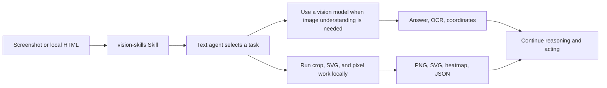

<p align="center">
  
</p>

<div align="center">

# DSH Vision Toolkit

<a href="https://trendshift.io/repositories/149708?utm_source=trendshift-badge&amp;utm_medium=badge&amp;utm_campaign=badge-trendshift-149708" target="_blank" rel="noopener noreferrer"></a>

[](https://dshfind.com/en/plugins/Anionex/dsh-vision-toolkit)
[](https://dshfind.com/en/plugins/Anionex/dsh-vision-toolkit)
[](https://www.theagenticleaderboard.com)

[](https://www.npmjs.com/package/@anionex/dsh-vision-toolkit)
[](LICENSE)
[](cordis.patch.yml)

**A more powerful vision toolkit—give text-only models in DeepSeek Harness eyes: image Q&A, long-screenshot OCR, UI restoration, and GUI visual tasks in one toolkit and Skill.**

🚀 Paste an image and ask directly | Install with one command | Built-in free vision | Broad use cases

[Highlights](#highlights) | [Quick start](#quick-start-three-steps) | [Toolbox](#toolbox) | [Configuration and limits](#configuration-and-limits) | [Troubleshooting](#troubleshooting) | [Community](#development-and-community)

🌐 **English** | [中文](README.zh.md)

</div>

🏆 This project is the first comprehensive vision-tool plugin in the DeepSeek Harness ecosystem: it was initiated before internal beta and built during the beta with reference to [`agent-vision-toolkit`](https://github.com/Anionex/agent-vision-toolkit).

> **Original work:** The system and division of responsibilities behind these visual tools, together with the `vision-skills` Skill, were personally created and continuously refined by the author through long-term real-world use and repeated iteration.

> If this project helps you or gives you some inspiration, feel free to star 🌟 & fork.

## Highlights

- **Paste an image and ask directly.** In DSH Web, pasting an image switches the text-only model to its `(Vision Toolkit)` variant automatically — no manual path copying or model changes. Native thumbnails, session history, and workspace paths stay intact; Web can preview artifacts.
- **One command to install.** The built-in free Gemini 3.7 Flash vision service is ready after installation, with no API key required.
- **Built-in free vision quota.** The shared service works immediately after installation with a quota of **100 images per machine per day**.
- **Not just a caption — the content that matters.** The model does not produce a generic description; it extracts evidence around the current task, such as “Where is the error?” or “Where is the button?”.
- **A battle-tested visual-task methodology.** The bundled Skill tells the agent what to look at for different visual tasks, which tool to choose, how to proceed, and how to verify the result.

[`agent-vision-toolkit`](https://github.com/Anionex/agent-vision-toolkit) gives an agent more than image captions: it can read, locate, crop, trace, rebuild, and verify visual work. DSH Vision Toolkit is its native DeepSeek Harness integration, bringing that workflow into Web and Headless Profiles.

This project has two layers:

1. **Visual tools and a Skill:** the agent learns when to inspect, ground, OCR, crop, trace, or compare pixels.
2. **Native DSH integration:** those capabilities live inside Profiles, sessions, Settings, Artifacts, and the Web UI, with a free Gemini 3.7 Flash vision service ready after installation.

> **Install and use it immediately.** The default setup includes a free Gemini 3.7 Flash vision service and requires no API key.

```sh
dsh plugin --profile web add @anionex/dsh-vision-toolkit
```

**Upstream toolkit:** [Anionex/agent-vision-toolkit](https://github.com/Anionex/agent-vision-toolkit) · **Project website:** [agent-vision.anionex.me](https://agent-vision.anionex.me)

## ❤️ Sponsor

> Want to sponsor this project? See [FUNDING.md](FUNDING.md) or email davidyang042@gmail.com.

<details open>
<summary>Click to collapse</summary>

<table>
<tr>
<td width="220"><a href="https://aihubmix.com/?aff=5wj6sgx8"></a></td>
<td>Thanks to <a href="https://aihubmix.com/?aff=5wj6sgx8">AIHubMix</a> for sponsoring this project! AIHubMix is a stable, high-concurrency AI model API gateway that connects Claude, GPT, Gemini, DeepSeek, and other mainstream models through a single API key, compatible with multiple protocols, with <b>free model options</b> available. To sign up, use the <a href="https://aihubmix.com/?aff=5wj6sgx8">AIHubMix entry</a> outside mainland China or the <a href="https://inferera.com/?aff=5wj6sgx8">Inferera entry</a> within mainland China.</td>
</tr>
</table>

</details>

**Contents**

- [Highlights](#highlights)
- [Recent updates](#recent-updates)
- [Who it is for](#who-it-is-for)
- [See it in action](#see-it-in-action)
- [Quick start: three steps](#quick-start-three-steps)
- [Toolbox](#toolbox)
- [Configuration and limits](#configuration-and-limits)
- [Troubleshooting](#troubleshooting)
- [Donation](#donation)
- [Development and community](#development-and-community)

## Recent updates

- **2026-08-20 · AIHubMix setup guide:** Added a screenshot-based guide for getting an API key through the Inferera entry and using the free Gemini 3.7 Flash vision model; Settings now links directly to this guide.
- **2026-08-19 · Transparent routing by default:** The model selector keeps one entry per model with the original name, and image input (paste, history, `read_image`) works without manually switching to a `(Vision Toolkit)` variant. Disable “Transparent variant routing” in advanced settings → image input to restore the explicit entries.
- **2026-08-16 · Windows Python:** Added Microsoft Store Python support, fixing first-time isolated-runtime setup failures for affected Windows users.
- **2026-08-17 · Free vision upgrade:** Switched the built-in no-key service to Gemini 3.7 Flash and fixed Qwen/Gemini bounding-box coordinate order.
- **2026-08-16 · Image paste:** Text-only routes now switch to a `(Vision Toolkit)` variant and keep a workspace path, fixing blocked pastes and images that could not be reused later.
- **2026-08-16 · More shared capacity:** Expanded the free service capacity to reduce peak-time `429` responses.
- **2026-08-16 · Real model test:** Added a full image-request test in Settings, fixing the false confidence caused by a successful `/models` request to a model that still cannot process images.

## Who it is for

1. Want an interaction experience similar to a multimodal model: paste an image directly and ask a question or make a request.
2. Want more than image Q&A — complete more complex, high-value visual tasks such as turning a sketch into a front-end page, converting an image into HTML, or extracting chat messages from long screenshots; more scenarios are added over time.

The bundled `vision-skills` Skill carries the complete upstream playbooks, explaining when to use each workflow, in what order to call the tools, and how to verify the result:

| Playbook | What the agent learns to do |
| --- | --- |
| [Read long screenshots, chat histories, and scrolling pages](assets/skill/references/long-screenshot-ocr.md) | Find low-content cut bands, OCR each chunk in order, preserve chat speakers/timestamps/quotes, merge only duplicated overlap, and surface risky boundaries for verification |
| [Rebuild a UI from a screenshot or design](assets/skill/references/restore-ui.md) | Reuse project components and assets first, then combine code-native UI, extracted visuals, rendered screenshots, and visual comparison to align a page or component |
| [Restore an icon, logo, illustration, or other graphic](assets/skill/references/restore-graphic.md) | Extract a transparent PNG from the source image, or rebuild an editable/scalable SVG when needed, then verify shape, color, and alpha edges |
| [Turn a sketch, diagram, or whiteboard into structured code](assets/skill/references/restore-structure.md) | Recover nodes, labels, connections, and directions as editable Mermaid, Graphviz, or another structured representation |
| [Operate a GUI from screenshots](assets/skill/references/gui.md) | Locate a control, perform one action, capture the screen again, and verify the resulting state before continuing |

## See it in action

### Paste an image directly into DSH

<p align="center">
  
</p>

*Paste an image into the conversation. A text-only model can switch to its `Vision Toolkit` variant and inspect the image in the context of the user's question.*

### Screenshot to editable page

<p align="center">
  
  
</p>

> Prompt example: “(Use vision-skills) Rebuild this image into HTML.”

*Left: the reference screenshot. Right: an editable HTML/CSS result. The result can continue into screenshot rendering and pixel comparison instead of ending as an image description.*

### Sketch to working interface

<p align="center">
  
  
</p>

*Left: a hand-drawn reference. Right: the working interface reconstructed from it.*

> Prompt example: “(Use vision-skills) Turn this sketch into a working front-end page.”

### Fast UI restoration: an approximate first pass

<p align="center">
  
  
</p>

> Prompt example: “(Use vision-skills) Quickly rebuild this image into HTML.”

*Left: the original page. Right: a fast reconstruction that preserves the main layout, content, and visual hierarchy while allowing approximate colors and library icons. Fast mode targets a first screenshot in about three minutes.*

## Quick start: three steps

### 1. Install

```sh
dsh plugin --profile web add @anionex/dsh-vision-toolkit
```

You can install it into a Headless Profile too:

```sh
dsh plugin --profile headless add @anionex/dsh-vision-toolkit
```

Using DSH Desktop? It bundles its own `dsh` CLI and intentionally does not add it to your system PATH. Open **DSH Terminal** from the tray and run the command there, targeting the Desktop profile:

```sh
dsh plugin --profile desktop add @anionex/dsh-vision-toolkit
```

Then restart DSH Desktop. The built-in plugin marketplace in DSH Desktop 2.0.1 has known installation issues; the terminal command above is the reliable path until a fixed Desktop release is available.

For the full Desktop install, update, and troubleshooting walkthrough, see [Installing and updating in DSH Desktop](docs/dsh-desktop-install.md).

### 2. Restart and check it

Restart a running Web Profile, then open **Settings → Vision Toolkit**. The free provider is already configured; run **Test vision model** to confirm it is reachable.

The first start prepares an isolated runtime: the plugin prefers a system Python 3.11+; when none is found, it downloads a hash-verified standalone Python (about 35 MB) from the domestic mirror (`dsh-vision-python-bootstrap-1317715800.cos.ap-guangzhou.myqcloud.com`) on first use, falling back to the GitHub release when the mirror is unreachable. The locked runtime dependencies (Pillow, NumPy, vtracer) are installed from the Tencent Cloud PyPI mirror (`mirrors.cloud.tencent.com/pypi/simple`) first and fall back to the official PyPI index. A normal installation does not require an `agent-vision-toolkit` source checkout or a local path setting.

### 3. Paste an image and describe the outcome you want

Paste a screenshot into the conversation or place an image in the session workspace, then invoke `/vision-skills`. For example:

```text
Inspect this screenshot. Explain the error and tell me what to fix first.
Find the login button in the top-right corner, return original pixel coordinates, and make a boxed preview.
Crop this icon and convert it to SVG.
Rebuild the page from reference.png. After each pass, render it and run a pixel diff until the major differences are gone.
```

## Toolbox

The plugin provides 10 tools that can be called independently or composed into a workflow:

| Tool | Best question to ask | Main result |
| --- | --- | --- |
| `vision_glance` | “What is happening in this image?” | Focused answer, description, OCR, or multi-image comparison |
| `vision_ground` | “Where is the thing I need?” | Original pixel coordinates and optional boxed preview |
| `vision_detect` | “Which buttons, icons, or elements are present?” | Numbered element inventory, coordinates, and optional preview |
| `vision_crop` | “Extract this region as its own image” | PNG or JPEG crop |
| `vision_trace` | “Turn this shape into an editable vector” | SVG |
| `vision_pixel_diff` | “Where does the implementation differ from the reference?” | Difference percentage, ranked regions, heatmap, and JSON |
| `vision_long_screenshot_ocr` | “Read this entire long screenshot” | Markdown, chunks, manifest, and audit output |
| `vision_extract_foreground` | “Remove the background from this subject” | Transparent PNG |
| `vision_dominant_colors` | “Which colors dominate this area?” | Palette or ranked candidate colors |
| `vision_html_screenshot` | “Render this local page at an exact viewport or capture the full page” | PNG and optional CSS `pageHeight` |

Coordinates always use original-image pixels in `x1,y1,x2,y2` form, so grounding output can feed directly into cropping, tracing, or later automation.

For a long HTML document, pass `fullPage=true`. The requested width and height remain the layout viewport, while the resulting PNG covers the complete document and reports `pageHeight` in CSS pixels.

## How it works

The plugin keeps image understanding and deterministic local image processing in one Agent workflow. The diagram below shows the implementation boundary.

### Descriptions that keep the task in view

Most vision bridges for text-only models ask a multimodal model for a generic description and hand it to the text model, adding a semantic layer where information is lost. Vision Toolkit instead recovers **why the agent wants to look at the image**: the user message or the model's stated reason becomes a focus hint passed to the vision model. The result is a task-aware description that emphasizes what matters for the current step — with fewer tokens, higher accuracy, and faster responses.

<p align="center">
  
  
</p>

**Architecture and image-input behavior**



The visual capabilities come from a packaged, pinned `agent-vision-toolkit` snapshot. The DSH plugin handles installation, session-scoped tool exposure, Credentials, path checks, cancellation, timeouts, result files, and Web presentation. The runtime never fetches upstream `main` in the background.

The bundled `vision-skills` Skill is the DSH adapter of the upstream
`vision-tools` Skill: its `SKILL.md` plus all five upstream playbooks. Tool
names, argument syntax, Artifact delivery, progressive exposure, and DSH
path/lifecycle boundaries are adapted; the upstream tool-selection rules,
coarse-to-fine method, and task SOPs remain intact. The exact upstream Skill
commit, source hashes, adapted hashes, and reviewable adapter patch are
recorded in `assets/skill/UPSTREAM.json` and `patches/vision-tools-dsh.patch`.

For routes that DSH positively identifies as text-only, the plugin registers a sibling `<model> (Vision Toolkit)` variant. By default, pasting an image in DSH Web switches to that variant and gives the model both a reusable workspace path and a visual description focused on the current task.

## Configuration and limits

### Built-in free service

The default setup uses:

```text
Base URL: https://vision.anionex.me/v1
Model:    gemini-3.7-flash
API Key:  https://agent-vision.anionex.me (filled automatically)
```

Requests that still use the previous `qwen/qwen3.6-27b` model name remain compatible and are routed to the Qwen backend.

This is a shared zero-configuration entry point, not an unlimited private endpoint. Request safeguards include:

| Limit | Current value |
| --- | --- |
| Daily quota | 100 images per machine per day |
| Images per request | Up to 5 |
| Image size | 4 MiB per image |
| Decoded pixels | 20,000,000 per image |
| Output | Up to 4,096 tokens per request |

These safeguards prevent unusually large requests from monopolizing memory or request time. When shared capacity is reached, the service returns a readable `429` response with `Retry-After` instead of collapsing into an unexplained model failure.

Existing clients that still send `api_key="free"` remain compatible.

### Bring your own vision model

For higher quotas, private endpoints, or another model, change the provider in **Settings → Vision Toolkit** and store the API key as a DSH Credential. Settings stores the Credential reference and never reads the saved secret back into the browser.

**Step-by-step AIHubMix tutorial:** [Get an AIHubMix API key and use free Gemini 3.7 Flash for vision](docs/aihubmix-gemini-vision.md). It includes screenshots for account/API-key setup, the exact Vision Toolkit settings, free-model selection, and troubleshooting.

You can also configure a Profile patch:

```yaml
- id: vision-toolkit
  config:
    provider:
      baseUrl: https://api.example.com/v1
      credential: MY_VISION_KEY
      model: your-vision-model
      protocol: openai
```

OpenAI Chat Completions-compatible endpoints and Anthropic Messages are supported. The Web Settings panel exposes the full provider, runtime, timeout, image-limit, and image-input-variant configuration.

For a trusted internal endpoint that uses a self-signed certificate or MITM proxy, start the DSH process with `VISION_SSL_VERIFY=0`. The plugin forwards that value to the isolated Python runtime; certificate verification remains enabled when the variable is unset or has any other value. The false values `false`, `off`, `no`, `none`, and `disabled` are also accepted, case-insensitively.

### Configure the Python runtime

Most users never need to configure the Python runtime: the plugin prefers a system Python 3.11+ and otherwise downloads a pinned standalone Python automatically from the domestic mirror, falling back to GitHub when the mirror is unreachable.

For advanced setups — overriding `runtime.python`, using `runtime.mode: external`, verifying the runtime, or allowing additional input directories — see [Python runtime configuration](docs/python-runtime.md).

## Troubleshooting

| Problem | What to do |
| --- | --- |
| The vision-model test fails with `Vision API returned an incompatible response structure` | The base URL usually needs a path prefix. Local OpenAI-compatible services such as LM Studio and Ollama should be entered as `http://127.0.0.1:1234/v1` (include `/v1`); the plugin appends `/chat/completions`, and a port-only address hits an unknown endpoint and returns this error |
| Pasting an image still says the model does not support image input | Restart the Web Profile, refresh the page, and confirm the selected route has the `(Vision Toolkit)` suffix. You can also place the image in the session workspace and invoke `/vision-skills` |
| The free service returns 429 | Wait for the `Retry-After` interval, or switch to your own endpoint when you need stable higher volume |
| The image exceeds a size or pixel limit | Crop or resize it first; the error identifies whether bytes or decoded pixels caused the rejection |
| A custom Credential is missing | Enter the API key in **Settings → Vision Toolkit** and confirm the Credential name matches the provider configuration |
| First-time runtime setup fails | The standalone-Python download needs network and disk access (domestic mirror first, GitHub fallback). Check connectivity or package-cache access, or install Python 3.11+ / configure `runtime.python` in Settings, then retry the model test |
| Chrome is not found | Install Chrome, Chromium, or Edge. Only HTML screenshot rendering is unavailable; the other tools still work |
| DSH Desktop says `dsh` is not recognized, or its built-in marketplace install fails | Open **DSH Terminal** from the tray, run `dsh plugin --profile desktop add @anionex/dsh-vision-toolkit`, then restart DSH Desktop. The Desktop 2.0.1 marketplace has known install issues, so the terminal command is the reliable path for now |
| An artifact cannot be previewed | Use **Open file** or the workspace path in the result. Preview URLs exist only while the Web route is available |

## FAQ

**Will adding a vision model significantly increase costs?**

No. Each inspection sends only the necessary intent and the image to the multimodal model, and context does not accumulate across calls, so the added cost stays small. To reduce it further, a locally deployed small multimodal side model (for example the Gemma 4 or Qwen 3.5/3.6 series) can provide the vision capability.

## Donation

If this project is valuable to you, you are welcome to buy the developer a coffee ☕️


## Development and community

- Read [CONTRIBUTING.md](CONTRIBUTING.md) before contributing.
- Use [GitHub Issues](https://github.com/Anionex/dsh-vision-toolkit/issues) for bugs, focused feature requests, and usage questions; see [SUPPORT.md](SUPPORT.md) for channel guidance.
- Report vulnerabilities privately through [SECURITY.md](SECURITY.md).
- See [CHANGELOG.md](CHANGELOG.md) for releases and [FUNDING.md](FUNDING.md) for sponsorship details.
- Visit upstream [agent-vision-toolkit](https://github.com/Anionex/agent-vision-toolkit) for the general toolkit, cross-agent integrations, and visual-task playbooks.

<p align="center">
  
</p>

I'm [anionex](https://anionex.me/), an AI-native developer who once ranked **No. 3** on GitHub's global developer trending list, with more than 16k stars across my projects. If you would like to follow my future work, [follow me on GitHub](https://github.com/Anionex).

[`agent-vision-toolkit`](https://github.com/Anionex/agent-vision-toolkit) was created by [Anionex](https://anionex.me/). This repository maintains its native DeepSeek Harness integration.

## License

The plugin is available under the [MIT License](LICENSE). The packaged upstream snapshot retains its original MIT license in [`vendor/agent-vision-toolkit/LICENSE`](vendor/agent-vision-toolkit/LICENSE).
