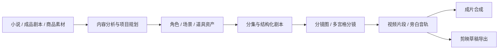

<h1 align="center">
  <br>
  <picture>
    <source media="(prefers-color-scheme: light)" srcset="frontend/public/android-chrome-maskable-512x512.png">
    <source media="(prefers-color-scheme: dark)" srcset="frontend/public/android-chrome-512x512.png">
    
  </picture>
  <br>
  ArcReel
  <br>
</h1>

<p align="center">
  <strong>开源、自托管的 AI 视频生产工作台</strong>
  <br>
  将小说、成品剧本或商品素材转化为角色一致、过程可控、成本可追踪、可继续编辑的短视频。
</p>

<p align="center">
  <a href="README.md"></a>
  <a href="README.en.md"></a>
</p>

<p align="center">
  <a href="https://github.com/ArcReel/ArcReel/releases/latest"></a>
  <a href="https://github.com/ArcReel/ArcReel/actions/workflows/test.yml"></a>
  <a href="https://codecov.io/gh/ArcReel/ArcReel"></a>
  <a href="https://github.com/ArcReel/ArcReel/pkgs/container/arcreel"></a>
  <a href="LICENSE"></a>
  <a href="https://github.com/ArcReel/ArcReel"></a>
</p>

<p align="center">
  <a href="#快速开始"><strong>快速开始</strong></a>
  ·
  <a href="https://docs.arc-reel.com/guide/getting-started">入门教程</a>
  ·
  <a href="https://docs.arc-reel.com/">完整文档</a>
  ·
  <a href="#交流群">加入社区</a>
</p>

<p align="center">
  
</p>

## ArcReel 是什么

ArcReel 是面向 AI 漫剧与小说改编、旁白/解说短视频、广告与带货短片的开源自托管工作台。它把内容分析、资产管理、分镜、媒体生成、费用追踪和导出组织成一条可审核、可中断恢复的生产流水线。

- **统一生产链路**：小说、成品剧本或商品素材都能逐步转化为角色、场景、道具、分镜、视频片段和最终成片。
- **视觉一致、人工可控**：跨分镜复用资产图等参考图，关键阶段可确认，单个素材可重做，历史版本可回滚。
- **模型与成本可管理**：统一配置文本、图像、视频和 TTS 能力，并在生成前后查看费用与实际用量。
- **交付可继续编辑**：既可直接合成视频，也可导出剪映草稿继续调整字幕、配音、节奏和转场。导出面向中国大陆版剪映，与 CapCut 的兼容性尚未验证。

## 从输入到成片



每个阶段都可以由 Agent（智能体）编排，也可以由用户在工作台中审核、调整或重新生成。详细模式选择见 [创作流程与模式](https://docs.arc-reel.com/guide/workflows)。

## 快速开始

准备好 Docker 和 Docker Compose，然后运行：

```bash
git clone https://github.com/ArcReel/ArcReel.git
cd ArcReel/deploy

cp .env.example .env
docker compose up -d
```

访问 <http://localhost:1241>。默认用户名为 `admin`；`AUTH_PASSWORD` 留空时，首次启动会自动生成密码并回写到 `deploy/.env`。

> 默认 Compose 会将 `1241` 端口发布到宿主机所有网络接口。请勿将服务直接暴露到公网；远程访问前请配置认证，并使用 HTTPS、VPN 或安全隧道，详见 [反向代理与 HTTPS](https://docs.arc-reel.com/ops/deployment#reverse-proxy-and-https)。

登录后进入 **设置** 页面，配置 ArcReel Agent 以及文本、图像、视频等生成能力，再创建项目开始制作。

完整的首次使用流程见 [完整入门教程](https://docs.arc-reel.com/guide/getting-started)；生产部署、升级、备份和反向代理见 [部署与运维](https://docs.arc-reel.com/ops/deployment)。

## 文档

| 页面 | 内容 |
|---|---|
| [文档首页](https://docs.arc-reel.com/) | 按使用者、运维者和开发者进入文档 |
| [完整入门教程](https://docs.arc-reel.com/guide/getting-started) | 从首次部署到生成第一条视频 |
| [创作流程与模式](https://docs.arc-reel.com/guide/workflows) | 小说、剧本与创作构想，三种创作类型及两种生成模式 |
| [供应商与模型配置](https://docs.arc-reel.com/guide/providers) | Agent、文本、图像、视频、TTS 供应商的选择和配置 |
| [剪映草稿导出](https://docs.arc-reel.com/guide/jianying-export) | 将 ArcReel 生成结果交给剪映继续编辑 |
| [常见问题](https://docs.arc-reel.com/guide/faq) | 部署、费用、模型、数据和许可证问题 |
| [部署与运维](https://docs.arc-reel.com/ops/deployment) | SQLite、PostgreSQL、升级、备份和反向代理 |
| [从 SQLite 迁移到 PostgreSQL](https://docs.arc-reel.com/ops/migrate-to-postgres) | 数据迁移、验证与回滚流程 |
| [架构说明](https://docs.arc-reel.com/dev/architecture) | Agent Runtime、任务队列、供应商抽象和数据层 |
| [贡献指南](https://docs.arc-reel.com/dev/contributing) | 本地开发、测试、代码规范和 PR 流程 |

## 交流群

扫码加入飞书交流群，获取使用帮助、版本动态和创作经验：

<p align="center">
  
</p>

遇到可以复现的 Bug 或明确的功能需求，也可以直接提交 [GitHub Issue](https://github.com/ArcReel/ArcReel/issues)。

## 贡献

欢迎贡献代码、文档、测试、供应商适配和问题复现。

开始开发前请阅读 [CONTRIBUTING.md](CONTRIBUTING.md)。本地克隆后建议立即安装项目的 pre-commit 钩子：

```bash
uv run pre-commit install
```

## 许可证与商业使用

ArcReel 采用 [GNU Affero General Public License v3.0](LICENSE)，附加条款见 [NOTICE](NOTICE)。

如果你的组织无法采用 AGPL-3.0，或者希望在不承担 AGPL 开源义务的情况下进行商业部署、白标或再分发，请联系：

**support@arc-reel.com**

Copyright © 2026 Pollo3470 and ArcReel contributors

---

<p align="center">
  如果 ArcReel 对你有帮助，欢迎点亮一个 ⭐ Star。
</p>
