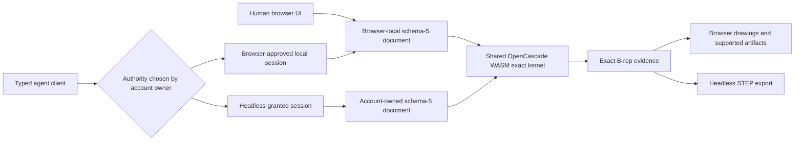

<p align="center">
  
</p>

<h1 align="center">PartMode</h1>

<p align="center">
  <strong>Open-source, local-first parametric CAD for people and permissioned typed agents.</strong>
</p>

<p align="center">
  <a href="https://partmode.com/"><strong>Open PartMode</strong></a>
  ·
  <a href="https://partmode.com/help">Read the help</a>
  ·
  <a href="docs/architecture.md">Explore the architecture</a>
  ·
  <a href="CONTRIBUTING.md">Contribute</a>
</p>

PartMode is browser-based mechanical CAD built on OpenCascade WebAssembly,
replicad, and three.js. It combines constrained sketches, editable feature
history, exact B-rep evaluation, assemblies, drawings, and standard exchange
formats in one application that runs without a desktop CAD installation.

It is built around a simple idea: human and agent changes should use the same
canonical document model and exact kernel instead of parallel, opaque
automation state. In a browser-approved session they can revise the same open
project; the separate headless path uses its own account-owned document.

| Local by default | Exact geometry | Shared model + kernel |
| --- | --- | --- |
| Model anonymously in the browser. Optional hosted agent connectivity and headless document storage are separate, explicit choices. | OpenCascade evaluates solid B-rep geometry. The shaded three.js scene is a view of the result, not the source of truth. | People use the CAD interface. Agents use typed, permissioned operations against the same schema and kernel; browser-approved agents can edit the open project. |

PartMode is free to use, inspect, modify, and self-host under the
[GNU AGPL v3 license](LICENSE).

## See PartMode in 18 seconds

[](docs/media/partmode-contributor-demo.mp4)

Open an editable template, make a human parameter edit, approve a typed agent
change, rebuild the exact geometry, and export STEP.

The demo was captured locally from public source snapshot `8db0b804` using the
production typed-agent protocol. The complete steps and evidence are in the
[capture notes](docs/media/README.md).

## What you can build

| Area | Included capabilities |
| --- | --- |
| Parametric parts | Constrained sketches, dimensions and expressions, editable feature history, multiple solid bodies, direct edits, configurations, patterns, holes, threads, sheet-metal, and structural tools |
| Assemblies | Reusable part definitions, occurrences, mates, direct in-context component editing, exploded views, sections, dependency inspection, and assembly mass properties |
| Drawings | Exact OpenCascade hidden-line views; SVG and PDF sheets can carry document-owned dimensions, tolerances, notes, symbols, and tables, while DXF exports a restricted R12 orthographic or sketch geometry subset |
| Interchange | Editable PartMode project bundles, STEP import and export, plus STL, AMF, and 3MF mesh exports |
| Inspection | Measurements, geometry health, volume, surface area, material-driven mass properties, centers of mass, inertia tensors, and persistent topology evidence |
| Agent workflows | Hosted MCP tools for capabilities, inspection, queries, detached previews, revision-safe commits, browser artifacts, and opt-in server-headless STEP workflows |

Templates are editable schema-5 starting projects, not decorative meshes.
Exact capability coverage varies by template, and a failed rebuild is reported
instead of being treated as valid geometry.

## One document model, two authority paths



### Browser-approved local projects

- Anonymous browser CAD needs no account. Projects, geometry, and recovery
  history remain in browser storage.
- Hosted browser-agent access requires an account, a revocable agent key, a
  signed-in PartMode tab, and visible approval for the project-scoped session.
  A key authenticates the agent but does not grant CAD authority by itself.
- Approved commands and results cross the hosted relay over HTTPS and remain
  only in bounded process memory. There is no offline queue, the relay is not
  end-to-end encrypted, and the browser project itself is not stored there.
- The agent inspects current state, creates a detached preview, and commits only
  against the matching document revision. The person can reject, pause,
  disconnect, or revoke access.

### Server-headless durable projects

- An edit key can be created with an explicit, immutable headless grant for
  unattended CAD. This is a separate storage and authority choice, not an
  automatic extension of browser access.
- Live headless sessions are key-bound, expire within one hour, and do not
  survive a service restart. Only committed headless documents are durable.
- Committed records survive session expiry, key revocation, restarts, and
  deployments, and remain until account deletion; there is no individual
  project-delete control yet. Headless execution has no visible Studio and a
  narrower artifact surface; STEP is the current dedicated export path.

Read the [agent workflow](docs/help/agents.md) for the complete permission,
storage, session, and tool boundaries. Live `cad_capabilities` output remains
authoritative for the exact operations and schemas supported by a running
release.

## Run locally

PartMode requires Node.js 22.13 or newer.

```sh
git clone https://github.com/BOMWiki/partmode.git
cd partmode
npm ci
npm run build
npm start
```

Open `http://127.0.0.1:4401`. Browser-local CAD does not require an account or
an external service.

To run the focused contributor gate:

```sh
npm run ci:gate
```

The gate type-checks and builds the release, verifies static and runtime
manifests, and exercises the local HTTP, account, identity, MCP, cloud, and
entrypoint contracts. CAD, kernel, assembly, export, and visible UI changes
also require the affected `smoke:*` checks. The broader blocking release gate
is available through `npm run release:gate`; the professional and nightly
matrices are separate.

## Connect an MCP agent

Create a revocable key from [Agent access](https://partmode.com/account), then
store it in the secret environment used to launch your MCP client. Do not paste
the key into a prompt, URL, command argument, or repository file.

For Codex:

```sh
codex mcp add partmode \
  --url https://partmode.com/mcp \
  --bearer-token-env-var PARTMODE_AGENT_KEY
```

Start a new session, read the PartMode Help resources, and call
`cad_capabilities` before constructing a transaction. Use a browser-approved
session when a person should see and approve the work, or deliberately create a
headless-granted edit key for an unattended server project.

## Architecture at a glance

The browser and agent paths share the canonical document model and exact
kernel-worker boundary:

- `src/page.html` and the focused `src/static/studio-*` modules implement the
  visible product, documents, modeling, assemblies, drawings, storage, and
  interaction behavior.
- `src/static/studio-agent-service.js` validates typed operations, creates
  detached previews, enforces revisions, and commits accepted changes.
- `src/static/studio-kernel.worker.js` isolates exact rebuild, validation,
  import, export, drawing, and inspection work from the UI thread.
- `src/mcp.ts`, `src/relay-hub.ts`, and `src/headless-sessions.ts` implement the
  hosted MCP, browser relay, and server-headless boundaries.

See the [architecture guide](docs/architecture.md) for the component map,
verification map, and design rules.

## Contribute

Start with a [good first issue](https://github.com/BOMWiki/partmode/labels/good%20first%20issue)
or a [help wanted issue](https://github.com/BOMWiki/partmode/labels/help%20wanted).
Comment before starting so scope and ownership are clear.

For a behavior change:

1. Stay within the issue's accepted boundary.
2. Add or update the narrowest relevant regression.
3. Run `npm run ci:gate`.
4. Run every affected `smoke:*` command named by the issue or change area.

| Area | Start here | Typical focused checks |
| --- | --- | --- |
| Browser UI and recovery | `src/page.html`, `src/static/studio.js`, `src/static/studio-storage.js` | `smoke:browser`, `smoke:usability-ui` |
| Documents and features | `src/static/studio-project-v5.js`, `src/static/studio-v5-runtime-document.js` | the affected feature `smoke:*` test |
| Exact geometry and topology | `src/static/studio-kernel.worker.js`, `src/static/studio-brep-evidence.js`, `src/static/studio-topo-naming.js` | `smoke:brep-evidence`, `smoke:topology-hash`, `smoke:cad-regression` |
| Assemblies | `src/static/studio-v5-assembly.js`, `src/static/studio-assembly-*` | `smoke:assembly-runtime` plus the affected assembly smoke |
| Typed agents and headless | `src/static/studio-agent-service.js`, `src/mcp.ts`, `src/relay-hub.ts`, `src/headless-sessions.ts` | `smoke:cloud`, `smoke:mcp`, `smoke:headless-mcp` |
| Drawings and exchange | `src/static/studio-drawing-*`, kernel import and export handlers | the affected `smoke:drawing-*`, `smoke:step-determinism` |

For CAD changes, screenshots and mesh counts are supporting evidence only.
Report the settled document result and the exact kernel, B-rep, topology, or
export evidence required by the issue. Visible behavior changes also need
browser evidence.

[Contributing guide](CONTRIBUTING.md) · [Architecture](docs/architecture.md) ·
[Contribution roadmap](ROADMAP.md) · [Public-source changelog](CHANGELOG.md)

## Limits and engineering responsibility

PartMode is engineering software, not a certification authority. Validate
dimensions, tolerances, materials, standards content, and released
manufacturing data for your application.

PartMode does not currently provide engineering simulation, certified
analysis, automated design approval, CAM, native DWG authoring, or a general
standards-certified GD&T/PMI workbench. Imported STEP does not reconstruct a
vendor's native feature history, mates, or PMI. Read
[limits, evidence, and safety](docs/help/limits-and-safety.md) for the current
product boundary.

## Repository scope

This repository contains the standalone PartMode product source, public
technical documentation, fixtures, and tests. Production credentials, private
operations, deployment configuration, internal handovers, and release records
are intentionally outside this repository.

The BOMWiki organization is the administrative home of this repository;
PartMode does not depend on BOMWiki applications, services, databases, ports,
or deployment infrastructure.

See [SECURITY.md](SECURITY.md) for vulnerability reports. Third-party
components and their licenses are listed in
[THIRD_PARTY_NOTICES.md](THIRD_PARTY_NOTICES.md).

## License

PartMode is licensed under the
[GNU Affero General Public License v3.0 only](LICENSE). Copyright © 2026 Sphinx.
