# Texts to Transformer

Train a tiny language model from scratch on your iMessage history, entirely on your Mac.

This repository contains the complete pipeline: safe Messages database snapshotting, text
extraction and pseudonymization, leakage-resistant dataset splits, tokenizer training, a custom
decoder-only Transformer, MLX training, evaluation, memorization checks, model export, and a local
terminal chat interface.

Nothing is pretrained. The tokenizer and model both start from zero.

> [!IMPORTANT]
> This builds a small personal style model, not a generally capable assistant. It can learn your
> phrasing, rhythm, slang, and common responses, but it will not reliably reason or answer factual
> questions. The resulting model may memorize private text and must remain private.

## What you will build

The default small preset is a 4-layer, 1.38M-parameter decoder-only Transformer with a custom
4,096-token byte-level BPE tokenizer and a 256-token context window. A larger 6.16M-parameter
preset is included for unusually large message histories.

```mermaid
flowchart LR
    A["Messages chat.db"] -->|"read-only SQLite backup"| B["Private snapshot"]
    B --> C["Extract + pseudonymize"]
    C --> D["Conversation sessions"]
    D --> E["Chronological train / validation / test"]
    E --> F["Train custom tokenizer"]
    F --> G["Initialize Transformer randomly"]
    G --> H["Train + evaluate with MLX"]
    H --> I["Local reply generator"]
```



An example development run used roughly 8M training tokens and produced a 1.38M-parameter model
that generated short replies in the owner's writing style.

## Safety and privacy

Read [the privacy documentation](docs/privacy.md) before running the data pipeline.

- `~/Library/Messages/chat.db` is opened in SQLite read-only mode and is never modified.
- Processing happens from a consistent private backup under `work/`, never from the live database.
- Attachments are never opened or copied.
- Handles and chat identifiers are replaced with keyed HMAC pseudonyms before JSONL is written.
- URLs, email addresses, and phone-number-shaped strings are redacted by default.
- Raw messages are never printed in normal logs.
- Datasets, tokenizers, checkpoints, and final weights are excluded from Git.
- No command uploads data or sends an iMessage. `chat` only prints a suggestion in the terminal.

Pseudonymization is not anonymization. Keep `work/` and `outputs/` on a FileVault-protected Mac and
never commit, upload, or share them.

## Requirements

- An Apple Silicon Mac (M1 or newer)
- macOS 14 or newer
- At least 16 GB of unified memory recommended
- Enough free disk space for a private copy of `chat.db` and training artifacts
- [Homebrew](https://brew.sh/) or another way to install `uv`
- Full Disk Access for Terminal, Codex, or whichever app runs the snapshot command

The project uses Python 3.11 and pins MLX 0.32.0. It does not require PyTorch.

## Install

```bash
git clone https://github.com/Doriandarko/texts-to-transformer.git
cd texts-to-transformer

# Skip this if uv is already installed.
brew install uv

uv sync
uv run imessage-mlx doctor
```

`doctor` verifies Apple Silicon, MLX Metal support, disk space, Git ignore coverage, private
directory permissions, and read-only access to the Messages database.

### Grant Full Disk Access

If `safe_to_snapshot_real_data` is `false`, open:

```text
System Settings → Privacy & Security → Full Disk Access
```

Enable the application running the command, completely restart that application, and rerun:

```bash
uv run imessage-mlx doctor
```

Do not copy the live database manually or change its permissions as a workaround.

## Train your model

Run these commands from the repository root. The commands print aggregate counts and metrics, not
message text.

### 1. Create a safe database snapshot

```bash
uv run imessage-mlx snapshot --config configs/data.yaml
```

This uses SQLite's online backup API, writes `work/snapshot/chat.db`, hashes the snapshot, and runs
`PRAGMA quick_check`.

### 2. Inspect the local Messages schema

```bash
uv run imessage-mlx inspect-schema \
  --database work/snapshot/chat.db \
  --output work/schema/schema.json
```

Apple changes the Messages schema between macOS versions, so the extractor inspects the local
schema instead of assuming an internet example is correct.

### 3. Build the private dataset

```bash
uv run imessage-mlx prepare --config configs/data.yaml
uv run imessage-mlx privacy-audit
```

This stage:

1. Recovers ordinary text and Apple typedstream `attributedBody` text.
2. Filters reactions, system events, deleted messages, and attachment-only rows.
3. Redacts obvious identifiers and pseudonymizes database identities.
4. Groups messages into six-hour conversation sessions.
5. Removes duplicate sessions.
6. Creates chronological 90/5/5 splits with seven-day guard bands.
7. Verifies that no duplicate session hash appears across splits.

The command stops instead of silently continuing when recovery or privacy checks fail.

### 4. Train the tokenizer

```bash
uv run imessage-mlx train-tokenizer \
  --train work/splits/train.jsonl \
  --output outputs/tokenizer \
  --vocab-size 4096
```

Only the training split is used. The byte-level BPE tokenizer preserves emoji, casing, punctuation,
multilingual text, slang, and unusual spelling.

### 5. Encode the corpus and select a model size

```bash
uv run imessage-mlx corpus-stats \
  --splits work/splits \
  --tokenizer outputs/tokenizer \
  --output work/tokens
```

Read `work/reports/model-selection.json`. The project refuses real training below one million
tokens and selects the largest preset supported by the corpus. A low token-to-parameter ratio is
clearly marked as a memorization-prone experiment.

### 6. Train from random initialization

Most people should use the selected 1M preset:

```bash
uv run imessage-mlx train \
  --config configs/model-1m.yaml \
  --data work/tokens \
  --tokenizer outputs/tokenizer \
  --output outputs/runs/my-model
```

If `model-selection.json` explicitly selects `model-7m`, use `configs/model-7m.yaml` instead.

Training uses next-token cross-entropy, AdamW, learning-rate warmup and cosine decay, gradient
clipping, compiled MLX updates, validation-based checkpoint selection, and resumable checkpoints.

Resume an interrupted run with:

```bash
uv run imessage-mlx train \
  --config configs/model-1m.yaml \
  --data work/tokens \
  --tokenizer outputs/tokenizer \
  --output outputs/runs/my-model \
  --resume-from outputs/runs/my-model/last
```

### 7. Evaluate the untouched test split

```bash
uv run imessage-mlx evaluate \
  --checkpoint outputs/runs/my-model/best \
  --data work/tokens \
  --output outputs/evaluation.json
```

The report includes overall and `me`-turn perplexity, a unigram baseline, exact train n-gram overlap
aggregates, and obvious-PII pattern counts. Matching private text is never persisted in the report.

### 8. Export the local model

```bash
uv run imessage-mlx export \
  --checkpoint outputs/runs/my-model/best \
  --metrics outputs/evaluation.json \
  --output outputs/final
```

The exported directory includes inference weights, model configuration, tokenizer, aggregate
metrics, and dataset hashes. Optimizer state and source messages are excluded.

### 9. Generate reply suggestions

```bash
uv run imessage-mlx chat --model outputs/final
```

Example interaction:

```text
Local MLX reply generator. Type /quit to exit. Nothing will be sent.
other: hey, are you around later?
me: yeah should be! what time?
```

The prompt labeled `other:` is the incoming message. The text labeled `me:` is the model's suggested
reply. The command remembers earlier turns until `/quit`, but it never sends anything.

For shorter, less chaotic generations:

```bash
uv run imessage-mlx chat \
  --model outputs/final \
  --temperature 0.5 \
  --top-p 0.8 \
  --max-new-tokens 24 \
  --repetition-penalty 1.2
```

## What this model can and cannot do

It can learn:

- Common greetings and sign-offs
- Your average response length
- Punctuation, emoji, slang, and casing patterns
- Frequently repeated conversational structures

It does not reliably learn:

- Arithmetic or factual knowledge
- Multi-step reasoning
- Long-term memory beyond its context window
- The capabilities of a pretrained assistant model

Making the architecture larger without adding more unique training text usually increases
memorization rather than intelligence. If you want general reasoning plus personal style, fine-tune
a pretrained model instead; this repository intentionally demonstrates true from-scratch training.

## Included model presets

| Preset | Layers | Width | Heads | MLP width | Context | Vocabulary | Approx. parameters |
| --- | ---: | ---: | ---: | ---: | ---: | ---: | ---: |
| `model-1m` | 4 | 128 | 4 | 384 | 256 | 4,096 | 1.38M |
| `model-7m` | 6 | 256 | 8 | 768 | 512 | 4,096 | 6.16M |

See [the architecture guide](docs/architecture.md) for the model, data, and checkpoint design.

## Validate everything

```bash
uv run ruff check .
uv run ruff format --check .
uv run pytest -q
git diff --check
git ls-files work outputs
```

The final command must print nothing. The test suite uses synthetic SQLite and JSONL fixtures only.
It covers snapshot immutability, attributed-body decoding, extraction accounting, pseudonymization,
split isolation, tokenizer behavior, causal masking, one-batch overfitting, checkpoint resume,
compiled MLX training, evaluation, export, and fresh-process inference.

After a real run, perform the aggregate Gate A-D audit:

```bash
uv run imessage-mlx audit \
  --run outputs/runs/my-model \
  --model outputs/final
```

The audit writes aggregate evidence to `work/reports/completion-audit.json` and exits nonzero unless
every required gate passes.

## Troubleshooting

See [the troubleshooting guide](docs/troubleshooting.md) for Full Disk Access failures, insufficient
data, interrupted runs, strange output, and privacy audit failures.

## Project structure

```text
configs/                    data and model presets
src/imessage_mlx/data/      snapshot, decoding, extraction, privacy, sessions, splits
src/imessage_mlx/model/     decoder-only Transformer implementation
src/imessage_mlx/tokenizer/ local tokenizer training
src/imessage_mlx/train.py   MLX training loop
src/imessage_mlx/evaluate.py held-out and memorization evaluation
src/imessage_mlx/generate.py local autoregressive generation
tests/                      synthetic-only test suite
work/                       ignored private datasets and reports
outputs/                    ignored private tokenizers, checkpoints, and models
```

## License

[MIT](LICENSE)
