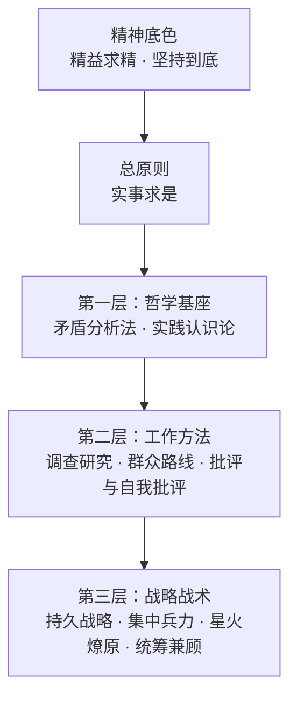

<p align="center">
  
</p>

# 🔴 求是 Skill —— 武装 AI 的大脑

<p align="center">
  <strong>语言</strong>：
  <a href="./README.md">简体中文</a> |
  <a href="./README.en.md">English</a>
</p>

> 🌟 "我们的同志在困难的时候，要看到成绩，要看到光明，要提高我们的勇气。"

> ✊ "世界上怕就怕'认真'二字。"


<p align="center">
  <a href="https://trendshift.io/repositories/25395?utm_source=trendshift-badge&amp;utm_medium=badge&amp;utm_campaign=badge-trendshift-25395" target="_blank" rel="noopener noreferrer"></a>
  <a href="https://trendshift.io/repositories/25395?utm_source=trendshift-badge&amp;utm_medium=badge&amp;utm_campaign=badge-trendshift-25395" target="_blank" rel="noopener noreferrer"></a>
  <a href="https://trendshift.io/repositories/25395?utm_source=trendshift-badge&amp;utm_medium=badge&amp;utm_campaign=badge-trendshift-25395" target="_blank" rel="noopener noreferrer"></a>
</p>

<p align="center">
<a href="https://hughyau.com/qiushi-skill/">
    
  </a>
</p>


---

**你的 AI 不应该是一个唯唯诺诺的工具。它应该是一个先看事实、再下判断的行动者。**

「求是 Skill」是一个 AI Agent Skills 合集，从经典唯物辩证法与实践哲学中提炼出一条总原则和九大方法论工具，系统性地武装 AI 的大脑。不是口号，不是鸡汤，而是可操作的方法论集合。

每一条方法都有据可依、有迹可循，直接引用经典著作原文（详见各 skill 目录下的 `original-texts.md`）。

>  "让人讲话，天不会塌下来。"

## 🔍 为什么需要这个？

当前的 AI Agent 有一个根本问题：**它们会思考，但不会"想问题"。**

- 🌀 面对复杂问题，胡子眉毛一把抓，抓不住重点
- 🗣️ 没有调查就急于给出答案，犯教条主义的错误
- 😴 方案做完不自查，"差不多就行了"
- 🏳️ 遇到困难就说"这超出了我的能力"，缺乏持续推进的能力
- 🎯 同时做十件事，件件做不好，不懂集中兵力

教员思想中的方法论——矛盾分析、实践认识论、调查研究、群众路线、批评与自我批评、持久战略——恰恰解决的就是"怎么想问题、怎么做事情"这个根本问题。

> 欢迎支持作者的其他项目！：**[AcademicForge](https://github.com/HughYau/AcademicForge)**：**One Forge, All Skills.** 一键生成安装多个 AI Agent Skills 的跨平台命令。
> 
## ❌ 这不是什么

- 🚫 **这不是 Politics或者Propaganda。** 这是 Methodology。经典唯物辩证法与实践哲学方法论可以用于指导任何需要分析问题和解决问题的场景。
- 🧭 **这不是人格蒸馏。** 该项目发布于3月25日，彼时尚无“人格蒸馏”这一概念。作者认为，以skills本身的形式限制，除了作为知识库和工作流的载体，大模型目前不能够、也不应被用来模拟人物人格，任何此类尝试都不可避免地流于失真。


*本项目仅提炼经实践检验的方法论，将其转化为可执行的认知工具，以实现取法其上、用之于今，以期借前人之光，照当下之路。*


## 🏗️ 方法结构



☀️ **总原则** —— 约束全部判断过程
- **实事求是**：从客观存在着的实际事物出发，让事实规定判断，让现实修正理论。它不是第十件思想武器，而是全部思想武器共同服从的认识论准绳。

⚙️ **第一层·哲学基座** —— 分析任何问题的底层框架
- **⚔️ 矛盾分析法**：识别矛盾、抓住主要矛盾、区分矛盾性质。"捉住了这个主要矛盾，一切问题就迎刃而解了。"
- **🔄 实践认识论**：实践→认识→再实践，螺旋上升。"实践是检验真理的唯一标准。"

🛠️ **第二层·工作方法** —— 日常工作的基本方法
- **🔎 调查研究**：没有调查就没有发言权。"调查就像'十月怀胎'，解决问题就像'一朝分娩'。"
- **👥 群众路线**：从群众中来，到群众中去。收集→系统化→返回→验证→再收集。
- **🪞 批评与自我批评**：惩前毖后，治病救人。"房子是应该经常打扫的。"

🎖️ **第三层·战略战术** —— 面对具体任务的行动指导
- **⏳ 持久战略**：战略上藐视，战术上重视。不急于求成，也不畏难放弃。
- **🎯 集中兵力**：伤其十指不如断其一指。不打无准备之仗。
- **🔥 星火燎原**：建立根据地，不做流寇。从小处着手，积累发展。
- **⚖️ 统筹兼顾**：调动一切积极因素。拒绝片面性，寻找动态平衡。

## 🗡️ 九大思想武器

| 思想武器 | 核心要义 | 原著出处 | 适用场景 |
|---------|---------|---------|---------|
| ⚔️ 矛盾分析法 | 抓主要矛盾 | 《矛盾论》 | 复杂问题分析 |
| 🔄 实践认识论 | 实践→认识→再实践 | 《实践论》 | 方案验证与迭代 |
| 🔎 调查研究 | 没有调查就没有发言权 | 《反对本本主义》 | 决策前的信息收集 |
| 👥 群众路线 | 从群众中来到群众中去 | 《关于领导方法的若干问题》 | 反馈整合与方案验证 |
| 🪞 批评与自我批评 | 惩前毖后治病救人 | 《论联合政府》 | 工作审视与质量改进 |
| ⏳ 持久战略 | 战略上藐视战术上重视 | 《论持久战》 | 长期复杂任务规划 |
| 🎯 集中兵力 | 集中优势兵力各个歼灭 | 《中国革命战争的战略问题》 | 优先级决策与资源聚焦 |
| 🔥 星火燎原 | 建立根据地不做流寇 | 《星星之火，可以燎原》 | 从零开始的发展策略 |
| ⚖️ 统筹兼顾 | 调动一切积极因素 | 《论十大关系》 | 多目标平衡与权衡 |

> 另有 `/workflows` 🔗 工作流组合作为跨 skill 编排层，定义多种方法串联时的调用顺序与数据传递规范。

## 📋 展示示例

这里收集了大家在使用求是 Skill 过程中的真实案例。欢迎在 [Discussions](https://github.com/HughYau/qiushi-skill/discussions) 中分享你使用经验帮助项目改进！
- 📖 **[用户分享“躺平”问题的矛盾分析法解读](docs/assets/tangping_editorial_perspective.md)**  —— 看skill如何“调查在先”与“具体问题具体分析”来进行实事求是。
- 📖 **[分析外行指导内行问题](https://mp.weixin.qq.com/s/bg5cgSAscy37T4gv9YJG0A)**：展示了如何用求是 Skill 拆解复杂的职场现象。
- 🤖 **[ZZZ 白话讲 AI —— 用“求是方法论”写一本零基础 AI 认知书](https://github.com/mfkyddh/ZZZ-Simple-AI)**：以“求是”方法论组织 AI 入门知识。
- 🛠️ **[Harness Ralph Qiushi](https://github.com/Tiyou-zm/harness-ralph-qiushi)**：结合求是调查研究与矛盾分析法，构建可靠的长线 Agent 交付循环工作流。
## 📦 安装


### 方式一：`npx qiushi-skill` 一键安装（首推）

默认进入交互式安装：

```bash
npx qiushi-skill
```

也支持非交互式：

```bash
npx qiushi-skill install --target claude-code --scope user
npx qiushi-skill install --target claude-code,cursor --scope project
npx qiushi-skill install --target codex,opencode,openclaw,hermes,nanobot --scope user
npx qiushi-skill install --target all --scope user
npx qiushi-skill uninstall --target claude-code --scope user
npx qiushi-skill validate
```

CLI 会：

- 为 Claude Code / Cursor 复制标准 plugin bundle
- 为 Codex / OpenCode / OpenClaw / Hermes / nanobot 复制到宿主实际扫描的 skills/commands 目录
- 为每个直接复制目录写入 `.qiushi-skill-install.json`，卸载时只删除本 CLI 管理过的文件
- 用同一条 Node 入口校验当前源码 checkout 或已发布 bundle

### 方式二：Claude Code 官方 Marketplace 安装

仓库根现已提供 `.claude-plugin/marketplace.json`，可以直接从 GitHub 仓库发现：

```text
/plugin marketplace add HughYau/qiushi-skill
/plugin install qiushi-skill@qiushi-skill
```

### 方式三：Claude Plugin Hub（备选）

```bash
npx claudepluginhub hughyau/qiushi-skill
```


### 方式四：直接贴给 AI agent 安装

如果你在让 Claude Code、Cursor Agent 或其他终端型 AI 助手代你安装，可以直接粘贴下面这段：

```text
请帮我安装 qiushi-skill：

1. 如果当前目录还没有这个仓库，执行：
   git clone https://github.com/HughYau/qiushi-skill

2. 进入仓库目录：
   cd qiushi-skill

3. 如果当前环境有 Node.js 18.17+，优先选择匹配宿主的目标执行：
   npx qiushi-skill install --target claude-code --scope user
   npx qiushi-skill install --target cursor --scope user
   npx qiushi-skill install --target codex --scope user
   npx qiushi-skill install --target opencode --scope user
   npx qiushi-skill install --target openclaw --scope user
   npx qiushi-skill install --target hermes --scope user
   npx qiushi-skill install --target nanobot --scope user

4. 如果当前环境是 Claude Code，也可以走官方链路：
   /plugin marketplace add HughYau/qiushi-skill
   /plugin install qiushi-skill@qiushi-skill

5. 如果需要手动安装或核对平台细节，请分别读取：
   .codex/INSTALL.md
   .opencode/INSTALL.md
   .openclaw/INSTALL.md
   .hermes/INSTALL.md
   .nanobot/INSTALL.md

6. 安装完成后执行：
   npx qiushi-skill validate

7. 如果没有 Node.js，再退回到仓库内置脚本：
   bash tests/validate.sh
   # 或 Windows：
   powershell -NoLogo -NoProfile -ExecutionPolicy Bypass -File tests/validate.ps1

8. 告诉我如何验证安装是否成功。
```

## 🚀 使用方式

安装后，每次会话开始时「武装思想」入口 skill 会自动注入，AI 将：

1. ☀️ 先以 `实事求是` 约束判断，避免脱离实际和先验结论
2. 🧭 根据场景判断是否值得调用某个思想武器
3. 🛠️ 在明显适用时加载对应 skill，而不是机械全调用

### 手动命令入口

仓库现在提供与 skill 对应的 `commands/*.md` 手动命令入口。  
在支持 Markdown slash commands 的助手里，可直接调用这些命令；不支持命令目录的助手，则直接打开同名文件或加载对应 `skills/*/SKILL.md`。

可用命令：

```
/contradiction-analysis   ⚔️  矛盾分析法
/practice-cognition       🔄  实践认识论
/investigation-first      🔎  调查研究
/mass-line                👥  群众路线
/criticism-self-criticism 🪞  批评与自我批评
/protracted-strategy      ⏳  持久战略
/concentrate-forces       🎯  集中兵力
/spark-prairie-fire       🔥  星火燎原
/overall-planning         ⚖️  统筹兼顾
/workflows                🔗  工作流组合
```

### 安装验证

首选：

```bash
npx qiushi-skill validate
```


```bash
bash tests/validate.sh
```

Windows：

```powershell
powershell -NoLogo -NoProfile -ExecutionPolicy Bypass -File tests/validate.ps1
```


更多平台细节见根目录下的 `.codex/INSTALL.md`、`.opencode/INSTALL.md`、`.openclaw/INSTALL.md`、`.hermes/INSTALL.md`、`.nanobot/INSTALL.md`；源码仓库还包含 `docs/platforms.md`。

## 📚 支撑文件

除核心 SKILL.md 外，部分 skill 目录下还包含以下支撑文件：

**📜 原著依据（`original-texts.md`）**  
每个方法论 skill 都附有独立的原著引用文件，收录教员选集中的完整原文引用。这些引用不会被 AI 自动加载，但可随时查阅，保证每条方法论都有据可依。

**🤖 Subagent Prompts**  
可派遣的专项 agent，将方法论转化为可执行的自动化任务：
- `investigation-agent-prompt.md` — 系统化调查研究 agent
- `contradiction-mapper-prompt.md` — 结构化矛盾映射 agent
- `feedback-synthesizer-prompt.md` — 反馈意见综合 agent

**🗺️ Reference Guides**  
将抽象方法论落地为具体可操作的参考工具：
- `contradiction-types-reference.md` — 矛盾类型速查表
- `review-checklist.md` — 工作审查检查清单
- `phase-assessment-guide.md` — 持久战阶段评估指南

## 🗂️ 项目结构

```
qiushi-skill/
├── .claude-plugin/
│   ├── marketplace.json              # Claude Code 原生 marketplace 入口
│   └── plugin.json                   # Claude Code 插件配置
├── .codex/INSTALL.md                 # Codex 安装入口
├── .cursor-plugin/plugin.json        # Cursor 插件配置
├── .hermes/INSTALL.md                # Hermes Agent 安装入口
├── .opencode/INSTALL.md              # OpenCode 安装入口
├── .openclaw/INSTALL.md              # OpenClaw 安装入口
├── .nanobot/INSTALL.md               # nanobot 安装入口
├── bin/
│   ├── qiushi-skill.mjs              # npm CLI 主入口
│   └── lib/                          # detect / install / validate 模块
├── commands/                         # 手动 slash commands 入口
├── hooks/                            # Session 注入系统
│   ├── hooks.json
│   ├── session-start                 # POSIX shell 注入脚本
│   ├── session-start.ps1             # Windows PowerShell 注入脚本
│   └── run-hook.cmd                  # Windows 适配
├── agents/
│   └── self-critic.md                # 自我批评审查 subagent
├── skills/
│   ├── arming-thought/
│   │   └── SKILL.md
│   ├── contradiction-analysis/
│   ├── practice-cognition/
│   ├── investigation-first/
│   ├── mass-line/
│   ├── criticism-self-criticism/
│   ├── protracted-strategy/
│   ├── concentrate-forces/
│   ├── spark-prairie-fire/
│   ├── overall-planning/
│   └── workflows/
│       └── SKILL.md
├── tests/
│   ├── validate.sh                   # macOS/Linux 验证脚本
│   └── validate.ps1                  # Windows 验证脚本
├── docs/
│   ├── platforms.md
│   ├── README.codex.md
│   ├── README.hermes.md
│   ├── README.openclaw.md
│   └── README.opencode.md
├── package.json
├── CHANGELOG.md
├── LICENSE
├── README.en.md
└── README.md
```

## 💡 灵感来源

- [obra/superpowers](https://github.com/obra/superpowers) —— Agentic skills 框架与软件开发方法论
- 毛选（第一至五卷）—— 本项目的方法论根基

## 📝 原著引用说明

本项目中所有语录和方法论均引自公开出版物。每条引用都标注了原文出处（篇名和年份），力求高度忠实于原著本意。引用目的仅为方法论研究和应用，不涉及政治立场。


## Star History

<a href="https://www.star-history.com/?repos=HughYau%2Fqiushi-skill&type=date&legend=top-left">
 <picture>
   <source media="(prefers-color-scheme: dark)" srcset="https://api.star-history.com/chart?repos=HughYau/qiushi-skill&type=date&theme=dark&legend=top-left&sealed_token=aj1QNUOtOCFTUi4O6DOfgYltCKt-paOWZoeAIcjLGFUyHTVU-PgQS72JVMsP7SpYY5eZeVildgoVRGJAZE4b8Io54TaA3bEcrh0Yf3BodGgk-vVgAW1Xng" />
   <source media="(prefers-color-scheme: light)" srcset="https://api.star-history.com/chart?repos=HughYau/qiushi-skill&type=date&legend=top-left&sealed_token=aj1QNUOtOCFTUi4O6DOfgYltCKt-paOWZoeAIcjLGFUyHTVU-PgQS72JVMsP7SpYY5eZeVildgoVRGJAZE4b8Io54TaA3bEcrh0Yf3BodGgk-vVgAW1Xng" />
   
 </picture>
</a>

## ⚖️ 许可证

MIT License

---

> ✊ "下定决心，不怕牺牲，排除万难，去争取胜利。"

本项目仅为方法论研究与工程应用，所有引用均出自公开出版物，引用目的为学术性方法提炼。项目不涉及任何政治立场、不对原著作政治性再诠释、不代表任何组织或个人观点。如涉侵权或不当使用请联系作者删除。
