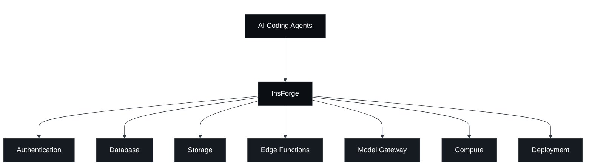

<div align="center">
  <a href="https://insforge.dev">
    <picture>
      <source media="(prefers-color-scheme: dark)" srcset="assets/logo-dark.svg">
      <source media="(prefers-color-scheme: light)" srcset="assets/logo-light.svg">
      
    </picture>
  </a>

  <p>
    The all-in-one, open-source backend platform for agentic coding.<br />
  </p>

  <p>
    <a href="https://opensource.org/licenses/Apache-2.0"></a>
    <a href="https://www.npmjs.com/package/@insforge/sdk"></a>
    <a href="https://github.com/InsForge/InsForge/graphs/contributors"></a>
    <a href="https://insforge.dev"></a>
    <a href="https://gitcgr.com/InsForge/InsForge">
      
    </a>
  </p>
  <p>
    <a href="https://x.com/InsForge"></a>
    <a href="https://www.linkedin.com/company/insforge"></a>
    <a href="https://discord.com/invite/MPxwj5xVvW"></a>
  </p>
  <a href="https://trendshift.io/repositories/19834" target="_blank">
    
  </a>
  <br /><br />
  <a href="https://vercel.com/oss">
    
  </a>
</div>

<p align="center">
  ⭐ <em>Help us reach more developers and grow the InsForge community. Star this repo!</em>
</p>

## InsForge
The all-in-one, open-source backend platform for agentic coding. InsForge gives your coding agent database, auth, storage, compute, hosting, and AI gateway to ship full-stack apps end-to-end.

https://github.com/user-attachments/assets/345efbc6-ca63-4189-bde0-12ef3bda561b

### How it works

Coding agents interact with InsForge through one of two interfaces:

- **MCP Server** (self-hosted and cloud): exposes InsForge's operations as tools any MCP-compatible agent can call.
- **CLI + Skills** (cloud only): a command-line interface paired with Skills that agents invoke directly from the terminal.

Both interfaces let coding agents operate the backend like backend engineers:

- **Read backend context and state**: Pull documentation, schemas, metadata (deployed functions, bucket contents, auth config), and runtime logs, so the agent has what it needs to write code, verify what it built, and debug when something breaks.
- **Configure primitives**: Deploy edge functions, run database migrations, create storage buckets, set up auth providers, and configure other backend resources directly.



### Core Products:
- **Authentication**: User management, authentication, and sessions
- **Database**: Postgres relational database
- **Storage**: S3 compatible file storage
- **Model Gateway**: OpenAI compatible API across multiple LLM providers
- **Edge Functions**: Serverless code running on the edge
- **Compute** (private preview): Long-running container services
- **Site Deployment**: Site build and deployment


## ⭐️ Star the Repository

<p align="center">
  
</p>

If you find InsForge useful or interesting, a GitHub Star ⭐️ would be greatly appreciated.

## Quickstart

### Cloud-hosted: [insforge.dev](https://insforge.dev)

<a href="https://insforge.dev" target="_blank" rel="noopener noreferrer"></a>

### Self-hosted: Docker Compose

Prerequisites: [Docker](https://www.docker.com/) with Compose v2.

#### 1. Setup

```bash
curl -fsSL https://raw.githubusercontent.com/InsForge/InsForge/main/deploy/setup.sh | sh -s ~/insforge
```

Fetches the files the stack reads and generates `JWT_SECRET`, `ENCRYPTION_KEY`,
`POSTGRES_PASSWORD`, `ROOT_ADMIN_PASSWORD`, and the two access keys into
`~/insforge/.env` (mode 600). Nothing is started. Re-running refreshes the files
and keeps every value you have set — it only ever adds `COMPOSE_FILE`, or points
it at this checkout's compose file if it still names the development one.

```bash
cd ~/insforge
$EDITOR .env          # API_BASE_URL, VITE_API_BASE_URL — the URL browsers will use
docker compose up -d
```

`.env` sets `COMPOSE_FILE`, so plain `docker compose` commands work from that
directory — no `-f` flags to remember.

[![Deploy on Docker][docker-btn]][docker-deploy]

<details>
<summary>Building from source instead</summary>

For working on InsForge itself. `docker-compose.prod.yml` reads the same
variables but generates nothing, so set the secrets in `.env` yourself before
starting anything you expose.

```bash
git clone https://github.com/InsForge/InsForge.git
cd InsForge
cp .env.example .env
$EDITOR .env
docker compose -f docker-compose.prod.yml up
```

Set `JWT_SECRET`, `ENCRYPTION_KEY`, `POSTGRES_PASSWORD`, and
`ROOT_ADMIN_PASSWORD` — `.env.example` ships placeholders for them, and the
compose file falls back to published defaults for any you leave unset. Set
`ACCESS_API_KEY` and `ACCESS_ANON_KEY` too if you want to know your own keys;
left empty, the backend generates a pair only it knows.

This path passes `-f` explicitly, which overrides `COMPOSE_FILE`. Add overlays as
further `-f` flags rather than editing that variable.

</details>

#### 2. Connect InsForge MCP

Open [http://localhost:7130](http://localhost:7130)

Follow the steps to connect InsForge MCP Server

<div align="center">

</div>

#### 3. Verify installation

To verify the connection, send the following prompt to your agent:
```
I'm using InsForge as my backend platform, call InsForge MCP's fetch-docs tool to learn about InsForge instructions.
```

#### 4. Running Multiple Projects

Give each project its own directory:

```bash
curl -fsSL https://raw.githubusercontent.com/InsForge/InsForge/main/deploy/setup.sh | sh -s ~/project1
curl -fsSL https://raw.githubusercontent.com/InsForge/InsForge/main/deploy/setup.sh | sh -s ~/project2
```

Then give each a project name and its own ports. Both `.env` files start with
`COMPOSE_PROJECT_NAME=insforge`, and **two directories sharing that name share
containers** — the second `up -d` adopts the first's, rebuilt with the second's
config. Set it before starting anything.

`~/project1/.env` keeps the default ports — which collide with the `~/insforge`
instance from the quickstart above if it is still running. Stop that one, or give
`project1` its own ports the way `project2` has:

```env
COMPOSE_PROJECT_NAME=project1
```

`~/project2/.env`:

```env
COMPOSE_PROJECT_NAME=project2
POSTGRES_PORT=5442
POSTGREST_PORT=5440
APP_PORT=7230
AUTH_PORT=7231
DENO_PORT=7233
```

Now each directory is a separate instance with its own containers, volumes,
database, and secrets:

```bash
cd ~/project1 && docker compose up -d
cd ~/project2 && docker compose up -d
```

`docker compose ps`, `logs -f`, and `down` operate on whichever directory you
run them from.

#### 5. Storage Backends (Optional)

InsForge stores files on the local filesystem by default. Backing storage with an S3-compatible store also enables the S3-compatible gateway at `/storage/v1/s3` (use `aws` CLI, rclone, or any AWS SDK against your InsForge Storage).

Append one overlay to `COMPOSE_FILE` in `.env`. Bundled MinIO, whose store stays
internal to the Docker network:

```env
COMPOSE_FILE=deploy/docker-compose/docker-compose.yml:docker-compose.minio.yml
```

Or RustFS, an Apache-2.0 licensed alternative:

```env
COMPOSE_FILE=deploy/docker-compose/docker-compose.yml:docker-compose.rustfs.yml
```

Keep one — the file is read as shell assignments, so a second line replaces the
first. Then `docker compose up -d` as usual.

The overlays ship with default store credentials — set `MINIO_ROOT_USER`/`MINIO_ROOT_PASSWORD` (or `RUSTFS_ACCESS_KEY`/`RUSTFS_SECRET_KEY`) in `.env` before production use.

Or bring your own S3-compatible store (AWS S3, MinIO, RustFS, Wasabi, R2, Tencent COS, Aliyun OSS ...) by setting `S3_BUCKET`, `S3_REGION`, `S3_ACCESS_KEY_ID`, `S3_SECRET_ACCESS_KEY` — plus `S3_ENDPOINT_URL` for non-AWS providers — in `.env`. If the endpoint is not reachable by browsers (private network), also set `S3_USE_PRESIGNED_URLS=false` to enable proxy mode.

See the [self-hosted storage guide](https://docs.insforge.dev/deployment/self-host-storage) for provider notes, presigned vs. proxy mode, and upgrade tips.

### One-click Deployment

In addition to running InsForge locally, you can also launch InsForge using a pre-configured setup. This allows you to get up and running quickly with InsForge without installing Docker on your local machine.

| Railway | Zeabur | Sealos |
| --- | --- | --- |
| [](https://railway.com/deploy/insforge) | [](https://zeabur.com/templates/Q82M3Y) | [](https://sealos.io/products/app-store/insforge) |


## Contributing

**Contributing**: If you're interested in contributing, you can check our guide here [CONTRIBUTING.md](CONTRIBUTING.md). We truly appreciate pull requests, all types of help are appreciated!

**Support**: If you need any help or support, we're responsive on our [Discord channel](https://discord.com/invite/MPxwj5xVvW), and also feel free to email us [info@insforge.dev](mailto:info@insforge.dev) too!


## Documentation & Support

### Documentation
- **[Official Docs](https://docs.insforge.dev/introduction)** - Comprehensive guides and API references

### Community
- **[Discord](https://discord.com/invite/MPxwj5xVvW)** - Join our vibrant community
- **[Twitter](https://x.com/InsForge)** - Follow for updates and tips

### Contact
- **Email**: info@insforge.dev

## License

This project is licensed under the Apache License 2.0 - see the [LICENSE](LICENSE) file for details.

---

[](https://www.star-history.com/#InsForge/InsForge&Date)

## Badges

Show your project is built with InsForge.

### Made with InsForge

<a href="https://insforge.dev">
  
</a>

**Markdown:**
```md
[](https://insforge.dev)
```

**HTML:**
```html
<a href="https://insforge.dev">
  
</a>
```

### Made with InsForge (dark)

<a href="https://insforge.dev">
  
</a>

**Markdown:**
```md
[](https://insforge.dev)
```

**HTML:**
```html
<a href="https://insforge.dev">
  
</a>
```


<p align="center">⭐ <b>Star us on GitHub</b> to get notified about new releases!</p>

<!-- LINK GROUPS -->

[docker-btn]: ./deploy/buttons/docker.png
[docker-deploy]: ./deploy/docker-deploy.md
