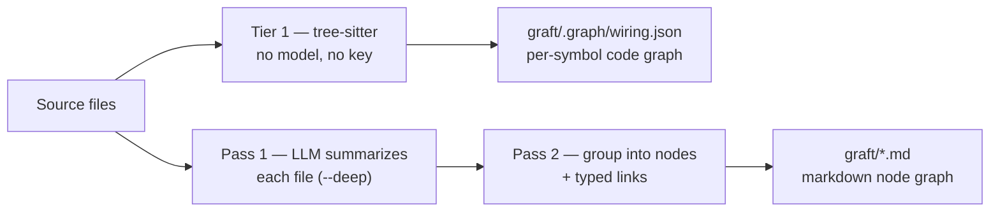

<div align="center">


### Turbocharge Claude Code, Cursor, Codex, Gemini & every coding agent: faster, cheaper, with contextual understanding specific to your codebase.

<p>
  <a href="https://github.com/NanoNets/Graft"></a>
  <a href="https://graft.nanonets.ai"></a>
  <a href="https://discord.gg/zxmKweAA29"></a>
  <a href="https://www.npmjs.com/package/@nanonets/graft"></a>
  <a href="https://www.npmjs.com/package/@nanonets/graft"></a>
  <a href="https://nodejs.org"></a>
  
  
  <a href="TELEMETRY.md"></a>
  <a href="https://scorecard.dev/viewer/?uri=github.com/NanoNets/Graft"></a>
</p>

### Up to **4× cheaper** and **3× faster**, with better or no loss of correctness.

| Metric | Cold Claude Code | Claude Code with graft |
|---|---|---|
| Tool-call reduction | Baseline | **+46%** |
| Token savings | Baseline | **+42%** |
| Time savings | Baseline | **+60%** |
| Correctness | 54% | **66% (+12 pts)** |

<sub>Efficiency is a 162-run controlled benchmark (same agent, same file tools, only the context differs). Correctness is **SWE-bench Verified**, graded by the official harness — graft resolved 66% of instances tested against Cold Claude Code's 54%. [Efficiency method ↓](#benchmark) · [SWE-bench ↓](#swe-bench-verified) · [Per-repo numbers ↓](#tested-on-your-popular-repos)</sub>

</div>

<p align="center">
  
</p>

---

## Contents

- [Quick start](#quick-start)
- [The problem](#the-problem)
- [What Graft does](#what-graft-does)
- [Benchmark](#benchmark)
- [SWE-bench Verified](#swe-bench-verified)
- [How the graph gets built](#how-the-graph-gets-built)
- [Supported languages](#supported-languages)
- [What's in a node](#whats-in-a-node)
- [What runs where](#what-runs-where)
- [Agent integration](#agent-integration) — [MCP server](#mcp-server) · [Claude Code (deep integration)](#claude-code-deep-integration)
- [CLI](#cli)
- [Search & orient](#search--orient-graft-grep--graft-map) (`graft grep` / `graft map`)
- [Monorepos & multi-repo folders](#monorepos--multi-repo-folders)
- [Visualize it](#visualize-it-graft-viz) (`graft viz`)
- [Tested on your popular repos](#tested-on-your-popular-repos)
- [Development](#development)
- [License](#license)

---

## Quick start

```bash
npm install -g @nanonets/graft   # install the CLI, once
graft init                       # build the graph + wire it into Claude Code
```

That is the whole setup. `graft init` asks which of your coding agents to wire up, builds `graft/` from your code, and drops a statusline and hooks into `.claude/`, so from the next session on Graft rides along in Claude Code: it pulls the matching nodes into each prompt and rebuilds the graph in the background after every turn. No daemon, no re-indexing to remember, nothing to run or maintain by default — the graph is just files.

Nothing is written until you pick. Run `graft init --dry-run` to see every file it would touch first, or `graft init --agents claude` to skip the prompt and wire Claude Code alone.

`graft build` adds `graft/` to your `.gitignore` automatically — the graph is a local, regenerable cache (like `node_modules`), not something you commit. What you share is the wiring `init` dropped into `.claude/`; each teammate runs `graft build` to generate their own graph:

```bash
git add .claude && git commit -m "wire in graft"
```

Prefer not to install globally? `npx @nanonets/graft init` works the same way.

<p align="center">
  
</p>

---

## The problem

Every task, your coding agent starts blind. Before it changes anything, it re-explores the repo: grep a term, open a file, follow an import, back out, try again. It is rebuilding a picture of a codebase it mapped an hour ago and threw away. That rediscovery burns most of a run's tool calls, tokens, and latency, and it is pure overhead:

- **Repeated.** Every task pays the exploration cost again, from zero.
- **Discarded.** Whatever the agent figured out dies with the session.
- **Unshared.** The next teammate, and their agent, start from scratch too.

Humans onboard to a codebase once. Agents onboard every single time.

<p align="center">
  
</p>

---

## What Graft does

Graft builds that understanding **once** and writes it into your repo as a folder of linked markdown files, one node per system, API, or concept.

- **Real explanations, not a list of symbols.** Each node says, in plain English, what a part of the system does and how it connects to the rest, the way a senior engineer would explain it. That is the part an agent actually needs so it can skip the exploration. It is not a dump of function names.
- **A real graph you can read.** No embeddings, no similarity search, no index to keep warm. The graph is a set of linked files your agent opens, greps, and follows, exactly the way it reads any other file in the repo.
- **A local cache, not a committed artifact.** `graft build` writes `graft/` and adds it to `.gitignore` — it's a regenerable local cache, like `node_modules`. What you commit is the small wiring `graft init` drops in (`.claude/`, `AGENTS.md`, the MCP config); each teammate runs `graft build` to generate their own graph. No database, no server, no setup.
- **Always fresh, automatically.** Every query rebuilds the graph against the working tree first — structural, `$0`, ~3ms when nothing moved — so `ask`/`grep`/`callers`/`skeleton`/`map` describe the code as it is right now, including uncommitted edits. `graft check` is a local freshness signal; there's no stale index to babysit.
- **Your provider, your key, your model.** Summaries are written by any provider you choose — OpenAI, Anthropic (native), OpenRouter, Fireworks, Groq, a LiteLLM proxy, or a local model — under your own key. The structural code graph (`graft build`, `graft check`) is deterministic tree-sitter and never calls a model at all.

<p align="center">
  <picture>
    <source media="(prefers-color-scheme: dark)" srcset="assets/graft-cold-vs-graft-dark.png">
    
  </picture>
</p>

---

## Benchmark

An agent that reads the graph should be cheaper and faster without getting more answers wrong. That's the whole claim, so we measured it instead of asserting it.

The harness ran three variants of the same Claude Sonnet 5 agent with the same file tools: **cold** (explores from zero), **Graft** (a `graft ask --source` bundle pushed up front), and **pull** (graft_find_code/graft_file_api tools, nothing injected — context paid for only when asked). An Opus 4.8 judge scored correctness with a required-keyword floor, so a fast-but-wrong answer couldn't win by being fast. Cost is cache-aware: reads ≈0.1×, writes 1.25×, the billing model agents actually run under.

162 runs, two repos (graft itself and a real Node/Express auth service), 3 trials each, tasks split between single-file and multi-file questions.

| Metric (mean/task) | Cold Claude Code | Claude Code with graft |
|---|---|---|
| Cost savings ($) | 0.0429 | **0.0292 (+32%)** |
| Token savings | 8,070 | **4,650 (+42%)** |
| Tool-call savings | 4.2 | **2.3 (+46%)** |
| Latency savings (s) | 39.8 | **15.8 (+60%)** |
| Correctness | 93% | 93% (equal) |

Graft never answered worse than cold, on any corpus. The pull variant gave up most of that speed for something bigger: correctness jumped to 98%, +5 points over cold, the strongest single result in the sweep. Push when speed is what you need; pull when being right matters more.

---

## SWE-bench Verified

The sweep above is our harness measuring our mechanism. So we ran the industry-standard one too — **SWE-bench Verified**, real GitHub issues from real repos, graded by the official `swebench` harness. No judge model, no similarity score: your patch is applied, the maintainers' own tests are run, and you either flip the failing test without breaking the passing ones or you don't.

**50 instances**, same model on both arms — **Claude Sonnet 5** — same Docker images, same turn limits. The only difference is whether graft is wired in.

| Correctness & efficiency | Cold Claude Code | Claude Code with graft | Improvement |
|---|---|---|---|
| Correctness | 27 / 50 (54%) | **33 / 50 (66%)** | **+12 pts** |
| Token savings | 142.0M | **109.4M** | **+23%** |
| Cost savings | $52.34 | **$42.43** | **+19%** |
| Tool-call savings | 1,370 | **1,031** | **+25%** |
| API-request savings | 2,455 | **1,875** | **+24%** |
| Wall-clock savings | 13,094s | **8,922s** | **+32%** |

graft resolved **33 of 50 instances** against Cold Claude Code's 27 — and got there with 25% fewer tool calls, 23% fewer tokens, and 32% less wall-clock time. Every correctness win has the same shape: the baseline patches one file and misses its siblings. On `django-11532` it patched 1 of the 5 files the fix requires and broke 18 previously-passing tests, twice over. On `django-16263` it patched 1 of 4 and scored 102 / 103. graft found the rest — and on `django-16263` did it in half the tokens and half the time.

Two harnesses, two claims: the controlled sweep says graft is cheaper and faster, SWE-bench says it's also more correct.

<sub>Correctness over all instances; tokens, cost and calls over the instances both arms resolved, for a like-for-like comparison. Official SWE-bench Verified images and official `swebench` 4.1.0 grader, native x86_64.</sub>

---

## How the graph gets built

Graft builds the graph in two passes, both powered by a language model:

1. **Read each file.** Every source file is summarized once into a short description of what it does.
2. **Group into nodes.** Those summaries are grouped into a curated set of nodes (subsystems, key files, and concepts) with typed links between them. Graft chooses the right level of detail for you instead of making one node per file, so a big repo becomes a few dozen readable nodes.



Every pass is cached by content hash — the LLM ones and the tree-sitter parse alike. Re-running only touches the files that changed, so the second build is fast and cheap (on this repo, 124 files: 0.74s cold, 0.18s after one edited file, 0.18s with nothing changed). `graft build --no-reuse` forces a cold re-parse.

That cheapness is what lets **every query refresh the graph before it answers**. A retrieval call stats the tree against the last build's fingerprint (~3ms), and rebuilds only if something moved — so `ask`/`grep`/`callers`/`skeleton`/`map` describe the code as it is right now, including edits that are unsaved to git: uncommitted, unstaged, or staged all look the same to graft. Git determines the visible file set; freshness compares the working-tree bytes rather than commit or index state. The refresh is structural and `$0`; it never calls the LLM. Turn it off per-command with `--no-refresh`, or everywhere with `GRAFT_NO_REFRESH=1`.

Alongside the markdown graph, `graft build` builds `graft/.graph/wiring.json` — a per-symbol code graph — plus a per-file wiring card mirroring your source tree. Tier 1 is pure tree-sitter (every function, class, and call edge; deterministic, no model, no network), which is why plain `graft build` needs no key. The `--deep` pass adds a one-line summary and a crux excerpt per symbol, cached by body hash.

---

## Supported languages

Graft parses with tree-sitter at two levels of fidelity, plus an optional
compiler-grade layer — all `$0` and deterministic (no model, no key):

- **Full-fidelity** — hand-written extractors with scope-aware, cross-file call
  and import resolution:
  **TypeScript / JavaScript** (incl. JSX & TSX), **Python**, **Go**, **Java**.

- **Broad** — symbols (functions, classes, methods, types, …) plus name-resolved
  call edges via a generic tree-sitter extractor, one grammar per language:
  **Rust, C, C++, C#, Ruby, PHP, Kotlin, Scala, Swift, Elixir, Solidity,
  OCaml, Zig, Dart, Clojure**.

- **Compiler-grade edges (opt-in)** — `graft build --lsp` adds precise
  `lsp_resolved` call edges (member calls the static pass can't type) when a
  language server is on your `PATH`: **rust-analyzer** (Rust), **clangd** (C/C++),
  **gopls** (Go), **pyright** (Python), **typescript-language-server** (TS/JS).
  It's best-effort — with no server installed the graph is unchanged.

Twenty-one languages in total. A file whose language isn't listed is skipped, not
indexed. Adding a broad-tier language is a small contribution — see
[CREDITS.md](CREDITS.md) for the folks who added the current set.

---

## What's in a node

A node is a single markdown file. Most code maps stop at an address: this thing lives in that file, on that line. That tells an agent where to look, not what it will find, so it still has to open the source and read. A Graft node holds the meaning inline, so the agent learns what it needs up front and opens the file only when it wants more.

Each node holds:

| Part | What it holds |
|---|---|
| **Summary** | A plain-English explanation of what the code does, written by the model and cached. It is there whether or not the code was ever documented, and it is regenerated when the source changes. |
| **Crux** | The handful of lines that actually carry the logic: the guard, the skip condition, the state change. Lifted straight from the source and stored inline, so the agent sees *how* it works, not just what. |
| **Sources** | The exact files the node is built from, each tracked by a content hash, so Graft can tell precisely when a node has gone stale. |
| **Links** | Typed connections to other nodes (`depends_on`, `part_of`, `uses`, `implements`, `produces`), written as `[[wikilinks]]` your agent can follow. |
| **Notes** | Anything you write below the generated block. It is preserved across regenerations, so your own context is never overwritten. |

That is three depths in one file: the summary says *what* the code does, the crux shows *how*, and the sources point to the rest if the agent needs it. A plain index makes it read a whole file to learn one thing. A Graft node hands it the answer inline, and the follow-up read often never happens.

The crux is stored as the code itself, not as a line range, on purpose. Line numbers drift whenever unrelated code above them shifts, but the lines that matter do not. Keeping the text, not the numbers, means the crux stays correct even as the file around it moves.

_Summary, sources, links, and notes ship today in markdown nodes. The crux ships per-symbol in the code graph (`graft build --deep`); inlining it into markdown nodes is next._

---

## What runs where

- **On your machine, no key, no network:** the structural code graph. `graft build` (wiring graph + per-file cards), `graft check`, and `graft ask` are deterministic tree-sitter — they never call a model.
- **Through your provider key:** the LLM-written parts — `graft build --deep` adds the concept nodes (file summaries + node synthesis) and the per-symbol summaries and cruxes. graft is vendor-neutral: set `GRAFT_PROVIDER` (`openai` for any OpenAI-compatible endpoint, or `anthropic` for the native API), your `GRAFT_API_KEY`, `GRAFT_MODEL`, and — for the `openai` wire format — `GRAFT_BASE_URL` to point at OpenRouter, Fireworks, Groq, a LiteLLM proxy, a local server, or OpenAI itself. Or pass `--provider/--model/--api-key/--base-url` on the command line. (`OPENROUTER_API_KEY` still works as a deprecated fallback.)
- **Anonymous usage stats** — the only network calls are the LLM requests you configured, a daily npm version check, and one batched usage ping. The ping carries buckets and fixed labels only: never your code, file paths, repo name, symbols, queries, or error messages. [`TELEMETRY.md`](TELEMETRY.md) is the complete list and `graft telemetry debug` prints exactly what your machine would send. Turn it off with `graft telemetry disable`, `DO_NOT_TRACK=1`, or by unchecking the box in `graft init`; it is off in CI and in any build from source.

See [`.env.example`](.env.example) for the full list of settings (model, base URL, graph directory).

---

## Agent integration

One command wires Graft into the coding agents you use:

```bash
npx @nanonets/graft init
# detects your agents and writes each one's native instruction file;
# Claude Code additionally gets the live statusline + hooks below
```

On a terminal, `init` shows you every agent it knows about — flagging the ones it detected (via their config directories) and listing the exact files each would write — and wires only the ones you select. Claude Code is pre-selected; nothing else is. Selected agents get a marker-fenced Graft section in their shared instruction file — `AGENTS.md` (Codex, OpenCode and other CLIs that read it), `GEMINI.md`, `.github/copilot-instructions.md` — or a wholly-owned rule/skill file for the agents that use one: `.claude/skills/graft/SKILL.md`, `.cursor/rules/graft.mdc`, `.kiro/steering/graft.md`, `.windsurf/rules/graft.md`, `.adal/skills/graft/SKILL.md` for [AdaL](https://adal.sylph.ai). Claude Code is in the second group: `init` writes its own skill file and never touches your `CLAUDE.md`. Re-running only updates Graft's own section (or replaces the owned file) and never touches the rest of your content.

With no TTY to prompt on — CI, a Dockerfile, a piped shell — `init` writes **nothing** and prints the command to run instead. Pass `--agents <ids>` or `--yes` to make a scripted run explicit.

| Flag | Effect |
|---|---|
| `--agents <ids...>` | wire only these, no prompt — ids: `agents`, `cursor`, `gemini`, `copilot`, `kiro`, `windsurf`, `adal`, `claude` |
| `--yes`, `-y` | skip the prompt and wire every **detected** agent |
| `--dry-run` | print every file `init` would touch, then exit without writing |
| `--all-agents` | write instruction files for every known agent, detected or not |
| `--no-agents` | Claude Code wiring only; skip other agents |
| `--list-agents` | print the known agent ids and exit |
| `--no-mcp` | skip MCP server registration |
| `--no-hooks` | skip hook installation |
| `--no-global` | skip writes outside this repo (the `~/.codex/` entries below) |

#### Writes outside the repo

Selecting the `agents` host also touches your **user-level** Codex config, when `~/.codex/` exists:

| Path | What changes |
|---|---|
| `~/.codex/config.toml` | registers the Graft MCP server (`[mcp_servers.graft]`) |
| `~/.codex/hooks/graft/graft-hooks.cjs` | the post-edit hook shim |
| `~/.codex/hooks.json` | a `PostToolUse` entry matching `Write\|Edit\|MultiEdit` |

Both configs are user-level, so they apply to **every** repo you open with Codex, not just this one. The picker labels these `machine-wide`, `--dry-run` lists them in their own section, and `--no-global` skips them while still wiring `AGENTS.md`.

### MCP server

`graft init` also registers Graft's MCP server with agents that support it, so these six tools appear natively, no shell required. Claude Code gets this too: `graft init` writes the server into the project's `.mcp.json` (restart Claude Code to load it). Skip with `--no-mcp`; run it manually with `graft mcp [dir]`.

| Tool | Takes | What it's for |
|---|---|---|
| `graft_find_code` | a question | Ranked nodes with file:line, source inlined — usually the full answer, no follow-up read needed. |
| `graft_file_api` | a file path | Every signature in that file, no bodies — the API surface for a tenth of the tokens. |
| `graft_trace_calls` | a symbol | Who depends on it, or what it depends on with `direction: out`, N levels deep for blast radius. |
| `graft_find_all` | a regex | Every hit, grouped by enclosing symbol, ranked by how coupled that symbol is. |
| `graft_repo_map` | nothing | A first look at an unfamiliar repo: directory clusters, hubs, hotspots. |
| `graft_check_freshness` | nothing | Whether the local graph has drifted from the code. |

Register it by hand if your agent needs it explicit:

```json
{ "mcpServers": { "graft": { "command": "npx", "args": ["-y", "@nanonets/graft", "mcp"] } } }
```

Where a CLI agent supports user-level `hooks.json`, `init` also installs Graft's post-edit hook — blast-radius warnings and automatic `$0` graph re-sync after edits (skip with `--no-hooks`).

### Claude Code (deep integration)

`graft init` always wires up Claude Code, and Claude Code gets more than the skill file above. From then on, any Claude Code session opened in the repo gets:

- **a live statusline** — graph size, % enriched, and a `⚠ N stale` warning when the code has moved ahead of the graph
- **auto-sync** — every graft query brings the graph up to date first, so an answer always describes the code as it is right now, uncommitted edits included. A query refreshes only what it reads; the markdown under `graft/` is refreshed by the background rebuild at the end of a turn that touched code. Both are structural and `$0` — auto-sync never calls the LLM on its own
- **context on tap** — each prompt pulls the matching nodes into the session; editing a file surfaces what depends on it ("blast radius"); new sessions start with the repo map

<p align="center">
  
  <br/><sub>install → init → hooks keep the graph fresh every session</sub>
</p>

<p align="center">
  
  <br/><sub>edit a file → blast radius appears inline → graph auto-resyncs → confirmed in <code>graft viz</code></sub>
</p>

`graft init` is idempotent and never clobbers your existing `.claude/settings.json` — it merges its blocks and leaves the rest alone. Want the LLM summaries too? Run `graft build --deep` (with a key) whenever you like; auto-sync will never do it for you.

---

## CLI

```bash
graft build [dir]                    # build graft/ from the code at [dir]: wiring graph + per-file cards (no LLM, no key)
graft build --deep                   # add the LLM layer: concept nodes + per-symbol summary/crux (cached)
graft build --extensions .ts .py     # only include these code extensions
graft build --no-reuse               # re-parse every file instead of replaying unchanged ones from cache
graft build --follow-submodules      # include initialized submodules; persist the choice for builds + MCP refresh
graft build --no-follow-submodules   # exclude submodules again and persist that choice (the default)

graft ask "<task>" [dir]             # query the graph — ranked nodes + exact file:line (no LLM, no key)
graft ask "<task>" --json            # machine-readable result
graft ask "<task>" --in <scope>      # narrow to one sub-project of a monorepo/multi-repo folder (see below)

graft skeleton <file> [dir]          # every signature in one file, no bodies — the API surface for ~1/10th the tokens (no LLM, no key)

graft callers <symbol> [dir]         # who calls/references/imports/implements/extends a symbol (no LLM, no key)
graft callers <symbol> --direction out  # the reverse: what the symbol itself calls/references (was `graft callees`)
graft callers <symbol> -d N          # walk transitively out to depth N — full blast radius (was `graft impact`)

graft grep "<regex>" [dir]           # exhaustive regex search over indexed files, grouped by enclosing symbol (no LLM, no key)
graft grep "<regex>" --in <path>     # narrow to files at or under this path prefix
graft grep "<regex>" -i --fixed      # case-insensitive; treat the pattern as a literal string, not a regex

graft map [dir]                      # token-budgeted repo orientation — dir clusters, hubs, hotspots (no LLM, no key)
graft map --max-dirs N               # raise/lower the number of directories shown

graft blast [dir]                    # blast radius of a diff: what depends on the lines this change touched (no LLM, no key)
graft blast --base origin/main       # diff against the merge base with HEAD — what a PR job runs
graft blast --format markdown        # a PR comment: the areas a change can reach, per-symbol detail collapsed under it
graft blast --base origin/main --name  # name those areas with one cached LLM call, instead of a full --deep build
graft blast --export-viz site/       # also write the interactive page for this radius (what a PR comment links to)
graft blast --depth all --format json  # the full transitive closure, machine-readable

graft check [dir]                    # fail (exit 1) if graft/ has drifted from the code (never auto-refreshes — it's the drift report)
graft check --json                   # print the drift report as JSON

# ask / skeleton / callers / grep / map / blast all refresh the graph first if the working tree moved:
#   --no-refresh                     # answer from the graph exactly as it is on disk
#   GRAFT_NO_REFRESH=1               # same, for every command
#   GRAFT_REFRESH=hash               # hash every file instead of trusting size+mtime

graft viz [dir]                      # see the graph: serves an interactive viewer on localhost
graft viz --port 5000 --no-open      # pick a port; don't auto-open the browser
graft viz --export site/ --title "PR #12"  # one self-contained index.html — for CI, GitHub Pages, or a build artifact

graft init [dir]                     # pick which agents to wire (prompts on a terminal; writes nothing until you choose)
graft init --dry-run                 # list every file it would touch, then exit
graft init --agents cursor kiro      # wire only these agents, no prompt (ids: agents, cursor, gemini, copilot, kiro, windsurf, adal, claude)
graft init --yes                     # no prompt; wire every detected agent
graft init --no-global               # skip writes outside this repo (~/.codex/ config + hooks)
graft init --no-build                # wire the files only; don't build the graph
graft init --all-agents              # wire every known agent, detected or not
graft init --list-agents             # list known agent ids and exit

graft version                        # print the installed + latest published npm version
graft upgrade                        # npm install -g the latest published version
                                     # a new version is announced automatically (checked once a day);
                                     # after upgrading, the next session refreshes this repo's wiring itself

# global
graft --dir <path>                   # use a context dir other than <repo>/graft
graft --version, -v                  # print the installed version and exit
```

Method calls resolve through the receiver's type — constructor assignments
(`self.router = APIRouter()`) and type annotations, not just the call-site
name — so `callers`/`grep --in` return calls bound to the right
type on method-heavy code, not every method anywhere with that name.

## Search & orient (`graft grep` / `graft map`)

`graft grep "<regex>"` is exhaustive over every indexed file and groups hits
by enclosing symbol, ranked by the same in-edge coupling `graft map` uses —
built for "every occurrence of this pattern" tasks where `graft ask`'s
ranked top-N isn't enough:

```
"NEEDLE" — 2 hits in 2 symbols across 1 files (searched 1 indexed files)

heavilyCalled · function · src/a.ts:L1-L3 · 3 in-edges
  L2: console.log("NEEDLE hit in heavilyCalled");

rarelyCalled · function · src/a.ts:L4-L6 · 0 in-edges
  L5: console.log("NEEDLE hit in rarelyCalled");
```

`graft map` is a token-budgeted first look at a repo — directory clusters
with file/symbol counts, each dir's local hubs, and the global hotspots —
all ranked by in-degree, no LLM, no key:

```
repo map — 113 files · 687 symbols · 2186 edges · typescript

src/                63 files · 527 symbols   hubs: contextDirFor (node-file.ts, 21←), wiringPath (write.ts, 14←), buildGraph (build.ts, 11←)
test/               43 files · 102 symbols   hubs: edge (graph-traverse.test.ts, 4←), graphOf (graph-traverse.test.ts, 4←), fileNode (graph-map.test.ts, 3←)
viewer/             5 files · 58 symbols   hubs: $ (main.ts, 9←), activeGraph (main.ts, 5←), cvar (data.ts, 5←)
scripts/            2 files · 0 symbols

hotspots: contextDirFor · function · src/context/node-file.ts:L100-L103 · 21←  wiringPath · function · src/graph/write.ts:L20-L22 · 14←  buildGraph · function · src/graph/build.ts:L104-L218 · 11←  ...
```

## Monorepos, submodules & multi-repo folders

Graft supports these layouts:

- **A monorepo with one `.git`** (a `pnpm-workspace.yaml`/`package.json`
  `workspaces`, or per-package `go.mod`/`pyproject.toml`/`Cargo.toml`) —
  `graft build` discovers each sub-project as a ranking scope. `ask`/`map`
  rank every scope on its own terms and fuse the results, so the biggest
  sub-project can't drown a small one; hits carry `[scope/]` labels, and
  `graft map` groups its directory clusters by scope first.
- **A Git superproject with initialized submodules** — submodules stay excluded
  by default. Run `graft build --follow-submodules` to fold initialized gitlinks
  into one graph, prefixing child paths (for example,
  `deps/parser/src/index.ts`) while honoring each submodule's own Git ignore
  rules. Visible untracked files are included too; uninitialized submodules
  remain absent until `git submodule update --init` checks them out. The choice
  is saved in `.graft/config.json`, so later no-flag builds and MCP automatic
  refreshes behave the same way. Run `graft build --no-follow-submodules` to
  restore and persist the default boundary.
- **A folder of separate git repos** (no `.git` at the top) — `graft build`
  auto-splits: each child gets its own (git-ignored) `graft/`, and the parent
  gets a `graft/workspace.json` index. Queries from the parent federate across
  every child, always labeled `<child>/`. Run `graft build` inside a child to
  work on just that repo.

In every layout, narrow to one sub-project with `graft ask "<task>" --in <scope>/`
once you know where you're working.

`graft init` at the parent of a multi-repo folder wires **every child repo too**,
not just the parent — an agent session opens at a repo root and reads its
instruction files from there, so each child needs its own. A session started in
the parent gets the federated view; one started in a child sees that repo alone.

Commands also find the graph from a subdirectory: with no `[dir]` argument they
walk up to the nearest `graft/`, so `graft ask` works from `src/deep/inside/`
without a `cd` to the repo root.

## Visualize it (`graft viz`)

`graft viz` opens a local, interactive view of both graphs — no install, no dev
server; the viewer ships prebuilt inside the package.

<p align="center">
  
  <br/><sub>search → jump to a node → dependency graph lights up</sub>
</p>

- **Context** tab — the architecture graph from `graft/*.md`. Nodes colored by
  type, sized by connectedness.
- **Code** tab — the per-symbol graph from `graft/.graph/wiring.json` (run `graft build` first).
- **Outline** tab — the file → class → method hierarchy as a collapsible tree.

Edges speak the code's language. Every link is one of a closed set of verbs, each
answering a question someone building or reviewing code actually asks:

| Verb | The question it answers |
|---|---|
| `part_of` / `contains` | where does this live? |
| `uses` / `calls` / `imports` / `depends_on` | what breaks if I change this? |
| `produces` | where does this output come from? |
| `configures` | what changes its behavior without a code change? |
| `validates` | what checks or judges this? (tests, drift checks, scoring) |
| `extends` / `implements` | what contract must this honor? |

Select a node and its edges take on direction: **amber = what it depends on,
teal = what depends on it**, with the verb written on each highlighted edge.
Chips above the canvas filter by verb; tree-sitter-extracted edges draw solid
while LLM-inferred ones draw dashed. The viewer live-reloads when `graft/`
changes on disk. Older graphs with vague verbs (`influences`, `supports`) are
normalized on load — no regeneration needed.

---

## Tested on your popular repos

The [benchmarks](#benchmark) measure the mechanism. The real test is whether graft helps an agent **ship real changes** on code people actually run, not just answer questions. So we benchmark it on popular open-source repos: **15 tasks each**, 10 real developer questions plus **5 actual implementation tasks** (real merged pull requests, each re-implemented from its base commit and scored against the files the maintainers actually changed). Same agent (Claude Opus), same file tools; the only difference is whether graft is wired in.

Across these repos graft runs **up to 4× cheaper and 3× faster**, with better or no loss of correctness: it reproduces the real merged PRs by touching the same files the maintainers did. Per-repo detail below.

### PocketBase (Go, ~350 files)

| Aggregate over 15 tasks | Standard Claude Code | With graft |
|---|---|---|
| Cost | $13.91 | **$11.02 (−21%)** |
| Wall-clock | 2,044s | **1,762s (−14%)** |
| PRs reproduced | 5 / 5 | **5 / 5 (same files as the maintainers)** |

Cheaper and faster with no loss of correctness: graft reproduced all five merged PRs, touching the same files the maintainers did. The gap is widest on cross-file understanding — "how does auth work across OAuth2 providers" dropped from $2.19 to $0.84.

<details>
<summary><b>The 10 questions we asked</b></summary>

1. **Orientation** — Give me a map of PocketBase's architecture: the main subsystems and how an HTTP request flows through to the database.
2. **Entry-point trace** — Trace end-to-end what happens when a client creates a record via the REST API, from route handler to database write.
3. **Feature location** — I want to add a brand-new collection field type. Where do I hook it in, and which pieces must change?
4. **Bug localization** — Realtime subscriptions silently stop delivering events after a while. Where would you start looking, and why?
5. **Blast radius** — If I change the signature of the record-validation logic, what depends on it and what could break?
6. **Cross-file synthesis** — How does auth work across OAuth2 providers: where are tokens issued, validated, stored, and refreshed?
7. **Extensibility** — How do I use PocketBase as a Go framework to register a custom route plus an on-record-create hook?
8. **Security discovery** — Where is user input validated, and where are collection API access rules enforced before a query runs?
9. **Public API** — As an external app, how do I authenticate and then list and filter records over the REST API?
10. **Test verification** — Where are the tests for the record CRUD API, and what do they assert about access rules?

</details>

<details>
<summary><b>The 5 merged PRs we re-implemented</b></summary>

Each PR was reset to its base commit; graft's diff was scored against the files the merged PR changed.

| PR | Type | What it does | Files the maintainers touched |
|---|---|---|---|
| [#6744](https://github.com/pocketbase/pocketbase/pull/6744) | feat | Generate & serve WebP thumbnails | `apis/file.go`, `tools/filesystem/filesystem.go` |
| [#6947](https://github.com/pocketbase/pocketbase/pull/6947) | fix | Uniform char distribution in regex random strings | `tools/security/random_by_regex.go` |
| [#6690](https://github.com/pocketbase/pocketbase/pull/6690) | refactor | Patreon OAuth2 to use `x/oauth2/endpoints` | `tools/auth/patreon.go` |
| [#2726](https://github.com/pocketbase/pocketbase/pull/2726) | perf | Drop a redundant admin-count query on a hot middleware path | `apis/middlewares.go` |
| [#3192](https://github.com/pocketbase/pocketbase/pull/3192) | fix | Restore prior API rules on automigration rollback | `plugins/migratecmd/templates.go` |

</details>

<details>
<summary><b>Method</b></summary>

Two clones of PocketBase at the same commit: one wired with `graft init`, one untouched and verified graft-free. Each task run headless (`claude -p`, Claude Opus) with an empty MCP config. Understanding questions were graded by whether the answer pointed to the right files and functions; PR tasks were scored on whether the agent's diff touched the same files as the merged PR. Every transcript was audited to confirm graft was actually used in the graft arm and absent from the standard arm.

</details>

---

## Development

```bash
git clone https://github.com/NanoNets/context-graph-engine.git && cd context-graph-engine
npm install
npm run build
npm test

npm run cli -- build --deep .      # run the CLI from source
```

---

## License

MIT. See [LICENSE](LICENSE).
