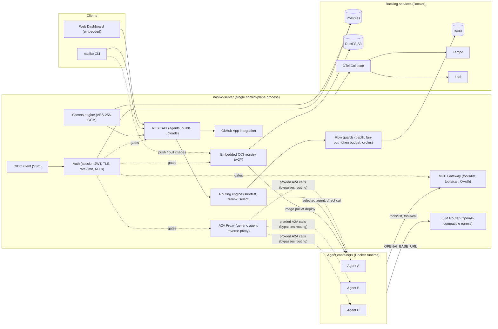

<p align="center">
  
</p>

<p align="center">
  <strong>Deploy, route, secure, and observe any <a href="https://github.com/a2aproject/a2a-spec">A2A</a>-speaking agent
  with a single command</strong> — no gateway, no sidecar, no glue code.
</p>

<p align="center">
  <a href="https://docs.nasiko.com"><b>📚 Documentation</b></a>
  &nbsp;•&nbsp;
  <a href="https://discord.com/invite/HmnfkTfjFv"><b>💬 Discord</b></a>
  &nbsp;•&nbsp;
  <a href="https://github.com/Nasiko-Labs/nasiko/issues"><b>🐛 Report a bug</b></a>
</p>

<!-- Shieldcn badges: badge groups + colored single badges, tuned for both GitHub color schemes -->
<p align="center">
  <a href="https://github.com/Nasiko-Labs/nasiko/stargazers">
    <picture>
      <source media="(prefers-color-scheme: dark)" srcset="https://shieldcn.dev/github/stars/Nasiko-Labs/nasiko.svg?variant=secondary&mode=dark&theme=amber&font=geist-mono" />
      
    </picture>
  </a>
  <a href="https://github.com/Nasiko-Labs/nasiko/network/members">
    <picture>
      <source media="(prefers-color-scheme: dark)" srcset="https://shieldcn.dev/github/forks/Nasiko-Labs/nasiko.svg?variant=secondary&mode=dark&theme=blue&font=geist-mono" />
      
    </picture>
  </a>
  <a href="https://github.com/Nasiko-Labs/nasiko/releases">
    <picture>
      <source media="(prefers-color-scheme: dark)" srcset="https://shieldcn.dev/github/release/Nasiko-Labs/nasiko.svg?variant=secondary&mode=dark&theme=violet&font=geist-mono" />
      
    </picture>
  </a>
  <a href="https://github.com/Nasiko-Labs/nasiko/blob/main/LICENSE">
    <picture>
      <source media="(prefers-color-scheme: dark)" srcset="https://shieldcn.dev/badge/License-Apache_2.0-red.svg?mode=dark&font=geist-mono" />
      
    </picture>
  </a>
</p>
<p align="center">
  <a href="https://github.com/Nasiko-Labs/nasiko">
    <picture>
      <source media="(prefers-color-scheme: dark)" srcset="https://shieldcn.dev/badge/Language-Rust-orange.svg?logo=rust&mode=dark&font=geist-mono" />
      
    </picture>
  </a>
  <a href="https://github.com/Nasiko-Labs/nasiko/issues">
    <picture>
      <source media="(prefers-color-scheme: dark)" srcset="https://shieldcn.dev/github/issues/Nasiko-Labs/nasiko.svg?variant=secondary&mode=dark&theme=cyan&font=geist-mono" />
      
    </picture>
  </a>
  <a href="https://github.com/Nasiko-Labs/nasiko/pulls">
    <picture>
      <source media="(prefers-color-scheme: dark)" srcset="https://shieldcn.dev/github/prs/Nasiko-Labs/nasiko.svg?variant=secondary&mode=dark&theme=green&font=geist-mono" />
      
    </picture>
  </a>
  <a href="https://github.com/Nasiko-Labs/nasiko">
    <picture>
      <source media="(prefers-color-scheme: dark)" srcset="https://shieldcn.dev/github/ci/Nasiko-Labs/nasiko.svg?variant=secondary&mode=dark&theme=purple&font=geist-mono" />
      
    </picture>
  </a>
  <a href="https://github.com/Nasiko-Labs/nasiko/pulls">
    <picture>
      <source media="(prefers-color-scheme: dark)" srcset="https://shieldcn.dev/badge/PRs-Welcome-pink.svg?mode=dark&font=geist-mono" />
      
    </picture>
  </a>
</p>

## Table of Contents

- [What is Nasiko?](#what-is-nasiko)
- [Features](#features)
- [Architecture](#architecture)
- [Requirements](#requirements)
- [Quick Start — Docker only (no Rust needed)](#quick-start--docker-only-no-rust-needed)
- [Setup guides by operating system](#setup-guides-by-operating-system)
- [CLI — install & use](#cli--install--use)
- [Environment Variables](#environment-variables)
- [Project Structure](#project-structure)
- [Troubleshooting](#troubleshooting)
- [Project Activity](#project-activity)
- [Documentation & Links](#documentation--links)
- [Support](#support)
- [Contributing](#contributing)
- [License](#license)

## What is Nasiko?

Running more than a couple of agents quickly turns into an operations problem: *who calls whom*,
*which key does each agent hold*, *what did that call cost*, *why did it fail?*

Nasiko is a **single control-plane process** that sits in front of every agent and answers all of that.
It terminates TLS, authenticates every request, and proxies all agent-to-agent traffic itself, so agents
are **never publicly reachable** — every hop is a checkpoint for rate limits, ACLs, and tracing.

**Different language, same A2A protocol** — bring your own agents in Python, Rust, Go, or TypeScript.
No proprietary agent format, no lock-in.

<p align="center">
  
  <br />
  <sub><b>Nasiko Dashboard</b> — deploy agents, route traffic, manage tools, and watch traces.</sub>
</p>

## Features

| Feature | What it does |
|---|---|
| **Deploy anything that speaks A2A** | `nasiko deploy` builds, pushes to the embedded registry, and runs it. No external registry required. |
| **Intelligent routing engine** | 3-stage pipeline — shortlist by embedding similarity, rerank on conversation context, then LLM final pick. Callers don't need to know your fleet. |
| **Single ingress, always proxied** | Agents are never publicly reachable; every agent-to-agent call is proxied through the server. |
| **MCP Gateway** | One permanent URL gives every agent a merged, permission-filtered view of Composio toolkits and custom MCP servers — without the agent holding the credentials. |
| **LLM Router** | Agents get an `OPENAI_BASE_URL` + a short-lived identity token instead of a real key. The router resolves provider/model/key server-side. No agent or log ever sees a real API key. |
| **Full observability** | Every dispatch and proxy hop emits a real OTel span -> one end-to-end trace. Token usage & cost are auto-collected from `gen_ai.*` attributes. |
| **Flow guards** | Redis-backed cascade limits (depth, fan-out, token budget, timeout, cycle detection) stop runaway agent loops. |
| **Encrypted secrets** | Per-agent secrets are AES-256-GCM encrypted at rest, injected only at deploy time. |
| **Access control** | User to-agent ownership/grants and an agent-to-agent allowlist gate every proxy call, independently. |
| **Embedded OCI registry** | Self-hosted, S3-backed registry with layer dedup — `nasiko push` / `nasiko deploy` need nothing external. |
| **CLI-first, no lock-in** | `nasiko new`, `run`, `chat`, `deploy`. Bring your own LLM provider. |
## Architecture

Nasiko is a **single process** — there is no separate gateway. Every inter-agent call is proxied back
through the server, the single chokepoint where flow limits, ACLs, and observability are enforced.
Durable state lives in **Postgres**, **Redis**, and **S3** (RustFS), with optional observability via
**Tempo / Loki / the OTel Collector**.



> Every request to an agent is either dispatched by the routing engine or proxied generically — both
> paths originate **inside** the server. Agents never receive a direct, public request, and both call
> back out into the LLM Router and MCP Gateway rather than holding real API keys or tool credentials.

---

## Requirements

| Component | Minimum version | Why |
|---|---|---|
| **Docker Engine + Compose V2** | Compose V2 plugin (the `docker compose` command — not the legacy standalone `docker-compose` v1 binary) | `docker-compose.yml` uses the extended `depends_on: condition: service_healthy` syntax; the Docker-only path needs nothing else. |
| **Rust** | 1.85+ (stable) | The workspace targets `edition = "2024"` (see [`Cargo.toml`](Cargo.toml)), stabilized in Rust 1.85 — only needed for the CLI / Path B developer setup, not the Docker-only path. |
| **A2A protocol** | Spec **v1.0** exactly (latest upstream release: v1.0.1, Linux Foundation) | Nasiko requires and hardcodes the `A2A-Version: 1.0` header on every request; agents on older/pre-1.0 spec versions (e.g. 0.2.x, 0.3.0) are rejected with `-32009 VersionNotSupported` (see [`docs/A2A_PROTOCOL.md`](docs/A2A_PROTOCOL.md)). Any agent speaking v1.0 works, regardless of its implementation language. |

---

## Quick Start — Docker only (no Rust needed)

The fastest way to run Nasiko requires **only [Docker](https://docs.docker.com/get-docker/)** (with Compose).
The server builds itself from source inside Docker.

### 1. Clone and configure

```sh
git clone https://github.com/Nasiko-Labs/nasiko.git
cd nasiko
cp .env.example .env
```

Edit `.env` and set at minimum:

- `OPENAI_API_KEY` — your OpenAI key (used by the routing engine and injected into agents)
- `ADMIN_PASSWORD` — password for the bootstrap admin account

### 2. Start the platform

```sh
docker compose up -d
```

This builds the server image and starts the full stack:
**Postgres · Redis · RustFS (S3) · OTel Collector · Tempo · Loki · nasiko-server**.

- First build takes a few minutes (compiles Rust inside Docker) — subsequent builds are fast.
- Open **http://localhost:8080** for the dashboard and log in with `ADMIN_USERNAME` / `ADMIN_PASSWORD`
  (default `admin` / `changeme`).

```sh
docker compose logs -f server   # follow server logs
docker compose down             # stop everything
docker compose up -d --build    # rebuild after pulling new changes
```

> No Docker? Use the [Developer / Rust setup](#path-b--developer--rust-setup) below.
## Setup guides by operating system

You have **two supported paths**:

| Path | Requires | Best for |
|---|---|---|
| **A. Docker-only** | Docker only | Anyone who just wants to run the platform |
| **B. Source / Rust** | Rust + `just` | Contributors, developers, hot-reload |

### Path A — Docker-only

<details>
<summary><b>Windows</b></summary>

1. Install **Docker Desktop** -> https://www.docker.com/products/docker-desktop/
2. Open Docker Desktop and wait until the engine is running.
3. In a terminal (PowerShell or Git Bash):
   ```powershell
   git clone https://github.com/Nasiko-Labs/nasiko.git
   cd nasiko
   Copy-Item .env.example .env
   # edit .env -> set OPENAI_API_KEY and ADMIN_PASSWORD
   docker compose up -d
   ```
4. Open http://localhost:8080 and log in.

> Windows troubleshooting: see the [Troubleshooting](#troubleshooting) section (port conflicts,
> line endings, encryption key, WSL, Docker Desktop).
</details>

<details>
<summary><b>macOS</b></summary>

1. Install **Docker Desktop for Mac** -> https://www.docker.com/products/docker-desktop/
2. Open Docker Desktop until the engine is running.
3. In Terminal:
   ```sh
   git clone https://github.com/Nasiko-Labs/nasiko.git
   cd nasiko
   cp .env.example .env
   # edit .env -> set OPENAI_API_KEY and ADMIN_PASSWORD
   docker compose up -d
   ```
4. Open http://localhost:8080 and log in.

> `host.docker.internal` resolves out of the box on Docker Desktop (macOS + Windows), so agents can
> reach the MCP gateway without extra setup.
</details>

<details>
<summary><b>Linux</b></summary>

1. Install Docker engine + Compose plugin -> https://docs.docker.com/engine/install/
2. Add your user to the `docker` group and re-login:
   ```sh
   sudo usermod -aG docker "$USER"
   newgrp docker
   ```
3. In a terminal:
   ```sh
   git clone https://github.com/Nasiko-Labs/nasiko.git
   cd nasiko
   cp .env.example .env
   # edit .env -> set OPENAI_API_KEY and ADMIN_PASSWORD
   docker compose up -d
   ```
4. Open http://localhost:8080 and log in.

> **Linux note:** native Docker does **not** provide `host.docker.internal` automatically. If agents
> report `[Errno -2] Name or service not known`, run Docker with
> `--add-host host.docker.internal:host-gateway` or set `MCP_GATEWAY_PUBLIC_URL` to the bridge IP
> (see [Troubleshooting](#troubleshooting)).
</details>

### Toolchain setup — Rust, `just`, etc. (for the CLI / Path B)

<details>
<summary><b>Windows</b></summary>

```powershell
# 1. Rust (installs rustup + stable toolchain)
winget install --id Rustlang.Rustup -e
# (reopen your terminal, then verify)
rustc --version; cargo --version

# 2. `just` command runner + cargo-watch (after Rust is installed)
cargo install just cargo-watch

# 3. If you plan to build native Windows binaries, also install the C++ linkers:
winget install Microsoft.VisualStudio.2022.BuildTools --override "--wait --quiet --add Microsoft.VisualStudio.Workload.VCTools --includeRecommended"
```
> Building the CLI **does not** require the C++ Build Tools — it uses a pure-Rust toolchain. The
> C++ linkers are only needed if native crates (e.g. `ring`) fail to link on the MSVC toolchain.
</details>

<details>
<summary><b>macOS</b></summary>

```sh
# 1. Xcode Command Line Tools (provides the C toolchain/linker)
xcode-select --install

# 2. Rust
curl --proto '=https' --tlsv1.2 -sSf https://sh.rustup.rs | sh
source "$HOME/.cargo/env"

# 3. `just` + cargo-watch
cargo install just cargo-watch
```
</details>

<details>
<summary><b>Linux (Debian/Ubuntu)</b></summary>

```sh
# 1. Build dependencies (cc, OpenSSL)
sudo apt update && sudo apt install -y build-essential pkg-config libssl-dev

# 2. Rust
curl --proto '=https' --tlsv1.2 -sSf https://sh.rustup.rs | sh
source "$HOME/.cargo/env"

# 3. `just` + cargo-watch
cargo install just cargo-watch

# 4. Docker engine + compose (if not using Docker Desktop)
#    See https://docs.docker.com/engine/install/ubuntu/
```
</details>

After setup, verify everything:

```sh
rustc --version   && cargo --version
just --version
docker --version  && docker compose version
```

### Path B — Developer / Rust setup

Requires **[Rust (rustup)](https://rustup.rs)**, **[`just`](https://github.com/casey/just)**
(`cargo install just`), and **Docker**.

```sh
# 1. Start infrastructure only (Postgres, Redis, RustFS, OTel stack)
just infra

# 2. Configure the server env
cp server/.env.example server/.env
# edit server/.env -> set OPENAI_API_KEY at minimum

# 3. Run the server natively (hot-reload)
just dev
# ...or without hot-reload:
just run
```

The server runs on http://localhost:8080. `just dev` auto-rebuilds on changes (needs
[`cargo-watch`](https://github.com/watchexec/cargo-watch)).

Useful dev commands:

```sh
just check        # cargo check --workspace
just clippy       # lint (zero-warnings policy)
just test-unit    # fast hermetic unit tests (no infra needed)
just test         # unit + integration tests (needs: just infra)
```

Building from source:

```sh
cargo build --release -p nasiko          # CLI binary
cargo build --release -p nasiko-server   # Server binary
```

## CLI — install & use

The CLI needs **Rust** to build from source (it is a separate `cli/` crate). You also need
[Docker](https://docs.docker.com/get-docker/) to build/deploy agent images.

### Install the CLI

```sh
# from the repo root
cargo install --path cli/
# ...or build a standalone binary
cargo build --release -p nasiko
```

Add it to your `PATH` if it is not already (Cargo's `bin` dir: `~/.cargo/bin`).

### Deploy your first agent

```sh
nasiko connect http://localhost:8080
nasiko auth login                          # log in with ADMIN_USERNAME / ADMIN_PASSWORD
nasiko new openai my-agent && cd my-agent  # scaffold from a template
nasiko deploy .                            # build, push, and deploy
nasiko chat "Hello there"                  # talk to your agent (message must contain a space,
                                            # or use --agent: nasiko chat --agent my-agent "Hello")
```

You can also deploy agents directly from the dashboard UI — upload source, import from GitHub, or
pull from the artifact registry.

### Handy CLI commands

| Command | Description |
|---|---|
| `nasiko connect <url>` | Register a control plane and switch to it |
| `nasiko auth login` | Authenticate with the active cluster |
| `nasiko new [template] [name]` | Scaffold a new agent project |
| `nasiko build` / `nasiko run` | Build the agent image / build + run it locally |
| `nasiko push` / `nasiko deploy <image>` | Push image / build-push-deploy to the cluster |
| `nasiko upload [source]` | Upload source; the server builds it (no local Docker) |
| `nasiko ps` | List running agents |
| `nasiko logs <agent> -f` | Stream (and follow) agent logs |
| `nasiko stop` / `start` / `restart` / `scale <n>` | Agent lifecycle |
| `nasiko rm --name <agent>` | Terminate + deregister an agent (positional `id` only accepts a UUID) |
| `nasiko chat <agent>` | Interactive or one-shot A2A chat |
| `nasiko secrets set` | Configure encrypted per-agent secrets |
| `nasiko mcp` | Manage MCP Gateway connectors and tool permissions |
| `nasiko observe` | Observability: sessions, traces, spans, stats, FinOps |
| `nasiko maf` | Multi-agent flow workflows (create/run/inspect) |
| `nasiko registry` | Browse the artifact registry |
| `nasiko github` | GitHub integration (status/repos/connect/disconnect/clone) |

Run `nasiko --help` for the full, workflow-ordered command list.

## Environment Variables

Everything is env-driven through a single `Config` struct (`config/src/lib.rs`); required keys fail
fast at startup. When running via `docker compose`, the infrastructure URLs (`DATABASE_URL`,
`REDIS_URL`, `S3_ENDPOINT`, OTel/Tempo/Loki, agent network) are set automatically by
`docker-compose.yml`. See [`.env.example`](.env.example) for every variable with descriptions.

| Variable | Purpose | Default |
|---|---|---|
| `OPENAI_API_KEY` | LLM provider for the router + agents | optional (`sk-...`) |
| `SECRETS_ENCRYPTION_KEY` | Base64 32-byte AES-256-GCM key | **required** |
| `ADMIN_USERNAME` / `ADMIN_PASSWORD` | Bootstrap admin account | `admin` / `changeme` |
| `JWT_SECRET` | JWT signing secret | **required** |
| `S3_BUCKET` / `S3_ACCESS_KEY` / `S3_SECRET_KEY` / `S3_REGION` | S3 storage for the OCI registry | set by compose |
| `AGENT_RUNTIME` | Container runtime (`docker` in OSS) | `docker` |
| `DATABASE_URL` / `REDIS_URL` / `S3_ENDPOINT` | Infra connections | set by compose |
| `COMPOSIO_API_KEY` | Composio platform (MCP toolkits) | optional |
| `SEED_TOOLKITS` | Composio toolkits to auto-register at boot | optional |
| `MCP_GATEWAY_PUBLIC_URL` | Public URL injected into agents for the MCP gateway | set by compose |
| `SEED_AGENTS` | Space-separated images auto-deployed at boot | optional |
| `ROUTER_MODEL` / `EMBEDDING_MODEL` | Routing-engine models | see `config/` |
| `NASIKO_FLOW_MAX_DEPTH` / `NASIKO_FLOW_MAX_FAN_OUT` / `NASIKO_FLOW_MAX_TOKENS` | Flow-guard cascade limits | see `config/` |
## Project Structure

```
server/         Control plane: Axum routes, auth, agent proxy, build worker, embedded UI
orchestrator/   Routing engine: semantic agent selection (shortlist, rerank, select)
mcp-gateway/    MCP Gateway: connectors, tool aggregation, per-agent permissions, OAuth
llm-router/     Provider-agnostic OpenAI-compatible egress proxy for agent LLM calls
runtime/        ContainerRuntime trait + DockerRuntime (bollard)
auth/           AuthService trait + OSS implementation (JWT login, RBAC hooks)
flow/           FlowGuard: anti-DoS cascade limits + live flow events
secrets/        AES-256-GCM encryption for agent secrets at rest
oci/            Embedded OCI Distribution v2 registry (S3-backed, layer dedup)
observability/  OTel init, Tempo/Loki clients, DB-backed model pricing
agent-proxy/    Agent ID -> running-container endpoint resolution
github/         GitHub OAuth + repo import for source-based deploys
types/          A2A protocol + registry types
config/         Single env-driven Config struct
utils/          Shared helpers
cli/            nasiko binary (agent developer CLI, sync HTTP via ureq)
agents/         Example and seed agents (each a standalone A2A container)
migrations/     Postgres migrations (sqlx, run automatically at startup)
ui/             Frontend (vanilla JS web components, embedded in the server binary)
docs/           Design docs (architecture, protocol, conventions)
```

## Troubleshooting

### Quick fixes - one command

| Problem | One command |
|---|---|
| CLI won't compile: `link.exe not found` / `cc not found` (Windows) | Use the Docker-only path, or `winget install Microsoft.VisualStudio.2022.BuildTools --override "--wait --quiet --add Microsoft.VisualStudio.Workload.VCTools --includeRecommended"` then reopen the terminal |
| CLI won't compile: `dlltool ... Invalid bfd target` | `winget install MSYS2.MSYS2` then add `C:\msys64\mingw64\bin` to PATH ahead of `C:\MinGW`, or switch to MSVC |
| `: command not found` when sourcing `.env` | `sed -i 's/\r$//' server/.env` |
| `invalid SECRETS_ENCRYPTION_KEY` at startup | `sed -i.bak "s/^SECRETS_ENCRYPTION_KEY=.*/SECRETS_ENCRYPTION_KEY=$(openssl rand -base64 32)/" .env` |
| `address already in use` on ports 9000/4317/4318 | Stop Docker Desktop, then `wsl --shutdown` (Windows) and rerun `docker compose up -d` |
| `permission denied` on Docker socket | `sudo usermod -aG docker "$USER" && newgrp docker` (*nix/WSL) |
| WSL `ext4.vhdx: path not found` | `wsl --unregister Ubuntu && wsl --install -d Ubuntu` |
| Agent upload -> `500 agents_owner_id_fkey` | Log out and back in, or `docker compose down -v && docker compose up -d` then log in fresh |
| Server can't reach Postgres | `docker compose up -d` and wait for `healthy` |
| Agent `Name or service not known` (Linux Docker) | Recreate with `--add-host host.docker.internal:host-gateway` |

### Windows

| Symptom | Cause / fix |
|---|---|
| `link.exe not found` / `linker 'cc' not found` when building the CLI | MSVC C++ Build Tools not installed. Use the Docker-only path (no Rust), or install [VS Build Tools](https://visualstudio.microsoft.com/downloads/#build-tools-for-visual-studio-2022) with the "Desktop development with C++" workload. |
| `error: dlltool ... Invalid bfd target` | A broken 32-bit MinGW (`C:\MinGW`) cannot build 64-bit. Install a real 64-bit MinGW-w64 (e.g. [MSYS2](https://www.msys2.org/)) or switch to the MSVC toolchain. |
| `: command not found` when sourcing `.env` | Windows line endings (CRLF) break bash `source`. Convert: `sed -i 's/\r$//' server/.env` |
| `invalid SECRETS_ENCRYPTION_KEY ... Invalid padding` | Invalid key in `.env`. Generate one: `openssl rand -base64 32` |
| `address already in use` on ports 9000/4317/4318 | Two Docker engines fighting (Docker Desktop + WSL native). Keep **one**; run `wsl --shutdown`, reopen, `docker compose up -d` |
| `permission denied ... Docker daemon socket` (inside WSL) | Add user to `docker` group: `sudo usermod -aG docker $USER`, then re-login |
| `Wsl ... ext4.vhdx: path not found` | Corrupt WSL distro. `wsl --unregister Ubuntu` then `wsl --install -d Ubuntu` |
| Agent upload -> `500` / `agents_owner_id_fkey` | Stale login token from an old DB. **Log out, log back in** (or `docker compose down -v` + fresh login) |

### macOS

| Symptom | Cause / fix |
|---|---|
| `linker 'cc' not found` | `xcode-select --install` (Command Line Tools) missing |
| `permission denied ... Docker daemon` | Start Docker Desktop and wait for the engine |
| `address already in use` | Another process on ports 9000/4317/4318. `lsof -i :9000` to find it. |

### Linux

| Symptom | Cause / fix |
|---|---|
| `permission denied ... Docker socket` | `sudo usermod -aG docker $USER` then log out/in (or `newgrp docker`) |
| `error: linker 'cc' not found` (building CLI) | Missing build tools: `sudo apt install -y build-essential pkg-config libssl-dev` |
| Agent `[Errno -2] Name or service not known` | `host.docker.internal` is not provided by native Docker. See the Linux note in [Path A](#path-a--docker-only), or set `MCP_GATEWAY_PUBLIC_URL` to the bridge IP |
| First `cargo` build very slow | Normal — it compiles the whole workspace. Prefer a native clone over a mounted/9p filesystem. |
### All platforms

| Symptom | Fix |
|---|---|
| `failed to connect to Postgres` at startup | Infra is not up yet — run `docker compose up -d` (or `just infra`) and wait for healthy |
| `docker: command not found` | Docker not installed/running. Install [Docker](https://docs.docker.com/get-docker/). |
| Dashboard will not load | Verify `docker compose ps` shows `server` as `Up`; open `http://localhost:8080` |

## Project Activity

<div align="center">
  <table>
    <tr>
      <td align="center" valign="middle" style="padding:8px 16px">
        <picture>
          <source media="(prefers-color-scheme: dark)" srcset=".github/shieldcn/star-chart-dark.svg">
          
        </picture>
      </td>
      <td align="center" valign="middle" style="padding:8px 16px">
        <a href="https://github.com/Nasiko-Labs/nasiko/issues">
          
        </a>
      </td>
    </tr>
  </table>
</div>

<br/>

<div align="center">
  <a href="https://github.com/Nasiko-Labs/nasiko/stargazers">
    <picture>
      <source media="(prefers-color-scheme: dark)" srcset="https://shieldcn.dev/github/stars/Nasiko-Labs/nasiko.svg?variant=secondary&mode=dark&theme=red&font=geist-mono" />
      
    </picture>
  </a>
  &nbsp;&nbsp;&nbsp;&nbsp;
  <a href="https://github.com/Nasiko-Labs/nasiko/commits">
    <picture>
      <source media="(prefers-color-scheme: dark)" srcset="https://shieldcn.dev/github/commits/Nasiko-Labs/nasiko.svg?variant=secondary&mode=dark&theme=amber&font=geist-mono" />
      
    </picture>
  </a>
  &nbsp;&nbsp;&nbsp;&nbsp;
  <a href="https://github.com/Nasiko-Labs/nasiko/pulls">
    <picture>
      <source media="(prefers-color-scheme: dark)" srcset="https://shieldcn.dev/github/prs/Nasiko-Labs/nasiko.svg?variant=secondary&mode=dark&theme=violet&font=geist-mono" />
      
    </picture>
  </a>
</div>

## Documentation & Links

- **Official docs** — **[docs.nasiko.com](https://docs.nasiko.com)** — guides, API reference, and concepts
- **Design docs** — [`docs/`](docs/): architecture, the A2A protocol, agent lifecycle, MCP Gateway internals, CLI design, networking
- **A2A protocol** — https://github.com/a2aproject/a2a-spec
- **Rust toolchain** — https://rustup.rs
- **Docker** — https://docs.docker.com/get-docker/
- **`just` command runner** — https://github.com/casey/just
- **`cargo-watch`** (hot-reload) — https://github.com/watchexec/cargo-watch
- **Versus shields** — https://shieldcn.dev (premium README badges & charts)

## Support

Questions, ideas, or stuck on setup? Join the community on Discord:

**[discord.com/invite/HmnfkTfjFv](https://discord.com/invite/HmnfkTfjFv)**

## Contributing

See [`CONTRIBUTING.md`](CONTRIBUTING.md) for local setup, code conventions, and the PR flow.

## License

**Apache-2.0** — see [`LICENSE`](LICENSE).

<p align="center">
  <sub>Built with love by the Nasiko team. Stars, issues, and PRs are always welcome.</sub>
</p>
