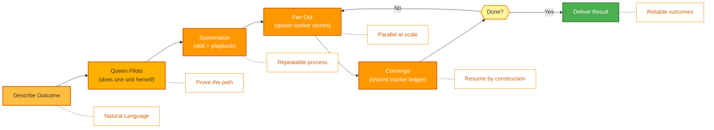

<p align="center">
  
</p>

<p align="center">
  <a href="README.md">English</a> |
  <a href="docs/i18n/zh-CN.md">简体中文</a> |
  <a href="docs/i18n/es.md">Español</a> |
  <a href="docs/i18n/hi.md">हिन्दी</a> |
  <a href="docs/i18n/pt.md">Português</a> |
  <a href="docs/i18n/ja.md">日本語</a> |
  <a href="docs/i18n/ru.md">Русский</a> |
  <a href="docs/i18n/ko.md">한국어</a>
</p>

<p align="center">
  <a href="https://github.com/aden-hive/hive/blob/main/LICENSE"></a>
  <a href="https://www.ycombinator.com/companies/aden"></a>
  <a href="https://discord.com/invite/MXE49hrKDk"></a>
  <a href="https://x.com/aden_hq"></a>
  <a href="https://www.linkedin.com/company/teamaden/"></a>
  
</p>

<p align="center">
  
  
  
  
  
  
</p>
<p align="center">
  
  
  
</p>

<p align="center"><em>The agent harness for production workloads — state management, failure recovery, observability, and human oversight so your agents actually run.</em></p>

## Overview

OpenHive is a zero-setup, model-agnostic runtime for **colonies of agents**. A colony is a group of specialized agents that work together to run one business process: a **Queen** — the persistent, client-facing lead — plus however many **worker** agents the job needs. You describe the outcome; the Queen does the work, then grows a colony around it to run that work reliably and at scale.

The mechanism underneath is **one loop controlling many loops**. Hive has a single execution primitive: the Queen *is* an agent loop, and every worker is a **clone** of it — same tools, same model, its own task. There is no graph to compile and no orchestration boilerplate to write. The colony coordinates through a shared ledger and a persistent plan, with crash-safe state, deep observability, and human oversight built into the one primitive every agent shares. See the **[Architecture Overview](docs/architecture/README.md)** for how it works.

## Features

- ✅ Colonies of agents — a Queen spawns worker clones on demand for parallel, long-running work
- ✅ One primitive, many loops — no graph to wire; the Queen grows the colony at runtime
- ✅ Shared tracker ledger + persistent task plan for coordination without a data buffer
- ✅ Queen personas with CEO-style routing and evolving, scoped memory
- ✅ Crash-safe park/resume, cost enforcement, and out-of-band human-in-the-loop (Sentinel)
- ✅ Zero Setup — no technical configuration required
- ✅ General Compute Use and Browser Use with Native Extension
- ✅ Custom Model Support

Visit [adenhq.com](https://adenhq.com) for complete documentation, examples, and guides.

Visit [HoneyComb](http://honeycomb.open-hive.com/) to see what jobs are being automated by AI. It’s a stock market for jobs, driven by our community’s AI agent progress. You can long and short jobs (with no real money but compute token)based on how much you think a job is going to be replaced by AI.

https://github.com/user-attachments/assets/bf10edc3-06ba-48b6-98ba-d069b15fb69d


## Who Is Hive For?

Hive is the multi-agent harness layer for teams moving AI agents from prototype to production. Single agents like Openclaw and Cowork can finish personal jobs pretty well but lack the rigor to fulfil business processes. 

Hive is a good fit if you:

- Want AI agents that **execute real business processes**, not demos
- Need a **runtime that handles state, recovery, and parallel execution** at scale
- Need **adaptive agents that improve over time** through reflexion, memory, and learned skills
- Require **human-in-the-loop control**, observability, and cost limits
- Plan to run agents in **production** where uptime, cost, and auditability matter

Hive may not be the best fit if you’re only experimenting with simple agent chains or one-off scripts.

## When Should You Use Hive?

Use Hive when the bottleneck is no longer the model but the harness around it:

- Long-running agents that need **state persistence and crash recovery**
- Production workloads requiring **cost enforcement, observability, and audit trails**
- Agents that **improve over time** through reflexion, scoped memory, and learned skills
- Parallel, multi-agent work coordinated through a **shared tracker ledger and persistent plan**
- A framework that **scales with model improvements** rather than fighting them

## Quick Links

- **[Documentation](https://docs.adenhq.com/)** - Complete guides and API reference
- **[Self-Hosting Guide](https://docs.adenhq.com/getting-started/quickstart)** - Deploy Hive on your infrastructure
- **[Changelog](https://github.com/aden-hive/hive/releases)** - Latest updates and releases
- **[Roadmap](docs/roadmap.md)** - Upcoming features and plans
- **[Report Issues](https://github.com/aden-hive/hive/issues)** - Bug reports and feature requests
- **[Contributing](CONTRIBUTING.md)** - How to contribute and submit PRs

## Quick Start

### Prerequisites

- Python 3.11+ for agent development
- An LLM provider that powers the agents
- **ripgrep (optional, recommended on Windows):** The `terminal_rg` / `terminal_glob` search tools use ripgrep for faster file search. If not installed, a Python fallback is used. On Windows: `winget install BurntSushi.ripgrep` or `scoop install ripgrep`

> **Windows Users:** Native Windows is supported via `quickstart.ps1` and `hive.ps1`. Run these in PowerShell 5.1+. WSL is also an option but not required.

### Installation

> **Note**
> Hive uses a `uv` workspace layout and is not installed with `pip install`.
> Running `pip install -e .` from the repository root will create a placeholder package and Hive will not function correctly.
> Please use the quickstart script below to set up the environment.

```bash
# Clone the repository
git clone https://github.com/aden-hive/hive.git
cd hive

# Run quickstart setup (macOS/Linux)
./quickstart.sh

# Windows (PowerShell)
.\quickstart.ps1
```

This sets up:

- **framework** - Core agent runtime and colony runtime (in `core/.venv`)
- **aden_tools** - MCP tools for agent capabilities (in `tools/.venv`)
- **credential store** - Encrypted API key storage (`~/.hive/credentials`)
- **LLM provider** - Interactive default model configuration, including Hive LLM and OpenRouter
- All required Python dependencies with `uv`

- Finally, it will open the Hive interface in your browser

> **Tip:** To reopen the dashboard later, run `hive open` from the project directory.

### Build Your First Agent

Type the agent you want to build in the home input box. The queen is going to ask you questions and work out a solution with you.


### Use Template Agents

Click "Try a sample agent" and check the templates. You can run a template directly or choose to build your version on top of the existing template.

### Run Agents

Now you can run an agent by selecting the agent (either an existing agent or example agent). You can click the Run button on the top left, or talk to the queen agent and it can run the agent for you.


## Integration

<a href="https://github.com/aden-hive/hive/tree/main/tools/src/aden_tools/tools"></a>
Hive is built to be model-agnostic and system-agnostic.

- **LLM flexibility** - Hive Framework supports Anthropic, OpenAI, OpenRouter, Hive LLM, and other hosted or local models through LiteLLM-compatible providers.
- **Business system connectivity** - Hive Framework is designed to connect to all kinds of business systems as tools, such as CRM, support, messaging, data, file, and internal APIs via MCP.

## Why Hive

As models improve, the upper bound of what agents can do rises — but their reliability and production value are determined by the harness. Hive focuses on running real business processes rather than generic agents. Instead of making you hand-wire a workflow graph, define every agent interaction, and handle failures reactively, Hive flips the paradigm: **you describe the outcome, the Queen does the work first, then grows a colony to scale it** — an outcome-driven, adaptive experience with an easy-to-use set of tools and integrations.



### How It Works

1. **[Describe the outcome](docs/key_concepts/goals_outcome.md)** → Say what you want in plain English; a CEO-style router picks the right [Queen](docs/key_concepts/queen.md)
2. **Queen pilots** → She does one unit of the work herself, proving the path and recording it in the shared tracker
3. **[Systematize](docs/key_concepts/improvement.md)** → She factors the proven protocol into a skill + playbook — a repeatable process
4. **[Fan out](docs/key_concepts/colony.md)** → `run_worker` spawns [worker clones](docs/key_concepts/worker_agent.md) that run in parallel and report back
5. **Converge & monitor** → Workers write results to the tracker; the Queen validates via SQL, with real-time metrics, budget enforcement, and crash-safe resume

## Documentation

- **[Developer Guide](docs/developer-guide.md)** - Comprehensive guide for developers
- [Getting Started](docs/getting-started.md) - Quick setup instructions
- [Configuration Guide](docs/configuration.md) - All configuration options
- [Architecture Overview](docs/architecture/README.md) - System design and structure

## Contributing
We welcome contributions from the community! We’re especially looking for help building tools, integrations, and example agents for the framework ([check #2805](https://github.com/aden-hive/hive/issues/2805)). If you’re interested in extending its functionality, this is the perfect place to start. Please see [CONTRIBUTING.md](CONTRIBUTING.md) for guidelines.

**Important:** Please get assigned to an issue before submitting a PR. Comment on an issue to claim it, and a maintainer will assign you. Issues with reproducible steps and proposals are prioritized. This helps prevent duplicate work.

1. Find or create an issue and get assigned
2. Fork the repository
3. Create your feature branch (`git checkout -b feature/amazing-feature`)
4. Commit your changes (`git commit -m 'Add amazing feature'`)
5. Push to the branch (`git push origin feature/amazing-feature`)
6. Open a Pull Request

## Community & Support

We use [Discord](https://discord.com/invite/MXE49hrKDk) for support, feature requests, and community discussions.

- Discord - [Join our community](https://discord.com/invite/MXE49hrKDk)
- Twitter/X - [@adenhq](https://x.com/aden_hq)
- LinkedIn - [Company Page](https://www.linkedin.com/company/teamaden/)

## Join Our Team

**We're hiring!** Join us in engineering, research, and go-to-market roles.

[View Open Positions](https://jobs.adenhq.com/a8cec478-cdbc-473c-bbd4-f4b7027ec193/applicant)

## Security

For security concerns, please see [SECURITY.md](SECURITY.md).

## License

This project is licensed under the Apache License 2.0 - see the [LICENSE](LICENSE) file for details.

## Frequently Asked Questions (FAQ)

**Q: What LLM providers does Hive support?**

Hive supports 100+ LLM providers through LiteLLM integration, including OpenAI (GPT-4, GPT-4o), Anthropic (Claude models), Google Gemini, DeepSeek, Mistral, Groq, OpenRouter, and Hive LLM. Simply set the appropriate API key environment variable and specify the model name. See [docs/configuration.md](docs/configuration.md) for provider-specific configuration examples.

**Q: Can I use Hive with local AI models like Ollama?**

Yes! Hive supports local models through LiteLLM. Simply use the model name format `ollama/model-name` (e.g., `ollama/llama3`, `ollama/mistral`) and ensure Ollama is running locally.

**Q: What makes Hive different from other agent frameworks?**

Hive runs **colonies of agents**, not single agents or hand-wired agent graphs. Most frameworks make you compile a graph of distinct nodes and edges; Hive has one execution primitive — the Queen *is* an agent loop, and every worker is a [clone](docs/key_concepts/the_loop.md) of it. Orchestration is a runtime `run_worker` fan-out, not a compiled DAG, and the colony coordinates through a [shared tracker ledger](docs/key_concepts/coordination.md) instead of a data buffer. On top of that "one loop, many loops" core, Hive is a production harness — crash-safe park/resume, cost enforcement, real-time observability, and out-of-band human-in-the-loop — inherited by every agent because there is only one kind of agent. See the [Architecture Overview](docs/architecture/README.md).

**Q: Is Hive open-source?**

Yes, Hive is fully open-source under the Apache License 2.0. We actively encourage community contributions and collaboration.

**Q: Does Hive support human-in-the-loop workflows?**

Yes. A Queen escalates to a human out-of-band through **Sentinel** — an account-bound Slack/Telegram channel. The agent loop parks (persisting its state to disk), notifies the human, and resumes exactly where it left off when they reply. Because escalation isn't a node in a graph, any agent in a colony can pause for human judgment at any point, with configurable timeouts and escalation policies. See the [Architecture Overview](docs/architecture/README.md#reliability-is-in-the-primitive).

**Q: What programming languages does Hive support?**

The Hive framework is built in Python. A JavaScript/TypeScript SDK is on the roadmap.

**Q: Can Hive agents interact with external tools and APIs?**

Yes. Every agent in a colony has built-in tool access, and Hive connects to external APIs, databases, and services through MCP — including 100+ integration tools plus General Compute Use and Browser Use via the native extension. Because the Queen and her workers share one tool surface, a capability you add is available to the whole colony.

**Q: How does cost control work in Hive?**

Hive provides granular budget controls including spending limits, throttles, and automatic model degradation policies. You can set budgets at the team, agent, or workflow level, with real-time cost tracking and alerts.

**Q: Where can I find examples and documentation?**

Visit [docs.adenhq.com](https://docs.adenhq.com/) for complete guides, API reference, and getting started tutorials. The repository also includes documentation in the `docs/` folder and a comprehensive [developer guide](docs/developer-guide.md).

**Q: How can I contribute to Aden?**

Contributions are welcome! Fork the repository, create your feature branch, implement your changes, and submit a pull request. See [CONTRIBUTING.md](CONTRIBUTING.md) for detailed guidelines.

## Star History

<a href="https://www.star-history.com/?type=date&repos=aden-hive%2Fhive">
 <picture>
   <source media="(prefers-color-scheme: dark)" srcset="https://api.star-history.com/chart?repos=aden-hive/hive&type=date&theme=dark&legend=top-left&sealed_token=vfX1DG8w_KTkonUUtIEjFRLvBopgDzxQpyb8hiYT22sobcDIpvQiMciZghLsDu5hyU3LJs-ZddFjl8eYFx5zRrY-kcMRsfyQ3vAiacsroPoqgRYmZaES3Q" />
   <source media="(prefers-color-scheme: light)" srcset="https://api.star-history.com/chart?repos=aden-hive/hive&type=date&legend=top-left&sealed_token=vfX1DG8w_KTkonUUtIEjFRLvBopgDzxQpyb8hiYT22sobcDIpvQiMciZghLsDu5hyU3LJs-ZddFjl8eYFx5zRrY-kcMRsfyQ3vAiacsroPoqgRYmZaES3Q" />
   
 </picture>
</a>

---

<p align="center">
  Made with 🔥 Passion in San Francisco
</p>
