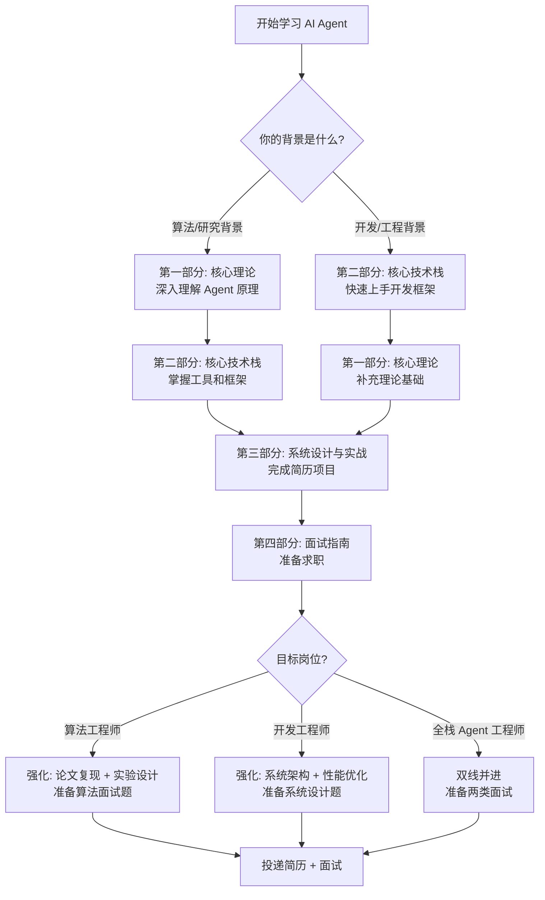

# AgentGuide
[](https://free.picui.cn/free/2025/12/02/692eadf2be3ac.png)

<div align="center">
    
    
    
    
<br/>
    
<a href="https://github.com/adongwanai/AgentGuide">
        
    </a>
    <a href="https://github.com/adongwanai/AgentGuide/network/members">
        
    </a>
    
<br/>
    
<h2>🔥 AI Agent 开发 × 面试求职 = 一站式解决方案</h2>
    
<p>
        <strong>对标 JavaGuide 的 AI Agent 学习指南</strong><br/>
        <strong>从入门到拿 Offer，系统化 + 实战化 + 求职导向</strong>
    </p>
</div>

---

## 💡 核心理念

> **📌 本项目定位：资源整合 + 系统化路径 + 实战导向**
>
> 🎯 **我们的原则**：
> - ✅ **站在巨人的肩膀上** - 互联网已有的优质资源（课程、教程、论文），我们直接引用，不重复造轮子
> - ✅ **只分享干货** - （坚持更新中，欢迎催更）
> - ✅ **提供系统化路径** - 将碎片化资源串联成完整学习路线，告诉你先学什么、再学什么
> - ✅ **求职导向** - 每个知识点都标注"面试怎么考"、"简历怎么写"
>
> 💪 **AgentGuide 的独特价值**：不是简单的资源堆砌，而是**系统化 + 求职导向 + 实战验证**的完整解决方案！

## 📑 目录

**🎯 核心内容**：
- [💡 关于本项目](#-关于本项目) - Agent开发指南、转行大模型、高级RAG、大模型面试
- [🆕 求职新范式](#-求职新范式做出什么--学过什么) - 1-2-5框架、个人品牌、投递策略
- [🧭 Agent 求职通关 Todo List](#-agent-求职通关-todo-list新增) - 当前优先级、8阶段学习产出、项目落地5步法
- [🚦 6步学习路径](#-从零到offer的完整路径快速导航) - 从岗位选择到拿Offer
- [🔬 算法岗 vs 🛠️ 开发岗](#-第一步确定你的目标岗位) - 岗位选择决策树
- [📚 学习路线图](#-第三步基于岗位的学习路线) - 算法岗10-15周 | 开发岗8-12周
- [💼 实战项目](#-第四步完成实战项目可写进简历) - 开源优质项目合集+N X Agent项目
- [📖 技术教程](#-第五步系统学习-agent-技术技术准备) - LangGraph、RAG、上下文工程、监督微调、强化学习
- [🎯 面试题库](#-第六步面试准备与-offer-冲刺) - 1500+题/面经、系统设计、编程题

**🛠️ 快速导航**：
- ⭐ 阿东作品推荐：[**learn-workbuddy**](https://github.com/adongwanai/learn-workbuddy) - 从 0 搭建 WorkBuddy-style Desktop Agent Harness，clean-room 教学复现 Agent Loop、工具调用、上下文工程、长期记忆、Sidecar、权限审计和真实模型评测
- [🚀 10分钟快速开始](#-快速开始) | [💬 加入学习社群](#-联系作者--加入社群) | [❓ 常见问题](./FAQ.md)
- [🧭 新手快速开始](./docs/00-getting-started/README.md) | [🧭 2026 Agent 求职路线](./docs/05-roadmaps/agent-job-ready-roadmap-2026.md) | [🛠️ Agent 项目落地方法](./docs/03-practice/05-ship-agent-project.md) | [🧩 Agent Harness Engineering](./docs/02-tech-stack/27-agent-harness-engineering.md)
- [🔬 前沿算法完整路线](./docs/05-roadmaps/algorithm-complete-learning-guide.md) | [🤖 具身智能/VLA路线](./docs/05-roadmaps/embodied-ai-vla-learning-guide.md) | [💻 算法+AI手撕题库](./docs/04-interview/22-algorithm-ai-coding-question-bank.md) | [📋 小红书AI算法岗面经](./docs/04-interview/19-xiaohongshu-ai-algorithm-interview-bank.md)
- [📄 Paper Agent](./projects/01-paper-agent/README.md) | [🧳 Travel Agent](./projects/02-travel-agent/README.md) | [🌐 Web Agent](./projects/03-web-agent/README.md) | [🖼️ Multimodal RAG](./resources/multimodal/README.md)

---

## 📖 关于本项目

> **3 分钟了解为什么你需要 AgentGuide**

### 😰 你是否正在经历这些痛点？

- ❌ **学了一堆 LLM API 调用，但不知道 Agent 和普通对话有什么区别**
- ❌ **看了无数篇 LangChain 文档，却依然不知道从哪里开始**
- ❌ **做了一些 Demo 项目，但简历上写不出亮点，面试讲不清楚**
- ❌ **想转 AI Agent 方向，但不知道算法岗和开发岗应该准备什么**
- ❌ **网上资料又多又杂，缺少一条清晰的学习路线**

**`AgentGuide` 是什么？**

> **AI Agent 开发学习指南 | 转行大模型 | LangGraph 实战 | 高级RAG  | 大模型面试**

一份系统化、求职导向的 AI Agent 学习与面试指南，涵盖：
- **Agent 工程**：Agent Loop、LangGraph / OpenAI Agents SDK、MCP、Skills、权限与状态管理
- **Context Engineering**：上下文分层、Memory、Tool Loadout、长任务压缩、成本与缓存优化
- **RAG / Multimodal RAG**：文档解析、Embedding、Rerank、GraphRAG、Agentic RAG、视觉文档检索
- **Eval / Observability / Safety**：Agent 评测集、trace、LLM-as-judge、红队、安全边界与 human-in-the-loop
- **Post-training / Agent RL**：SFT、偏好优化、GRPO/DPO、工具调用数据合成、轨迹数据训练
- **实战与求职**：Paper Agent、Travel Agent、Web Agent、项目复盘、简历表达与面试题库

### 🗺️ AgentGuide 在 LLM 生态中的定位

**我们覆盖 AI Agent 开发的完整技术栈** - 从模型微调到应用部署的全流程：

<div align="center">

<sub>图片来源：<a href="https://github.com/adongwanai/Awesome-Awesome-LLMs">Awesome-Awesome-LLMs</a></sub>
</div>

**📌 AgentGuide 涵盖的核心技术栈（2026 版）**：

<table>
<tr>
<td width="33%">

**🤖 Agent 应用层**
- ✅ **Agent / Workflow**
  - LangGraph、OpenAI Agents SDK
  - AutoGen、CrewAI、Pydantic AI
  - Dify、n8n、Flowise
- ✅ **任务形态**
  - Research / Coding / Web Agent
  - Multi-Agent / Supervisor / Handoff
  - Computer Use / Browser Automation

</td>
<td width="33%">

**🧩 Agent Harness 层**（核心）
- ✅ **Context Engineering**
  - System / Memory / Retrieval / Trace
  - Context Compression、Prompt Cache
- ✅ **Tools & Protocols**
  - Tool Schema、MCP、Skills
  - A2A / ACP、权限分级
- ✅ **Reliability**
  - Sandbox、HITL、Retry、Cost Guard
  - Trace、Replay、Observability

</td>
<td width="33%">

**📊 Data / Eval / Training 层**
- ✅ **RAG & Data**
  - Docling、MinerU、Unstructured
  - Milvus、Qdrant、Chroma、FAISS
  - GraphRAG、Agentic RAG、Multimodal RAG
- ✅ **Eval & Safety**
  - Promptfoo、DeepEval、Inspect、RAGAS
  - WebArena、OSWorld、SWE-bench
- ✅ **Post-training**
  - SFT、LoRA / QLoRA、DPO / GRPO
  - Tool-use / Trajectory 数据合成

</td>
</tr>
</table>

> **💡 AgentGuide 的完整覆盖**：
>
> **🔬 算法工程师路径**：
> - Agent 推理与规划：ReAct、Reflexion、Tree/Graph Search、Tool-use 策略
> - RAG 与记忆算法：Hybrid Retrieval、Rerank、GraphRAG、Agentic RAG、Memory 压缩与召回
> - Post-training：SFT、LoRA/QLoRA、DPO/GRPO、工具调用/轨迹数据合成与评测
>
> **🛠️ 开发工程师路径**：
> - Agent Harness：状态管理、工具注册、权限确认、sandbox、trace、replay、成本控制
> - 工具与协议：MCP、Skills、A2A/ACP、API adapter、Browser / Computer-use 工具封装
> - 生产级 RAG：文档解析、向量库、rerank、引用、观测、CI eval 与安全红队
>
> **🔀 通吃型路径**：用算法能力提升 Agent 决策质量，用工程能力把 Agent 做成可运行、可评测、可复盘、可写进简历的系统。

---

### 🎯 适合人群

**求职目标**：
- ✅ AI Agent 算法工程师 | AI Agent 开发工程师 | RAG 系统工程师
- ✅ LLM 应用工程师 | 大模型工程师 | 多模态算法工程师

**学习需求**：
- ✅ Agent Loop | LangGraph | OpenAI Agents SDK | MCP / Skills
- ✅ RAG / Multimodal RAG | 向量数据库 | Agent Memory | Eval Harness
- ✅ 大模型面试 | 算法岗面试 | 开发岗面试 | HR面试 | 谈薪技巧


### 🌟 AgentGuide 的 6 大核心价值

<table>
<tr>
<td width="50%">
📚 系统化学习路径

- ✅ 从零基础到面试通过的完整路线
- ✅ 理论 → 工具 → 实战 → 求职，环环相扣
- ✅ 不用再到处找资料，一个仓库学完全部
</td>
<td width="50%">
 🎯 100% 求职导向
 
- ✅ 每个知识点都标注"面试怎么考"
- ✅ 提供真实大厂面试题
- ✅ 手把手教你如何将项目写进简历
</td>
</tr>
<tr>
<td>
💼 n个简历级实战项目

- ✅ XXXAgent（RAG方向）
- ✅ XXXMulti-Agent（协作方向）
- ✅ XXXAgent（高级方向）
- ✅ 持续收集高质量开源项目
</td>
<td>
🔀 算法 × 开发双线通吃

- ✅ 同一项目，可投算法岗或开发岗
- ✅ 算法线：原理、创新、实验设计
- ✅ 开发线：架构、优化、系统设计
</td>
</tr>
<tr>
<td>
🆓 完全开源，持续更新

- ✅ 所有内容永久免费
- ✅ 作者一线大模型算法工程师
- ✅ 社区驱动，欢迎贡献
</td>
<td>
🚀 快速上手，立即见效

- ✅ 10 分钟跑通第一个 Agent
- ✅ 2-3 周完成简历级项目
- ✅ 8-10 周系统掌握，准备面试
</td>
</tr>
</table>

---


### 🎁 学完 AgentGuide，你能获得什么？

> **从迷茫到清晰，从理论到Offer，一站式成长路径**
```
✅ 【概念清晰】深刻理解：Agent 和普通 LLM 调用的本质区别
✅ 【技能掌握】熟练使用：CamelAI、LangGraph、向量数据库等核心工具  
✅ 【动手能力】独立开发：RAG Agent、Multi-Agent、Web Agent 系统
✅ 【简历亮点】2-3 个可以写进简历、面试能讲清楚的项目
✅ 【面试自信】掌握 Agent 方向的高频面试题和标准答案
✅ 【职业规划】明确算法岗和开发岗的差异，找到适合自己的方向
✅ 【人脉资源】加入 AI Agent 学习社群，结识同行，互相成长
```

---

## 🚦 从零到Offer的完整路径（快速导航）

> **👋 新来的同学看这里！先看新范式，再按步骤执行，8-10周拿到Offer！**

<table>
<tr>
<td align="center" width="14.3%">

**🆕 新范式**

[求职新范式](#-求职新范式做出什么--学过什么)

做出什么 > 学过什么

</td>
<td align="center" width="14.3%">

**🎯 第一步**

[确定目标岗位](#-第一步确定你的目标岗位)

算法 vs 开发？

</td>
<td align="center" width="14.3%">

**💡 第二步**

[拿Offer方法论](#-第二步拿offer的方法论)

如何准备？

</td>
<td align="center" width="14.3%">

**📚 第三步**

[学习路线](#-第三步基于岗位的学习路线)

学什么？

</td>
<td align="center" width="14.3%">

**💼 第四步**

[实战项目](#-第四步完成实战项目可写进简历)

做什么？

</td>
<td align="center" width="14.3%">

**🎓 第五步**

[系统学习](#-第五步系统学习-agent-技术技术准备)

技术细节

</td>
<td align="center" width="14.3%">

**🎯 第六步**

[面试冲刺](#-第六步面试准备与-offer-冲刺)

如何面试？

</td>
</tr>
</table>

> **⚡ 重要提醒**：  
> 1. **一定要先完成"第一步"和"第二步"** - 确定方向再学习！  
> 2. **"第四步"实战项目最重要** - 简历的核心竞争力！  
> 3. **学习时对照"第六步"面试题** - 知道学的东西面试怎么考！

---

## 🆕 求职新范式：做出什么 > 学过什么

> **⚡ 求职规则已经变了。2026年，HC:投递比约1:200，核心问题不再是"我够不够格"，而是"我用什么方式让自己被看见"。**

### 1-2-5 求职框架

| 维度 | 内容 |
|:---|:---|
| **1个原则** | 从"我会什么"转向"我做出了什么" |
| **2条轨道** | Agent开发（工程落地）vs Agent算法（研究创新） |
| **5步链路** | 简历 → 投递 → 模拟面试 → Vibe Coding → 成果展示 |

> **工具不再是壁垒，你用工具做出的东西才是。**

### 旧方式 vs 新范式

| 环节 | 旧方式 | 新范式 |
|:---|:---|:---|
| 简历 | 一份通用简历打天下 | AI读JD，动态生成针对性版本 |
| 投递 | 手动上传，逐一投递 | 一键全网投，AI做适配分析 |
| 模拟面试 | 背八股，刷题库 | AI扮演面试官，无限迭代实战 |
| Vibe Coding | 手写算法题 | AI协作设计Agent系统 |
| 成果展示 | PDF+截图 | 个人站+在线demo+社区影响力 |

### 个人品牌：让面试官主动找你

**个人网站必备要素（免费部署：Vercel/GitHub Pages，5分钟上线）：**
- 每个项目一个页面 + **在线可访问的demo链接**
- 技术Blog：至少3篇有深度的原理解析
- 社区数据：GitHub Star数 / 真实用户数
- 时间线里程碑

**简历项目描述公式：**
> ❌ 「参与开发了一个AI客服系统」
> ✅ 「基于LangGraph + MCP构建多Agent客服系统，工具调用成功率94%，响应时长从3.2s降至0.8s，日处理10万+对话」

### 投递策略：AI筛简历时代的人工突围

招聘方也在用AI筛简历——两个AI在对话，人的主动触达反而更稀缺。

**核心目标公司（5-10家）走人工路线：**
1. Boss/猎聘找具体的Hiring Manager或Team Lead
2. 提前关注他们的开源项目/技术Blog
3. 带着具体问题主动联系（不是「请问还招人吗？」）
4. 目标：一个warm intro，不是冷申请

**时机窗口：** 3-6月提前批竞争烈度比8-9月低30-40%，往往是真正的机会窗口。

**AI辅助投递工具：**
- [Auto Job Apply](https://zread.ai/loks666/get_jobs) - 开源自动投递简历工具，支持批量投递与AI简历适配

### 说几句实话

- **语言不是门槛，设计才是。** Python/TypeScript AI都能帮你写。但Agent状态机怎么设计、Memory何时截断、工具调用失败如何fallback——这些必须你自己想清楚、讲明白。
- **AI工具人人都有，判断力才是壁垒。** 会用Cursor写代码不算竞争力。当AI给你一个错误的Agent设计，你能30秒内发现并说清楚为什么错——这才是L5和L3的分水岭。
- **分享即异步面试。** 一篇深度Blog、一个有Star的仓库，相当于提前通过了一轮面试。
- **拿结果说话。** 不是"我学过LangChain"，是"我用LangGraph做了一个有300个真实用户的工具"。

### 新增优质资源

| 资源 | 简介 | 链接 |
|:---|:---|:---|
| **learn-workbuddy** | 从 0 搭建一个 WorkBuddy-style Desktop Agent Harness：clean-room 教学复现 Agent Loop、工具调用、上下文工程、长期记忆、Sidecar、权限审计和真实模型评测，不提取源码，只复现核心机制 | [GitHub](https://github.com/adongwanai/learn-workbuddy) |
| **Superpowers** | 由可组合 Skills 构成的 AI Coding 完整开发工作流，覆盖需求梳理、计划、TDD、系统调试、代码评审和完成前验证 | [GitHub](https://github.com/obra/superpowers) |
| **Learn Claude Code** | 从零构建迷你Claude Code，12节渐进式，覆盖工具调用/子Agent/上下文压缩/多Agent协作 | [GitHub](https://github.com/shareAI-lab/learn-claude-code) |
| **claw0** | 10章10个核心概念~7000行Python，从while循环到生产级Agent网关 | [GitHub](https://github.com/shareAI-lab/claw0) |
| **hello-agents（Datawhale）** | 《从零开始构建智能体》，16章，含MCP实战、DeepResearch复现、多Agent协同 | [GitHub](https://github.com/datawhalechina/hello-agents) |
| **OpenClaw** | 生产级个人AI助手框架，支持Telegram/Discord/Slack等 | [GitHub](https://github.com/openclaw/openclaw) |
| **Anthropic官方：Building Effective Agents** | Anthropic工程团队出的Agent设计原则，面试必读 | [链接](https://www.anthropic.com/engineering/building-effective-agents) |
| **Vibe Coding 教程** | 从零掌握AI协作编程，Cursor/Claude Code实操指南，Vibe Coding面试攻略 | [链接](https://adongwanai.github.io/vibecoding/) |

> **后续实践重点**：在 Superpowers 的 Skills 工作流基础上，我将重点使用 `grill-me` / `grilling` 系列 Skills。它们会一次只追问一个问题，逐项压测计划、决策与设计中的假设、依赖、边界和取舍；达成共同理解后，再进入实现。

---

## 🧭 Agent 求职通关 Todo List（新增）

> **不是链接收藏夹，是可以照着执行的 todo list。**
>
> 目标很简单：从“我学过什么”，推进到“我做出了什么、怎么验证、怎么写进简历、怎么讲给面试官听”。

- 完整路线：[2026 Agent 求职通关路线](./docs/05-roadmaps/agent-job-ready-roadmap-2026.md)
- 项目落地方法：[如何落地一个可写进简历的 Agent 项目](./docs/03-practice/05-ship-agent-project.md)
- 工程核心专题：[Agent Harness Engineering](./docs/02-tech-stack/27-agent-harness-engineering.md)

### How To Use

| 你的状态 | 建议入口 |
|:---|:---|
| **零基础** | 从 [6步学习路径](#-从零到offer的完整路径快速导航) 开始，先建立 Agent / Workflow / RAG / Multi-Agent 的坐标系 |
| **会 LLM 应用** | 重点补 Agent Loop、Tool Use、Context Engineering、Eval，不要只停留在 API 调用 |
| **想做项目** | 直接进入 [实战项目](#-第四步完成实战项目可写进简历)，按“Spec → Coding → Eval → 复盘”推进 |
| **准备面试** | 对照 [面试题库](#-第六步面试准备与-offer-冲刺)，重点准备 Agent Loop、工具设计、记忆、评测、可靠性 |
| **只想找资料** | 看 [技术教程](#-第五步系统学习-agent-技术技术准备) 和 [资源导航](#-资源导航)，优先读官方文档、工程博客和可运行项目 |

### What To Learn Now

Agent 方向变化很快，当前更值得投入的是能落地、能验证、能讲清楚取舍的工程能力：

| 优先级 | 方向 | 为什么重要 |
|:---:|:---|:---|
| 1 | **Claude Code / Codex-style Coding Agents** | 真实代码库、shell、文件编辑、测试、权限、上下文压缩，是理解 Agent 工程的最佳样本 |
| 2 | **Agent Harness Engineering** | Agent 能力很大一部分来自 harness：工具协议、权限、状态、反馈、回放、CI、评测 |
| 3 | **Context Engineering** | Agent 的核心不是“写提示词”，而是控制信息在正确时间以正确格式进入模型 |
| 4 | **Skills / MCP / A2A / ACP** | Skills 负责能力复用，MCP 连接工具，A2A 连接 Agent，ACP 连接宿主应用 |
| 5 | **Browser / Computer-Use Agents** | 浏览器和桌面操作是 Agent 从 demo 走向真实任务的重要边界 |
| 6 | **Evaluation / Observability / Safety** | 没有 eval、trace、权限边界的 Agent，只能算 demo，不能算可交付系统 |

### 8 阶段学习产出

| 阶段 | 学什么 | 产出物 |
|:---:|:---|:---|
| Stage 0 | 区分 chatbot、workflow、agent、multi-agent | 一页笔记：为什么你的场景需要 Agent |
| Stage 1 | 最小 Agent Loop、结构化输出、工具调用 | 50-150 行最小 Agent |
| Stage 2 | Tool Use、RAG、Memory、引用与失败处理 | 一个资料研究助手 |
| Stage 3 | 现代 Agent Harness：工具、权限、状态、日志、子任务 | 可调试的 harness demo |
| Stage 4 | Multi-Agent 协调：planner / executor / reviewer / router | 一个 research → write → review 小系统 |
| Stage 5 | Skills、MCP、A2A、ACP 与能力封装 | 一个可复用 SKILL.md 或工具协议 demo |
| Stage 6 | Browser / Computer-Use Agent | 一个只操作公开网页的 browser agent |
| Stage 7-8 | Eval、Observability、Safety、部署 | 20 条 eval case + 一个别人能 clone 跑的 Agent 项目 |

### 项目落地 5 步法

1. **建立全局认知**：先搞清楚目标项目的 agent loop、tool registry、context 拼装、memory、channel 抽象。
2. **准备 AI 编程环境**：沉淀 `CLAUDE.md` / `AGENTS.md`、需求规格、实现计划和跨会话 todo。
3. **建立项目理解 Skill**：把项目结构、关键模块、测试方式写成可复用的项目理解文档。
4. **先写 Spec，再写代码**：明确目标用户、工具列表、权限策略、失败处理、成本约束、成功标准。
5. **评测 + 归因 + 消融实验**：记录通过率、失败原因、工具调用次数、成本、延迟，把结果写进简历。

### 面试深水区

面试不只问“会不会 LangChain”，更会追问你有没有真正写过能跑的 Agent：

- **Agent Loop**：`observe → think → act → observe`，最大步数、停止条件、错误恢复、HITL 怎么设计？
- **Context + Cost Engineering**：上下文分层、压缩、缓存友好结构、模型路由、token 成本怎么降？
- **Tool Design**：工具命名、description、schema、分页截断、权限分级、工具选错怎么修？
- **Memory System**：working / episodic / semantic memory，什么值得存、怎么召回、什么时候遗忘？
- **Eval + Governance**：component / trajectory / end-to-end eval，golden dataset 怎么来，trace 怎么审计？
- **Reliability Engineering**：idempotency、timeout、retry、cost guard、permission tier、observability 六件套。

### 简历三维表达法

不要只写“基于大模型实现智能问答”。一个 Agent 项目要从三维表达：

| 维度 | 怎么写 |
|:---|:---|
| **架构表达** | Agent loop、工具注册、会话状态、上下文裁剪、权限确认、记忆和错误恢复 |
| **业务表达** | 业务场景、关键工具、数据源、用户路径、约束条件 |
| **结果表达** | 评测集规模、成功率、失败类型、成本优化、消融实验结论 |

示例：

> 基于轻量 Agent Harness 构建垂直场景助手，使用 ReAct loop + dispatch 表注册 5 个业务工具，四层分级 context 管理 system / long-term / short-term / turn 信息；高风险操作接入三级权限确认，20 条评测 case 端到端通过率 82%，通过上下文压缩和模型路由将 token 成本降低 60%。

---

## 🎯 第一步：确定你的目标岗位

> **核心理念：选择 > 努力！选对方向，事半功倍！**

### 🤔 AI Agent 岗位的两条主线

在大模型时代，Agent 方向的岗位主要分为两条线：

<table>
<tr>
<td width="50%">

### 🔬 **算法工程师线**

**核心工作**：算法创新、论文研究

**日常任务**：
- 读论文、设计算法
- 跑实验、做消融
- 写论文、开源贡献

**产出形式**：
- 论文发表（顶会/期刊）
- 算法库、开源项目
- 专利、技术报告

**评价标准**：
- 算法性能提升（+15%准确率）
- 创新性（新架构、新策略）
- 影响力（论文引用、Star数）

**岗位数量**：⭐⭐⭐ 中等  
**竞争激烈度**：⭐⭐⭐⭐⭐ 很激烈  
**薪资天花板**：⭐⭐⭐⭐⭐ 很高（60-200万）

</td>
<td width="50%">

### 🛠️ **开发工程师线**

**核心工作**：系统搭建、业务落地

**日常任务**：
- 写代码、优化系统
- 对接业务、解决问题
- 性能调优、监控告警

**产出形式**：
- 生产系统上线
- 业务指标提升
- 用户满意度提高

**评价标准**：
- 系统稳定性（P99延迟<500ms）
- 业务价值（成本降低40%）
- 工程能力（QPS、并发、可用性）

**岗位数量**：⭐⭐⭐⭐⭐ 最多  
**竞争激烈度**：⭐⭐⭐ 适中  
**薪资天花板**：⭐⭐⭐⭐ 较高（40-80万）

</td>
</tr>
</table>

### 🎯 你应该选哪条线？

<details>
<summary><b>👉 点击查看详细的岗位选择决策树</b></summary>

<br/>

**问题1：你的核心优势是什么？**

```
├─ 数学/理论强 + 喜欢钻研原理 + 有论文发表
│   → 【算法工程师线】
│   
│   细分方向选择：
│   ├─ 想优化 Agent 算法 → Agent 算法工程师（Memory优化、规划策略）
│   ├─ 想优化 RAG 算法 → RAG 算法工程师（检索策略、Reranker）
│   └─ 想改进模型本身 → 模型算法工程师（Reasoning、对齐）
│
└─ 工程能力强 + 喜欢做系统 + 注重落地
    → 【开发工程师线】
    
    细分方向选择：
    ├─ 想做业务应用 → Agent 应用开发（RAG系统、RPA、智能客服）⭐ 推荐
    ├─ 想做基础设施 → AI Infra 开发（推理部署、训练平台）
    └─ 想做产品化 → AI 应用开发（前端集成、产品化）
```

**问题2：有什么背景？**

- ✅ **有论文/科研经历** → 优先算法线
- ✅ **有工程/项目经验** → 优先开发线
- ✅ **两者都有** → **通吃策略**（最推荐！）

**⭐ 最佳策略：两手抓！**
- 简历中既有算法项目（论文、算法优化）
- 又有开发项目（完整系统、业务指标）
- 可以同时投两类岗位，机会翻倍！

</details>

---

### 🎯 技术方向细分（重要！）

<details>
<summary><b>👉 点击查看 Agent 方向的细分岗位</b></summary>

<br/>

#### 🔬 算法线细分方向

**1. 上下文工程算法工程师** ⭐⭐⭐⭐⭐ 最热门！

**技术方向**：
- **RAG 算法**：GraphRAG、Agentic RAG、Reranker 训练
- **Agent 算法**：Memory 机制、规划算法优化、Multi-Agent 协作
- **多模态算法**：跨模态对齐（CLIP改进）、多模态融合

**项目示例**：
- GraphRAG 检索算法优化（召回率 +12%）
- Agent Memory 压缩算法（存储 -60%）
- Agentic RAG 策略设计（准确率 +20%）

**岗位数量**：⭐⭐⭐⭐（大厂+头部创业公司）

---

**2. 模型算法工程师** ⭐⭐

**技术方向**：
- Reasoning 算法（Long COT、工具调用 RL）
- 对齐算法（RLHF、DPO、GRPO）
- 模型架构（MoE、长文本、Attention 改进）

**岗位数量**：⭐⭐（主要在大厂研究院）

---

#### 🛠️ 开发线细分方向

**1. 上下文工程开发工程师** ⭐⭐⭐⭐⭐ 岗位最多！

**技术方向**：
- **RAG 系统**：企业知识库、智能客服、文档解析
- **Agent 应用**：RPA 自动化、研究助手、工作流 Agent
- **多模态系统**：图文检索、OCR pipeline、视觉问答

**项目示例**：
- 企业级 GraphRAG 知识问答系统（服务1000+员工）
- Agent 驱动的 RPA 系统（自动化率80%，节省200万/年）

**岗位数量**：⭐⭐⭐⭐⭐（所有 AI 公司都需要）

---

**2. AI Infra 开发工程师** ⭐⭐⭐

**技术方向**：
- 推理服务部署（vLLM、TGI、Triton）
- 训练平台搭建（KubeFlow、Ray）
- 模型服务化（API 网关、负载均衡、监控）

**岗位数量**：⭐⭐⭐（大厂需求多）

</details>

<details>
<summary><b>👉 Agent 开发工程师核心能力要求（大厂真实招聘）</b></summary>

<br/>

> 基于 OpenAI、DeepMind、Meta、蚂蚁等大厂真实 JD 总结

#### 三层能力模型

**Layer 1：后端与系统功底**（基础能力）
- 大型分布式、高并发、高性能系统设计
- 云原生 PaaS 平台、Kubernetes 架构理解
- **价值**：Agent 系统本质是复杂分布式服务

**Layer 2：Agent 核心技术**（重点能力）
- 混合 Agent 架构（单 Agent vs Multi-Agent）
- 上下文工程（动态打包、向量索引、信息检索）
- 工具编排（Tool 设计、Function Calling）
- 记忆与个性化（Memory 设计、Mem0、Zep）
- 任务规划（Orchestration、Workflow）
- 评估体系（如何证明 Agent 比人工更好？）

**Layer 3：模型理解**（加分项）
- 主流模型长短板（GPT-4/Claude/Llama 选择）
- 微调能力（Function Call 微调、垂直领域适配）
- 强化学习基础（Agent RL、DPO）

#### 从"调包侠"到"真实项目"的关键转变

**❌ 玩具项目**：
- 只用 LangChain 跑个 demo
- 没有评估、没有优化、没有生产化考虑
- 面试一问就穿帮

**✅ 真实项目**：
- **具体业务场景**（智能客服、RPA、研究助手）
- **完整技术栈**（文档解析 + 高级 RAG + Agentic 逻辑）
- **量化评估**（构建测试集、使用 Ragas、持续追踪优化）
- **生产化考虑**（成本控制、性能优化、可观测性、异常处理）

</details>

**📖 完整技术方向详解**：[转行大模型热门方向准备指南](./docs/04-interview/07-career-transition.md)

> **💡 新手建议**：优先选择**上下文工程开发**（RAG/Agent 系统），岗位最多、最易落地

---

## 💡 第二步：拿Offer的方法论

> **不同岗位，完全不同的准备策略！**

### 🔬 算法工程师 - 如何准备？

<details>
<summary><b>点击查看算法岗完整准备方案</b></summary>

<br/>

**简历重点**：

✅ **必须强调**：
- **算法创新**："提出XX算法"、"改进XX方法"、"设计XX策略"
- **实验验证**：对比实验、消融实验、baseline对比、指标提升
- **论文/专利**："论文在投XXX"、"发表于XXX"
- **开源贡献**："开源代码XX stars"

❌ **尽量少提**：
- 业务指标（用户数、QPS）
- 系统架构细节
- 工程优化

**项目示例（算法岗）**：
```
【Agentic RAG 策略优化】
- 问题：多跳推理场景召回率低（实验测得62%）
- 方法：提出基于RL的子图采样算法，优化路径排序策略
- 实验：在KGQA数据集上F1提升12%，对比5种baseline
        消融实验：RL策略贡献8%，路径排序贡献4%
- 产出：论文在投EMNLP（一作），代码开源300+ stars
- 技能：强化学习、图神经网络、知识图谱
```

**面试准备重点**：
- 📚 理论深度（能推导算法原理）
- 🧪 实验设计（对比实验、消融实验）
- 📄 论文阅读（顶会最新进展）
- 💻 代码实现（能手撕核心算法）

</details>

### 🛠️ 开发工程师 - 如何准备？

<details>
<summary><b>点击查看开发岗完整准备方案</b></summary>

<br/>

**简历重点**：

✅ **必须强调**：
- **完整系统**："搭建XX系统"、"端到端实现"、"上线服务"
- **业务价值**：服务用户数、处理量、业务指标提升
- **性能优化**：QPS提升、延迟降低、成本节省
- **技术栈**：具体框架、工具、数据库、部署方案
- **工程能力**：高并发、高可用、监控告警

❌ **不要过度强调**：
- 算法细节和理论推导
- 论文（开发岗更看重系统）

**项目示例（开发岗）**：
```
【企业级 Agent 自动化系统】
- 背景：客服部门日均5000+重复工单，人力成本高
- 技术：LangChain + WebShaper + Mem0
        多Agent协同（规划Agent、执行Agent、审核Agent）
        集成20+工具（数据库、API、浏览器操作）
- 优化：异常重试机制，成功率从70%→95%
        并发处理，吞吐量提升5倍
- 成果：自动化率80%，效率提升3倍
        节省人力成本200万/年，获部门最佳项目奖
- 技能：Agent开发、工具集成、系统监控
```

**面试准备重点**：
- 🏗️ 系统设计（高可用、高并发）
- ⚡ 性能优化（缓存、批处理）
- 🔧 工程实践（部署、监控、异常处理）
- 💼 业务理解（为什么这样设计）

</details>

### 🔀 通吃策略 - 如何准备？（⭐ 最推荐）

<details>
<summary><b>点击查看"通吃"完整准备方案</b></summary>

<br/>

**为什么推荐通吃？**
1. **机会翻倍**：可同时投算法和开发岗
2. **展现全栈**：大模型时代，算法+工程都重要
3. **灵活适配**：大厂偏算法，创业公司偏工程

**理想简历结构（3-4个项目）**：
```
项目1：算法创新型 🔬
  → 体现算法能力：Agent Memory优化 / Agentic RAG策略
  → 关键词：论文、实验、开源
  
项目2：系统落地型 🛠️
  → 体现工程能力：完整RAG系统 / Multi-Agent应用
  → 关键词：业务指标、性能优化、上线
  
项目3：微调/训练型（加分项）
  → 体现训练能力：Function Call微调 / RLHF
  → 关键词：多少卡、参数设置、训练稳定性
```

**AgentGuide 的学习路径**：
1. 先学理论（第一部分）- 建立算法认知
2. 再学工具（第二部分）- 掌握工程技能
3. 做实战项目（第三部分）- 同时准备算法版和开发版
4. 面试准备（第四部分）- 掌握两类面试技巧

</details>

---

## 📚 第三步：基于岗位的学习路线

> **根据你在"第一步"的选择，选择对应的学习路线**

### 🎯 快速导航

**🚀 新手推荐**：
- 📘 [**AgentGuide开源学习路线（简易版）**](./docs/05-roadmaps/AgentGuide开源学习路线（简易版本）.md) - **从零到Offer完整路径**，8-15周系统化学习方案，包含完整资源清单 ⭐⭐⭐

**🔬 算法 / 具身方向新增**：
- 🧠 [前沿算法岗位完整学习指南](./docs/05-roadmaps/algorithm-complete-learning-guide.md) - 覆盖算法岗从工程基础、模型训练、RAG/Agent、多模态到推理部署的完整能力栈
- 🤖 [具身智能与 VLA 完整学习指南](./docs/05-roadmaps/embodied-ai-vla-learning-guide.md) - 面向 VLA/机器人岗位的多模态、动作建模、仿真、Sim2Real 与数据闭环路线

**📋 详细路线**（按岗位分）：

### 🗺️ 选择你的学习路线

<table>
<tr>
<td width="50%" align="center">

### 🔬 **算法岗学习路线**

**学习时长**：10-15 周  
**难度**：⭐⭐⭐⭐⭐  
**产出**：论文 + 开源项目

**学习重点**：
- 📚 理论深度（能推导公式）
- 🧪 实验设计（对比、消融）
- 📄 论文阅读（顶会前沿）
- 💻 算法实现（手撕核心）

**项目类型**：
- Agentic RAG 策略优化
- Agent Memory 压缩算法
- Multi-Agent 协作策略

<br/>

**👉 [查看详细路线图](./docs/05-roadmaps/learning-roadmap-algorithm.md)**

</td>
<td width="50%" align="center">

### 🛠️ **开发岗学习路线**

**学习时长**：8-12 周  
**难度**：⭐⭐⭐  
**产出**：完整系统 + 业务指标

**学习重点**：
- 🏗️ 系统设计（架构、扩展性）
- ⚡ 性能优化（缓存、批处理）
- 🔧 工程实践（部署、监控）
- 💼 业务理解（痛点、价值）

**项目类型**：
- 企业级 RAG 系统
- Agent 自动化系统
- Multi-Agent 协作应用

<br/>

**👉 [查看详细路线图](./docs/05-roadmaps/learning-roadmap-development.md)**

</td>
</tr>
</table>

---

### 🗺️ 通用学习流程图



### ⏱️ 学习时间概览

| 学习路线          |   时长   | 每日投入  | 适合人群       |
| :------------ | :----: | :---: | :--------- |
| **🔬 算法岗路线**  | 10-15周 | 4-6小时 | 有科研背景，想做创新 |
| **🛠️ 开发岗路线** | 8-12周  | 2-4小时 | 有工程背景，想做落地 |


> **💡 建议**：点击上面的"查看详细路线图"，获取**每日学习计划**和**详细任务清单**

---

## 💼 第四步：完成实战项目（可写进简历）

> **这是最重要的一步！没有项目，一切都是空谈！**

AgentGuide 提供 **n 个简历级实战项目**，每个项目都提供：
- ✅ 完整的代码实现
- ✅ 系统架构设计
- ✅ **算法岗和开发岗两种简历写法**
- ✅ 面试时如何讲解

**👉 直接跳转到实战项目**：[点击这里查看n个项目](#32-简历级实战项目-)

---

## 🎓 第五步：系统学习 Agent 技术（技术准备）

> 💡 **学习目标**：掌握 Agent 开发完整技术栈，从理论到实战全覆盖  
> 🔬 **算法岗重点**：深入理解原理，能推导公式，关注创新点  
> 🛠️ **开发岗重点**：熟练使用框架，快速实现功能，注重工程化

### 📊 技术能力四层模型

我们将 Agent 技术划分为**四大能力层级**，每个层级对应不同的学习模块：
我来创建一个三列的内容导航表格：

## 📑 内容导航


| 章节                  | 内容介绍                                | 进展  |
| :------------------ | :---------------------------------- | :-- |
| **🔰 L1-基础认知层**     | 理解核心概念、掌握基本原理（1-2周）                 |     |
| 模块1：Agent核心概念解析     | 智能体定义与分类体系、5级自主性模型                  |     |
| 模块2：技术演进历程与趋势洞察     | 从专家系统到神经网络的发展轨迹                     |     |
| 模块3：大模型工作原理         | Transformer/分词/训练/推理/对齐技术           |     |
| **🛠️ L2-开发实现层**    | 掌握框架工具、完成系统搭建（3-4周）                 |     |
| 模块4：经典Agent范式手撕实现   | ReAct、Plan-Execute、Reflection模式     |     |
| 模块5：低代码平台快速验证       | LangChain、Dify、Coze、n8n工具使用         |     |
| 模块6：主流框架深度实战        | LangGraph、AutoGen、AgentScope、CrewAI |     |
| 模块7：自研Agent框架设计原理   | 消息路由、工具注册、异常处理、日志追踪                 |     |
| **🚀 L3-高阶优化层**     | 检索优化、上下文管理、模型训练（4-5周）               |     |
| 模块8：检索增强生成（RAG）全栈技术 | 数据预处理、索引构建、检索优化、高级RAG               |     |
| 模块9：上下文工程           | Write/Select/Compress/Isolate四大策略   |     |
| 模块10：智能体通信标准与协议     | MCP、A2A、ANP协议详解                     |     |
| 模块11：模型微调与强化学习      | SFT、LoRA、PPO、DPO、GRPO算法应用           |     |
| 模块12：性能评估与效果量化      | 评估维度、测试框架、自定义评估方法、🔥Anthropic评估完全指南   |  ✅  |


---

### 🔰 L1-基础认知层详解

> **学习时长**：1-2 周 | **难度**：⭐⭐⭐ | **重要性**：⭐⭐⭐⭐⭐

#### 🎯 阶段目标
- ✅ 理解 Agent 的本质定义与核心组件
- ✅ 掌握 Transformer 架构与大模型基础
- ✅ 了解 Agent 技术发展历程与未来趋势

#### 📚 学习内容

<table>
<tr>
<td width="50%">

**模块1：Agent 核心概念解析**
- 智能体定义、类型、范式与应用
- 5级自主性分类体系
  - L1: 基础响应器（Responder）
  - L2: 路由模式（Router）
  - L3: 工具调用者（Tool Caller）
  - L4: 多智能体协作（Multi-Agent）
  - L5: 完全自主（Autonomous）
- Agent 系统解剖学
  - 角色与聚焦（Role & Focus）
  - 记忆系统（Memory）
  - 工具生态（Tools）
  - 安全防护（Guardrails）

📖 [阅读：什么是 AI Agent？](./docs/01-theory/01-what-is-agent.md)

</td>
<td width="50%">

**模块2：技术演进历程与趋势洞察**
- 符号主义时代（1950s-1990s）
- 连接主义崛起（1990s-2010s）
- 深度学习革命（2012-2020）
- LLM 驱动的 Agent 时代（2020-至今）
- 关键里程碑论文解读
  - ReAct（推理+行动）
  - Reflexion（自我反思）
  - AutoGPT（自主规划）
  - Multi-Agent（协作涌现）

📖 [阅读：Agent 技术演进史](./docs/01-theory/02-agent-history.md)

</td>
</tr>
<tr>
<td colspan="2">

**模块3：大模型工作原理（Agent的大脑）**

> **Agent 的"大脑"是 LLM，理解大脑的工作原理是构建 Agent 的前提**

| 知识模块 | 核心内容 | 学习要点 |
|:-----|:---------|:---------|
| **架构层** | Transformer、Self-Attention、MoE | 注意力机制、上下文窗口、位置编码（RoPE/ALiBi） |
| **数据层** | Word2Vec、BPE、WordPiece | Tokenizer 原理、中文分词（jieba）、Token 计算 |
| **训练层** | 预训练、SFT、LoRA/QLoRA | 分布式训练、参数高效微调、显存优化技巧 |
| **推理层** | vLLM、TGI、量化技术 | PagedAttention、GPTQ/AWQ 量化、推理优化 |
| **对齐层** | RLHF、PPO、DPO | Reward Model、策略优化、人类偏好对齐 |

📖 [深入阅读：Transformer 架构详解](./docs/01-theory/03-transformer.md)  
📖 [DeepSeek 系列完整深度笔记](./docs/01-theory/10-deepseek-series.md) 🆕  
📖 [LLaMA 系列完整深度笔记](./docs/01-theory/11-llama-series.md) 🆕  
📖 [Qwen 系列深度学习笔记](./docs/01-theory/12-qwen-series.md) 🆕

</td>
</tr>
</table>

---

### 🛠️ L2-开发实现层详解

> **学习时长**：3-4 周 | **难度**：⭐⭐⭐⭐ | **重要性**：⭐⭐⭐⭐⭐

#### 🎯 阶段目标
- ✅ 手撕核心 Agent 架构（ReAct、Plan-Solve、Reflexion）
- ✅ 掌握主流开发框架（LangChain、AutoGen、AgentScope）
- ✅ 能够独立搭建完整的 Agent 系统

#### 🔨 实操内容

<table>
<tr>
<td width="50%">

**模块4：经典 Agent 范式手撕实现**

从零实现三大核心模式：

**1. ReAct 模式**
- Thought（思考）→ Action（行动）→ Observation（观察）
- 工具调用与结果解析
- 循环终止条件设计

**2. Plan-Execute 模式**
- 任务分解（Task Decomposition）
- 子任务规划与执行
- 依赖关系处理

**3. Reflection 模式**
- Self-Evaluation（自我评估）
- Error Analysis（错误分析）
- Strategy Adjustment（策略调整）

📖 [实战教程：手撕 ReAct](./docs/01-theory/04-react-framework.md)  
📖 [实战教程：规划与执行](./docs/01-theory/05-cot-and-planning.md)

</td>
<td width="50%">

**模块5：低代码平台快速验证**

工具选型与使用：

**1. 代码优先（Code-First）**
- **LangChain/LangGraph**：工业界标准
- **LlamaIndex**：数据导向，RAG 首选
- **AutoGen/CrewAI**：Multi-Agent 协作
- **AgentScope**：阿里开源，易上手

**2. 低代码/无代码（Low-Code）**
- **Dify**：开源 LLM 应用平台
- **Coze/扣子**：字节跳动，快速搭建
- **n8n**：工作流自动化神器

📖 [框架对比：如何选择？](./docs/02-tech-stack/04-langchain-guide.md)  
📖 [Multi-Agent 框架详解](./docs/02-tech-stack/06-multi-agent-frameworks.md)

</td>
</tr>
<tr>
<td colspan="2">

**模块6：主流框架深度实战**

框架能力对比与应用：

| 框架 | 核心特性 | 适用场景 | 学习资源 |
|:-----|:---------|:---------|:---------|
| **LangGraph** | 图导向、状态管理、循环控制 | 复杂工作流、需要精确控制的场景 | [📖 完整教程](./docs/02-tech-stack/04-langchain-guide.md) |
| **AutoGen** | 多 Agent 对话、角色扮演 | 团队协作、复杂任务分解 | [📖 实战指南](./docs/02-tech-stack/06-multi-agent-frameworks.md) |
| **AgentScope** | 消息驱动、灵活扩展 | 国内场景、中文优化 | [📖 快速上手](./docs/02-tech-stack/07-agentscope.md) |
| **CrewAI** | 角色分工、层级管理 | 企业级应用、流程自动化 | [📖 企业实战](./docs/02-tech-stack/06-multi-agent-frameworks.md) |

**模块7：自研 Agent 框架设计原理**

理解框架底层设计，培养自主开发能力：
- 消息路由与状态管理机制
- 工具注册与动态加载系统
- 异常处理与重试策略
- 可观测性与日志追踪

📖 [实战项目：打造自己的 Agent 框架](./docs/02-tech-stack/22-build-your-agent-framework.md)

</td>
</tr>
</table>

---

### 🚀 L3-高阶优化层详解

> **学习时长**：4-5 周 | **难度**：⭐⭐⭐⭐⭐ | **重要性**：⭐⭐⭐⭐⭐

#### 🎯 阶段目标
- ✅ 掌握 RAG 全栈技术（数据处理、检索优化、高级 RAG）
- ✅ 精通上下文工程（Context Engineering 2.0）
- ✅ 理解 Agent 评估体系与微调方法

#### 💡 高级技术

<table>
<tr>
<td width="50%">

**模块8：检索增强生成（RAG）全栈技术**

**8.1 数据预处理**
- 文档解析（PDF/Markdown 高保真提取）
- 智能分块（Semantic Chunking 语义切分）
- 元数据增强（结构化信息提取）

**8.2 索引构建与管理**
- Embedding 模型选型与评估
- 向量数据库对比（Milvus/Chroma/Qdrant）
- 多模态索引（图文混合处理）

**8.3 检索策略优化**
- 混合检索（Hybrid Search 向量+关键词）
- 查询重写（HyDE/Query Expansion）
- Reranker 二次排序
- Text2SQL 自然语言查询

**8.4 高级 RAG 架构**
- **GraphRAG**：知识图谱增强检索
- **Modular RAG**：模块化可组合架构
- **Agentic RAG**：智能体驱动的自主检索
- **Multimodal RAG**：跨模态理解与检索

📖 [完整教程：RAG 系统开发指南](./docs/02-tech-stack/20-rag-full-pipeline.md)  
📖 [向量数据库选型](./docs/02-tech-stack/08-vector-db-basics.md)

</td>
<td width="50%">

**模块9：上下文工程（Context Engineering）⭐⭐⭐**

> "将海量信息中最相关的内容，精准放入有限上下文窗口的艺术"

**核心策略 - The 4 Acts**：
- **Write（写入）**：Prompt 设计、Memory 结构化存储
- **Select（选择）**：RAG 检索、动态工具加载
- **Compress（压缩）**：摘要生成、Token 剪枝优化
- **Isolate（隔离）**：状态隔离、沙盒环境设计

**工程实践技巧**：
- KV Cache 优化（降低 90% 成本与延迟）
- 12-Factor Agents 生产级设计原则
- Claude Code 最佳实践

**常见问题修复**：
- 上下文中毒（Poisoning）
- 注意力分散（Distraction）
- 信息冲突（Clash）

📖 [必读：上下文工程资源合集](./docs/02-tech-stack/13-context-engineering-resources.md) 🔥  
📖 [深度指南：Context Engineering 2.0](./docs/02-tech-stack/18-context-engineering-guide.md)

</td>
</tr>
<tr>
<td colspan="2">

**模块10：智能体通信标准与协议**

| 协议 | 功能定位 | 核心能力 | 应用场景 |
|:-----|:---------|:---------|:---------|
| **MCP** | Model Context Protocol | 标准化上下文与工具交换 | 跨平台工具调用、统一接口 |
| **A2A** | Agent-to-Agent | 智能体间协作通信 | Multi-Agent 系统、任务分发 |
| **ANP** | Agent Negotiation Protocol | 智能体协商与共识 | 资源分配、冲突解决 |

📖 [协议详解：MCP 完全指南](./docs/02-tech-stack/14-mcp-protocol.md)

</td>
</tr>
<tr>
<td width="50%">

**模块11：模型微调与强化学习**

从监督微调到强化学习的完整路径：

**11.1 监督微调（SFT）**
- LoRA/QLoRA 参数高效微调原理
- Function Call 微调实战
- 指令数据集构建技巧
- LlaMA-Factory 实战应用

**11.2 强化学习（RLHF）**
- **PPO**：Proximal Policy Optimization
- **DPO**：Direct Preference Optimization
- **GRPO**：DeepSeek 的群组相对策略优化
- Reward Model 训练技巧

**11.3 Agent RL 应用**
- 工具调用策略优化
- 规划能力增强训练
- 自我修正机制训练

📖 [完整指南：Agent 强化学习](./docs/02-tech-stack/21-agent-reinforcement-learning.md)  
📖 [实战：SFT 监督微调](./docs/02-tech-stack/16-sft-finetuning.md)  
📖 [Post-Training 完整面试指南](./docs/02-tech-stack/25-post-training-complete-guide.md) 🆕

</td>
<td width="50%">

**模块12：性能评估与效果量化**

如何科学评估 Agent 性能？

**评估维度**：
- **准确性**：任务完成率、答案正确率
- **效率**：平均步数、Token 消耗
- **鲁棒性**：错误恢复、异常处理
- **成本**：API 调用次数、计算资源

**评估框架**：
- **AgentBench**：通用 Agent 评测基准
- **WebArena**：Web 任务评测
- **KGQA**：知识图谱问答
- **HotPotQA**：多跳推理测试

**自定义评估**：
- 构建测试集的方法论
- 使用 Ragas 自动评估
- 人工评估与 LLM-as-Judge

**🔥 新增：AI Agent 评估完全指南**
- 💡 **Anthropic 万字评估指南译文**
- 🎯 三种评分器正确打开方式 (Code/Model/Human-based)
- 🏗️ 四类 Agent 评估秘籍 (编程/对话/研究/计算机操作)
- 🎲 驯服非确定性：pass@k vs pass^k
- 🗺️ 从零开始的八步路线图
- 🧀 瑞士奶酪组合拳评估法
- 🛠️ 工具选择避坑指南

📖 [评估指南：科学评估 Agent](./docs/01-theory/09-evaluation-metrics.md)
📖 [AgentBench 详解](./docs/01-theory/08-agent-bench.md)
📖 [🔥 **AI Agent 评估完全指南** (Anthropic官方万字长文)](./docs/02-tech-stack/agent-evaluation-complete-guide.md) ⭐ **必读**

</td>
</tr>
</table>

---

### 🛡️ 生产级系统设计（工程化实践）

#### 高可用架构设计
- 缓存策略（Semantic Cache、KV Cache）
- 异步任务队列与重试机制
- 降级与熔断

#### 可观测性（Observability）
- LangSmith/LangFuse 链路追踪
- 成本监控与 Token 审计
- 性能分析与优化

#### 安全性（Security）
- Prompt 注入防御
- 权限控制与沙盒隔离
- 人机协作边界（Human-in-the-loop）

📖 [完整指南：高可用 RAG 系统](./docs/03-practice/02-high-availability-rag.md)  
📖 [安全性指南](./docs/03-practice/03-agent-security.md)

---

### 💼 简历级实战项目 🚀

> **💡 学习目标**：掌握复杂 Multi-Agent 系统设计，完成可写进简历的高质量项目  
> **⏱️ 学习时长**：3-4 周 | **难度**：⭐⭐⭐⭐⭐ | **重要性**：⭐⭐⭐⭐⭐（简历核心）

#### 🎯 核心收获
- ✅ 掌握复杂 Multi-Agent 系统设计
- ✅ 理解生产级系统的工程化实践
- ✅ 完成可写进简历的高质量项目

---

#### 🎨 简历级实战项目详解

> **每个项目都提供完整代码 + 算法岗/开发岗双版本简历写法**

##### 🎯 简历项目详细教程

<details>
<summary><b>📄 项目一：自动化论文检索与分析 Agent（⭐ 推荐新手）</b></summary>

<br/>

**项目核心**：为研究人员打造智能论文分析助手，整合 ArXiv 检索、多跳推理、自主规划等核心技术

**适合场景**：
- ✅ 面试 RAG 相关岗位（检索增强生成）
- ✅ 展示 Agentic 思维和系统设计能力
- ✅ 零基础友好，2-3周可完成

**你将获得的核心能力**：

<table>
<tr>
<td width="50%">

**🔬 算法线能力**
- Agentic RAG 策略设计
- 多跳推理算法实现
- 检索召回率优化（65% → 85%）
- 消融实验设计与分析

</td>
<td width="50%">

**🛠️ 工程线能力**
- 端到端 RAG 系统搭建
- Redis 缓存优化（降低70%成本）
- LangSmith 链路追踪集成
- 高可用架构设计

</td>
</tr>
</table>

**技术栈**：LangChain + Milvus + ArXiv API + GPT-4 + Redis

**学习路径**：
- [ ] 项目需求与技术选型 _（即将推出）_
- [ ] 系统架构设计 _（即将推出）_
- [ ] 核心代码实现 _（即将推出）_
- [ ] 部署与演示 _（即将推出）_
- [ ] 📝 如何写进简历？（算法岗 vs 开发岗）_（即将推出）_

**📝 简历示例**

<table>
<tr>
<td width="50%">

**算法岗写法**：
```
【Agentic RAG 策略优化】
- 问题：传统RAG召回率仅65%
- 方法：基于ReAct框架设计自主
  规划检索策略，引入多跳推理
- 实验：召回准确率提升至85%
  消融实验：规划策略贡献12%
- 产出：论文在投，代码开源
```

</td>
<td width="50%">

**开发岗写法**：
```
【高可用论文分析系统】
- 背景：研究员日均检索50+论文
- 技术：LangChain + Milvus + Redis
  混合检索策略 + 缓存优化
- 优化：P99延迟2s→300ms
  API成本降低70%
- 成果：服务20+研究员，日均
  500+查询，满意度95%
```

</td>
</tr>
</table>

</details>

<details>
<summary><b>🌍 项目二：旅行规划 Multi-Agent 系统（⭐ 适合展示协作能力）</b></summary>

<br/>

**项目核心**：打造智能旅行助手，通过多Agent协作实现从需求分析到行程规划的完整闭环

**适合场景**：
- ✅ 面试 Multi-Agent 协作岗位
- ✅ 展示复杂任务分解与Agent编排能力
- ✅ 中等难度，适合有一定基础的同学

**你将获得的核心能力**：

<table>
<tr>
<td width="50%">

**🔬 算法线能力**
- Multi-Agent 协作策略设计
- 任务分解与规划算法
- Agent 通信协议优化
- 共识机制与冲突解决

</td>
<td width="50%">

**🛠️ 工程线能力**
- AutoGen/CrewAI 框架实战
- 多API集成与编排
- 异步任务处理与并发控制
- 分布式 Agent 系统设计

</td>
</tr>
</table>

**技术栈**：AutoGen / CrewAI + 天气API + 航班API + 酒店API + GPT-4

**项目亮点**：
- ✅ 3 个专业 Agent 协同工作（需求分析师、预算规划师、行程执行者）
- ✅ 层级式通信：Supervisor 模式 + 消息队列
- ✅ 智能决策：预算超支自动调整、天气影响行程变更

**学习路径**：
- [ ] 项目需求与技术选型 _（即将推出）_
- [ ] 系统架构设计 _（即将推出）_
- [ ] 核心代码实现 _（即将推出）_
- [ ] 部署与演示 _（即将推出）_
- [ ] 📝 如何写进简历？（算法岗 vs 开发岗）_（即将推出）_

</details>

<details>
<summary><b>🕷️ 项目三：Web Agent - 自主浏览与任务完成（⭐ 高级，适合冲刺大厂）</b></summary>

<br/>

**项目核心**：打造能自主浏览网页、理解页面内容、完成复杂任务的智能Agent（如在线购物、表单填写）

**适合场景**：
- ✅ 面试顶级 Agent 岗位（字节、阿里等）
- ✅ 展示视觉理解 + 决策执行的完整能力
- ✅ 高级项目，适合冲刺大厂SP/SSP

**你将获得的核心能力**：

<table>
<tr>
<td width="50%">

**🔬 算法线能力**
- 视觉-语言多模态理解
- 强化学习策略优化
- 自我修正与反思机制
- Benchmark评估（WebArena）

</td>
<td width="50%">

**🛠️ 工程线能力**
- Playwright 浏览器自动化
- GPT-4V 视觉理解集成
- 异常处理与重试机制
- 复杂工作流编排

</td>
</tr>
</table>

**技术栈**：Playwright + GPT-4V + LangChain + 强化学习（PPO）

**项目亮点**：
- ✅ 视觉理解 + 操作执行的完整闭环
- ✅ 基于反馈的自我修正机制（识别错误 → 分析原因 → 调整策略）
- ✅ 在 WebArena 基准测试上达到 75% 成功率（超越 Baseline 10%）

**学习路径**：
- [ ] 项目需求与技术选型 _（即将推出）_
- [ ] 系统架构设计 _（即将推出）_
- [ ] 核心代码实现 _（即将推出）_
- [ ] 部署与演示 _（即将推出）_
- [ ] 📝 如何写进简历？（算法岗 vs 开发岗）_（即将推出）_

</details>

<details>
<summary><b>📂 项目四：优质 Agent 实战开源项目、Workflow 项目与 Agent 项目集合</b></summary>

<br/>

**项目核心**：整理分享一些优质的 Agent 实战开源项目、Workflow 项目与 Agent 项目集合

**包含内容**：
- [优质 Agent 实战开源项目](./projects/04-end-to-end-projects/README.md)
- [优质 Workflow 项目](./projects/05-agent-workflows/README.md)
- [优质 Agent 项目集合](./projects/06-project-collections/README.md)

</details>

<details>
<summary><b>🧳 项目五：智能旅行助手 - Multi-Agent 协作系统（⭐ 适合展示协作能力）</b></summary>

<br/>

**项目核心**：打造智能旅行助手，通过多Agent协作实现从需求分析到行程规划的完整闭环

**适合场景**：
- ✅ 面试 Multi-Agent 协作岗位
- ✅ 展示复杂任务分解与Agent编排能力
- ✅ 中等难度，适合有一定基础的同学

**你将获得的核心能力**：

<table>
<tr>
<td width="50%">

**🔬 算法线能力**
- Multi-Agent 协作策略设计
- 任务分解与规划算法
- Agent 通信协议优化
- 共识机制与冲突解决

</td>
<td width="50%">

**🛠️ 工程线能力**
- AutoGen/CrewAI 框架实战
- 多API集成与编排
- 异步任务处理与并发控制
- 分布式 Agent 系统设计

</td>
</tr>
</table>

**技术栈**：AutoGen / CrewAI + 天气API + 航班API + 酒店API + GPT-4

**项目亮点**：
- ✅ 3 个专业 Agent 协同工作（需求分析师、预算规划师、行程执行者）
- ✅ 层级式通信：Supervisor 模式 + 消息队列
- ✅ 智能决策：预算超支自动调整、天气影响行程变更
- ✅ MCP 协议集成实践

**学习路径**：
- [ ] 项目需求与技术选型 _（即将推出）_
- [ ] 系统架构设计 _（即将推出）_
- [ ] 核心代码实现 _（即将推出）_
- [ ] 部署与演示 _（即将推出）_
- [ ] 📝 如何写进简历？（算法岗 vs 开发岗）_（即将推出）_

</details>

<details>
<summary><b>🔬 项目六：自动化深度研究智能体（⭐ 适合科研方向）</b></summary>

<br/>

**项目核心**：复现 DeepResearch Agent，打造自动化文献检索与分析系统

**适合场景**：
- ✅ 面试 AI 研究助手相关岗位
- ✅ 展示复杂工作流设计与知识整合能力
- ✅ 高级项目，适合有科研背景的同学

**你将获得的核心能力**：

<table>
<tr>
<td width="50%">

**🔬 算法线能力**
- 知识图谱构建算法
- 多源信息融合策略
- 自动化推理与总结
- 长文本生成优化

</td>
<td width="50%">

**🛠️ 工程线能力**
- LangGraph 状态机设计
- ArXiv / Semantic Scholar API集成
- GraphRAG 知识整合
- 分布式爬虫与数据处理

</td>
</tr>
</table>

**技术栈**：LangGraph + ArXiv API + Semantic Scholar + GraphRAG + GPT-4/Claude

**项目亮点**：
- ✅ 复现 DeepResearch Agent 核心功能
- ✅ 自动化文献检索与分析（日均处理100+论文）
- ✅ 知识图谱自动构建与可视化
- ✅ 研究报告自动生成（3000+字深度报告）

**学习路径**：
- [ ] 项目需求与技术选型 _（即将推出）_
- [ ] 系统架构设计 _（即将推出）_
- [ ] 核心代码实现 _（即将推出）_
- [ ] 部署与演示 _（即将推出）_
- [ ] 📝 如何写进简历？（算法岗 vs 开发岗）_（即将推出）_

</details>

<details>
<summary><b>🎮 项目七：桌游小镇社会模拟 - 大规模Agent系统（⭐ 高级，展示系统设计能力）</b></summary>

<br/>

**项目核心**：构建25个Agent角色的社会模拟系统，探索复杂社交网络与记忆机制

**适合场景**：
- ✅ 面试大规模Agent系统设计岗位
- ✅ 展示社交模拟与记忆系统设计能力
- ✅ 高级项目，适合冲刺大厂

**你将获得的核心能力**：

<table>
<tr>
<td width="50%">

**🔬 算法线能力**
- 社交网络建模
- 记忆压缩与检索算法
- 行为预测与模拟
- 涌现行为分析

</td>
<td width="50%">

**🛠️ 工程线能力**
- 自定义 Agent 框架设计
- SQLite 记忆存储优化
- 事件驱动架构
- 大规模并发处理

</td>
</tr>
</table>

**技术栈**：自定义 Agent 框架 + SQLite + 事件驱动架构 + 可视化界面

**项目亮点**：
- ✅ 25 个 Agent 角色自主交互与演化
- ✅ 记忆与关系网络动态管理
- ✅ 复杂社交行为模拟（友谊、竞争、合作）
- ✅ 可视化展示社交网络演化过程

**学习路径**：
- [ ] 项目需求与技术选型 _（即将推出）_
- [ ] 系统架构设计 _（即将推出）_
- [ ] 核心代码实现 _（即将推出）_
- [ ] 部署与演示 _（即将推出）_
- [ ] 📝 如何写进简历？（算法岗 vs 开发岗）_（即将推出）_

</details>

<details>
<summary><b>🎓 项目八：毕业设计 - 综合实战项目（⭐⭐⭐ 必做）</b></summary>

<br/>

**项目核心**：综合运用所学知识，构建属于你的完整 Agent 应用

**适合场景**：
- ✅ 所有同学必做
- ✅ 简历核心项目
- ✅ 面试必讲项目

**设计要求**：
1. ✅ **选择真实业务场景**（RAG/自动化/研究助手等）
2. ✅ **端到端系统设计**（需求分析 → 架构设计 → 实现 → 优化 → 部署）
3. ✅ **包含量化评估**（构建测试集、性能指标、成本分析）
4. ✅ **生产级考虑**（异常处理、监控告警、成本优化）
5. ✅ **可写进简历**（提供算法岗和开发岗两种描述版本）

**推荐方向**：

<table>
<tr>
<td width="50%">

**🔬 算法岗方向**
- 企业级 RAG 检索算法优化
- Agent 规划策略创新
- Multi-Agent 协作算法
- 强化学习策略优化

</td>
<td width="50%">

**🛠️ 开发岗方向**
- 企业级 RAG 知识问答系统
- Agent 驱动的 RPA 自动化平台
- 智能研究助手（论文分析/代码生成）
- Multi-Agent 协作系统（客服/销售/运营）

</td>
</tr>
</table>

**核心产出**：
- ✅ 完整的系统设计文档
- ✅ 可运行的代码实现
- ✅ 性能评估报告
- ✅ 算法岗 + 开发岗双版本简历描述
- ✅ 面试讲解准备材料

📖 [毕业设计完整指南](./docs/03-practice/04-graduation-project.md)

</details>

---

## 💼 第六步：面试准备与 Offer 冲刺

> 💡 **学习目标**：系统准备面试，提升 Offer 成功率  
> 📝 **两条线不同的面试策略**：算法岗讲创新，开发岗讲价值

#### 📚 完整面试题库（1500+题/面经）🔥 全面升级

> **🎯 题库特色**：
> - ✅ 完整覆盖 LLM/VLM/RLHF/RAG/Agent 全技术栈
> - ✅ 包含美团、字节、阿里、DeepSeek等一线大厂真题
> - ✅ 难度分级 + 公司来源标注 + 考点分析
> - ✅ 区分算法岗/开发岗重点，覆盖最新技术（DeepSeek-V3/R1）

**📖 核心通用题库（两个岗位都需要）**

<table>
<tr>
<td width="50%">

**理论基础（必学）**
- [x] [📘 LLM/VLM/RLHF理论题](./docs/04-interview/01-theory-questions.md)
  - **LLM核心**: 32题（Transformer、位置编码、MHA/MQA/GQA等）
  - **推理优化**: 16题（KV Cache、LoRA、量化、分布式训练）
  - **VLM多模态**: 18题（CLIP、融合策略、BLIP等）
  - **RLHF对齐**: 32题（SFT、PPO、DPO、GRPO等）
  - **总计**: **98题** ⬆️ 新增42题

**RAG系统（开发岗重点）**
- [x] [📊 RAG全流程题](./docs/04-interview/02-rag-questions.md)
  - **核心原理**: 检索、索引、生成
  - **检索优化**: 混合检索、BM25、Reranker
  - **高级技术**: GraphRAG、意图识别、增量更新
  - **总计**: **22题** ⬆️ 新增10题

</td>
<td width="50%">

**Agent开发（核心）**
- [x] [🤖 Agent系统题](./docs/04-interview/03-agent-questions.md)
  - **核心概念**: ReAct、Memory、Tool Use
  - **Multi-Agent**: 协作机制、调度策略
  - **系统设计**: 记忆系统、工具调用、容错机制
  - **工程实践**: 并发安全、性能优化、可解释性
  - **总计**: **52题** ⬆️ 新增39题

**编程实战（必备）**
- [x] [💻 手撕代码题](./docs/04-interview/04-coding-questions.md)
  - LLM基础：Self-Attention、MHA、MQA、RoPE等 **11题** 🆕
  - Agent核心：ReAct、Tool Registry、Memory系统
  - RAG系统：文档切块、混合检索、Reranker
  - 推理优化：KV Cache、Beam Search、LoRA
  - **总计**: **34题** ⬆️ 新增11道Transformer核心组件手撕题
- [x] [💻 大模型手撕刷题路线](./docs/04-interview/17-coding-exercises.md) 🆕
  - 分阶段刷题：神经网络基础算子 → Attention 机制 → 位置编码 → 优化技术
  - 按难度分级，系统化刷题指南
- [x] [🧩 算法题：传统算法与 AI 手撕分类版](./docs/04-interview/22-algorithm-ai-coding-question-bank.md) 🆕
  - 503 道，覆盖数组/链表/树/图/动态规划/训练推理/CUDA 等分类
  - 保留公司来源和难度标签，适合按专题刷题

</td>
</tr>
</table>

**🎯 岗位专项题库（针对性强化）**

- [x] [🔬 算法岗专项](./docs/04-interview/05-algorithm-specialized.md) - 算法创新/推导/实验/论文 **45题**
- [x] [🛠️ 开发岗专项](./docs/04-interview/06-development-specialized.md) - 系统设计/工程实践/选型/落地 **45题**

**🏢 真实面经与进阶**

- [x] [📋 大厂真实面经](./docs/04-interview/12-company-interview-cases.md) - 美团/字节/阿里等16个完整案例
- [x] [🧭 AI Agent 面试备战手册合集](./docs/04-interview/18-agent-interview-playbooks/) - Memory、Skills、Harness、评估、数据合成、源码分析与项目话术
- [x] [📚 1000篇小红书AI算法岗面经：难度递增整合版](./docs/04-interview/19-xiaohongshu-ai-algorithm-interview-bank.md) 🆕 - 按编程、ML/DL、RAG/Agent、多模态、系统设计等难度递增整理

<!-- opensource-radar:truncated -->
