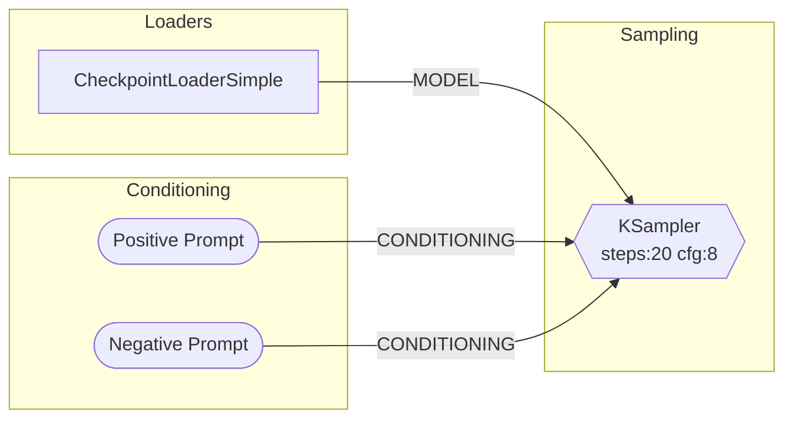

# comfyui-mcp — drive ComfyUI with ANY LLM

<p align="center">
  <a href="https://comfyui-mcp.artokun.io/docs">
    
  </a>
</p>

<p align="center">
  <em>The Agent panel driving ComfyUI end to end — reading what is installed locally,
  wiring the graph, freeing VRAM, and running the render.<br>
  <a href="https://comfyui-mcp.artokun.io/docs">Watch the 76s demo &rarr;</a></em>
</p>

**The local-first, agent-native control plane for [ComfyUI](https://github.com/comfyanonymous/ComfyUI)** — an MCP server + live sidebar agent that generates images, video and audio, authors and runs workflows, manages models and custom nodes, and **edits your live ComfyUI graph in natural language**. Bring whatever model you have: **Claude or ChatGPT on your subscription, Gemini on your Google login, a free local model via Ollama (fully offline), or any hosted model over one API key** (DeepSeek, GLM, MiMo, Kimi, GPT, Claude via OpenRouter). Same tools, same panel, every tier — and the built-in [LLM Arena](https://comfyui-mcp.artokun.io/docs/arena) scores them all on real ComfyUI tasks so you know exactly what your model can do. One config targets local installs, LAN, VPS, or Comfy Cloud.

[](https://www.npmjs.com/package/comfyui-mcp)
[](https://nodejs.org)
[](./LICENSE)
[](https://comfyui-mcp.artokun.io/docs)

[](https://glama.ai/mcp/servers/artokun/comfyui-mcp)
[](https://glama.ai/mcp/servers/artokun/comfyui-mcp)

[](https://console.runpod.io/deploy?template=bnqtkvcer3&ref=dkx71w9b) [](https://discord.gg/cW9arBhzCu) &nbsp;**One-click GPU pod** — a ready-to-run ComfyUI with this project + [Agent Panel](https://github.com/artokun/comfyui-mcp-panel) + ComfyUI-Manager v2 preinstalled, on your own GPU. No setup.

Works on **macOS**, **Linux**, and **Windows**. Auto-detects your ComfyUI installation and port.

**Stuck or have a question? [Join the Discord](https://discord.gg/cW9arBhzCu)** — help, model tips, and release announcements.

**37 MCP tools** | **41 AI skills** (Flux · WAN · LTX 2.3 video · MiniMax H3 · Qwen · Z-Image · Ideogram 4 · ERNIE · ANIMA · model registry · Civitai · node authoring · launch/perf flags) | **56 installer packs** | **11 slash commands** | **4 autonomous agents** | **3 hooks**

The plugin ships **expert skills that grow with every release** — model-specific generation guides with curated download URLs, workflow recipes, troubleshooting, and custom-node authoring — so Claude knows the right sampler, CFG, resolution, and model files for each architecture without trial and error.

> ### ✅ Now available: the [ComfyUI Agent Panel](https://registry.comfy.org/nodes/comfyui-agent-panel) on ComfyUI-Manager & the Comfy Registry
> An autonomous AI agent in your ComfyUI sidebar — **on Claude, ChatGPT, Gemini, or ANY local/hosted LLM** (Ollama and every OpenAI-compatible endpoint). Subscriptions work with no API key; local models work with no account at all. Pick a provider and it drives your live graph: edits, spatial layout, one-shot workflow/pack loads, rewind/rollback, a pending-message tray, activity cards, multi-tab — and it asks before spending paid API credits.
> Search **`comfyui-agent-panel`** in ComfyUI-Manager to install. [Read more →](https://comfyui-mcp.artokun.io/docs/panel)

📖 **Full documentation: [comfyui-mcp.artokun.io/docs](https://comfyui-mcp.artokun.io/docs)**

---

## Quick Start

**1. Install ComfyUI** (if you haven't already): [ComfyUI Desktop](https://www.comfy.org/download) or [from source](https://github.com/comfyanonymous/ComfyUI)

**2. Add the MCP server** to your Claude Code config (`~/.claude/settings.json`):

```json
{
  "mcpServers": {
    "comfyui": {
      "command": "npx",
      "args": ["-y", "comfyui-mcp"],
      "env": {
        "CIVITAI_API_TOKEN": ""
      }
    }
  }
}
```

**3. Start using it.** With ComfyUI running, ask Claude to generate an image:

```
> Generate an image of a sunset over mountains
```

Claude will find (or download) a checkpoint, build a workflow, execute it, and return the image.

> **Note**: This runs as a standalone MCP server — no need to clone this repo. `npx` will download and run it automatically.

### Scope: local, remote, or Comfy Cloud

`comfyui-mcp` is **local-first**: a self-hosted ComfyUI on Mac/Linux/Windows is the primary target, with the same agent reaching remote installs (RunPod, VPS, LAN, reverse-proxied) from one config. Local-first, not local-only.

**More than a bridge.** Most ComfyUI MCP servers are thin connectors — they forward a prompt and hand back an image. `comfyui-mcp` is a full control plane: it authors and edits the graph node-by-node, runs and iterates on workflows, manages models and custom nodes, and ships model-specific expertise (samplers, CFG, resolutions, curated model URLs) so the agent gets it right without trial and error. If you want a minimal local relay, a lightweight server is fine; if you want an agent that actually *operates* ComfyUI, that's this project.

For **Comfy Cloud** users, Comfy-Org ships its own [agent tooling](https://docs.comfy.org/agent-tools): **Comfy Cloud MCP** (public beta, hosted on Comfy Cloud GPUs), the **Comfy In-App Agent** (private alpha, inside Comfy Cloud), and a first-party **Comfy Local MCP** (private test, not publicly available yet) — all maintained by the Comfy team. If you don't have a GPU or you want zero setup, that's the better path; go use it.

Where this project differs is that it runs on **your** install and **your** choice of model — including a free local one via Ollama with no account and no network at all. `comfyui-mcp` *also* includes a community cloud-mode (set `COMFYUI_API_KEY` — see [Deployment modes](#deployment-modes)) so a single MCP can target all three deployment shapes from one config.

📊 **[Local vs. Comfy Cloud agent](https://comfyui-mcp.artokun.io/docs/local-vs-comfy-cloud)** — an honest side-by-side, including when Comfy Cloud is the right answer. *(Statuses above are as of July 2026; Comfy-Org ships fast — check their docs for the current state.)*

### Remote / hosted connector (one command)

Want to use `comfyui-mcp` from **Claude Desktop's Custom Connectors** or any remote
client — like Comfy's own `cloud.comfy.org/mcp` connector? Run it as an
authenticated, publicly-reachable Streamable-HTTP server with one flag:

```bash
npx -y comfyui-mcp@latest --tunnel
```

This forces the HTTP transport, generates an auth token, opens a
[cloudflared](https://github.com/cloudflare/cloudflared) quick tunnel, and prints
a ready-to-paste `https://…/mcp` URL + token + Claude Desktop connector snippet.
Auth accepts `Authorization: Bearer <token>` **or** `X-API-Key: <token>` (matching
Comfy Cloud's convention). See the
[Remote / hosted connector guide](https://comfyui-mcp.artokun.io/docs/remote-connector)
for the full walkthrough and headless usage.

> Auth is opt-in: with no `COMFYUI_MCP_HTTP_TOKEN` set and no `--tunnel`, the
> default stdio (and plain `--http` on loopback) behavior is unchanged — open and
> local. OAuth (Comfy's browser sign-in flow) is a planned follow-up.

---

## Claude Code Plugin

This package also ships as a **Claude Code plugin**, providing slash commands, skills, agents, and hooks on top of the MCP tools.

### Install as a plugin

```bash
# In Claude Code
/plugin marketplace add artokun/comfyui-mcp
/plugin install comfy
```

### Slash commands

| Command | Description |
|---------|-------------|
| `/comfy:gen <prompt>` | Generate an image from a text description — auto-selects checkpoint, builds workflow, returns image |
| `/comfy:viz <workflow>` | Visualize a workflow as a Mermaid diagram with nodes grouped by category |
| `/comfy:node-skill <pack>` | Generate a Claude skill for a custom node pack from Registry ID or GitHub URL |
| `/comfy:debug [prompt_id]` | Diagnose why a workflow failed — reads history, logs, traces root cause, suggests fixes |
| `/comfy:batch <prompt, params>` | Parameter sweep generation across cfg, sampler, steps, seed, etc. |
| `/comfy:convert <file>` | Convert between UI format and API format workflows |
| `/comfy:install <pack>` | Install a custom node pack — git clone, pip install, optional restart |
| `/comfy:gallery [filter]` | Browse generated outputs with metadata — filter by date, count, or filename |
| `/comfy:compare <a vs b>` | Diff two workflows side by side — shows added/removed nodes and changed parameters |
| `/comfy:recipe <name> <prompt>` | Multi-step recipes: `portrait`, `hires-fix`, `style-transfer`, `product-shot` |

### Built-in skills

41 skills total — model-family guides (Flux, WAN, LTX 2.3, MiniMax H3, Qwen, Z-Image, Ideogram 4, ERNIE, ANIMA + anime / WAN / Z-Image LoRA training), the **model-registry** (curated download URLs), the **civitai** pairing skill, node authoring, the **launch/performance-flags** matrix, and the core four below. Full list on the [plugin docs page](https://comfyui-mcp.artokun.io/docs/plugin).

> **Installer packs.** [`packs/`](packs/) bundles 13 one-command ComfyUI setups — ANIMA, Ideogram 4, LTX-2.3, ERNIE, WAN (animate / longer-videos / transparent), Qwen (image / image-edit), Z-Image (turbo / base / xy-plot) and artokun-flow (WAN Animate — replace / animate). Each is a manifest of custom nodes + model URLs + workflow that drives both `apply_manifest` and generated `install-windows.bat` / `install-runpod.sh`, with CI that validates every model link + payload size. See [`packs/README.md`](packs/README.md).

| Skill | Description |
|-------|-------------|
| **comfyui-core** | Workflow format, node types, data flow patterns, pipeline architecture, MCP tool usage guide |
| **prompt-engineering** | CLIP weight syntax `(word:1.3)`, BREAK tokens, embeddings, model-specific prompting for SD1.5/SDXL/Flux/SD3 |
| **troubleshooting** | Common error catalog — OOM, dtype mismatches, missing nodes, NaN tensors, black images, CUDA errors, with VRAM estimates per model |
| **model-compatibility** | Compatibility matrix — loaders, resolutions, CFG, samplers, ControlNets, LoRAs, and VAEs per model family (SD1.5/SDXL/Turbo/Lightning/Flux/SD3/LTXV) |

### Agents

| Agent | Model | Description |
|-------|-------|-------------|
| **comfy-explorer** | Sonnet | Researches custom node packs — reads docs, queries `/object_info`, generates comprehensive skill files |
| **comfy-debugger** | Sonnet | Autonomously diagnoses workflow failures — gathers logs + history, identifies failing node, checks models + custom nodes, proposes and optionally applies fixes |
| **comfy-optimizer** | Sonnet | Analyzes workflows for performance — detects redundant nodes, VRAM waste, wrong CFG/steps for model family, precision issues, suggests optimizations |
| **comfy-researcher** | Sonnet | Discovers and ranks ComfyUI custom node packs for a stated image-generation problem |

### Hooks

| Event | Trigger | Action |
|-------|---------|--------|
| PreToolUse | `enqueue_workflow` | **VRAM watchdog** — checks GPU memory via `/system_stats` and warns if < 1GB free before execution |
| PreToolUse | `restart_comfyui` (actions `stop`/`restart`) | **Save warning** — prompts user to save unsaved workflow changes before stopping ComfyUI |
| PostToolUse | Any comfyui tool | **Job completion notify** — checks for completed jobs and injects completion summaries into the conversation |

### Background Scripts

| Script | Description |
|--------|-------------|
| `monitor-progress.mjs` | **Progress monitor** — connects to ComfyUI's WebSocket for real-time step progress (e.g., `step 5/14 (36%)`). Run as a background Bash task after enqueuing workflows. Reports completion with output filenames, errors with node details. Replaces polling `queue` (action:"status") in a loop. |

---

## Panel agent (Claude · ChatGPT · Gemini · any local/hosted LLM)

Beyond the headless MCP server, this package ships the **panel orchestrator** that
powers the **[ComfyUI Agent Panel](https://github.com/artokun/comfyui-mcp-panel)** —
an autonomous agent embedded in ComfyUI's sidebar that drives the live canvas. It
runs in the background on **your own subscription** (Claude *or* ChatGPT), started
on demand by the panel's **Connect** button:

```bash
npx -y comfyui-mcp@latest connect
```

### Drive a REMOTE ComfyUI from your own machine (`connect`)

When ComfyUI runs somewhere with **no Node/agent** (a RunPod pod, a cloud box) you
can still run the agent on **your** machine and drive that remote ComfyUI — no
agent login on the box, nothing to install or configure remotely:

```bash
npx -y comfyui-mcp@latest connect https://abcd1234-8188.proxy.runpod.net
```

This is sugar for `--panel-orchestrator` with `COMFYUI_URL` set from the URL: the
orchestrator runs locally on your Claude/ChatGPT login and reaches the remote
ComfyUI over its public proxy URL. For a **remote HTTPS pod**, `connect`
automatically opens a secure, token-gated **`wss://` tunnel** (via Cloudflare) to
the local agent bridge and hands the pod's panel that URL — so the pod's HTTPS page
reaches your machine with **no browser prompt, in any browser** (a secure page
can't open a plain `ws://` socket to your box — mixed content / Private Network
Access). A **local** ComfyUI uses the plain `ws://127.0.0.1:9199` loopback bridge;
add **`--insecure-bridge`** to force that loopback for a remote pod (then arrange
your own path to it, e.g. an SSH port-forward). Either way the panel JS runs in
**your local browser** and the agent — and your login — run only on **your**
machine, so nothing is installed remotely.

To finish: with `connect` still running on your machine, open the remote ComfyUI in
your browser and click **Connect** in the Agent panel. (The panel is a pure-frontend
extension — it links to the bridge your `connect` process is already serving, rather
than asking the ComfyUI host to spawn an orchestrator it cannot run.)

**Multi-provider, full parity.** The orchestrator depends on a provider-neutral
**`AgentBackend`** port (dependency injection), with two adapters:

- **`ClaudeBackend`** — the [Claude Agent SDK](https://www.npmjs.com/package/@anthropic-ai/claude-agent-sdk)
  (`@anthropic-ai/claude-agent-sdk`), a persistent streaming session over the
  claude.ai subscription (OAuth, no key).
- **`CodexBackend`** — OpenAI Codex over the **`codex app-server`** JSON-RPC
  protocol (`@openai/codex`), on the ChatGPT subscription (`codex login`, no key).

Further adapters follow the same port — Gemini CLI (ACP), **Antigravity
(`agy`, the Google AI Pro/Ultra subscription path — install from
[antigravity.google](https://antigravity.google) and run `agy` once to sign
in)**, Grok, Kimi, GLM, Ollama/LM Studio/llama.cpp (local), OpenRouter, and
any OpenAI-compatible endpoint. See
[docs/backends](https://comfyui-mcp.artokun.io/docs/backends) for the full
matrix.

Both are optional dependencies, and the panel picks a **provider, not a port** —
each backend runs its own orchestrator on its own loopback bridge port. A
capability matrix lets the panel degrade gracefully (e.g. conversation-rollback is
Claude-only today, since the Codex app-server resumes whole threads only).

**The live-canvas tools and model knowledge are identical across providers.** The
`panel_*` tool definitions live in **one shared list**, registered onto both the
in-process Claude SDK MCP server *and* a `@modelcontextprotocol/sdk` server over a
loopback **streamable-HTTP MCP** that the orchestrator hosts for Codex (which can
only host config-declared MCP servers). The headless `comfyui` MCP is likewise
injected into both — in-process for Claude, declared via `codex app-server -c
mcp_servers` for ChatGPT — so generation, models, and workflow tools are the same
everywhere.

New tools that give every backend the same expertise and a cost guardrail:

| Tool | Description |
|------|-------------|
| `list_packs` (`action: "skill_list"` / `"skill_read"`) | Discover and read bundled model-family + workflow skills — the knowledge Claude loads natively, exposed to any MCP client (e.g. the Codex backend) |
| `list_packs` (`action: "list"` / `"read_workflow"`) | List one-command installer packs (custom nodes + weights + ready workflow; all local-GPU / free) and read a pack's graph |
| `list_packs` (`action: "list_templates"`) | List the connected ComfyUI's custom-node-contributed workflow templates |
| `list_packs` (`action: "check_runtime"`) | Classify a workflow as **local** (your GPU, free) or **api** / **mixed** / **unknown** (hosted API nodes = paid credits) so the agent asks before spending paid API credits |
| `list_packs` (`action: "extract_deps"` / `"install_deps"`) | Work out which custom node packs a workflow needs, and install the missing ones through ComfyUI-Manager |
| `panel_load_workflow` | (panel tool) Load a full workflow onto the live canvas in one shot — by bundled `pack` name (read server-side, never shuttled through chat) or by graph JSON |
| `panel_strip_workflow` / `panel_slice_workflow` | (panel tools) De-virtualize a tangled graph (Get/Set buses, Reroutes, subgraphs, bypass → real connections) or carve one rgthree-toggled pipeline out of a monolith — by `pack`, server-side `path`, or inline graph; for understanding/rebuilding expert workflows without hand-tracing |

See the design doc — **[design/agent-backend-injection.md](design/agent-backend-injection.md)** —
for the port, the capability matrix, and the per-provider "clink" points, and the
**[panel docs](https://comfyui-mcp.artokun.io/docs/panel)** for the full sidebar UX.

---

## MCP Tools

37 tools across workflow execution, generation, iteration, composition, models, and more:

### Image Generation (high-level)

| Tool | Description |
|------|-------------|
| `generate_image` `action: "image"` | Generate from a text prompt — builds a txt2img workflow, fills unspecified params from your defaults, auto-selects a checkpoint |
| `generate_image` `action: "controlnet"` | Generate conditioned by a ControlNet image (pose/depth/canny/normal) + prompt |
| `generate_image` `action: "ip_adapter"` | Generate guided by a reference image's style/subject via IP-Adapter (needs ComfyUI_IPAdapter_plus) |
| `generate_image` `action: "video"` / `"3d"` | Generate a short video clip (LTX-2.3, local GPU) or a 3D model (hosted partner API nodes) from the same one-line entry point |
| `generate_image` `action: "upscale"` | Post-process an uploaded or staged image with ESRGAN super-resolution |
| generate_image (action:"remove_background") | Post-process an uploaded or staged image into a transparent BiRefNet cutout |

### Audio Generation (high-level)

| Tool | Description |
|------|-------------|
| `generate_image` `action: "audio"` | Generate audio from a text prompt — supports ACE Step 1.5 (music with lyrics/structure) and Stable Audio 3 (music, instruments, SFX); auto-selects local models |

### Assets & Iteration

| Tool | Description |
|------|-------------|
| `get_image (action:"view")` | Return a generated asset's bytes as an inline image so the agent can see the result |
| `get_image (action:"analyze_color")` | Palette / contrast / color statistics for a generated image (dominant colors, average + luminance stats, contrast checks) so the agent can reason about color without a vision round-trip |
| generate_image (action:"regenerate") | Re-run the workflow that produced an `asset_id`, with optional parameter overrides |
| `get_image (action:"list_assets")` | Browse recently generated assets (newest-first) by `asset_id` |
| `get_image (action:"asset_metadata")` | Full provenance for an asset, including the originating workflow |

### Defaults

| Tool | Description |
|------|-------------|
| `get_defaults` `action:"get"` | Show merged generation defaults with per-source attribution |
| `get_defaults` `action:"set"` | Update runtime defaults; `persist: true` writes the config file |
| `get_defaults` `action:"get_ui"` / `action:"set_ui"` | Read/write ComfyUI's OWN frontend UI settings (the `Comfy.*` ids) — a separate store from the generation defaults above |

### Workflow Execution

| Tool | Description |
|------|-------------|
| `enqueue_workflow` `action: "enqueue"` | Submit a workflow (API format JSON) — returns `prompt_id` immediately, non-blocking |
| `enqueue_workflow` `action: "rerun"` / `"run_url"` / `"template_schema"` | Re-run a past generation, or read/run a shared workflow from a URL, or inspect a bundled template's overridable slots |
| enqueue_workflow (action:"run_template") | One-shot: resolve a bundled pack's expert graph, apply `<nodeId>.<widget>` overrides, and enqueue it |
| `queue` | One action-parameterized tool for the execution queue: `list` (running + pending), `status` (one job by prompt ID), `get_workflow` (a pending job's full payload), `move`/`edit` (requeue a pending job front/back, patched or replaced, with a new prompt ID), `cancel` (interrupt the running job — escalates interrupt → verify → `/free`, reports WEDGED if it won't die; `clear_pending: true` also drops all pending), `cancel_queued`, `clear` |
| `get_system_stats` | Get system info — GPU, VRAM, Python version, OS |

### Workflow Visualization

| Tool | Description |
|------|-------------|
| `visualize_workflow` | One action-parameterized tool for rendering and converting a workflow you pass in: `render` (Mermaid flowchart, nodes grouped by category), `render_hierarchical` (the same graph sectioned — overview, one section in detail, a listing, or an AI-oriented summary), `mermaid` (a Mermaid diagram back to executable workflow JSON), `to_dsl`/`from_dsl` (the compact, losslessly round-tripping authoring DSL) |

### Workflow Composition

| Tool | Description |
|------|-------------|
| `create_workflow` | One action-parameterized tool for authoring: `create` (from templates: `txt2img`, `img2img`, `upscale`, `inpaint`, `controlnet`, `ip_adapter`, `ace_step_15`, `stable_audio_3`), `modify` (operations: `set_input`, `add_node`, `remove_node`, `connect`, `insert_between`), `validate` (dry-run — missing nodes, broken connections, invalid output indices, missing model files), `node_info` (query available node types from ComfyUI's `/object_info` endpoint) |

### Workflow Library

| Tool | Description |
|------|-------------|
| `get_workflow` | One action-parameterized tool for READING a saved workflow file: `list` (the user library, subfolders included), `get` (one workflow's JSON by filename), `analyze` (a structured summary instead of raw JSON), `query` (filter/traverse/aggregate a big graph without dumping it), `strip` (**de-virtualize** any workflow from an absolute path, library filename, or inline graph — resolve GetNode/SetNode buses, Reroutes, subgraph defs, and bypassed nodes into real connections and return the flat graph; reads ANY path server-side, so it loads ad-hoc/expert workflows the cached library can't), `slice` (**un-chunk** a toggle-template monolith — one rgthree Fast-Groups-Bypass-toggled pipeline out into a standalone activated graph; pair with `strip` to then flatten the buses), `from_image` (the workflow ComfyUI embedded in a PNG), `prompt_director` (Prompt Director's sanitized runtime state) |
| `save_workflow` | One action-parameterized tool for WRITING to the library: `save` (store a workflow — overwrites a same-filename file), `lock` (record a provenance lock: SHA-256 per model, git commit per node pack), `verify_lock` (report drift against that lock) |

### Image Management

| Tool | Description |
|------|-------------|
| `upload_image` | Copy a local image into ComfyUI's `input/` directory for img2img, inpaint, or ControlNet |
| `get_image (action:"list_outputs")` | Browse recently generated images **and videos** from the output directory, sorted newest-first — recurses into subfolders (e.g. SaveVideo's `output/video/…`) and returns each result's `subfolder` |

### Model Management

| Tool | Description |
|------|-------------|
| `download_model` | Find and fetch model weights, and track the transfers. `action`: `download` (from a URL, into the correct ComfyUI subdirectory), `status`, `cancel`, `search` (HuggingFace), `search_civitai`, `search_creators`, `download_civitai`, `resolve_missing` |
| `list_local_models` | What is installed, and where ComfyUI looks. `action`: `list` (installed models by type: checkpoints, loras, vae, upscale_models, controlnet, embeddings, clip, unet, diffusion_models, text_encoders), `remove` (**deletes a model file**), `embeddings`, `list_paths`, `add_path`, `remove_path` (the last three view/edit the extra search-path YAML) |

### Memory Management

| Tool | Description |
|------|-------------|
| `clear_vram` | Free GPU VRAM by unloading cached models — calls ComfyUI's `/free` endpoint, reports before/after stats |

### Registry & Discovery

| Tool | Description |
|------|-------------|
| `search_custom_nodes` | Search the ComfyUI Registry for node packs by keyword (`action: "search"`), or get one pack's full details (`action: "details"`) |
| `list_packs` (`action: "generate_skill"`) | Generate a Claude skill `.md` file from a Registry ID or GitHub URL |
| `comfy_cli` | Search actual loaded node classes through official `comfy nodes search` (action:"search_nodes") |

### Official comfy-cli

Install [comfy-cli](https://docs.comfy.org/comfy-cli/getting-started#install-cli) 1.11.1 or newer to enable the official JSON-backed tools. The MCP resolves `comfy` from `COMFY_CLI_PATH`, `PATH`, or the selected workspace's `.venv`/`venv`. Local custom-node operations prefer `comfy node` when a supported CLI is available and otherwise fall back to Manager HTTP; remote targets retain Manager HTTP.

| Tool | Description |
|------|-------------|
| `comfy_cli` | One action-parameterized tool for the whole official CLI: `status`, `server_start`/`server_stop`/`server_restart`, `jobs_list`/`jobs_status`/`jobs_wait`/`jobs_watch`/`jobs_cancel`, `search_nodes`, `workflow_validate`/`workflow_run`, `transfer_upload`/`transfer_download`, `models_*` (list/search/show/download/remove), `skills_*` (list/show/validate/install/status/uninstall) |

### Diagnostics

| Tool | Description |
|------|-------------|
| `get_system_stats (action:"logs")` | Get ComfyUI server logs with optional keyword filter (e.g., `error`, `warning`, a node name) |
| `get_history` `action: "list"` | Get execution history with full error details, Python tracebacks, timing, and cached node info |
| `get_history` `action: "diagnose"` | Explain a FAILED run in one call — the failed node and traceback PLUS the missing models (file + widget) and missing node types |

### Process Control

| Tool | Description |
|------|-------------|
| `restart_comfyui` `action:"restart"` | Stop and restart ComfyUI, preserving all launch arguments |
| `restart_comfyui` `action:"stop"` | Stop the running ComfyUI process (saves PID and launch args for restart) |
| `restart_comfyui` `action:"start"` | Start ComfyUI using info saved from a previous stop |

### Generation Tracker

| Tool | Description |
|------|-------------|
| `get_history` `action: "suggest"` | Suggest proven sampler/scheduler/steps/CFG settings from local generation history — query by model family, LoRA hash, or text search |
| `get_history` `action: "stats"` | Show local generation tracking statistics — total runs, unique combos, breakdown by model family |

Every `enqueue_workflow` call automatically logs settings to a local SQLite database (`generations.db`). Same settings combos get a `reuse_count` bump instead of duplicates, creating a natural popularity signal. Models and LoRAs are identified by content hash (AutoV2 / SHA256), not filenames — so renamed files still group together.

```bash
# View local stats from the CLI
npm run generations:stats
```

---

## Examples

### Generate an image

```
> /comfy:gen a cyberpunk city at night with neon lights
```

Claude will:
1. Check installed checkpoints (download one if needed)
2. Build a txt2img workflow with your prompt
3. Execute it on ComfyUI
4. Return the generated image

### Visualize a workflow

```
> /comfy:viz ~/workflows/my-workflow.json
```

Produces a Mermaid diagram with nodes grouped by category:



### Debug a failed workflow

```
> /comfy:debug
```

Automatically reads the last execution history and logs, identifies the failing node, checks for missing models or node packs, and suggests a fix.

```
> /comfy:debug abc123-def456
```

Diagnose a specific execution by prompt ID.

### Parameter sweep

```
> /comfy:batch a cat in a field, cfg:5-10:2, sampler:euler,dpmpp_2m
```

Generates a grid of images across all parameter combinations and presents a summary table with results.

Supported sweep parameters: `cfg`, `steps`, `sampler`, `scheduler`, `seed`, `denoise`, `width`, `height`.

### Multi-step recipes

```
> /comfy:recipe hires-fix a dramatic fantasy landscape with castles
```

Runs a two-pass pipeline: txt2img at 512x768, then img2img upscale to 1024x1536 with detail enhancement.

Available recipes:

| Recipe | Description |
|--------|-------------|
| `portrait` | Generate at 1024x1024, then 2x upscale to 2048x2048 |
| `hires-fix` | Low-res generation → img2img upscale with denoise 0.4-0.5 |
| `style-transfer` | Apply a style prompt to an existing image via img2img |
| `product-shot` | Product image with clean white background |

### Convert workflow format

```
> /comfy:convert ~/workflows/my-ui-workflow.json
```

Converts between ComfyUI's UI format (nodes + links arrays) and API format (node IDs → {class_type, inputs}).

### Install a custom node pack

```
> /comfy:install comfyui-impact-pack
```

Searches the registry, shows details, clones the repo to `custom_nodes/`, installs dependencies, and offers to restart ComfyUI.

### Browse output gallery

```
> /comfy:gallery last 5
> /comfy:gallery today
```

Lists recent outputs with embedded metadata — shows checkpoint, prompt, seed, steps, CFG, sampler for each image.

### Compare workflows

```
> /comfy:compare workflow-a.json vs workflow-b.json
```

Shows added/removed nodes, changed parameters (old → new values), and optional Mermaid diagrams for visual comparison.

### Validate before running

```
> Validate this workflow before I run it
```

Checks for missing node types, broken connections, invalid output indices, and missing model files — without executing.

### Manage models

```
> What checkpoints do I have installed?
> Search HuggingFace for SDXL turbo models
> Download this model to my checkpoints folder
```

### Manage VRAM

```
> Free my VRAM
> What embeddings do I have?
```

### Extract workflow from an image

```
> Extract the workflow from this image: ~/outputs/ComfyUI_00042_.png
```

Reads the PNG metadata chunks to recover the exact workflow and prompt used to generate the image.

### Explore custom nodes

```
> /comfy:node-skill comfyui-impact-pack
```

Generates a comprehensive skill file documenting every node, its inputs/outputs, and usage patterns.

### Process control

```
> Restart ComfyUI
> Stop ComfyUI
> Start ComfyUI back up
```

---

## Configuration

The server auto-detects your ComfyUI installation and port. Override with environment variables if needed.

Where to put keys and overrides:

- **Panel users**: the **API Keys** card (▾ menu next to "connected") — stored in `~/.comfyui-mcp/panel-secrets.json`, applied immediately, no restart.
- **MCP-only setups** (Claude Desktop, Claude Code, etc.): the `env` block of your MCP client config, as shown in the setup examples above.
- Real environment variables always take precedence over stored keys. (For development, `~/.comfyui-mcp/.env` is also loaded as an override file — regular installs shouldn't need it.)

### Deployment modes

`comfyui-mcp` operates in one of three modes, auto-selected from the environment:

| Mode | Trigger | Local FS / process tools? |
|------|---------|----------------------------|
| **Local** | default | yes |
| **Remote** | `--comfyui-url` / `COMFYUI_URL` points at a non-loopback host, or `--force-remote` is set | no — server skips `COMFYUI_PATH` auto-detection so stale local installs can't silently absorb uploads |
| **Cloud** | `COMFYUI_API_KEY` is set (targets [Comfy Cloud](https://cloud.comfy.org)) | no — HTTP primitives route via `cloud.comfy.org` over `X-API-Key`; WebSocket and local-only tools throw `CLOUD_UNSUPPORTED` |

Some setups (e.g. [dstack](https://dstack.ai) driving ComfyUI on RunPod) port-forward
a remote ComfyUI back to `localhost:8188`, so the loopback check above gets it
wrong — the install isn't actually local. Pass `--force-remote` (or set
`COMFYUI_MCP_FORCE_REMOTE=1`) alongside `--comfyui-url`/`COMFYUI_URL` to force
remote mode regardless of hostname:

```bash
npx -y comfyui-mcp@latest --comfyui-url http://localhost:8188 --force-remote
```

| Variable | Default | Description |
|----------|---------|-------------|
| `COMFYUI_URL` | | Full ComfyUI URL, e.g. `https://comfy.example.com:8443` — overrides `COMFYUI_HOST`/`PORT`/`SSL` and skips auto-detection. A **path prefix is preserved** (e.g. `https://host/comfyapi`) for reverse-proxied instances. Non-loopback hosts opt into **remote mode**. |
| `COMFYUI_MCP_FORCE_REMOTE` | | Set to `1`/`true` (or pass `--force-remote`) to force **remote mode** even when `COMFYUI_URL`/`--comfyui-url` resolves to a loopback host — for port-forwarded remote installs (e.g. dstack/RunPod) that are reachable at `localhost`. No effect without a `COMFYUI_URL`/`--comfyui-url`. |
| `COMFYUI_HOST` | `127.0.0.1` | ComfyUI server address |
| `COMFYUI_PORT` | *(auto-detect)* | ComfyUI server port (tries 8188, then 8000) |
| `COMFYUI_PATH` | *(auto-detect)* | Path to the ComfyUI data/base directory used for models, input/output and user state. In a conventional install this is also the checkout. Auto-detection suppressed in remote/cloud modes. |
| `COMFYUI_CODE_PATH` | `COMFYUI_PATH` | Optional path to the ComfyUI checkout (`main.py`, `.venv`, core git) when code and data live under different roots. Pip, venv, and core updates use this checkout (core updates prefer the checkout observed from the connected local server and use this as their fallback). Pack reads/writes — `custom_nodes`, comfy-cli `--workspace`, `apply_manifest` clone/checkout, workflow-lock pack commits — stay on the live `--base-directory` / `COMFYUI_PATH` data root (#1770). |
| `COMFY_CLI_PATH` | *(auto-detect)* | Path to the official `comfy` executable (comfy-cli >=1.11.1). Resolution also checks `PATH` and the selected workspace's `.venv`/`venv`. |
| `COMFYUI_PYTHON` | `python` | Python interpreter used by legacy git-clone dependency fallbacks. Point it at your ComfyUI venv's Python when needed. |
| `COMFYUI_MCP_BRIDGE_HOST` | `127.0.0.1` | Panel-bridge bind host. Set `0.0.0.0` (or a LAN IP) to run the orchestrator on a 24/7 server and connect panels from other machines — **requires a token** (below); the orchestrator prints a ready-to-paste `ws://…/?token=…` Bridge URL. |
| `COMFYUI_MCP_BRIDGE_TOKEN` | *(generated when needed)* | Shared secret gating every bridge connection (checked constant-time on the WS upgrade). Mandatory for a non-loopback `COMFYUI_MCP_BRIDGE_HOST`; pin it so the Bridge URL survives restarts. Never logged beyond the startup banner. |
| `COMFYUI_MCP_DATA_DIR` | `~/.comfyui-mcp` | Base dir for per-instance data (the `generations.db` behind `get_history` `action: "suggest"`) when there's no local `COMFYUI_PATH` (remote/cloud/undetected). Scoped per target under `instances/<host_port>/`. |
| `COMFYUI_API_KEY` | | Comfy Cloud API key. When set, **cloud mode** is active and the server talks to `cloud.comfy.org`. Never logged. |
| `COMFYUI_CLOUD_URL` | `https://cloud.comfy.org` | Override the Comfy Cloud endpoint (testing/staging). |
| `COMFYUI_AUTH_TOKEN` | | Generic auth token for a **self-hosted ComfyUI behind a reverse proxy / API gateway** (distinct from Comfy Cloud). When set, attached to every ComfyUI request. Never logged. |
| `COMFYUI_AUTH_HEADER` | `Authorization` | Header name for `COMFYUI_AUTH_TOKEN` (e.g. `X-API-Key`). |
| `COMFYUI_AUTH_SCHEME` | `Bearer` for `Authorization`, else none | Scheme prefix on the token value (e.g. `Bearer`, `Token`). |
| `CIVITAI_API_TOKEN` | | CivitAI API token for model downloads |
| `HUGGINGFACE_TOKEN` | | HuggingFace token for higher API rate limits |
| `GITHUB_TOKEN` | | GitHub token for skill generation (avoids rate limits) |
| `REGISTRY_ACCESS_TOKEN` | | Comfy Registry API key for `node_pack` (`action: "publish"`) (env-only, never logged) |
| `COMFYUI_DOWNLOAD_CACHE_DIR` | `~/.comfyui-mcp/cache` | Content-addressed model-download cache (dedup + concurrent coalescing) |
| `COMFYUI_LRU_CACHE_SIZE_GB` | `0` | Cap the download cache in GB; `0` disables LRU eviction |
| `COMFYUI_STARTUP_CHECK_INTERVAL_S` / `…_MAX_TRIES` | `1` / `60` | Readiness-probe interval + max tries when starting a local ComfyUI |
| `COMFYUI_ALWAYS_RESTART` | `false` | Auto-restart a crashed local ComfyUI (bounded by `COMFYUI_RESTART_MAX_ATTEMPTS` / `COMFYUI_RESTART_WINDOW_S`) |
| `COMFYUI_MCP_STALL_S` | `180` | Render-wedge watchdog: seconds a sampler step can re-emit the same progress before a STALL/BACKLOG note is prepended to the agent's next turn (clamped 15–3600s; live-tunable from the panel) |
| `COMFYUI_MCP_INTERRUPT_S` | `30` | Seconds `queue` (action:"cancel") waits for an interrupt to actually stop a job before escalating to `/free` and reporting it wedged |
| `LOG_LEVEL` | `info` | Logging verbosity: `debug`, `info`, `warn`, `error` |

### Transports

The server speaks **stdio by default** (what Claude Code, Claude Desktop, and the MCP Inspector expect — no flags needed). For MCP gateways, remote/hosted setups, or `fetch`-based clients, opt into **streamable-HTTP**:

```bash
# stdio (default)
npx -y comfyui-mcp@latest

# streamable-HTTP on http://127.0.0.1:9100/mcp
npx -y comfyui-mcp@latest --http
npx -y comfyui-mcp@latest --http --host 0.0.0.0 --port 9100   # bind/port overrides
```

| Flag | Env | Default | Description |
|------|-----|---------|-------------|
| `--http` / `--transport http` | `MCP_TRANSPORT=http` | `stdio` | Serve streamable-HTTP at `/mcp` instead of stdio |
| `--host <h>` | `MCP_HOST` | `127.0.0.1` | HTTP bind host (use `0.0.0.0` to expose) |
| `--port <n>` | `MCP_PORT` | `9100` | HTTP port |
| `--comfyui-url <url>` | `COMFYUI_URL` | *(auto-detect)* | Target a specific (incl. remote) ComfyUI |
| `--force-remote` | `COMFYUI_MCP_FORCE_REMOTE` | `false` | Force remote mode for a loopback `--comfyui-url` (e.g. dstack/RunPod port-forwards to `localhost`) |

### Other agents & local LLMs (Hermes, OpenClaw, Copilot CLI, Ollama)

comfyui-mcp has **first-class support for non-Claude harnesses**. One command
writes the server entry into the harness's own config (merging, not
clobbering):

```bash
npx -y comfyui-mcp setup hermes     # → ~/.hermes/config.yaml      (compact by default)
npx -y comfyui-mcp setup openclaw   # → ~/.openclaw/openclaw.json  (compact by default)
npx -y comfyui-mcp setup copilot    # → ~/.copilot/mcp-config.json (full by default)
# flags: --compact | --full, --comfyui-url <url>, --dry-run
```

**Model requirements**: tool calling is a hard requirement (no tool calling =
doesn't work). Thinking and vision are strongly recommended — without
thinking, multi-step tool chains degrade; without vision the agent can
generate but can't see its own outputs.

**Compact tool mode is one flag away**: `--compact` /
`COMFYUI_MCP_TOOL_MODE=compact` registers 3 meta-tools (`list_tools` →
`describe_tool` → `call_tool`) instead of the direct surface, pulling schemas
into context one tool at a time — the right trade for small local models. The
direct surface is the default and is what frontier-model harnesses want.
**Run it locally
for free with our fine-tuned models**: `ollama pull artokun/gemma4-comfyui-mcp:e4b`
(also `:e2b` for ~2 GB VRAM, `:12b` for ~8 GB) — Gemma 4 QLoRA-trained on 1,055
server-verified trajectories over the full comfyui-mcp tool surface, and the
panel's Ollama default. Stock `gemma4:*`/`qwen3:4b` also validated end-to-end
(`npm run test:local-llm`); gemma3 has no native tool calling and is
unsupported. Full guide — hosted-model guidance (DeepSeek/MiMo/GLM class),
per-harness setup, troubleshooting:
**[Local LLMs & other agents](https://comfyui-mcp.artokun.io/docs/local-llms)**.

| Flag | Env | Default | Description |
|------|-----|---------|-------------|
| `setup <agent>` | | | Write the comfyui entry into hermes / openclaw / copilot config, then exit |
| `--compact` / `--tool-mode compact` | `COMFYUI_MCP_TOOL_MODE=compact` | `full` | Opt into the 3 meta-tools (`list_tools` / `describe_tool` / `call_tool`) instead of the direct surface — recommended for small local models. `--full` is still accepted and is now a no-op |

### Remote ComfyUI

Point the server at a ComfyUI running anywhere — no local install required:

```bash
npx -y comfyui-mcp@latest --comfyui-url http://192.168.1.50:8188
npx -y comfyui-mcp@latest --http --comfyui-url https://comfy.example.com:8443
```

**Behind a reverse proxy / API gateway** (path prefix + auth header) — for a
self-hosted ComfyUI exposed under a prefixed route with its own auth layer (this
is *not* Comfy Cloud, which is `COMFYUI_API_KEY`):

```bash
COMFYUI_URL=https://gateway.example.com/comfyapi \
COMFYUI_AUTH_TOKEN=your-token \
  npx -y comfyui-mcp@latest --http        # → Authorization: Bearer your-token, requests under /comfyapi

# custom header / scheme:
COMFYUI_URL=https://gateway.example.com/comfyapi \
COMFYUI_AUTH_HEADER=X-API-Key COMFYUI_AUTH_TOKEN=your-token \
  npx -y comfyui-mcp@latest --http        # → X-API-Key: your-token
```

### Auto-detection

**Port**: Probes `8188` (CLI default) then `8000` (Desktop app default) via `/system_stats`.

**Path**: Checks common locations in order:

- `~/Documents/ComfyUI` (macOS/Windows Desktop app data directory)
- `~/Library/Application Support/ComfyUI` (macOS)
- `~/AppData/Local/Programs/ComfyUI/resources/ComfyUI` (Windows Desktop app install)
- `~/AppData/Local/ComfyUI` (Windows)
- `~/ComfyUI`, `~/code/ComfyUI`, `~/projects/ComfyUI`, `~/src/ComfyUI`
- `/opt/ComfyUI`, `~/.local/share/ComfyUI` (Linux)
- Scans `~/Documents` and `~/My Documents` for any directory containing "ComfyUI"

Set `COMFYUI_PATH` to skip detection and use an explicit path.

---

## How It Works

The server communicates with ComfyUI through its REST API and WebSocket interface:

- **WebSocket** — enqueue workflows, receive real-time progress updates (step-by-step via background monitor script), get execution results
- **REST API** — system stats, node definitions (`/object_info`), logs, history, queue management, workflow library, VRAM control (`/free`), embeddings
- **File system** — read/write models directory, detect installation paths, upload images, extract PNG metadata, browse outputs
- **External APIs** — HuggingFace (model search), ComfyUI Registry (custom node discovery), GitHub (skill generation), CivitAI (model downloads)

All communication with the MCP client (Claude Code) happens over **stdio** using the [Model Context Protocol](https://modelcontextprotocol.io). Logs go to stderr to avoid polluting the protocol stream.

---

## Development

### Prerequisites

- [Node.js](https://nodejs.org) >= 22.0.0
- [ComfyUI](https://github.com/comfyanonymous/ComfyUI) running locally

### Setup

```bash
git clone https://github.com/artokun/comfyui-mcp.git
cd comfyui-mcp
npm install
```

### Scripts

| Script | Description |
|--------|-------------|
| `npm run dev` | Run from source with tsx (hot reload) |
| `npm run build` | Compile TypeScript to `dist/` |
| `npm start` | Run compiled output |
| `npm test` | Run unit tests (vitest) |
| `npm run test:integration` | Run integration tests (requires running ComfyUI) |
| `npm run lint` | Type-check without emitting |
| `npm run generations:stats` | Show local generation tracking statistics |
| `npm run sync-agents` | Sync Claude skills/commands/hooks to Google Antigravity, OpenCode, and other AI IDE formats that supports .agents files |

### Local testing with Claude Code

Point Claude Code at your local build instead of the npm package:

```json
{
  "mcpServers": {
    "comfyui": {
      "command": "node",
      "args": ["/path/to/comfyui-mcp/dist/index.js"],
      "env": {}
    }
  }
}
```

Or test the plugin directly:

```bash
claude --plugin-dir ./plugin
```

### Project structure

```
scripts/
  generation-stats.mjs         # CLI: npm run generations:stats
src/
  index.ts                 # MCP server entry point (stdio transport)
  config.ts                # Auto-detection & environment config
  comfyui/
    client.ts              # ComfyUI WebSocket/HTTP client wrapper
    types.ts               # TypeScript interfaces
  services/
    workflow-executor.ts   # Execute workflows, handle images & errors
    workflow-composer.ts   # Templates (txt2img, img2img, upscale, inpaint)
    workflow-validator.ts  # Dry-run validation (missing nodes, models, connections)
    image-management.ts    # Upload images, extract PNG metadata, list outputs
    mermaid-converter.ts   # Workflow → Mermaid diagram
    workflow-converter.ts  # UI → API: de-virtualize Get/Set buses + Reroutes, expand subgraphs, resolve bypass (powers get_workflow's strip action)
    workflow-slicer.ts     # sliceWorkflow() — rgthree Fast-Groups-Bypass pipeline un-chunker (shared by the CLI + get_workflow's slice action)
    mermaid-parser.ts      # Mermaid diagram → Workflow
    model-resolver.ts      # HuggingFace search, local models, downloads
    generation-tracker.ts  # SQLite generation log, settings dedup, stats
    file-hasher.ts         # SHA256 hashing of .safetensors with cache
    workflow-settings-extractor.ts  # Extract settings from workflow JSON
    process-control.ts     # Stop, start, restart ComfyUI process
    registry-client.ts     # ComfyUI Registry API
    skill-generator.ts     # Generate node pack skill docs
  tools/                   # MCP tool registration (one file per group)
    workflow-execute.ts    # enqueue_workflow, get_system_stats
    workflow-visualize.ts  # visualize_workflow (render/render_hierarchical/mermaid/to_dsl/from_dsl)
    workflow-compose.ts    # create_workflow (create/modify/validate/node_info)
    workflow-validate.ts   # the validate action's body
    workflow-library.ts    # get_workflow (8 read actions), save_workflow (save/lock/verify_lock)
    image-management.ts    # get_image (7 read actions), upload_image (5 write actions)
    model-management.ts    # download_model, list_local_models (the two consolidated model tools)
    memory-management.ts   # clear_vram
    registry-search.ts     # search_custom_nodes (search/details)
    node-management.ts     # install_custom_node (install/update/fix/uninstall/enable/disable/list/…)
    node-pack.ts           # node_pack (scaffold/verify/publish/read/write/patch/git/…)
    generation-tracker.ts  # the get_history suggest/stats jobs
    diagnostics.ts         # get_system_stats (action:"logs"), get_history
    process-control.ts     # restart_comfyui (restart/start/stop)
    index.ts               # Registers all tool groups
  utils/
    errors.ts              # Custom error hierarchy with MCP integration
    logger.ts              # stderr-only logging (safe for stdio transport)
    image.ts               # Base64 encoding utilities
plugin/
  .claude-plugin/          # Plugin manifest
  .mcp.json                # MCP server config for plugin
  commands/                # Slash commands
    gen.md                 # /comfy:gen — image generation
    viz.md                 # /comfy:viz — workflow visualization
    node-skill.md          # /comfy:node-skill — skill generation
    debug.md               # /comfy:debug — failure diagnosis
    batch.md               # /comfy:batch — parameter sweeps
    convert.md             # /comfy:convert — format conversion
    install.md             # /comfy:install — node pack installation
    gallery.md             # /comfy:gallery — output browser
    compare.md             # /comfy:compare — workflow diff
    recipe.md              # /comfy:recipe — multi-step pipelines
  skills/                  # Knowledge bases
    comfyui-core/          # Workflow format, node types, pipeline patterns
    prompt-engineering/    # CLIP syntax, model-specific prompting
    troubleshooting/       # Error catalog with patterns and fixes
    model-compatibility/   # Compatibility matrix per model family
  agents/                  # Autonomous agents
    explorer.md            # Research custom node packs, generate skills
    debugger.md            # Diagnose workflow failures
    optimizer.md           # Analyze and optimize workflows
  hooks/                   # Pre/post tool-use hooks
    hooks.json             # Hook configuration
    vram-check.mjs         # VRAM watchdog before execution
    save-warning.mjs       # Save prompt before stop/restart
    job-complete-notify.mjs # Job completion notification via temp files
  scripts/                 # Background scripts
    monitor-progress.mjs   # Real-time WebSocket progress monitor
    launch-server.mjs      # MCP server launcher — prefers a global install over cold `npx` (#1447)
```

---

## Troubleshooting

**"ComfyUI not detected on ports 8188, 8000"**
Make sure ComfyUI is running. The Desktop app uses port 8000 by default; the CLI uses 8188. Set `COMFYUI_PORT` if you're using a custom port.

**"COMFYUI_PATH is not configured"**
The auto-detection couldn't find your ComfyUI data directory. Set `COMFYUI_PATH` to the directory containing your `models/` folder (e.g., `~/Documents/ComfyUI`).

**"Multiple ComfyUI installations detected"**
This is informational — the server uses the first one found. Set `COMFYUI_PATH` to pick a specific installation.

**Model downloads fail**
For HuggingFace gated models, set `HUGGINGFACE_TOKEN`. For CivitAI, set `CIVITAI_API_TOKEN`.

**Workflow execution errors**
Use `/comfy:debug` to automatically diagnose failures. Or use `get_history` (`action: "diagnose"`) / `get_system_stats (action:"logs")` directly to see detailed error messages including Python tracebacks from ComfyUI.

**Out of memory (OOM)**
Use `clear_vram` to free GPU memory before running large workflows. The VRAM watchdog hook will warn you automatically if memory is critically low. See the **troubleshooting** skill for model-specific VRAM estimates.

**Missing custom nodes**
Use `/comfy:install <pack>` to install missing node packs from the registry. The debug command will detect and suggest missing packs automatically.

---

## Contributing

Contributions are welcome! See **[CONTRIBUTING.md](./CONTRIBUTING.md)** for the dev setup, project
conventions, how to add an MCP tool, and the release process.

Quick version: fork → branch (`feat/my-feature`) → make changes (ensure `npm run build` and
`npm test` pass; run `npm run docs:gen` if you touched tools) → open a PR.

---

## Maintainer

Built and maintained by [**@artokun**](https://github.com/artokun) — a regular contributor across the Comfy-Org ecosystem:

- **[Comfy-Org/ComfyUI_frontend](https://github.com/Comfy-Org/ComfyUI_frontend/pulls?q=is%3Apr+author%3Aartokun)** — 10 merged PRs, mostly on the **v2 graph renderer**: subgraph rendering, promoted-widget plumbing, viewport persistence, with backports across `cloud/1.41`, `cloud/1.42`, `core/1.41`, and `core/1.42`.
- **[Comfy-Org/ComfyUI](https://github.com/Comfy-Org/ComfyUI/pulls?q=is%3Apr+author%3Aartokun)** (core) — crash fixes in the Python backend's video/audio save path ([#12683](https://github.com/Comfy-Org/ComfyUI/pull/12683), [#12550](https://github.com/Comfy-Org/ComfyUI/pull/12550)).

**Comfy-Org folks** (or anyone hiring around the ComfyUI ecosystem): I'd genuinely love to chat — **[art.longbottom.jr@gmail.com](mailto:art.longbottom.jr@gmail.com)**.

---

## License

MIT — see [LICENSE](./LICENSE) for details.

---

## Changelog

See [CHANGELOG.md](./CHANGELOG.md) for the full, structured release history.
