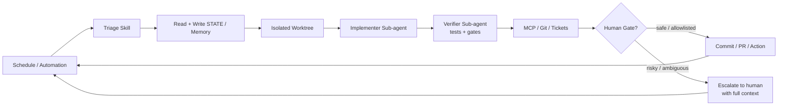

# Loop Engineering


<p align="center">
  <a href="https://cobusgreyling.github.io/loop-engineering/">
    
  </a>
</p>

<p align="center">
  <a href="https://github.com/cobusgreyling/loop-engineering/stargazers"></a>
  <a href="https://github.com/cobusgreyling/loop-engineering/actions/workflows/audit.yml"></a>
  <a href="https://www.npmjs.com/package/@cobusgreyling/loop"></a>
  <a href="https://www.npmjs.com/package/@cobusgreyling/loop-audit"></a>
  <a href="https://www.npmjs.com/package/@cobusgreyling/loop-init"></a>
  <a href="https://www.npmjs.com/package/@cobusgreyling/loop-cost"></a>
  <a href="https://www.npmjs.com/package/@cobusgreyling/loop-sync"></a>
  <a href="https://www.npmjs.com/package/@cobusgreyling/loop-context"></a>
  <a href="https://www.npmjs.com/package/@cobusgreyling/loop-mcp-server"></a>
  <a href="https://www.npmjs.com/package/@cobusgreyling/loop-worktree"></a>
  <a href="https://github.com/cobusgreyling/loop-engineering/blob/main/LICENSE"></a>
  <a href="https://cobusgreyling.github.io/loop-engineering/"></a>
</p>


<p align="center">
  <a href="https://cobusgreyling.github.io/loop-engineering/">
    
  </a>
</p>

> **Stop prompting. Design the loop. Get a score.**

<p align="center">
  
</p>

<p align="center">
  <strong>Start in 5 minutes</strong> ·
  <a href="docs/QUICKSTART.md">Quickstart</a> ·
  <a href="https://cobusgreyling.github.io/loop-engineering/#interactive">Pattern picker</a> ·
  <a href="#help-wanted">Contribute</a> ·
  <a href="https://github.com/cobusgreyling/loop-engineering/stargazers">⭐ Star</a>
</p>

<p align="center"><sub>If this repo changed how you run agents, a star helps others find the patterns. Docs &amp; small PRs: we aim to review within <strong>48 hours</strong>.</sub></p>

```bash
# One front door — init + doctor + status
npx @cobusgreyling/loop init . --pattern daily-triage --tool grok
npx @cobusgreyling/loop doctor .
```

`loop init` scaffolds skills, state, and budget files, then prints your **Loop Ready** score. `loop doctor` turns audit + sync into top-3 next actions. Swap `--tool` for `claude`, `codex`, or `opencode`. Optional: `--with-foundry` for a versioned harness stack. Legacy `npx @cobusgreyling/loop-init .` still works. See [docs/cli-front-door.md](docs/cli-front-door.md).

<p align="center">
  <a href="docs/QUICKSTART.md">
    
  </a>
</p>

Loop engineering replaces you as the person who prompts the agent — you design the system that does it instead.

**New here?** [Quickstart (5 min)](docs/QUICKSTART.md) · [Interactive picker](https://cobusgreyling.github.io/loop-engineering/#interactive) · [Help wanted](#help-wanted)

For developers using Grok, Claude Code, Codex, Cursor, and other AI coding agents.

<p align="center">
  <strong><a href="https://cobusgreyling.github.io/loop-engineering/">→ Interactive showcase + pattern picker</a></strong>
  ·
  <a href="https://cobusgreyling.substack.com/p/loop-engineering">Essay</a>
  ·
  <a href="https://addyosmani.com/blog/loop-engineering/">Addy Osmani</a>
</p>

## Contents

- [Quickstart (5 min)](docs/QUICKSTART.md)
- [Quick Links](#quick-links)
- [Why This Matters](#why-this-matters)
- [The Five Building Blocks + Memory](#the-five-building-blocks--memory)
- [Patterns](#patterns)
- [Getting Started (5 minutes)](#getting-started-5-minutes)
- [Examples by Tool](#examples-by-tool)
- [Operating & Safety](#operating--safety)
- [Caveats](#caveats)
- [Help wanted](#help-wanted)
- [Contributing](#contributing)
- [Sources](#sources)
- [License](#license)

## Quick Links

| Start here | Description |
|------------|-------------|
| [Quickstart (5 min)](docs/QUICKSTART.md) | `loop init` → `loop doctor` → first loop — **start here if you just landed** |
| [CLI front door](docs/cli-front-door.md) | Unified `@cobusgreyling/loop` — old packages stay open |
| [Loop Engineering essay](https://cobusgreyling.substack.com/p/loop-engineering) | The concept, primitives, and Grok mapping — read for the why |
| [Pattern Picker](docs/pattern-picker.md) | Which loop to run first — **start here if unsure** |
| [Primitives Matrix](docs/primitives-matrix.md) | Cross-tool loop primitive mapping — bookmark this |
| [Loop Design Checklist](docs/loop-design-checklist.md) | Ship readiness rubric |
| [Patterns](patterns/README.md) | 7 production patterns + [interactive picker](https://cobusgreyling.github.io/loop-engineering/#interactive) |
| [Starters](starters/) | Clone-and-run kits (Grok, Claude Code, Codex, Opencode) |
| [Opencode examples](examples/opencode/) | CLI-first loops: cron/systemd + `opencode run`, skills, worktrees |
| [**loop** (front door)](tools/loop/) | **Unified CLI** — `npx @cobusgreyling/loop init \| doctor \| status \| audit \| cost` · [cli-front-door](docs/cli-front-door.md) |
| [loop-audit](tools/loop-audit/) | Loop Readiness Score CLI (v1.7 — constraints + governance + **Harness Runtime**) — `npx @cobusgreyling/loop audit . --suggest` · also `loop-audit` |
| [loop-init](tools/loop-init/) | Scaffold starters + budget/run-log + constraints (v1.5) — `npx @cobusgreyling/loop init . --pattern daily-triage --tool grok` · also `loop-init` |
| [harness-foundry](https://github.com/cobusgreyling/harness-foundry) | **Companion runtime:** versioned stacks, sessions, traces — `npx @cobusgreyling/harness-foundry init --from loop-engineering:daily-triage` |
| [outerloop](https://github.com/cobusgreyling/outerloop) | **Companion governance:** evidence → verdict → answerability |
| [loop-cost](tools/loop-cost/) | Token spend estimator — `npx @cobusgreyling/loop-cost` |
| [loop-sync](tools/loop-sync/) | Drift detection between `STATE.md` and `LOOP.md` — `npx @cobusgreyling/loop-sync .` |
| [loop-context](tools/loop-context/) | Stateful memory manager + circuit breaker for long runs — `npx @cobusgreyling/loop-context --check --ledger run.json` |
| [loop-mcp-server](tools/mcp-server/) | MCP runtime lookup for patterns, skills, state — `npx @cobusgreyling/loop-mcp-server` |
| [loop-worktree](tools/loop-worktree/) | Manage isolated git worktrees per fix attempt — `npx @cobusgreyling/loop-worktree create --run-id <id> --pattern <p>` |
| [loop-gate](tools/loop-gate/) | Mechanical enforcement of the path denylist + auto-merge allowlist from `gate.yaml` — `npx @cobusgreyling/loop-gate check --action auto-merge --paths <f1,f2,...>` |
| [loop-sandbox](tools/loop-sandbox/) | Ephemeral git worktree isolation + patch capture — `npx @cobusgreyling/loop-sandbox run -- <cmd>` |
| [loop-action](tools/loop-action/) | GitHub Composite Action for running loops in CI — `uses: cobusgreyling/loop-engineering/tools/loop-action@main` |
| [Goal Engineering](https://github.com/cobusgreyling/goal-engineering) | **Companion:** loops discover, goals finish — `/goal` + [stack cookbook](https://github.com/cobusgreyling/goal-engineering/blob/main/docs/stack-cookbook.md) (`npx @cobusgreyling/goal doctor .`) |
| [Memory Engineering](https://github.com/cobusgreyling/memory-engineering) | **Companion:** stop re-explaining the repo — tiers, budget, Memory Ready score (`node tools/memory-init/cli.js .`) |
| [Fleet Engineering](https://github.com/cobusgreyling/fleet-engineering) | **Companion:** govern populations of agents — registry, inbox, Fleet Ready score (`npx @cobusgreyling/fleet-init .`) |
| [Stories](stories/) | Real wins and honest failures |

### Ecosystem stack

```
memory-engineering → loop-engineering → harness-foundry → outerloop → fleet-engineering
   (persist)            (patterns)         (runtime)        (verdict)     (population)
```

| Layer | You get | Start |
|-------|---------|--------|
| **Memory** | Tiers, recall budget, Memory Ready score | [memory-engineering](https://github.com/cobusgreyling/memory-engineering) |
| **Design** (this repo) | Patterns, starters, Loop Ready score | `npx @cobusgreyling/loop init .` then `loop doctor .` |
| **Runtime** | Versioned harness, traces, evolve | `npx @cobusgreyling/loop init . --with-foundry` or [Foundry showcase](https://github.com/cobusgreyling/harness-foundry/blob/main/docs/showcase.md) |
| **Govern** | Evidence, verdict, answerability | [outerloop](https://github.com/cobusgreyling/outerloop) |
| **Fleet** | Registry, inbox, budgets, kill switch | `npx @cobusgreyling/fleet-init .` · [Fleet Ready](https://github.com/cobusgreyling/fleet-engineering/blob/main/docs/fleet-ready-score.md) |

**Scale beyond one loop:** when agents forget across sessions, add [memory-engineering](https://github.com/cobusgreyling/memory-engineering). When you have many agents/loops on a team, add [fleet-engineering](https://github.com/cobusgreyling/fleet-engineering).

**Next after Loop Ready 80+:** version the loop as a harness — `loop-init` prints the CTA automatically; `loop-audit` recommends Foundry when the score is strong but `.foundry/stack.yaml` is missing.

### Community & announcements

| Discussion | Summary |
|------------|---------|
| [Contributor quickstart](https://github.com/cobusgreyling/loop-engineering/discussions/123) | **Help wanted:** open `good first issues` — comment *I'll take this* to get assigned · see [Help wanted](#help-wanted) |
| [Community update](https://github.com/cobusgreyling/loop-engineering/discussions/145) | **July 4:** 5.5k stars, traffic sources, contributor merges |
| [Community week (Jul 8)](https://github.com/cobusgreyling/loop-engineering/discussions/219) | loop-worktree npm, MCP quickstart, tool appendices |
| [npm update (Jul 16)](https://github.com/cobusgreyling/loop-engineering/discussions/294) | `loop-context` 1.2.0 + `loop-worktree` 1.1.0 — daily budget, path locks |
| [Maintenance (Jul 10)](https://github.com/cobusgreyling/loop-engineering/discussions/241) | Doc sync, branch prune, loop-audit 1.6.0 follow-up |
| [Prior release notes](https://github.com/cobusgreyling/loop-engineering/discussions/89) | v1.5.0 — loop-sync, constraints, MCP server |
| [Add your project](https://github.com/cobusgreyling/loop-engineering/discussions/92) | **Pinned:** Loop Ready badge + adopters list |

<p align="center">
  
</p>

## Why This Matters

Peter Steinberger:
> “You shouldn’t be prompting coding agents anymore. You should be designing loops that prompt your agents.”

Boris Cherny (Head of Claude Code at Anthropic):
> “I don’t prompt Claude anymore. I have loops running that prompt Claude and figuring out what to do. My job is to write loops.”

The leverage point has moved from crafting individual prompts to designing the control systems that orchestrate agents over time.

## The Five Building Blocks + Memory

| Primitive | Job in the Loop |
|-----------|-----------------|
| **Automations / Scheduling** | Discovery + triage on a cadence |
| **Worktrees** | Safe parallel execution |
| **Skills** | Persistent project knowledge |
| **Plugins & Connectors** | Reach into your real tools (MCP) |
| **Sub-agents** | Maker / checker split |
| **+ Memory / State** | Durable spine outside any conversation |

Full detail: [docs/primitives.md](docs/primitives.md) · Cross-tool matrix: [docs/primitives-matrix.md](docs/primitives-matrix.md)

### Visual Overview

<p align="center">
  
</p>

### Anatomy of a Loop

<p align="center">
  
</p>

<details>
<summary>Mermaid diagram (copy-friendly)</summary>



</details>

Deeper diagrams — the actor-level sequence within one run, the run lifecycle's states, autonomy levels L1-L3, and how `tools/` maps onto the primitives — live in [docs/architecture-diagrams.md](docs/architecture-diagrams.md).

**This reference repo now runs its own `validate-patterns` + `audit` workflows on every push/PR** (see `.github/workflows/`). We also added `LOOP.md` describing the loops that will maintain it.

## Patterns

<p align="center">
  
</p>

| Pattern | Cadence | Starter | Week 1 | Token cost |
|---------|---------|---------|--------|------------|
| [Daily Triage](patterns/daily-triage.md) | 1d–2h | [minimal-loop](starters/minimal-loop/) | **L1** report | Low |
| [PR Babysitter](patterns/pr-babysitter.md) | 5–15m | [pr-babysitter](starters/pr-babysitter/) | L1 watch | High |
| [CI Sweeper](patterns/ci-sweeper.md) | 5–15m | [ci-sweeper](starters/ci-sweeper/) | L2 cautious | Very high |
| [Dependency Sweeper](patterns/dependency-sweeper.md) | 6h–1d | [dependency-sweeper](starters/dependency-sweeper/) | L2 patch-only | Medium |
| [Changelog Drafter](patterns/changelog-drafter.md) | 1d or tag | [changelog-drafter](starters/changelog-drafter/) | **L1** draft | Low |
| [Post-Merge Cleanup](patterns/post-merge-cleanup.md) | 1d–6h | [post-merge-cleanup](starters/post-merge-cleanup/) | **L1** off-peak | Low |
| [Issue Triage](patterns/issue-triage.md) | 2h–1d | [issue-triage](starters/issue-triage/) | **L1** propose-only | Low |

Not sure which to pick? Try the [interactive picker](https://cobusgreyling.github.io/loop-engineering/#interactive) or [pattern-picker](docs/pattern-picker.md).

Machine-readable index: [patterns/registry.yaml](patterns/registry.yaml) (7 patterns)

## Getting Started (5 minutes)

```bash
# 1. Scaffold + Loop Ready score (printed automatically)
npx @cobusgreyling/loop init . --pattern daily-triage --tool grok

# 2. One health check (audit + sync + files → top 3 actions)
npx @cobusgreyling/loop doctor .

# 3. Optional: cost estimate / badge / day-2 dashboard
npx @cobusgreyling/loop cost --pattern daily-triage --level L1
npx @cobusgreyling/loop badge .
npx @cobusgreyling/loop status .

# 4. See scores climb: empty → L1 → L2
bash scripts/before-after-demo.sh

# 5. Start report-only (Grok example)
/loop 1d Run loop-triage. Update STATE.md. No auto-fix in week one.
```

**Same as before:** `npx @cobusgreyling/loop-init` and `loop-audit` still work — [CLI front door](docs/cli-front-door.md).

All npm CLIs publish from tagged releases — see [docs/RELEASE.md](docs/RELEASE.md). No clone required.

**Develop from source** (monorepo contributors):

```bash
cd tools/loop && npm ci && npm test && node dist/cli.js doctor ../..
cd tools/loop-init && npm ci && npm test && node dist/cli.js /path/to/project --pattern daily-triage --tool grok
cd tools/loop-audit && npm ci && npm test && node dist/cli.js /path/to/project --suggest
cd tools/loop-cost && npm ci && npm test && node dist/cli.js --pattern ci-sweeper --cadence 15m
```

Phased rollout: **L1 report → L2 assisted fixes → L3 unattended** — see [loop-design-checklist](docs/loop-design-checklist.md).

## Examples by Tool

- [Grok](examples/grok/daily-triage.md)
- [Claude Code](examples/claude-code/)
- [Codex](examples/codex/)
- [OpenClaw](examples/openclaw/daily-triage.md)
- [Opencode](examples/opencode/)
- [GitHub Actions](examples/github-actions/)

## Operating & Safety

- [Failure Modes](docs/failure-modes.md) — incident-style catalog
- [Anti-Patterns](docs/anti-patterns.md) — design mistakes before production
- [Multi-Loop Coordination](docs/multi-loop.md) — when loops collide
- [Operating Loops](docs/operating-loops.md) — cost, logging, when to kill
- [Safety](docs/safety.md) — denylist, auto-merge, MCP scopes
- [Security](SECURITY.md) — reporting and unattended automation risks
- [Concepts](docs/concepts.md) — intent debt, comprehension debt, harness vs loop
- [MCP Cookbook](examples/mcp/) — connector examples by pattern

## Caveats

Loop engineering amplifies judgment — both good and bad.

- **Token costs** can explode with sub-agents and long-running loops.
- **Verification is still on you.** Unattended loops make unattended mistakes.
- **Comprehension debt** grows faster unless you read what the loop ships.
- Two people can run the same loop and get opposite results. The loop doesn't know. You do.

Addy Osmani:
> “Build the loop. But build it like someone who intends to stay the engineer, not just the person who presses go.”

## Help wanted

**First PR?** Pick an open issue below, or [Add Adopter](https://github.com/cobusgreyling/loop-engineering/issues/new?template=add-adopter.yml) / [Share a story](https://github.com/cobusgreyling/loop-engineering/issues/new?template=share-story.yml).

**Review SLA:** docs, stories, adopters, and small tests — **within 48 hours** (same-day when possible). See [CONTRIBUTORS.md](CONTRIBUTORS.md) and the [contributor quickstart](https://github.com/cobusgreyling/loop-engineering/discussions/123).

[`good first issue` backlog](https://github.com/cobusgreyling/loop-engineering/issues?q=is%3Aissue+is%3Aopen+label%3A%22good+first+issue%22) (comment **"I'll take this"** for assignment). Prefer the live filter if a row below looks stale.

| Time | Issue | What you ship |
|------|-------|---------------|
| ~10 min | [#120 — Adopters list](https://github.com/cobusgreyling/loop-engineering/issues/120) | One row in `docs/adopters.md` (or [Add Adopter](https://github.com/cobusgreyling/loop-engineering/issues/new?template=add-adopter.yml) template) |
| ~15–20 min | [#118 — Daily Triage story](https://github.com/cobusgreyling/loop-engineering/issues/118) · [#173 — Issue Triage story](https://github.com/cobusgreyling/loop-engineering/issues/173) · [#119 — PR Babysitter failure](https://github.com/cobusgreyling/loop-engineering/issues/119) | Honest `stories/` write-up + index row |
| ~40–45 min | [#388 — Hermes Issue Triage](https://github.com/cobusgreyling/loop-engineering/issues/388) | Hermes Issue Triage example in `examples/hermes/` |
| Anytime | Templates | [Add Adopter](https://github.com/cobusgreyling/loop-engineering/issues/new?template=add-adopter.yml) · [Share a story](https://github.com/cobusgreyling/loop-engineering/issues/new?template=share-story.yml) |
| Hubs | Discussions | [Show your loop](https://github.com/cobusgreyling/loop-engineering/discussions/326) · [Ask anything](https://github.com/cobusgreyling/loop-engineering/discussions/327) |

**Recently shipped (thanks!):** @AIMindCrafter — Windows/CRLF notes (#492), Windsurf Post-Merge Cleanup (#494), Windsurf Changelog Drafter (#495). @pxmpsdev — loop-sync CRLF tests (#496), readiness skill-dedup (#497), append-run-log invalid-JSON (#498), metrics unparseable run_id (#499). @shixi-li — Hermes CI Sweeper example (#500).

**Docs/examples triage:** @AIMindCrafter co-owns `docs/`, `examples/`, and `stories/` (see [CODEOWNERS](CODEOWNERS) + [docs/area-owners.md](docs/area-owners.md)).

Maintainers re-seed the backlog with `bash scripts/create-good-first-issues.sh` (idempotent; skips existing titles). Prefer [live open GFI filter](https://github.com/cobusgreyling/loop-engineering/issues?q=is%3Aissue+is%3Aopen+label%3A%22good+first+issue%22) over this table if a row looks stale.

## Contributing

Share production patterns, tool mappings, and failure stories. See [CONTRIBUTING.md](CONTRIBUTING.md) (ladder + setup), [Code of Conduct](CODE_OF_CONDUCT.md), [adopters](docs/adopters.md), and hubs: [Show your loop](https://github.com/cobusgreyling/loop-engineering/discussions/326) · [Ask anything](https://github.com/cobusgreyling/loop-engineering/discussions/327).

We aim to **first-respond within 48 hours** on external PRs. Start here: [`good first issue`](https://github.com/cobusgreyling/loop-engineering/issues?q=is%3Aissue+is%3Aopen+label%3A%22good+first+issue%22) · [Help wanted](#help-wanted).

## Sources

- [Cobus Greyling – Loop Engineering (Substack)](https://cobusgreyling.substack.com/p/loop-engineering)
- [Addy Osmani – Loop Engineering](https://addyosmani.com/blog/loop-engineering/)
- [Attribution & further reading](resources/sources.md)

## License

MIT

---

*Practical, tool-aware reference for loop engineering, patterns you can clone, checklists you can ship against, and stories that include what broke.*

<p align="center">
  <a href="https://cobusgreyling.substack.com/p/loop-engineering">Essay</a>
  ·
  <a href="https://cobusgreyling.github.io/loop-engineering/">Showcase</a>
  ·
  <a href="https://github.com/cobusgreyling">Cobus Greyling</a>
</p>

<p align="center">
  <a href="https://cobusgreyling.github.io/loop-engineering/star-history.html">
    <picture>
      <source media="(prefers-color-scheme: dark)" srcset="https://cdn.jsdelivr.net/gh/cobusgreyling/loop-engineering@main/assets/visuals/star-history-dark.svg" />
      <source media="(prefers-color-scheme: light)" srcset="https://cdn.jsdelivr.net/gh/cobusgreyling/loop-engineering@main/assets/visuals/star-history.svg" />
      
    </picture>
  </a>
</p>
<p align="center"><sub>Static chart (CI-updated daily). <a href="https://cobusgreyling.github.io/loop-engineering/star-history.html">Live chart</a> needs a GitHub token — stored in your browser only.</sub></p>
