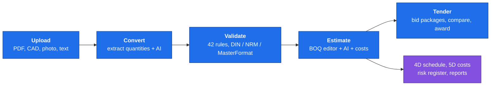
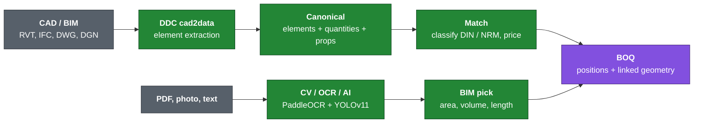
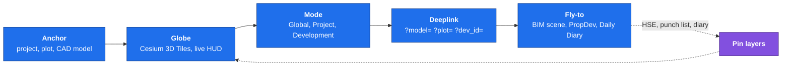
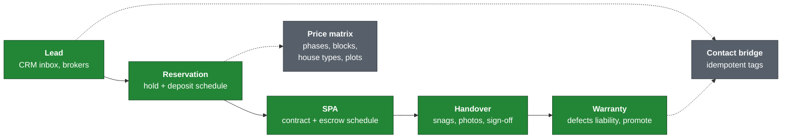
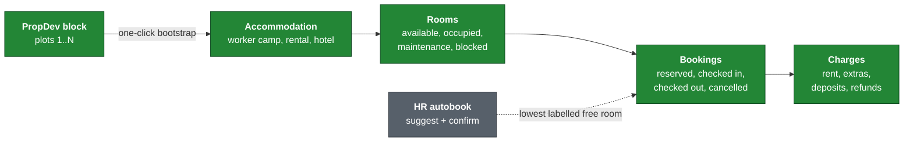
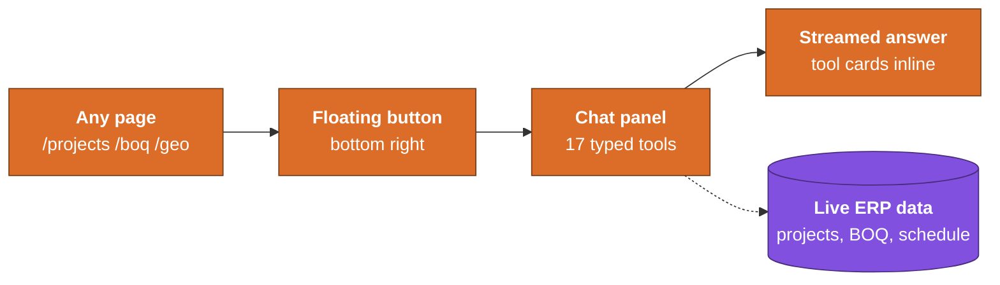
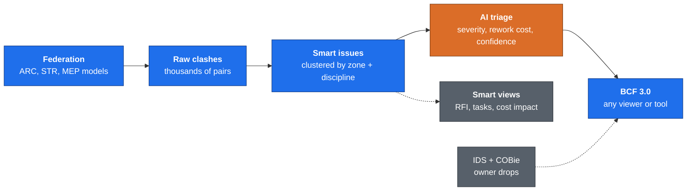
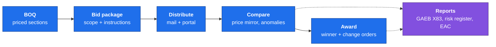

<div align="center">


# OpenConstructionERP

### A leading open-source workspace for construction project management

Professional BOQ, CAD and BIM takeoff, 4D scheduling, 5D cost model, and tendering - all in one self-hosted platform.

**Like WordPress for construction companies** - pick modules from the marketplace, drop in your own, or replace ours with custom-built ones. Same plug-and-play model, but for BOQ, scheduling, cost control, BIM, and tendering.

**A platform companies build any construction app on.** Use OpenConstructionERP as the base to assemble the exact software a project needs and to build your own modules on top, from estimating and BIM to scheduling and site delivery. One open, powerful foundation for anything you run in construction.

[▶ Watch the 12-min walkthrough](https://www.youtube.com/watch?v=X06cIaroAeI) · [Demo](https://openconstructionerp.com) · [Documentation](https://openconstructionerp.com/docs) · [Discussions](https://t.me/datadrivenconstruction) · [Report Bug](https://github.com/datadrivenconstruction/OpenConstructionERP/issues)

<!-- Each badge row is one source line on purpose. A newline between two badges
     renders as a line break here, which stacks them into a single column. -->
[](LICENSE) [](https://github.com/datadrivenconstruction/OpenConstructionERP/releases/latest) [](https://pypi.org/project/openconstructionerp/) [)](https://pepy.tech/project/openconstructionerp) [](https://github.com/datadrivenconstruction/OpenConstructionERP/stargazers) [](https://github.com/datadrivenconstruction/OpenConstructionERP/commits/main)
  [](https://securityscorecards.dev/viewer/?uri=github.com/datadrivenconstruction/OpenConstructionERP) [](https://github.com/datadrivenconstruction/OpenConstructionERP/actions/workflows/codeql.yml) [](SECURITY.md)


<video src="https://github.com/user-attachments/assets/20b9b585-93ac-4829-a3dc-0ede9ca9e2fc" controls width="800" playsinline>
  <a href="https://github.com/datadrivenconstruction/OpenConstructionERP/releases/download/v2.0.0/oce_full_demo.mp4">▶ 1-minute teaser (your browser can't inline this - click for full 12-min walkthrough)</a>
</video>

<sub><picture><source media="(prefers-color-scheme: dark)" srcset="docs/readme-icons/device-camera-video-dark.svg"></picture> <b>1-minute teaser above</b> · for the full 12-minute walkthrough → <a href="https://www.youtube.com/watch?v=X06cIaroAeI"><b>watch on YouTube</b></a> · onboarding → BoQ → BIM → DWG → PDF → AI → dashboard</sub>

<br/><br/>

### Download the free desktop app

<sub>No Python, no Docker, nothing to set up. Pick your system and run it.</sub>

<a href="https://github.com/datadrivenconstruction/OpenConstructionERP/releases/latest"></a> &nbsp;&nbsp; <a href="https://github.com/datadrivenconstruction/OpenConstructionERP/releases/latest"></a> &nbsp;&nbsp; <a href="https://github.com/datadrivenconstruction/OpenConstructionERP/releases/latest"></a>

<sub>Not sure which file? <a href="https://openconstructionerp.com/download"><b>openconstructionerp.com/download</b></a> picks the right one for you automatically. Prefer the terminal? <code>pip install openconstructionerp</code> or Docker, see <a href="#quick-start">Quick Start</a> below.</sub>

<br/>

<table>
<tr>
<td align="center" width="16.66%"><b>120K+</b><br/><sub>cost&nbsp;items</sub></td>
<td align="center" width="16.66%"><b>29</b><br/><sub>languages</sub></td>
<td align="center" width="16.66%"><b>47</b><br/><sub>countries</sub></td>
<td align="center" width="16.66%"><b>6</b><br/><sub>CAD&nbsp;formats</sub></td>
<td align="center" width="16.66%"><b>180</b><br/><sub>modules</sub></td>
<td align="center" width="16.66%"><b>28</b><br/><sub>sections</sub></td>
</tr>
</table>

</div>

---

<details open>
<summary><h2>Table of Contents</h2></summary>

<table width="100%">
<colgroup>
<col width="33%" />
<col width="34%" />
<col width="33%" />
</colgroup>
<tr>
<td valign="top">

<picture><source media="(prefers-color-scheme: dark)" srcset="docs/readme-icons/rocket-dark.svg"></picture> **Get Started**
- [Why OpenConstructionERP?](#why-openconstructionerp)
- [See It In Action](#see-it-in-action)
- [Quick Start](#quick-start)
- [Demo Accounts](#demo-accounts)

</td>
<td valign="top">

<picture><source media="(prefers-color-scheme: dark)" srcset="docs/readme-icons/credit-card-dark.svg"></picture> **Estimating & Costs**
- [Bill of Quantities](#-bill-of-quantities-boq-management)
- [Cost Databases & Catalog](#%EF%B8%8F-cost-databases--resource-catalog)
- [CAD/BIM Takeoff & AI](#%EF%B8%8F-cadbim-takeoff--ai-estimation)

</td>
<td valign="top">

<picture><source media="(prefers-color-scheme: dark)" srcset="docs/readme-icons/project-dark.svg"></picture> **Project Lifecycle**
- [4D Scheduling & 5D Cost](#-4d-scheduling--5d-cost-model)
- [Tendering, Risk & Reports](#-tendering-risk--reporting)
- [Requirements & Quality](#-requirements--quality-gates)
- [Property Development](#-property-development)

</td>
</tr>
<tr>
<td valign="top">

<picture><source media="(prefers-color-scheme: dark)" srcset="docs/readme-icons/globe-dark.svg"></picture> **Visualization & Coordination**
- [Geo Hub (3D Globe)](#-geo-hub-3d-globe)
- [Coordination Hub & Clash AI](#-coordination-hub--clash-ai)
- [PDF Markups & Annotations](#%EF%B8%8F-pdf-markups--annotations)

</td>
<td valign="top">

<picture><source media="(prefers-color-scheme: dark)" srcset="docs/readme-icons/shield-check-dark.svg"></picture> **Field & Quality**
- [Daily Diary & HSE](#-daily-diary--hse)
- [Punch List](#-punch-list)
- [Validation Engine](#%EF%B8%8F-validation--compliance-engine)

</td>
<td valign="top">

<picture><source media="(prefers-color-scheme: dark)" srcset="docs/readme-icons/gear-dark.svg"></picture> **Setup & Standards**
- [30+ Regional Standards](#-30-regional-standards)
- [Guided Onboarding](#-guided-onboarding)
- [All Key Features](#key-features)

</td>
</tr>
<tr>
<td valign="top">

<picture><source media="(prefers-color-scheme: dark)" srcset="docs/readme-icons/code-dark.svg"></picture> **Technical**
- [Tech Stack](#tech-stack)
- [Architecture](#architecture)
- [Security](#security)

</td>
<td valign="top">

<picture><source media="(prefers-color-scheme: dark)" srcset="docs/readme-icons/people-dark.svg"></picture> **Community**
- [Contributors](#contributors)
- [Support the Project](#support-the-project)
- [AI Disclaimer](#ai-disclaimer)
- [Trademarks](#trademarks)

</td>
<td valign="top">

<picture><source media="(prefers-color-scheme: dark)" srcset="docs/readme-icons/law-dark.svg"></picture> **Legal & Privacy**
- [Export Control](#export-control)
- [License](#license)
- [Privacy and Terms](#privacy-and-terms)

</td>
</tr>
</table>

</details>

---

⭐ <b>If you want to see new updates and database versions and if you find our tools useful please give our repositories a star to see more similar applications for the construction industry.</b>
Star OpenConstructionERP on GitHub and be instantly notified of new releases.
<p align="center">
  <br>
  
  <br></br>
</p>

---

## Why OpenConstructionERP?

Construction cost estimation software is expensive, closed-source, and locked to specific regions. OpenConstructionERP changes that.

| What you get | How it works |
|-------------|-------------|
| **Free forever** | AGPL-3.0 license. No subscriptions, no per-seat fees, no vendor lock-in. |
| **Your data, your server** | Self-hosted. Everything runs on your machine - nothing leaves your network. |
| **29 languages** | Full UI translation: English, German, French, Spanish, Portuguese, Russian, Chinese, Arabic, Hindi, Japanese, Korean, and 18 more. |
| **30+ regional standards** | DIN 276, NRM 1/2, CSI MasterFormat, GAEB, ГЭСН, DPGF, GB/T 50500, CPWD, ÖNORM, Birim Fiyat, Sekisan, SINAPI, and more. |
| **AI-powered** | Connect any LLM provider (Anthropic, OpenAI, Gemini, Mistral, Groq, DeepSeek) for smart estimation. |
| **120,000+ cost items** | Nine cost bases - global CWICR (repriced across 30 markets) plus eight national bases (China, Turkey, Brazil, Spain, Italy, Greece, Vietnam, Indonesia). |

### The whole platform in your language

The entire UI ships in **29 languages**, including full right-to-left support for Arabic. Switch language from any screen and every label, message and report follows.

<p align="center">
🇬🇧 English &nbsp;·&nbsp; 🇩🇪 Deutsch &nbsp;·&nbsp; 🇫🇷 Français &nbsp;·&nbsp; 🇪🇸 Español &nbsp;·&nbsp; 🇲🇽 Español (México) &nbsp;·&nbsp; 🇧🇷 Português &nbsp;·&nbsp; 🇷🇺 Русский &nbsp;·&nbsp; 🇨🇳 简体中文 &nbsp;·&nbsp; 🇸🇦 العربية &nbsp;·&nbsp; 🇮🇳 हिन्दी &nbsp;·&nbsp; 🇹🇷 Türkçe &nbsp;·&nbsp; 🇮🇹 Italiano &nbsp;·&nbsp; 🇳🇱 Nederlands &nbsp;·&nbsp; 🇵🇱 Polski &nbsp;·&nbsp; 🇨🇿 Čeština &nbsp;·&nbsp; 🇯🇵 日本語 &nbsp;·&nbsp; 🇰🇷 한국어 &nbsp;·&nbsp; 🇸🇪 Svenska &nbsp;·&nbsp; 🇳🇴 Norsk &nbsp;·&nbsp; 🇩🇰 Dansk &nbsp;·&nbsp; 🇫🇮 Suomi &nbsp;·&nbsp; 🇧🇬 Български &nbsp;·&nbsp; 🇭🇷 Hrvatski &nbsp;·&nbsp; 🇮🇩 Bahasa Indonesia &nbsp;·&nbsp; 🇷🇴 Română &nbsp;·&nbsp; 🇹🇭 ไทย &nbsp;·&nbsp; 🇻🇳 Tiếng Việt &nbsp;·&nbsp; 🇲🇳 Монгол &nbsp;·&nbsp; 🇰🇬 Кыргызча
</p>

### How It Compares

<table width="100%">
<colgroup>
<col width="26%" />
<col width="20%" />
<col width="14%" />
<col width="13%" />
<col width="14%" />
<col width="13%" />
</colgroup>
<thead>
<tr>
<th align="left">Capability</th>
<th align="center">OpenConstructionERP</th>
<th align="center">Enterprise<br/>BIM</th>
<th align="center">CAD<br/>Takeoff</th>
<th align="center">Legacy<br/>Estimating</th>
<th align="center">PDF<br/>Markup</th>
</tr>
</thead>
<tbody>
<tr><td><b>License</b></td><td align="center">AGPL-3.0 (free)</td><td align="center">Proprietary</td><td align="center">Proprietary</td><td align="center">Proprietary</td><td align="center">Proprietary</td></tr>
<tr><td><b>Self-hosted / offline</b></td><td align="center">&#10004;</td><td align="center">&#10006;</td><td align="center">&#10006;</td><td align="center">&#9888; partial</td><td align="center">&#10006;</td></tr>
<tr><td><b>Price</b></td><td align="center"><b>Free forever</b></td><td align="center">~&#8364;500/mo</td><td align="center">~&#8364;300/mo</td><td align="center">~&#8364;200/mo</td><td align="center">~&#8364;30/mo</td></tr>
<tr><td><b>AI estimation</b></td><td align="center">&#10004; 7 LLM providers</td><td align="center">&#10006;</td><td align="center">&#10006;</td><td align="center">&#10006;</td><td align="center">&#10006;</td></tr>
<tr><td><b>UI languages</b></td><td align="center"><b>29</b></td><td align="center">5</td><td align="center">3</td><td align="center">2</td><td align="center">8</td></tr>
<tr><td><b>Regional standards</b></td><td align="center"><b>30+</b></td><td align="center">4</td><td align="center">3</td><td align="center">2</td><td align="center">-</td></tr>
<tr><td><b>BOQ editor</b></td><td align="center">&#10004;</td><td align="center">&#10004;</td><td align="center">&#10004;</td><td align="center">&#10004;</td><td align="center">&#10006;</td></tr>
<tr><td><b>CAD/BIM takeoff</b></td><td align="center">&#10004; RVT IFC DWG DGN</td><td align="center">&#10004;</td><td align="center">&#10004;</td><td align="center">&#10006;</td><td align="center">PDF only</td></tr>
<tr><td><b>4D/5D planning</b></td><td align="center">&#10004;</td><td align="center">&#10004;</td><td align="center">&#10006;</td><td align="center">&#10006;</td><td align="center">&#10006;</td></tr>
<tr><td><b>Cost database included</b></td><td align="center">&#10004; 120K+ rates</td><td align="center">&#10006; extra</td><td align="center">&#10006; extra</td><td align="center">&#10006; extra</td><td align="center">&#10006;</td></tr>
<tr><td><b>Resource catalog</b></td><td align="center">&#10004; 7K+ priced</td><td align="center">&#10006; extra</td><td align="center">&#10006;</td><td align="center">&#10006;</td><td align="center">&#10006;</td></tr>
<tr><td><b>Validation engine</b></td><td align="center">&#10004; 42 rules</td><td align="center">&#9888; limited</td><td align="center">&#10006;</td><td align="center">&#10006;</td><td align="center">&#10006;</td></tr>
<tr><td><b>REST API</b></td><td align="center">&#10004; full</td><td align="center">&#9888; limited</td><td align="center">&#10006;</td><td align="center">&#10006;</td><td align="center">&#10006;</td></tr>
<tr><td><b>Real-time collab</b></td><td align="center">&#10004; soft locks</td><td align="center">&#10004;</td><td align="center">&#10006;</td><td align="center">&#10006;</td><td align="center">&#10006;</td></tr>
<tr><td><b>Open data export</b></td><td align="center">&#10004; GAEB · XLSX · JSON</td><td align="center">&#9888; limited</td><td align="center">&#9888; limited</td><td align="center">&#9888; limited</td><td align="center">PDF only</td></tr>
<tr><td><b>IDS / COBie requirements</b></td><td align="center">&#10004; import + export</td><td align="center">&#10006;</td><td align="center">&#10006;</td><td align="center">&#10006;</td><td align="center">&#10006;</td></tr>
<tr><td><b>Property dev lifecycle</b></td><td align="center">&#10004; Lead → SPA → Handover</td><td align="center">&#10006;</td><td align="center">&#10006;</td><td align="center">&#10006;</td><td align="center">&#10006;</td></tr>
<tr><td><b>3D globe / geo-anchor</b></td><td align="center">&#10004; Cesium 3D Tiles</td><td align="center">&#9888; map only</td><td align="center">&#10006;</td><td align="center">&#10006;</td><td align="center">&#10006;</td></tr>
</tbody>
</table>

<sub>Comparison reflects typical category capabilities based on publicly available information as of Q1 2026. Pricing is approximate (per-seat, list price) and varies by vendor and region. OpenConstructionERP is an independent open-source project and is not affiliated with any commercial vendor in the categories above.</sub>

---

## See It In Action

Each block below is a short GIF cut from the full walkthrough above - same order as the video, so you can jump to whichever workflow matters most. Prefer one continuous video? **[▶ Watch the 12-minute walkthrough on YouTube](https://www.youtube.com/watch?v=X06cIaroAeI)**.

<table>
<tr>
<td align="center" width="50%">
<strong><picture><source media="(prefers-color-scheme: dark)" srcset="docs/readme-icons/person-dark.svg"></picture> 1 · Role-Based Onboarding</strong><br/>
<em>Sign in as Admin / Estimator / Manager - the wizard pre-selects the right 17 of 180 modules for your role</em><br/><br/>

</td>
<td align="center" width="50%">
<strong><picture><source media="(prefers-color-scheme: dark)" srcset="docs/readme-icons/globe-dark.svg"></picture> 2 · New Project, Any Region</strong><br/>
<em>Pick currency, classification standard, regional factor - live map & weather come along for free</em><br/><br/>

</td>
</tr>
<tr>
<td align="center">
<strong><picture><source media="(prefers-color-scheme: dark)" srcset="docs/readme-icons/zap-dark.svg"></picture> 3 · Build the Bill of Quantities</strong><br/>
<em>Keyboard-first editor, 120K+ priced items, AI cost finder & Smart AI - quality score updates live</em><br/><br/>

</td>
<td align="center">
<strong><picture><source media="(prefers-color-scheme: dark)" srcset="docs/readme-icons/tools-dark.svg"></picture> 4 · BIM → BOQ Bulk Link</strong><br/>
<em>Link 100 BIM walls → one BOQ line with aggregated area / volume / length - no IfcOpenShell</em><br/><br/>

</td>
</tr>
<tr>
<td align="center">
<strong><picture><source media="(prefers-color-scheme: dark)" srcset="docs/readme-icons/workflow-dark.svg"></picture> 5 · DWG Drawings & Layers</strong><br/>
<em>636 wall entities across 10 DWG layers - every one linkable to the BOQ, measured in place</em><br/><br/>

</td>
<td align="center">
<strong><picture><source media="(prefers-color-scheme: dark)" srcset="docs/readme-icons/pencil-dark.svg"></picture> 6 · PDF Takeoff</strong><br/>
<em>Drop a floorplan, measure distance / area / count, push the numbers straight into the BOQ</em><br/><br/>

</td>
</tr>
<tr>
<td align="center">
<strong><picture><source media="(prefers-color-scheme: dark)" srcset="docs/readme-icons/credit-card-dark.svg"></picture> 7 · Complete Estimate - $6.26M</strong><br/>
<em>Real BIM project → 215 positions, 88 sections, CWICR-priced, quality score 99</em><br/><br/>

</td>
<td align="center">
<strong><picture><source media="(prefers-color-scheme: dark)" srcset="docs/readme-icons/check-circle-fill-dark.svg"></picture> 8 · Every Module - BIM-Linked Tasks</strong><br/>
<em>Issues tied to exact model elements, tracked on a Kanban board alongside schedule, docs & requirements</em><br/><br/>

</td>
</tr>
<tr>
<td align="center">
<strong><picture><source media="(prefers-color-scheme: dark)" srcset="docs/readme-icons/graph-dark.svg"></picture> 9 · Data Explorer - Pivot → BOQ</strong><br/>
<em>CAD-BIM Explorer pivot becomes 10 BOQ positions in one click - charts, data bars & drill-down included</em><br/><br/>

</td>
<td align="center">
<strong><picture><source media="(prefers-color-scheme: dark)" srcset="docs/readme-icons/device-camera-dark.svg"></picture> 10 · AI Estimate from a Photo</strong><br/>
<em>Upload a construction photo → GPT-4o + YOLO return a scoped BOQ in seconds, confidence-scored</em><br/><br/>

</td>
</tr>
<tr>
<td align="center">
<strong><picture><source media="(prefers-color-scheme: dark)" srcset="docs/readme-icons/globe-dark.svg"></picture> 11 · Global Portfolio Dashboard</strong><br/>
<em>7 projects, 4 continents, $28.3M in active estimates - one workspace, one map</em><br/><br/>

</td>
<td align="center">
<strong><picture><source media="(prefers-color-scheme: dark)" srcset="docs/readme-icons/search-dark.svg"></picture> Bonus · Instant Search</strong><br/>
<em>Find any of 120K+ cost items across 9 cost bases by keyword, unit or classification</em><br/><br/>

</td>
</tr>
</table>

---

## A Look Inside

A quick tour of the main workspaces. Every screen is the real application running the seven-country demo that ships with a fresh install.

<table>
<tr>
<td align="center" width="50%">
<strong>Portfolio Dashboard</strong><br/>
<em>Every project on one live map, with multi-currency totals that are grouped by currency, never blended.</em><br/><br/>

</td>
<td align="center" width="50%">
<strong>Projects</strong><br/>
<em>Localized projects worldwide. Each card carries its site map, BIM / DWG / PDF badges and live value.</em><br/><br/>

</td>
</tr>
<tr>
<td align="center">
<strong>BOQ Editor</strong><br/>
<em>Keyboard-first bill of quantities with sections, assemblies, a live quality score and grand total.</em><br/><br/>

</td>
<td align="center">
<strong>Cost Database</strong><br/>
<em>120,000+ priced items across 9 cost bases, bilingual, searchable by code, unit or class.</em><br/><br/>

</td>
</tr>
<tr>
<td align="center">
<strong>3D BIM Viewer</strong><br/>
<em>Federated models in the browser with a category and storey breakdown. Converted through DDC, no IfcOpenShell.</em><br/><br/>

</td>
<td align="center">
<strong>Clash Detection</strong><br/>
<em>Geometric coordination across federated models, with a clash matrix and BCF export.</em><br/><br/>

</td>
</tr>
<tr>
<td align="center">
<strong>PDF Takeoff</strong><br/>
<em>Drop a drawing, let AI extract the quantities, then push them straight into the BOQ.</em><br/><br/>

</td>
<td align="center">
<strong>AI Estimate</strong><br/>
<em>Turn text, a photo, a PDF or a spreadsheet into a scoped BOQ in seconds, with confidence scores.</em><br/><br/>

</td>
</tr>
<tr>
<td align="center">
<strong>Validation</strong><br/>
<em>Built-in DIN 276, NRM and MasterFormat rules score every BOQ with a traffic-light report.</em><br/><br/>

</td>
<td align="center">
<strong>Cross-Project Analytics</strong><br/>
<em>Portfolio KPIs grouped by currency: budget, actuals and variance, project by project.</em><br/><br/>

</td>
</tr>
<tr>
<td align="center" colspan="2">
<strong>Finance &amp; Earned Value</strong><br/>
<em>Budgets, invoices, payments and earned value tracked against the estimate.</em><br/><br/>

</td>
</tr>
</table>

---

## Key Features

### <picture><source media="(prefers-color-scheme: dark)" srcset="docs/readme-icons/graph-dark.svg"></picture> Bill of Quantities (BOQ) Management


Build professional cost estimates with a powerful BOQ editor. The full lifecycle - from first sketch to final tender submission:



- **Hierarchical BOQ structure** - Sections, positions, sub-positions with drag-and-drop reordering
- **Inline editing** - Click any cell to edit. Tab between fields. Undo/redo with Ctrl+Z
- **Resources & assemblies** - Link labor, materials, equipment to each position. Build reusable cost recipes
- **Markups** - Overhead, profit, VAT, contingency - configure per project or use regional defaults
- **Automatic calculations** - Quantity × unit rate = total. Section subtotals. Grand total with markups
- **Validation** - 42 built-in rules check for missing quantities, zero prices, duplicate items, and compliance with DIN 276, NRM, MasterFormat
- **Export** - Download as Excel, CSV, PDF report, or GAEB XML (X83)

### <picture><source media="(prefers-color-scheme: dark)" srcset="docs/readme-icons/database-dark.svg"></picture> Cost Databases & Resource Catalog


Access the world's construction pricing data:

- **Cost bases** - 120,000+ cost items across 9 bases: the global CWICR database (55,000+ items covering all major construction trades, repriced across 30 regional markets) plus 8 national bases built on each country's own norm system (China, Turkey, Brazil, Spain, Italy, Greece, Vietnam, Indonesia)
- **Smart search** - Find items by description, code, or classification. AI-powered semantic search matches meaning, not just keywords ("concrete wall" finds "reinforced partition C30/37")
- **Resource catalog** - 7,000+ materials, equipment, labor rates, and operators. Build custom assemblies from catalog items
- **Regional pricing** - Automatic price adjustment based on project location. Compare rates across regions
- **Import your data** - Upload your own cost database from Excel, CSV, or connect via API

### <picture><source media="(prefers-color-scheme: dark)" srcset="docs/readme-icons/tools-dark.svg"></picture> CAD/BIM Takeoff & AI Estimation


Extract quantities from any source - drawings, models, text, or photos:




- **CAD/BIM takeoff** - Upload RVT, IFC, DWG, or DGN files. DDC converters extract elements with volumes, areas, and lengths automatically
- **Interactive QTO** - Choose how to group extracted data: by Category, Type, Level, Family. Format-specific presets for RVT and IFC
- **Linked geometry preview** - Click the BIM link badge on any BOQ position to see a 3D preview of linked elements with interactive rotate/zoom/pan controls
- **BIM Quantity Picker** - Select quantities (area, volume, length) directly from linked BIM elements and apply them to BOQ positions. The source parameter name is shown next to the unit
- **DWG polyline measurement** - Click any polyline in the DWG viewer to instantly see area, perimeter, and individual segment lengths with on-canvas labels
- **PDF measurement** - Open construction drawings directly in the browser. Measure distances, areas, and count elements with calibrated scale
- **AI estimation** - Describe your project in plain text, upload a building photo, or paste a PDF - AI generates a complete BOQ with quantities and market rates
- **AI Cost Advisor** - Ask questions about pricing, materials, or estimation methodology. AI answers using your cost database as context
- **Cost matching** - After AI generates an estimate, match each item against your CWICR database to replace AI-guessed rates with real market prices

### <picture><source media="(prefers-color-scheme: dark)" srcset="docs/readme-icons/globe-dark.svg"></picture> Geo Hub (3D Globe)


Anchor every project on a real spherical earth - Cesium 3D Tiles 1.1 with live HUD and pin layers:




- **Three-mode picker** - Global (planet-wide portfolio), Project (job-site scale), Development (plot-level masterplan)
- **Live HUD** - Cursor latitude / longitude, terrain altitude, dynamic scale bar, north arrow
- **Anchored Projects rail** - Floating collapsible overlay showing every geo-anchored project, click to fly-to
- **Deeplinks** - `?model=`, `?plot=`, `?dev_id=`, `?phase=`, `?block=` survive page reloads and shareable URLs
- **Pin layers** - HSE incidents, Punchlist items, Daily Diary entries plotted on the globe with category icons
- **"View on map" CTAs** - One click from BIM viewer, PropDev plot, Daily Diary entry, Project card → globe with that asset selected
- **DWG / PDF raster overlay** - Upload a site plan or floorplan, drag four corner pins onto the globe → the raster drapes over real terrain; polygon crop with vertex drag for cookie-cutter trimming
- **Canonical pipeline** - `POST /api/v1/geo-hub/from-canonical/{cad_import_id}` turns any DDC cad2data conversion into glTF 3D Tiles via pure-Python pygltflib (no commercial toolkit needed)

*Example: open a Berlin masterplan in Geo Hub, switch to Development mode, see all 12 plots colored by sale status, click one → reservation pipeline opens with that buyer pre-filtered.*

### <picture><source media="(prefers-color-scheme: dark)" srcset="docs/readme-icons/organization-dark.svg"></picture> Property Development

End-to-end real-estate developer workflow - from first lead to handover snags to warranty close-out:




- **Lead → Reservation → SPA → Handover → Warranty** - Full lifecycle FSM with auto-creation of ContractParty on SPA conversion, Payment Schedule state machine, idempotent stage transitions
- **Sub-entity tabs** - Phases · Blocks · Brokers · Price Matrix · Escrow - one screen for every dev operation, no page hops
- **House Type catalogue** - ISO 3166-1 picker covering 180+ countries plus Custom region; CountryCombobox + HouseTypeEditModal share the same backend taxonomy as catalog & costs
- **SnagsBlock per handover** - Photo upload, status (Open / Resolved / Disputed), one-click promote-to-warranty when a snag survives the defects-liability period
- **Contacts ↔ PropDev bridge** - Every Lead and Buyer is idempotently tagged as a Contact via `Contact.module_tags`, so CRM and PropDev stay in sync without duplicates
- **Price Matrix** - Per-phase × house-type × view-premium grid with currency-aware totals and bulk apply
- **Escrow** - Per-buyer payment schedule with milestone receipts and outstanding balance roll-up
- **Bootstrap to Accommodation** - One click on a development block creates a worker-camp / rental inventory in the [Accommodation](#-accommodation) module (1:1 plots → rooms, idempotent)

*Example: import a 240-unit residential masterplan, generate price matrix from house-type × view, push to globe, accept 18 reservations across 3 brokers, convert 11 to SPA, hand over 4, track 7 open snags in the warranty period - all in one app.*

### <picture><source media="(prefers-color-scheme: dark)" srcset="docs/readme-icons/home-dark.svg"></picture> Accommodation


One module for three lodging kinds - worker camps for site crews, rentals for staff, hotels for visiting consultants - with rooms, bookings and charges in a unified data model:



- **Three kinds, one module** - `worker_camp` · `rental` · `hotel`, with tab filter and per-kind capacity counters on every card
- **Rooms with status** - `available` · `occupied` · `maintenance` · `blocked`; 409 prevents booking into a blocked or maintenance room
- **Booking state machine** - `reserved → checked_in → checked_out` with `cancelled` from any non-final state; idempotent same-state updates; final states locked
- **Charges with Decimal precision** - Base rent, extras, deposits, refunds, all in the room's inherited currency (no hardcoded EUR)
- **PropDev bootstrap** - One click on a development block iterates its plots and creates rooms 1:1, idempotent (running twice creates nothing extra)
- **HR autobook (suggest-confirm)** - Pick an employee Contact → suggest the lowest-labelled available `worker_camp` room → human confirms with a real booking POST
- **BIM + Geo aware** - `bim_element_id` carries through from PropDev plots; cards with `geo_lat/geo_lon` get a "Geo" deeplink to the globe
- **IDOR-hardened** - Every helper returns 404 (never 403) on cross-tenant access; tested in `backend/tests/modules/accommodation/`

*Example: 240-plot worker camp on a remote site - bootstrap from the PropDev block, HR autobooks 187 crew members from the Contacts directory over three weeks, base-rent charges roll up to the project P&L automatically.*

### <picture><source media="(prefers-color-scheme: dark)" srcset="docs/readme-icons/comment-discussion-dark.svg"></picture> Floating Chat with the ERP Database


Bottom-right floating chat on every page - talks to the entire ERP database through 17 typed tools (projects, BOQ items, schedule, validation, risks, CWICR search, BIM elements, full semantic search):



- **Always-on** - Mounted in `AppLayout`, available on every route (Dashboard, BOQ, BIM, Geo, PropDev, Accommodation, all 180 modules)
- **Real ERP access** - Reads/writes through tools, not LLM guesswork: `get_all_projects`, `get_project_summary`, `get_boq_items`, `get_schedule`, `get_validation_results`, `get_risk_register`, `search_cwicr_database`, `get_cost_model`, `compare_projects`, `run_validation`, `create_boq_item`, `search_boq_positions`, `search_documents`, `search_tasks`, `search_risks`, `search_bim_elements`, `search_anything`
- **Streamed responses** - Tool-call cards (risk register table, BOQ summary, etc.) render inline as the model produces them
- **Provider-agnostic** - Anthropic / OpenAI / Gemini / Mistral / Groq / DeepSeek behind the same tool interface

### <picture><source media="(prefers-color-scheme: dark)" srcset="docs/readme-icons/heart-dark.svg"></picture> Coordination Hub & Clash AI


Multi-disciplinary BIM coordination with AI-assisted issue triage:




- **Coordination Hub** - Single dashboard fusing clashes, RFIs, submittals, action items per model federation
- **Smart Views v1** - Saved filters across the federation (e.g. "MEP-vs-STR clashes > 50mm in Level 03")
- **Clash Smart Issues** - Auto-group thousands of raw clash results into prioritized issue clusters by location + discipline pair
- **AI Triage** - LLM ranks new clashes by severity / rework cost / location criticality with confidence scores
- **Cost Impact rollup** - Per-issue rework estimate driven by your cost database, surfaced on the dashboard
- **BCF 3.0 / OpenCDE export** - Round-trip with any BCF-compatible tool via the open BIM standard
- **BIM Requirements** - IDS (Information Delivery Specification) and COBie import / export for owner-side data drops

### <picture><source media="(prefers-color-scheme: dark)" srcset="docs/readme-icons/calendar-dark.svg"></picture> 4D Scheduling & 5D Cost Model


Plan your project timeline and track costs over time:

- **Gantt chart** - Visual project schedule with drag-and-drop activities, dependencies (FS/FF/SS/SF), and critical path highlighting
- **Auto-generate from BOQ** - Create schedule activities directly from your BOQ sections with cost-proportional durations
- **Earned Value Management** - Track SPI, CPI, EAC, and variance. S-curve visualization shows planned vs actual progress
- **Budget tracking** - Set baselines, compare snapshots, run what-if scenarios
- **Monte Carlo simulation** - Risk-adjusted schedule analysis with probability distributions

### <picture><source media="(prefers-color-scheme: dark)" srcset="docs/readme-icons/paste-dark.svg"></picture> Tendering, Risk & Reporting

Complete your estimation workflow:




- **Tendering** - Create bid packages, distribute to subcontractors, collect and compare bids with side-by-side price mirror
- **Change orders** - Track scope changes with cost and schedule impact analysis
- **Risk register** - Probability × impact matrix, mitigation strategies, risk-adjusted contingency
- **Reports** - Generate professional PDF reports, Excel exports, GAEB XML. 12 built-in templates
- **Documents** - Centralized file management with version tracking and drag-and-drop upload

### <picture><source media="(prefers-color-scheme: dark)" srcset="docs/readme-icons/note-dark.svg"></picture> Requirements & Quality Gates

Track and validate construction requirements with the EAC (Entity-Attribute-Constraint) system:

- **EAC Triplets** - Capture requirements as structured data: Entity (wall), Attribute (fire_rating), Constraint (≥ F90)
- **4 Quality Gates** - Completeness → Consistency → Coverage → Compliance. Run sequentially to validate requirements
- **BOQ Traceability** - Link each requirement to BOQ positions for full traceability from spec to estimate
- **Bulk Import** - Import requirements from structured text (pipe-delimited format)
- **Categories** - Structural, fire safety, thermal, acoustic, waterproofing, electrical, mechanical, architectural

### <picture><source media="(prefers-color-scheme: dark)" srcset="docs/readme-icons/pencil-dark.svg"></picture> PDF Markups & Annotations


Annotate construction drawings and documents directly in the browser:

- **10 markup types** - Cloud, arrow, text, rectangle, highlight, polygon, distance, area, count, stamp
- **Custom stamps** - Approved, Rejected, For Review, Revised, Final + create your own with logo and date
- **Scale calibration** - Set real-world scale per page for accurate measurements
- **Markups List** - Table view of all annotations with filters, search, and CSV export
- **BOQ Integration** - Link measurements directly to BOQ positions (quantity = measured value)

### <picture><source media="(prefers-color-scheme: dark)" srcset="docs/readme-icons/check-circle-fill-dark.svg"></picture> Punch List


Track construction deficiencies from discovery to resolution:

- **5-stage workflow** - Open → In Progress → Resolved → Verified → Closed
- **Location pins** - Mark exact position on PDF drawings (x/y coordinates)
- **Priority levels** - Low, Medium, High, Critical with color coding
- **Photo attachments** - Upload photos of deficiencies from the field
- **Categories** - Structural, mechanical, electrical, architectural, fire safety, plumbing, finishing
- **PDF Export** - Generate punch list reports for stakeholder review
- **Verification control** - Different user must verify (not the resolver)

### <picture><source media="(prefers-color-scheme: dark)" srcset="docs/readme-icons/book-dark.svg"></picture> Daily Diary & HSE


Field-level reporting and safety tracking that holds up in court:

- **Daily Diary** - Weather-aware entries (auto-pulled from project geo-coordinates), crew on site, equipment used, deliveries, delays, photos
- **HSE Incidents** - Near-miss → first-aid → recordable → lost-time taxonomy with mandatory root-cause and corrective-action fields
- **OSHA-recordable flag** - Server-side default backing for compliant regulatory exports (300 / 300A / 301)
- **Photo capture with EXIF / GPS** - Field photos preserve location and timestamp metadata; magic-byte upload validation for defence-in-depth
- **Geo-anchored pins** - Daily Diary and HSE pins surface on the Geo Hub globe layer for portfolio-level safety dashboards

### <picture><source media="(prefers-color-scheme: dark)" srcset="docs/readme-icons/globe-dark.svg"></picture> 30+ Regional Standards

| Standard | Region | Format |
|----------|--------|--------|
| DIN 276 / ÖNORM / SIA | Germany / Austria / Switzerland | Excel, CSV |
| NRM 1/2 (RICS) | United Kingdom | Excel, CSV |
| CSI MasterFormat | United States / Canada | Excel, CSV |
| GAEB DA XML 3.3 | DACH region | XML |
| DPGF / DQE | France | Excel, CSV |
| ГЭСН / ФЕР | Russia / CIS | Excel, CSV |
| GB/T 50500 | China | Excel, CSV |
| CPWD / IS 1200 | India | Excel, CSV |
| Bayındırlık Birim Fiyat | Turkey | Excel, CSV |
| 積算基準 (Sekisan) | Japan | Excel, CSV |
| Computo Metrico / DEI | Italy | Excel, CSV |
| STABU / RAW | Netherlands | Excel, CSV |
| KNR / KNNR | Poland | Excel, CSV |
| 표준품셈 | South Korea | Excel, CSV |
| NS 3420 / AMA | Nordic countries | Excel, CSV |
| ÚRS / TSKP | Czech Republic / Slovakia | Excel, CSV |
| ACMM / ANZSMM | Australia / New Zealand | Excel, CSV |
| CSI / CIQS | Canada | Excel, CSV |
| FIDIC | UAE / GCC | Excel, CSV |
| PBC / Base de Precios | Spain | Excel, CSV |

### <picture><source media="(prefers-color-scheme: dark)" srcset="docs/readme-icons/shield-dark.svg"></picture> Validation & Compliance Engine


Ensure your estimates meet regulatory standards before submission:

- **42 built-in rules** across 13 rule sets - DIN 276, NRM, MasterFormat, GAEB, and universal BOQ quality checks
- **Real-time validation** - Run checks with Ctrl+Shift+V. Each position gets a pass/warning/error indicator
- **Quality score** - Overall BOQ quality percentage (0-100%) visible in the toolbar
- **Drill-down** - Click any finding to jump directly to the affected BOQ position and fix it
- **Custom rules** - Define project-specific validation rules via the rule builder or Python scripting

### <picture><source media="(prefers-color-scheme: dark)" srcset="docs/readme-icons/rocket-dark.svg"></picture> Guided Onboarding

Get productive in under 10 minutes:

1. **Choose language** - Select from 29 languages. The entire UI switches instantly
2. **Select region** - Determines default cost database, currency, and classification standard
3. **Load cost database** - One-click import of CWICR pricing data for your region (55,000+ items)
4. **Import resource catalog** - Materials, labor, equipment, and pre-built assemblies
5. **Configure AI** *(optional)* - Enter an API key from any supported LLM provider
6. **Create your first project** - Set name, region, standard, and start estimating

---

## Quick Start

> <picture><source media="(prefers-color-scheme: dark)" srcset="docs/readme-icons/eye-dark.svg"></picture> **Prefer to see it first?** [▶ Watch the 12-minute walkthrough on YouTube](https://www.youtube.com/watch?v=X06cIaroAeI) - onboarding → BoQ → BIM → DWG → PDF → AI → dashboard.

### Easiest: download the desktop app (no Python, no setup)

Download the installer for your operating system, run it, and OpenConstructionERP opens as a native desktop app. No Python, no pip, no Docker, and no database to set up. Everything runs locally on your machine.

- **[Download for your platform](https://openconstructionerp.com/download)** picks the right file for your OS automatically.
- Or grab one straight from the **[latest release](https://github.com/datadrivenconstruction/OpenConstructionERP/releases/latest)**: Windows `.exe` installer, macOS `.dmg`, or Linux `.deb` / `.AppImage`.

The first launch takes about a minute while it sets up your local database, then every launch after that is fast. Open source under AGPL-3.0.

> **Prefer the command line?** The options below (pip, Docker, source) need Python 3.12+. Check with `python --version`.

### pip install (full app, one command)

```bash
pip install --upgrade openconstructionerp
openconstructionerp
```

That's it. The single wheel ships the backend plus the pre-built React frontend. The first run sets up a local embedded PostgreSQL database (no Docker, no setup), loads the demo data, opens your browser at **http://localhost:8080**, and you sign in with `demo@openconstructionerp.com` / `DemoPass1234!`. No Node.js and no extra services. Every later run, just type `openconstructionerp` again. [PyPI package](https://pypi.org/project/openconstructionerp/).

If the `openconstructionerp` command is not found after install, run it through Python instead. This works on every operating system and never depends on PATH:

```bash
python -m openconstructionerp
```

#### "Command not found"? You do not need to touch PATH

If your terminal says `openconstructionerp: command not found` (macOS/Linux) or `'openconstructionerp' is not recognized` (Windows), the package installed fine. pip just put the launcher in a per-user scripts folder that is not on your PATH. You have three options, easiest first.

**1. Run it through Python (simplest, no setup).** This works from any folder, on every OS, and never depends on PATH. We recommend this:

```bash
python -m openconstructionerp
```

Every command works this way: `python -m openconstructionerp serve`, `python -m openconstructionerp doctor`, and so on.

**2. Let pipx handle PATH for you.** [pipx](https://pipx.pypa.io) installs the app in its own isolated environment and puts the `openconstructionerp` command on your PATH automatically:

```bash
python -m pip install --user pipx
python -m pipx ensurepath        # then close and reopen the terminal
pipx install openconstructionerp
openconstructionerp
```

**3. Add the scripts folder to PATH yourself,** if you want the short `openconstructionerp` command. Pick your platform:

<details>
<summary><b>Windows</b></summary>

First find the folder pip used (it is printed as a warning during install, usually `%APPDATA%\Python\Python3xx\Scripts`):

```powershell
python -m site --user-base
```

Add `\Scripts` to that path. Then either:

- **Permanent (recommended):** open the Start menu, search for "Edit environment variables for your account", edit the `Path` variable, and add the folder (for example `C:\Users\you\AppData\Roaming\Python\Python312\Scripts`). Open a new terminal and `openconstructionerp` works.
- **This session only:**
  ```powershell
  set PATH=%APPDATA%\Python\Python312\Scripts;%PATH%
  ```
  (replace `Python312` with your version).

</details>

<details>
<summary><b>macOS / Linux</b></summary>

pip installs user scripts to `~/.local/bin`. Add it to your PATH by appending one line to your shell profile (`~/.zshrc` on modern macOS, `~/.bashrc` on most Linux):

```bash
echo 'export PATH="$HOME/.local/bin:$PATH"' >> ~/.zshrc   # or ~/.bashrc
source ~/.zshrc                                            # or ~/.bashrc
openconstructionerp
```

</details>

> **Ubuntu / Debian users:** on Ubuntu 23.04+ (including Ubuntu 26) and Debian 12+, `pip install` into the system Python fails with `error: externally-managed-environment` (PEP 668). The simplest fix is pipx (above), which is built for exactly this. If you prefer a venv:
> ```bash
> sudo apt install -y python3.12 python3.12-venv
> python3.12 -m venv venv && source venv/bin/activate
> pip install --upgrade openconstructionerp
> ```
> Full Linux guide with system deps and troubleshooting: [docs/INSTALL_LINUX.md](docs/INSTALL_LINUX.md).

If something looks off, run `openconstructionerp doctor` (or `python -m openconstructionerp doctor`) for a per-check OK/WARN/ERROR report.

### Alternative 1: One-line installer (handles PATH for you)

```bash
# Linux / macOS
curl -fsSL https://raw.githubusercontent.com/datadrivenconstruction/OpenConstructionERP/main/scripts/install.sh | bash

# Windows (PowerShell)
irm https://raw.githubusercontent.com/datadrivenconstruction/OpenConstructionERP/main/scripts/install.ps1 | iex
```

If you would rather not think about PATH at all, use this. It picks Docker if installed, otherwise uv, otherwise a dedicated Python virtual environment, installs OpenConstructionERP there, puts the `openconstructionerp` command on your PATH automatically, and finishes with a short panel showing the URL, the demo login and how to start. It also offers to launch right away. Open a new terminal afterwards and `openconstructionerp` just works. Runs at **http://localhost:8080**.

### Alternative 2: Docker

Fastest, using the published image:

```bash
docker run -d -p 8080:8080 -v oe_data:/data ghcr.io/datadrivenconstruction/openconstructionerp:latest
```

Or build from source:

```bash
git clone https://github.com/datadrivenconstruction/OpenConstructionERP.git
cd OpenConstructionERP
make quickstart
```

Open **http://localhost:8080**. The published image starts in seconds; a from-source build takes ~2 minutes.

### Alternative 3: Local development (clone + npm + uvicorn)

```bash
git clone https://github.com/datadrivenconstruction/OpenConstructionERP.git
cd OpenConstructionERP

# Install dependencies
pip install -e ./backend[server]
cd frontend && npm install && cd ..

# Start (Linux/macOS)
make dev

# Start (Windows - two terminals)
# Terminal 1: cd backend && uvicorn app.main:create_app --factory --reload --port 8000
# Terminal 2: cd frontend && npm run dev
```

Open **http://localhost:5173** - for hacking on the codebase. Requires Python 3.12+ and Node.js 20+.

### Demo Accounts

Three demo accounts are created automatically on first start. Each
password is **generated per installation** (via `secrets.token_urlsafe`)
and printed to the backend startup log so you see it immediately, e.g.:

```
[seed] Demo user created: demo@openconstructionerp.com / xK7p_Q2nR8sT4uV6wX9yZ
[seed] Pre-set DEMO_USER_PASSWORD env to skip random generation
```

The same passwords are also persisted to
`~/.openestimator/.demo_credentials.json` (chmod 600) so you can recover
them later. To pin known passwords (e.g. for a team demo or CI), set the
env vars **before the first boot**:

- `DEMO_USER_PASSWORD` - admin (`demo@openconstructionerp.com`)
- `DEMO_ESTIMATOR_PASSWORD` - estimator (`estimator@openconstructionerp.com`)
- `DEMO_MANAGER_PASSWORD` - manager (`manager@openconstructionerp.com`)

| Account | Email | Password | Role |
|---------|-------|----------|------|
| Admin | `demo@openconstructionerp.com` | _see startup log or `.demo_credentials.json`_ | Full access |
| Estimator | `estimator@openconstructionerp.com` | _see startup log or `.demo_credentials.json`_ | Estimator |
| Manager | `manager@openconstructionerp.com` | _see startup log or `.demo_credentials.json`_ | Manager |

> On a local default install you can simply type `DemoPass1234!` on the sign-in form for any demo account. The built-in demo login accepts it, so the documented credential always works. The per-install random password above is the stored hash, kept for reference and for API tokens. This shortcut turns off whenever `SEED_DEMO=false`, which you should set for any internet-exposed deployment.

> Demo accounts include 5 pre-loaded projects from Berlin, London, New York, Paris, and Dubai with complete BOQs, schedules, and cost models.
>
> **Security note.** For any internet-exposed deployment, set the three
> `DEMO_*_PASSWORD` variables to strong, unique secrets, or disable demo
> accounts entirely with `DISABLE_DEMO_ACCOUNTS=1`. Do not reuse
> passwords from examples, screenshots, or earlier versions of this README.

---

## Tech Stack

| Layer | Technology | Purpose |
|-------|-----------|---------|
| Backend | Python 3.12+ / FastAPI | Async API, Pydantic v2 validation, modular architecture |
| Frontend | React 18 / TypeScript / Vite | SPA with code splitting, 29 language bundles |
| Database | PostgreSQL 16+ (only) | OLTP with JSON columns; an embedded PostgreSQL starts automatically for local dev, so there is no Docker, no separate database, and nothing to configure |
| UI | Tailwind CSS / AG Grid | Professional data grid, responsive design, dark mode |
| AI | Any LLM via REST API | Anthropic, OpenAI, Gemini, Mistral, Groq, DeepSeek |
| Vector Search | LanceDB (embedded) / Qdrant | Semantic cost item search, 384d or 3072d embeddings |
| CAD/BIM | [DDC cad2data](https://github.com/datadrivenconstruction) | RVT, IFC, DWG, DGN → structured quantities |
| i18n | i18next + 29 language packs | Full RTL support (Arabic), locale-aware formatting |

## Architecture

### How the platform turns raw CAD/BIM into structured ERP data


OpenConstructionERP is built around **seven cooperating pipelines** that turn closed CAD/BIM files (RVT, IFC, DWG, DGN, PLN, TSK) into structured, queryable ERP data - without locking you into a proprietary stack. Every module in the platform plugs into one or more of these stages:

1. **Mining** - collect existing project data (CAD/BIM models, CDE drops, COBie deliverables) into a semi-structured pool. Handled by `cad`, `documents`, `bim_hub`, `file_search` modules + the **DDC cad2data** converters (RVT/IFC/DWG/DGN/PLN → canonical JSON).
2. **QTO Check & Quantity Take-off rules** - apply rule sets per discipline / family / type to extract quantities deterministically. Handled by `takeoff`, `requirements`, `validation`, and the rule editor in `match-elements`.
3. **BlackBox (company standard)** - codify your firm's classifications, formulas, unit factors and assembly recipes as a single canonical rule book (COBie / CFIHOS / SQL / Excel / Access). Handled by `costs`, `assemblies`, `catalog`, `cost_intelligence`.
4. **New project modeling** - apply the BlackBox to a fresh model: geometry → filtering → grouping → verification → BOQ. Handled by `boq`, `projects`, `match-elements`, `clash`.
5. **BlackBox mapping** - map a new project's raw element list onto the canonical rule book via vector + lexical + rule-based matchers. Handled by `match-elements` (7-stage pipeline) + AI Estimate.
6. **Project-specific data (4D/5D/6D)** - derive scheduling, cost, hours, ordering and environmental footprint per group. Handled by `scheduling`, `advanced_schedule`, `5d_planner`, `risk`, `carbon`, `hse`.
7. **Saving data & Machine Learning** - persist project history into the database, data lake and ML models so each new project starts further ahead. Handled by `analytics`, `bi_dashboards`, `ai_chat`, `cost_intelligence`, and the rule-learning loop in `clash` (Wave A4) and `match-elements`.

The right-hand side of the diagram is the **automatic data retrieval** layer that every UI surface (Dashboard, BOQ editor, /clash, /match-elements, /files, /scheduling) consumes: dashboards, calculations, reports, tables, charts, geometries, and ERP-ready exports - all driven from the same canonical store. The Machine-Learning column on the far right is where the platform progressively automates classification, parameterisation, recognition and marking, replacing manual steps (<picture><source media="(prefers-color-scheme: dark)" srcset="docs/readme-icons/tools-dark.svg"></picture>) with automatic steps (<picture><source media="(prefers-color-scheme: dark)" srcset="docs/readme-icons/zap-dark.svg"></picture>) over time.

This pipeline is the reason OpenConstructionERP can replace several commercial point-solutions with a single self-hosted stack - every module reads from and writes to the same canonical data layer.

### Technical stack

```mermaid
flowchart TB
    UI["Frontend SPA<br>React 18, TypeScript, Vite<br>AG Grid, Tailwind, PDF.js"]

    subgraph Backend ["FastAPI Backend, 180 modules"]
        CORE["Core<br>Module loader, Event bus, Hooks, RBAC<br>Validation, FSM + audit log"]
```

<!-- opensource-radar:truncated -->
