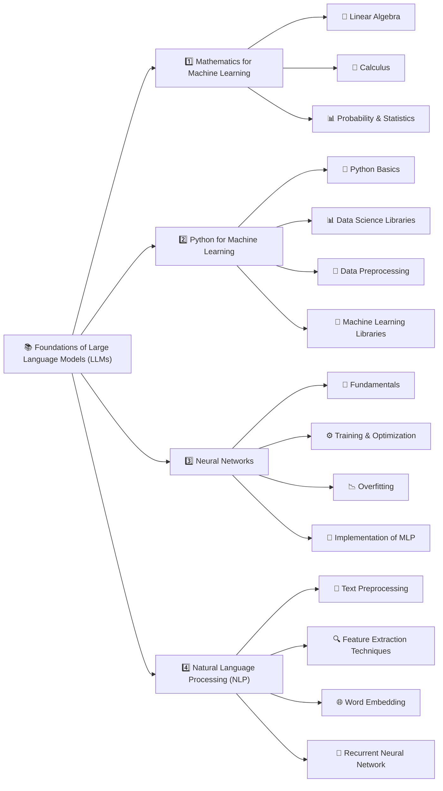
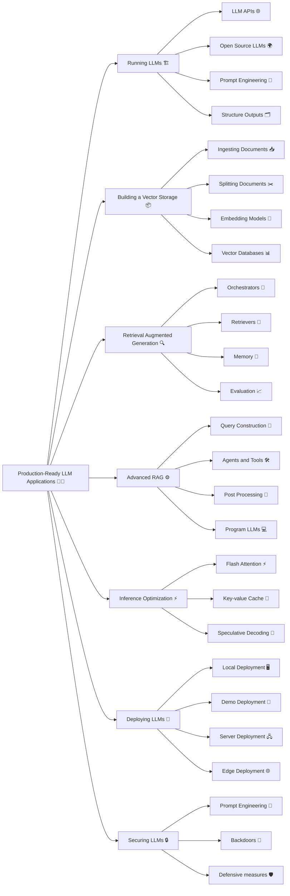

  <h1>🗣️ LLM PowerHouse</h1>
  

    

  
  
  
  
  

   
<em>Unleash LLMs' potential through curated tutorials, best practices, and ready-to-use code for custom training and inferencing.</em>

# Overview
Welcome to LLM-PowerHouse, your ultimate resource for unleashing the full potential of Large Language Models (LLMs) with custom training and inferencing. This GitHub repository is a comprehensive and curated guide designed to empower developers, researchers, and enthusiasts to harness the true capabilities of LLMs and build intelligent applications that push the boundaries of natural language understanding.

# Quick Navigation

## Start by goal
- 🧠 Learn fundamentals → [Foundations of LLMs](#foundations-of-llms)
- 🧪 Train & align models → [Unlock the Art of LLM Science](#unlock-the-art-of-llm-science)
- 🏭 Build production apps (RAG, deployment, security) → [Building Production-Ready LLM Applications](#building-production-ready-llm-applications)
- 📚 Browse all topic guides → [In-Depth Articles](#in-depth-articles)
- 💻 Jump to runnable examples → [Codebase Mastery: Building with Perfection](#codebase-mastery-building-with-perfection)
- 🗂️ Explore datasets quickly → [LLM Datasets](#llm-datasets)

## Repository map
- [Articles](./Articles)
- [Example codebase](./example_codebase)
- [Dataset](./dataset)
- [License](./LICENSE)

## Full Table of Contents
- [Foundations of LLMs](#foundations-of-llms)
- [Unlock the Art of LLM Science](#unlock-the-art-of-llm-science)
- [Building Production-Ready LLM Applications](#building-production-ready-llm-applications)
- [In-Depth Articles](#in-depth-articles)
    - [NLP](#nlp)
    - [Models](#models)
    - [Training](#training)
    - [Enhancing Model Compression: Inference and Training Optimization Strategies](#enhancing-model-compression-inference-and-training-optimization-strategies)
    - [Evaluation Metrics](#evaluation-metrics)
    - [Open LLMs](#open-llms)
    - [Resources for cost analysis and network visualization](#resources-for-cost-analysis-and-network-visualization)
- [Codebase Mastery: Building with Perfection](#codebase-mastery-building-with-perfection)
- [LLM PlayLab](#llm-playlab)
- [LLM Datasets](#llm-datasets)
- [LLM Alignment](#llm-alignment)
- [Data Generation](#data-generation)
- [What I am learning](#what-i-am-learning)
- [Contributing](#contributing)
- [License](#license)
- [About The Author](#about-the-author)

## Foundations of LLMs

This section offers fundamental insights into mathematics, Python, and neural networks. It may not be the ideal starting point, but you can consult it whenever necessary.

⬇️ Ready to Embrace Foundations of LLMs? ⬇️ 

### 1. Mathematics for Machine Learning

Before mastering machine learning, it's essential to grasp the fundamental mathematical concepts that underpin these algorithms.

| Concept                    | Description |
|----------------------------|-------------|
| **Linear Algebra**         | Crucial for understanding many algorithms, especially in deep learning. Key concepts include vectors, matrices, determinants, eigenvalues, eigenvectors, vector spaces, and linear transformations. |
| **Calculus**               | Important for optimizing continuous functions in many machine learning algorithms. Essential topics include derivatives, integrals, limits, series, multivariable calculus, and gradients. |
| **Probability and Statistics** | Vital for understanding how models learn from data and make predictions. Key concepts encompass probability theory, random variables, probability distributions, expectations, variance, covariance, correlation, hypothesis testing, confidence intervals, maximum likelihood estimation, and Bayesian inference. |

#### Further Exploration

| Reference | Description | Link |
| --- | --- | :---: |
| 3Blue1Brown - The Essence of Linear Algebra | Offers a series of videos providing geometric intuition to fundamental linear algebra concepts. | [🔗](https://www.youtube.com/watch?v=fNk_zzaMoSs&list=PLZHQObOWTQDPD3MizzM2xVFitgF8hE_ab) |
| StatQuest with Josh Starmer - Statistics Fundamentals | Provides clear and straightforward explanations for various statistical concepts through video tutorials. | [🔗](https://www.youtube.com/watch?v=qBigTkBLU6g&list=PLblh5JKOoLUK0FLuzwntyYI10UQFUhsY9) |
| AP Statistics Intuition by Ms Aerin | Curates a collection of Medium articles offering intuitive insights into different probability distributions. | [🔗](https://automata88.medium.com/list/cacc224d5e7d) |
| Immersive Linear Algebra | Presents an alternative visual approach to understanding linear algebra concepts. | [🔗](https://immersivemath.com/ila/learnmore.html) |
| Khan Academy - Linear Algebra | Tailored for beginners, this resource provides intuitive explanations for fundamental linear algebra topics. | [🔗](https://www.khanacademy.org/math/linear-algebra) |
| Khan Academy - Calculus | Delivers an interactive course covering the essentials of calculus comprehensively. | [🔗](https://www.khanacademy.org/math/calculus-1) |
| Khan Academy - Probability and Statistics | Offers easy-to-follow material for learning probability and statistics concepts. | [🔗](https://www.khanacademy.org/math/statistics-probability) |

### 2. Python for Machine Learning

| Concept | Description |
| --- | --- |
| **Python Basics** | Mastery of Python programming entails understanding its basic syntax, data types, error handling, and object-oriented programming principles. |
| **Data Science Libraries** | Familiarity with essential libraries such as NumPy for numerical operations, Pandas for data manipulation, and Matplotlib and Seaborn for data visualization is crucial for effective data analysis. |
| **Data Preprocessing** | This phase involves crucial tasks such as feature scaling, handling missing data, outlier detection, categorical data encoding, and data partitioning into training, validation, and test sets to ensure data quality and model performance. |
| **Machine Learning Libraries** | Proficiency with Scikit-learn, a comprehensive library for machine learning, is indispensable. Understanding and implementing algorithms like linear regression, logistic regression, decision trees, random forests, k-nearest neighbors (K-NN), and K-means clustering are essential for building predictive models. Additionally, familiarity with dimensionality reduction techniques like PCA and t-SNE aids in visualizing complex data structures effectively. |

#### Further Exploration

| Reference | Description | Link |
| --- | --- | :---: |
| Real Python | A comprehensive resource offering articles and tutorials for both beginner and advanced Python concepts. | [🔗](https://realpython.com/) |
| freeCodeCamp - Learn Python | A lengthy video providing a thorough introduction to all core Python concepts. | [🔗](https://www.youtube.com/watch?v=rfscVS0vtbw) |
| Python Data Science Handbook | A free digital book that is an excellent resource for learning pandas, NumPy, Matplotlib, and Seaborn. | [🔗](https://jakevdp.github.io/PythonDataScienceHandbook/) |
| freeCodeCamp - Machine Learning for Everybody | A practical introduction to various machine learning algorithms for beginners. | [🔗](https://www.youtube.com/watch?v=i_LwzRVP7bg) |
| Udacity - Intro to Machine Learning | An introductory course on machine learning for beginners, covering fundamental algorithms. | [🔗](https://www.udacity.com/course/intro-to-machine-learning--ud120) |

### 3. Neural Networks

| Concept                    | Description |
|----------------------------|-------------|
| Fundamentals | Understand the basic structure of a neural network, including layers, weights, biases, and activation functions like sigmoid, tanh, and ReLU. |
| Training and Optimization | Learn about backpropagation and various loss functions such as Mean Squared Error (MSE) and Cross-Entropy. Become familiar with optimization algorithms like Gradient Descent, Stochastic Gradient Descent, RMSprop, and Adam. |
| Overfitting | Grasp the concept of overfitting, where a model performs well on training data but poorly on unseen data, and explore regularization techniques like dropout, L1/L2 regularization, early stopping, and data augmentation to mitigate it. |
| Implement a Multilayer Perceptron (MLP) | Build a Multilayer Perceptron (MLP), also known as a fully connected network, using PyTorch. |

#### Further Exploration

| Reference | Description | Link |
| --- | --- | :---: |
| 3Blue1Brown - But what is a Neural Network? | This video provides an intuitive explanation of neural networks and their inner workings. | [🔗](https://www.youtube.com/watch?v=aircAruvnKk) |
| freeCodeCamp - Deep Learning Crash Course | This video efficiently introduces the most important concepts in deep learning. | [🔗](https://www.youtube.com/watch?v=CS4cs9xVecg) |
| Fast.ai - Practical Deep Learning | A free course designed for those with coding experience who want to learn about deep learning. | [🔗](https://course.fast.ai/) |
| Patrick Loeber - PyTorch Tutorials | A series of videos for complete beginners to learn about PyTorch. | [🔗](https://www.youtube.com/playlist?list=PLqnslRFeH2UrcDBWF5mfPGpqQDSta6VK4) |

### 4. Natural Language Processing (NLP)

| Concept | Description |
|----------------------------|-------------|
| Text Preprocessing | Learn various text preprocessing steps such as tokenization (splitting text into words or sentences), stemming (reducing words to their root form), lemmatization (similar to stemming but considers the context), and stop word removal. |
| Feature Extraction Techniques | Become familiar with techniques to convert text data into a format understandable by machine learning algorithms. Key methods include Bag-of-Words (BoW), Term Frequency-Inverse Document Frequency (TF-IDF), and n-grams. |
| Word Embeddings | Understand word embeddings, a type of word representation that allows words with similar meanings to have similar representations. Key methods include Word2Vec, GloVe, and FastText. |
| Recurrent Neural Networks (RNNs) | Learn about RNNs, a type of neural network designed to work with sequence data, and explore LSTMs and GRUs, two RNN variants capable of learning long-term dependencies. |

#### Further Exploration

| Reference | Description | Link |
| --- | --- | :---: |
| RealPython - NLP with spaCy in Python | An exhaustive guide on using the spaCy library for NLP tasks in Python. | [🔗](https://realpython.com/natural-language-processing-spacy-python/) |
| Kaggle - NLP Guide | A collection of notebooks and resources offering a hands-on explanation of NLP in Python. | [🔗](https://www.kaggle.com/learn/natural-language-processing) |
| Jay Alammar - The Illustrated Word2Vec | A detailed reference for understanding the Word2Vec architecture. | [🔗](https://jalammar.github.io/illustrated-word2vec/) |
| Jake Tae - PyTorch RNN from Scratch | A practical and straightforward implementation of RNN, LSTM, and GRU models in PyTorch. | [🔗](https://www.youtube.com/playlist?list=PLhhyoLH6IjfwU8t8_eElRxa2GvGv8vV_h) |
| colah's blog - Understanding LSTM Networks | A theoretical article explaining LSTM networks. | [🔗](https://colah.github.io/posts/2015-08-Understanding-LSTMs/) |

 

## Unlock the Art of LLM Science

In this segment of the curriculum, participants delve into mastering the creation of top-notch LLMs through cutting-edge methodologies.

```mermaid
graph LR
    Scientist["Art of LLM Science 👩‍🔬"] --> Architecture["The LLM architecture 🏗️"]
    Scientist["Art of LLM Science 👩‍🔬"] --> Instruction["Building an instruction dataset 📚"]
    Scientist["Art of LLM Science 👩‍🔬"] --> Pretraining["Pretraining models 🛠️"]
    Scientist["Art of LLM Science 👩‍🔬"] --> FineTuning["Supervised Fine-Tuning 🎯"]
    Scientist["Art of LLM Science 👩‍🔬"] --> RLHF["RLHF 🔍"]
    Scientist["Art of LLM Science 👩‍🔬"] --> Evaluation["Evaluation 📊"]
    Scientist["Art of LLM Science 👩‍🔬"] --> Quantization["Quantization ⚖️"]
    Scientist["Art of LLM Science 👩‍🔬"] --> Trends["New Trends 📈"]
    Architecture["The LLM architecture 🏗️"] --> HLV["High Level View 🔍"]
    Architecture["The LLM architecture 🏗️"] --> Tokenization["Tokenization 🔠"]
    Architecture["The LLM architecture 🏗️"] --> Attention["Attention Mechanisms 🧠"]
    Architecture["The LLM architecture 🏗️"] --> Generation["Text Generation ✍️"]
    Instruction["Building an instruction dataset 📚"] --> Alpaca["Alpaca-like dataset 🦙"]
    Instruction["Building an instruction dataset 📚"] --> Advanced["Advanced Techniques 📈"]
    Instruction["Building an instruction dataset 📚"] --> Filtering["Filtering Data 🔍"]
    Instruction["Building an instruction dataset 📚"] --> Prompt["Prompt Templates 📝"]
    Pretraining["Pretraining models 🛠️"] --> Pipeline["Data Pipeline 🚀"]
    Pretraining["Pretraining models 🛠️"] --> CLM["Casual Language Modeling 📝"]
    Pretraining["Pretraining models 🛠️"] --> Scaling["Scaling Laws 📏"]
    Pretraining["Pretraining models 🛠️"] --> HPC["High-Performance Computing 💻"]
    FineTuning["Supervised Fine-Tuning 🎯"] --> Full["Full fine-tuning 🛠️"]
    FineTuning["Supervised Fine-Tuning 🎯"] --> Lora["Lora and QLoRA 🌀"]
    FineTuning["Supervised Fine-Tuning 🎯"] --> Axoloti["Axoloti 🦠"]
    FineTuning["Supervised Fine-Tuning 🎯"] --> DeepSpeed["DeepSpeed ⚡"]
    RLHF["RLHF 🔍"] --> Preference["Preference Datasets 📝"]
    RLHF["RLHF 🔍"] --> Optimization["Proximal Policy Optimization 🎯"]
    RLHF["RLHF 🔍"] --> DPO["Direct Preference Optimization 📈"]
    Evaluation["Evaluation 📊"] --> Traditional["Traditional Metrics 📏"]
    Evaluation["Evaluation 📊"] --> General["General Benchmarks 📈"]
    Evaluation["Evaluation 📊"] --> Task["Task-specific Benchmarks 📋"]
    Evaluation["Evaluation 📊"] --> HF["Human Evaluation 👩‍🔬"]
    Quantization["Quantization ⚖️"] --> Base["Base Techniques 🛠️"]
    Quantization["Quantization ⚖️"] --> GGUF["GGUF and llama.cpp 🐐"]
    Quantization["Quantization ⚖️"] --> GPTQ["GPTQ and EXL2 🤖"]
    Quantization["Quantization ⚖️"] --> AWQ["AWQ 🚀"]
    Trends["New Trends 📈"] --> Positional["Positional Embeddings 🎯"]
    Trends["New Trends 📈"] --> Merging["Model Merging 🔄"]
    Trends["New Trends 📈"] --> MOE["Mixture of Experts 🎭"]
    Trends["New Trends 📈"] --> Multimodal["Multimodal Models 📷"]
```    

⬇️ Ready to Embrace LLM Science? ⬇️ 

### 1. The LLM architecture 🏗️

An overview of the Transformer architecture, with emphasis on inputs (tokens) and outputs (logits), and the importance of understanding the vanilla attention mechanism and its improved versions.

| Concept | Description |
| --- | --- |
| Transformer Architecture (High-Level) | Review encoder-decoder Transformers, specifically the decoder-only GPT architecture used in modern LLMs. |
| Tokenization | Understand how raw text is converted into tokens (words or subwords) for the model to process. |
| Attention Mechanisms | Grasp the theory behind attention, including self-attention and scaled dot-product attention, which allows the model to focus on relevant parts of the input during output generation.|
| Text Generation | Learn different methods the model uses to generate output sequences. Common strategies include greedy decoding, beam search, top-k sampling, and nucleus sampling.|

#### Further Exploration

| Reference | Description | Link |
| --- | --- | :---: |
| The Illustrated Transformer by Jay Alammar | A visual and intuitive explanation of the Transformer model | [🔗](https://jalammar.github.io/illustrated-transformer/) |
| The Illustrated GPT-2 by Jay Alammar | Focuses on the GPT architecture, similar to Llama's. | [🔗](https://jalammar.github.io/illustrated-gpt2/) |
| Visual intro to Transformers by 3Blue1Brown | Simple visual intro to Transformers | [🔗](https://www.youtube.com/watch?v=wjZofJX0v4M&t=187s) |
| LLM Visualization by Brendan Bycroft | 3D visualization of LLM internals | [🔗](https://bbycroft.net/llm) |
| nanoGPT by Andrej Karpathy | Reimplementation of GPT from scratch (for programmers) | [🔗](https://www.youtube.com/watch?v=kCc8FmEb1nY) |
| Decoding Strategies in LLMs | Provides code and visuals for decoding strategies | [🔗](https://mlabonne.github.io/blog/posts/2023-06-07-Decoding_strategies.html) |

### 2. Building an instruction dataset 📚

While it's easy to find raw data from Wikipedia and other websites, it's difficult to collect pairs of instructions and answers in the wild. Like in traditional machine learning, the quality of the dataset will directly influence the quality of the model, which is why it might be the most important component in the fine-tuning process.

| Concept | Description |
| --- | --- |
| [Alpaca](https://crfm.stanford.edu/2023/03/13/alpaca.html)-like dataset | This dataset generation method utilizes the OpenAI API (GPT) to synthesize data from scratch, allowing for the specification of seeds and system prompts to foster diversity within the dataset. |
| Advanced techniques | Delve into methods for enhancing existing datasets with [Evol-Instruct](https://arxiv.org/abs/2304.12244), and explore approaches for generating top-tier synthetic data akin to those outlined in the [Orca](https://arxiv.org/abs/2306.02707) and [phi-1](https://arxiv.org/abs/2306.11644) research papers.|
| Filtering data | Employ traditional techniques such as regex, near-duplicate removal, and prioritizing answers with substantial token counts to refine datasets.|
| Prompt templates  | Recognize the absence of a definitive standard for structuring instructions and responses, underscoring the importance of familiarity with various chat templates like [ChatML](https://learn.microsoft.com/en-us/azure/ai-services/openai/how-to/chatgpt?tabs=python&pivots=programming-language-chat-ml) and [Alpaca](https://crfm.stanford.edu/2023/03/13/alpaca.html).|

#### Further Exploration

| Reference | Description | Link |
| --- | --- | :---:|
| Preparing a Dataset for Instruction tuning by Thomas Capelle | Explores the Alpaca and Alpaca-GPT4 datasets and discusses formatting methods. | [🔗](https://wandb.ai/capecape/alpaca_ft/reports/How-to-Fine-Tune-an-LLM-Part-1-Preparing-a-Dataset-for-Instruction-Tuning--Vmlldzo1NTcxNzE2) |
| Generating a Clinical Instruction Dataset by Solano Todeschini | Provides a tutorial on creating a synthetic instruction dataset using GPT-4. | [🔗](https://medium.com/mlearning-ai/generating-a-clinical-instruction-dataset-in-portuguese-with-langchain-and-gpt-4-6ee9abfa41ae) |
| GPT 3.5 for news classification by Kshitiz Sahay | Demonstrates using GPT 3.5 to create an instruction dataset for fine-tuning Llama 2 in news classification. | [🔗](https://medium.com/@kshitiz.sahay26/how-i-created-an-instruction-dataset-using-gpt-3-5-to-fine-tune-llama-2-for-news-classification-ed02fe41c81f) |
| Dataset creation for fine-tuning LLM | Notebook containing techniques to filter a dataset and upload the result. | [🔗](https://github.com/ghimiresunil/LLM-PowerHouse-A-Curated-Guide-for-Large-Language-Models-with-Custom-Training-and-Inferencing/blob/main/example_codebase/Efficiently%20Fine%20Tune%20LLM/Dataset_creation_for_fine_tuning_LLM.ipynb) |
| Chat Template by Matthew Carrigan | Hugging Face's page about prompt templates | [🔗](https://huggingface.co/blog/chat-templates) |

### 3. Pretraining models 🛠️

Pre-training, being both lengthy and expensive, is not the primary focus of this course. While it's beneficial to grasp the fundamentals of pre-training, practical experience in this area is not mandatory.

| Concept | Description |
| --- | --- |
| Data pipeline | Pre-training involves handling vast datasets, such as the 2 trillion tokens used in [Llama 2](https://arxiv.org/abs/2307.09288), which necessitates tasks like filtering, tokenization, and vocabulary preparation. |
| Causal language modeling  | Understand the distinction between causal and masked language modeling, including insights into the corresponding loss functions. Explore efficient pre-training techniques through resources like [Megatron-LM](https://github.com/NVIDIA/Megatron-LM) or [gpt-neox](https://github.com/EleutherAI/gpt-neox). |
| Scaling laws  | Delve into the [scaling laws](https://arxiv.org/pdf/2001.08361), which elucidate the anticipated model performance based on factors like model size, dataset size, and computational resources utilized during training. |
| High-Performance Computing  | While beyond the scope of this discussion, a deeper understanding of HPC becomes essential for those considering building their own LLMs from scratch, encompassing aspects like hardware selection and distributed workload management. |

#### Further Exploration

| Reference | Description | Link |
| --- | --- | :---:|
| LLMDataHub by Junhao Zhao | Offers a carefully curated collection of datasets tailored for pre-training, fine-tuning, and RLHF. | [🔗](https://github.com/Zjh-819/LLMDataHub) |
| Training a causal language model from scratch by Hugging Face | Guides users through the process of pre-training a GPT-2 model from the ground up using the transformers library. | [🔗](https://huggingface.co/learn/nlp-course/chapter7/6?fw=pt) |
| TinyLlama by Zhang et al. | Provides insights into the training process of a Llama model from scratch, offering a comprehensive understanding. | [🔗](https://github.com/jzhang38/TinyLlama) |
| Causal language modeling by Hugging Face | Explores the distinctions between causal and masked language modeling, alongside a tutorial on efficiently fine-tuning a DistilGPT-2 model. | [🔗](https://huggingface.co/docs/transformers/tasks/language_modeling) |
| Chinchilla's wild implications by nostalgebraist | Delves into the scaling laws and their implications for LLMs, offering valuable insights into their broader significance. | [🔗](https://www.lesswrong.com/posts/6Fpvch8RR29qLEWNH/chinchilla-s-wild-implications) |
| BLOOM by BigScience | Provides a comprehensive overview of the BLOOM model's construction, offering valuable insights into its engineering aspects and encountered challenges. | [🔗](https://bigscience.notion.site/BLOOM-BigScience-176B-Model-ad073ca07cdf479398d5f95d88e218c4) |
| OPT-175 Logbook by Meta | Offers research logs detailing the successes and failures encountered during the pre-training of a large language model with 175B parameters. | [🔗](https://github.com/facebookresearch/metaseq/blob/main/projects/OPT/chronicles/OPT175B_Logbook.pdf) |
| LLM 360 | Presents a comprehensive framework for open-source LLMs, encompassing training and data preparation code, datasets, evaluation metrics, and models. | [🔗](https://www.llm360.ai/) |

### 4. Supervised Fine-Tuning 🎯
Pre-trained models are trained to predict the next word, so they're not great as assistants. But with SFT, you can adjust them to follow instructions. Plus, you can fine-tune them on different data, even private stuff GPT-4 hasn't seen, and use them without needing paid APIs like OpenAI's.

| Concept | Description |
| --- | --- |
| Full fine-tuning | Full fine-tuning involves training all parameters in the model, though it's not the most efficient approach, it can yield slightly improved results. |
| [LoRA](https://arxiv.org/abs/2106.09685) | LoRA, a parameter-efficient technique (PEFT) based on low-rank adapters, focuses on training only these adapters rather than all model parameters. |
| [QLoRA](https://arxiv.org/abs/2305.14314) | QLoRA, another PEFT stemming from LoRA, also quantizes model weights to 4 bits and introduces paged optimizers to manage memory spikes efficiently. |
| [Axolotl](https://github.com/OpenAccess-AI-Collective/axolotl) | Axolotl stands as a user-friendly and potent fine-tuning tool, extensively utilized in numerous state-of-the-art open-source models. |
| [DeepSpeed](https://www.deepspeed.ai/) | DeepSpeed facilitates efficient pre-training and fine-tuning of large language models across multi-GPU and multi-node settings, often integrated within Axolotl for enhanced performance. |

#### Further Exploration
| Reference | Description | Link |
| --- | --- | :---: |
| The Novice's LLM Training Guide by Alpin | Provides an overview of essential concepts and parameters for fine-tuning LLMs. | [🔗](https://rentry.org/llm-training)|
| LoRA insights by Sebastian Raschka | Offers practical insights into LoRA and guidance on selecting optimal parameters. | [🔗](https://lightning.ai/pages/community/lora-insights/)|
| Fine-Tune Your Own Llama 2 Model | Presents a hands-on tutorial on fine-tuning a Llama 2 model using Hugging Face libraries. | [🔗](https://mlabonne.github.io/blog/posts/Fine_Tune_Your_Own_Llama_2_Model_in_a_Colab_Notebook.html)|
| Padding Large Language Models by Benjamin Marie | Outlines best practices for padding training examples in causal LLMs. | [🔗](https://towardsdatascience.com/padding-large-language-models-examples-with-llama-2-199fb10df8ff)|

### RLHF 🔍
Following supervised fine-tuning, RLHF serves as a crucial step in harmonizing the LLM's responses with human expectations. This entails acquiring preferences from human or artificial feedback, thereby mitigating biases, implementing model censorship, or fostering more utilitarian behavior. RLHF is notably more intricate than SFT and is frequently regarded as discretionary.

| Concept | Description |
| --- | --- |
| Preference datasets | Typically containing several answers with some form of ranking, these datasets are more challenging to produce than instruction datasets. | 
| [Proximal Policy Optimization](https://arxiv.org/abs/1707.06347) | This algorithm utilizes a reward model to predict whether a given text is highly ranked by humans. It then optimizes the SFT model using a penalty based on KL divergence. |
| [Direct Preference Optimization](https://arxiv.org/abs/2305.18290) | DPO simplifies the process by framing it as a classification problem. It employs a reference model instead of a reward model (requiring no training) and only necessitates one hyperparameter, rendering it more stable and efficient. |

#### Further Exploration

| Reference | Description | Link |
| --- | --- | :---: |
| An Introduction to Training LLMs using RLHF by Ayush Thakur | Explain why RLHF is desirable to reduce bias and increase performance in LLMs.| [🔗](https://wandb.ai/ayush-thakur/Intro-RLAIF/reports/An-Introduction-to-Training-LLMs-Using-Reinforcement-Learning-From-Human-Feedback-RLHF---VmlldzozMzYyNjcy)|
| Illustration RLHF by Hugging Face | Introduction to RLHF with reward model training and fine-tuning with reinforcement learning. | [🔗](https://huggingface.co/blog/rlhf)|
| StackLLaMA by Hugging Face | Tutorial to efficiently align a LLaMA model with RLHF using the transformers library | [🔗](https://huggingface.co/blog/stackllama)|
| LLM Training RLHF and Its Alternatives by Sebastian Rashcka | Overview of the RLHF process and alternatives like RLAIF. | [🔗](https://magazine.sebastianraschka.com/p/llm-training-rlhf-and-its-alternatives)|
| Fine-tune Llama2 with DPO | Tutorial to fine-tune a Llama2 model with DPO| [🔗](https://huggingface.co/blog/dpo-trl)|

### 6. Evaluation 📊

Assessing LLMs is an often overlooked aspect of the pipeline, characterized by its time-consuming nature and moderate reliability. Your evaluation criteria should be tailored to your downstream task, while bearing in mind Goodhart's law: "When a measure becomes a target, it ceases to be a good measure."

| Concept | Description |
| --- | --- |
| Traditional metrics | Metrics like perplexity and BLEU score, while less favored now due to their contextual limitations, remain crucial for comprehension and determining their applicable contexts. |
| General benchmarks | The primary benchmark for general-purpose LLMs, such as ChatGPT, is the [Open LLM Leaderboard](https://huggingface.co/spaces/HuggingFaceH4/open_llm_leaderboard), which is founded on the [Language Model Evaluation Harness](https://github.com/EleutherAI/lm-evaluation-harness). Other notable benchmarks include BigBench and MT-Bench. |
| Task-specific benchmarks | Tasks like summarization, translation, and question answering boast dedicated benchmarks, metrics, and even subdomains (e.g., medical, financial), exemplified by [PubMedQA](https://pubmedqa.github.io/) for biomedical question answering. |
| Human evaluation | The most dependable evaluation method entails user acceptance rates or human-comparison metrics. Additionally, logging user feedback alongside chat traces, facilitated by tools like [LangSmith](https://docs.smith.langchain.com/old/evaluation), aids in pinpointing potential areas for enhancement. |

#### Further Evaluation

| Reference | Description | Link |
| --- | --- | :---: |
| Perplexity of fixed-length models by Hugging Face | Provides an overview of perplexity along with code to implement it using the transformers library. | [🔗](https://huggingface.co/docs/transformers/perplexity)|
| BLEU at your own risk by Rachael Tatman | Offers insights into the BLEU score, highlighting its various issues through examples. | [🔗](https://towardsdatascience.com/evaluating-text-output-in-nlp-bleu-at-your-own-risk-e8609665a213?gi=2f135d0032ac)|
| A Survey on Evaluation of LLMs by Chang et al. | Presents a comprehensive paper covering what to evaluate, where to evaluate, and how to evaluate language models. | [🔗](https://arxiv.org/abs/2307.03109)|
| Chatbot Arena Leaderboard by lmsys | Showcases an Elo rating system for general-purpose language models, based on comparisons made by humans. | [🔗](https://huggingface.co/spaces/lmsys/chatbot-arena-leaderboard)|

### 7. Quantization ⚖️

Quantization involves converting the weights (and activations) of a model to lower precision. For instance, weights initially stored using 16 bits may be transformed into a 4-bit representation. This technique has gained significance in mitigating the computational and memory expenses linked with LLMs

| Concept | Description |
| --- | --- |
| Base techniques | Explore various levels of precision (FP32, FP16, INT8, etc.) and learn how to conduct naïve quantization using techniques like absmax and zero-point. | 
| GGUF and llama.cpp | Originally intended for CPU execution, [llama.cpp](https://github.com/ggerganov/llama.cpp) and the GGUF format have emerged as popular tools for running LLMs on consumer-grade hardware. |
| GPTQ and EXL2 | [GPTQ](https://arxiv.org/abs/2210.17323) and its variant, the [EXL2](https://github.com/turboderp/exllamav2) format, offer remarkable speed but are limited to GPU execution. However, quantizing models using these formats can be time-consuming. |
| AWQ | This newer format boasts higher accuracy compared to GPTQ, as indicated by lower perplexity, but demands significantly more VRAM and may not necessarily exhibit faster performance. |

#### Further Exploration

| Reference | Description | Link |
| --- | --- | :---: |
| Introduction to quantization | Offers an overview of quantization, including absmax and zero-point quantization, and demonstrates LLM.int8() with accompanying code. | [🔗](https://github.com/ghimiresunil/LLM-PowerHouse-A-Curated-Guide-for-Large-Language-Models-with-Custom-Training-and-Inferencing/tree/main/Articles/Model%20Compression/Quantization) |
| Quantize Llama models with llama.cpp | Provides a tutorial on quantizing a Llama 2 model using llama.cpp and the GGUF format. | [🔗](https://mlabonne.github.io/blog/posts/Quantize_Llama_2_models_using_ggml.html) |
| 4-bit LLM Quantization with GPTQ | Offers a tutorial on quantizing an LLM using the GPTQ algorithm with AutoGPTQ. | [🔗](https://mlabonne.github.io/blog/posts/4_bit_Quantization_with_GPTQ.html) |
| ExLlamaV2 | Presents a guide on quantizing a Mistral model using the EXL2 format and running it with the ExLlamaV2 library, touted as the fastest library for LLMs. | [🔗](https://mlabonne.github.io/blog/posts/ExLlamaV2_The_Fastest_Library_to_Run%C2%A0LLMs.html) |
| Understanding Activation-Aware Weight Quantization by FriendliAI | Provides an overview of the AWQ technique and its associated benefits. | [🔗](https://medium.com/friendliai/understanding-activation-aware-weight-quantization-awq-boosting-inference-serving-efficiency-in-10bb0faf63a8) |

### 8. New Trends 📈

| Concept | Description |
| --- | --- |
| Positional embeddings | Explore how LLMs encode positions, focusing on relative positional encoding schemes like [RoPE](https://arxiv.org/abs/2104.09864). Implement extensions to context length using techniques such as [YaRN](https://arxiv.org/abs/2309.00071) (which multiplies the attention matrix by a temperature factor) or [ALiBi](https://arxiv.org/abs/2108.12409) (applying attention penalty based on token distance). |
| Model merging | Model merging has gained popularity as a method for creating high-performance models without additional fine-tuning. The widely-used [mergekit](https://github.com/arcee-ai/mergekit) library incorporates various merging methods including SLERP, [DARE](https://arxiv.org/abs/2311.03099), and [TIES](https://arxiv.org/abs/2311.03099). |
| Mixture of Experts | The resurgence of the MoE architecture, exemplified by [Mixtral](https://arxiv.org/abs/2401.04088), has led to the emergence of alternative approaches like frankenMoE, seen in community-developed models such as [Phixtral](https://huggingface.co/mlabonne/phixtral-2x2_8), offering cost-effective and high-performance alternatives. |
| Multimodal models | These models, such as [CLIP](https://openai.com/index/clip/), [Stable Diffusion](https://stability.ai/stable-image), or [LLaVA](https://llava-vl.github.io/), process diverse inputs (text, images, audio, etc.) within a unified embedding space, enabling versatile applications like text-to-image generation. |
| [glaive-function-calling-v2](https://huggingface.co/datasets/glaiveai/glaive-function-calling-v2) | High-quality dataset with pairs of instructions and answers in different languages.  See [Locutusque/function-calling-chatml](https://huggingface.co/datasets/Locutusque/function-calling-chatml) for a variant without conversation tags. | Agent & Function calling |
| [Agent-FLAN](https://huggingface.co/datasets/internlm/Agent-FLAN)| Mix of AgentInstruct, ToolBench, and ShareGPT datasets.                                                                   | Agent & Function calling |

#### Further Exploration

| Reference | Description | Link |
| --- | --- | :---: |
| Extending the RoPE by EleutherAI | Article summarizing various position-encoding techniques. | [🔗](https://blog.eleuther.ai/yarn/) |
| Understanding YaRN by Rajat Chawla | Introduction to YaRN. | [🔗](https://medium.com/@rcrajatchawla/understanding-yarn-extending-context-window-of-llms-3f21e3522465) |
| Merge LLMs with mergekit | Tutorial on model merging using mergekit. | [🔗](https://mlabonne.github.io/blog/posts/2024-01-08_Merge_LLMs_with_mergekit.html) |
| Mixture of Experts Explained by Hugging Face | Comprehensive guide on MoEs and their functioning. | [🔗](https://huyenchip.com/2023/10/10/multimodal.html) |
| Large Multimodal Models by Chip Huyen: | Overview of multimodal systems and recent developments in the field. | [🔗](https://huyenchip.com/2023/10/10/multimodal.html) |

 

## Building Production-Ready LLM Applications

Learn to create and deploy robust LLM-powered applications, focusing on model augmentation and practical deployment strategies for production environments.

⬇️ Ready to Build Production-Ready LLM Applications?⬇️ 

### 1. Running LLMs
Running LLMs can be demanding due to significant hardware requirements. Based on your use case, you might opt to use a model through an API (like GPT-4) or run it locally. In either scenario, employing additional prompting and guidance techniques can improve and constrain the output for your applications.

| **Category**            | **Details**                                                                                                                                                                                                                                                                                                        |
|-------------------------|--------------------------------------------------------------------------------------------------------------------------------------------------------------------------------------------------------------------------------------------------------------------------------------------------------------------|
| **LLM APIs**            | APIs offer a convenient way to deploy LLMs. This space is divided between private LLMs ([OpenAI](https://platform.openai.com/), [Google](https://cloud.google.com/vertex-ai/docs/generative-ai/learn/overview), [Anthropic](https://docs.anthropic.com/claude/reference/getting-started-with-the-api), [Cohere](https://docs.cohere.com/docs), etc.) and open-source LLMs ([OpenRouter](https://openrouter.ai/), [Hugging Face](https://huggingface.co/inference-api), [Together AI](https://www.together.ai/), etc.). |
| **Open-source LLMs**    | The [Hugging Face Hub](https://huggingface.co/models) is an excellent resource for finding LLMs. Some can be run directly in [Hugging Face Spaces](https://huggingface.co/spaces), or downloaded and run locally using apps like [LM Studio](https://lmstudio.ai/) or through the command line interface with [llama.cpp](https://github.com/ggerganov/llama.cpp) or [Ollama](https://ollama.ai/).                     |
| **Prompt Engineering**  | Techniques such as zero-shot prompting, few-shot prompting, chain of thought, and ReAct are commonly used in prompt engineering. These methods are more effective with larger models but can also be adapted for smaller ones.                                                                                       |
| **Structuring Outputs** | Many tasks require outputs to be in a specific format, such as a strict template or JSON. Libraries like [LMQL](https://lmql.ai/), [Outlines](https://github.com/outlines-dev/outlines), and [Guidance](https://github.com/guidance-ai/guidance) can help guide the generation process to meet these structural requirements.                       |

#### Further Exploration

| **Reference**                                                                                                          | **Description**                                                                                                           | **Link**   |
|------------------------------------------------------------------------------------------------------------------------|---------------------------------------------------------------------------------------------------------------------------|------------|
| Run an LLM locally with LM Studio by Nisha Arya                                                                        | A brief guide on how to use LM Studio for running a local LLM.                                                            | [🔗](https://www.kdnuggets.com/run-an-llm-locally-with-lm-studio) |
| Prompt engineering guide by DAIR.AI                                                                                    | An extensive list of prompt techniques with examples.                                                                     | [🔗](https://www.promptingguide.ai/)                              |
| Outlines - Quickstart                                                                                                  | A quickstart guide detailing the guided generation techniques enabled by the Outlines library.                            | [🔗](https://outlines-dev.github.io/outlines/quickstart/)        |
| LMQL - Overview                                                                                                        | An introduction to the LMQL language, explaining its features and usage.                                                  | [🔗](https://lmql.ai/docs/language/overview.html)                |

### 2. Building a Vector Storage

Creating a vector storage is the first step in building a Retrieval Augmented Generation (RAG) pipeline. This involves loading and splitting documents, and then using the relevant chunks to produce vector representations (embeddings) that are stored for future use during inference.

| **Category**           | **Details**                                                                                                                                                                                                                       |
|------------------------|-----------------------------------------------------------------------------------------------------------------------------------------------------------------------------------------------------------------------------------|
| **Ingesting Documents**| Document loaders are convenient wrappers that handle various formats such as PDF, JSON, HTML, Markdown, etc. They can also retrieve data directly from some databases and APIs (e.g., GitHub, Reddit, Google Drive).                 |
| **Splitting Documents**| Text splitters break down documents into smaller, semantically meaningful chunks. Instead of splitting text after a certain number of characters, it's often better to split by header or recursively, with some additional metadata. |
| **Embedding Models**   | Embedding models convert text into vector representations, providing a deeper and more nuanced understanding of language, which is essential for performing semantic search.                                                       |
| **Vector Databases**   | Vector databases (like [Chroma](https://www.trychroma.com/), [Pinecone](https://www.pinecone.io/), [Milvus](https://milvus.io/), [FAISS](https://faiss.ai/), [Annoy](https://github.com/spotify/annoy), etc.) store embedding vectors and enable efficient retrieval of data based on vector similarity. |

#### Further Exploration

| **Reference**                                                                                                           | **Description**                                                                                                           | **Link**   |
|------------------------------------------------------------------------------------------------------------------------|---------------------------------------------------------------------------------------------------------------------------|------------|
| LangChain - Text splitters                                                                                             | A list of different text splitters implemented in LangChain.                                                              | [🔗](https://python.langchain.com/docs/modules/data_connection/document_transformers/) |
| Sentence Transformers library                                                                                          | A popular library for embedding models.                                                                                   | [🔗](https://www.sbert.net/)                              |
| MTEB Leaderboard                                                                                                       | Leaderboard for evaluating embedding models.                                                                              | [🔗](https://huggingface.co/spaces/mteb/leaderboard)        |
| The Top 5 Vector Databases by Moez Ali                                                                                 | A comparison of the best and most popular vector databases.                                                               | [🔗](https://www.datacamp.com/blog/the-top-5-vector-databases)                |

### 3. Retrieval Augmented Generation

Using RAG, LLMs access relevant documents from a database to enhance the precision of their responses. This method is widely used to expand the model's knowledge base without the need for fine-tuning.

| Category      | Details                                                                                                                                                                                                                                  |
|---------------|------------------------------------------------------------------------------------------------------------------------------------------------------------------------------------------------------------------------------------------|
| **Orchestrators** | Orchestrators (like [LangChain](https://python.langchain.com/docs/get_started/introduction), [LlamaIndex](https://docs.llamaindex.ai/en/stable/), [FastRAG](https://github.com/IntelLabs/fastRAG), etc.) are popular frameworks to connect your LLMs with tools, databases, memories, etc. and augment their abilities. |
| **Retrievers**    | User instructions are not optimized for retrieval. Different techniques (e.g., multi-query retriever, [HyDE](https://arxiv.org/abs/2212.10496), etc.) can be applied to rephrase/expand them and improve performance.                                                      |
| **Memory**        | To remember previous instructions and answers, LLMs and chatbots like ChatGPT add this history to their context window. This buffer can be improved with summarization (e.g., using a smaller LLM), a vector store + RAG, etc.                                           |
| **Evaluation**    | We need to evaluate both the document retrieval (context precision and recall) and generation stages (faithfulness and answer relevancy). It can be simplified with tools [Ragas](https://github.com/explodinggradients/ragas/tree/main) and [DeepEval](https://github.com/confident-ai/deepeval).                 |

#### Further Exploration

| Reference                                       | Description                                                      | Link     |
|-------------------------------------------------|------------------------------------------------------------------|----------|
| Llamaindex - High-level concepts                | Main concepts to know when building RAG pipelines.               | [🔗](https://docs.llamaindex.ai/en/stable/getting_started/concepts.html) |
| Pinecone - Retrieval Augmentation               | Overview of the retrieval augmentation process.                  | [🔗](https://www.pinecone.io/learn/series/langchain/langchain-retrieval-augmentation/) |
| LangChain - Q&A with RAG                        | Step-by-step tutorial to build a typical RAG pipeline.           | [🔗](https://python.langchain.com/docs/use_cases/question_answering/quickstart) |
| LangChain - Memory types                        | List of different types of memories with relevant usage.         | [🔗](https://python.langchain.com/docs/modules/memory/types/) |
| RAG pipeline - Metrics                          | Overview of the main metrics used to evaluate RAG pipelines.     | [🔗](https://docs.ragas.io/en/stable/concepts/metrics/index.html) |

### 4. Advanced RAG

Real-world applications often demand intricate pipelines that utilize SQL or graph databases and dynamically choose the appropriate tools and APIs. These sophisticated methods can improve a basic solution and offer extra capabilities.

| Category            | Details                                                                                                                                                                                                                                        |
|---------------------|------------------------------------------------------------------------------------------------------------------------------------------------------------------------------------------------------------------------------------------------|
| **Query construction** | Structured data stored in traditional databases requires a specific query language like SQL, Cypher, metadata, etc. We can directly translate the user instruction into a query to access the data with query construction.                        |
| **Agents and tools**    | Agents augment LLMs by automatically selecting the most relevant tools to provide an answer. These tools can be as simple as using Google or Wikipedia, or more complex like a Python interpreter or Jira.                                         |
| **Post-processing**     | The final step processes the inputs that are fed to the LLM. It enhances the relevance and diversity of documents retrieved with re-ranking, [RAG-fusion](https://github.com/Raudaschl/rag-fusion), and classification.                           |
| **Program LLMs**        | Frameworks like [DSPy](https://github.com/stanfordnlp/dspy) allow you to optimize prompts and weights based on automated evaluations in a programmatic way.                                                                                      |

#### Further Exploration

| Reference                                             | Description                                                            | Link     |
|-------------------------------------------------------|------------------------------------------------------------------------|----------|
| LangChain - Query Construction                        | Blog post about different types of query construction.                 | [🔗](https://blog.langchain.dev/query-construction/) |
| LangChain - SQL                                       | Tutorial on how to interact with SQL databases with LLMs, involving Text-to-SQL and an optional SQL agent. | [🔗](https://python.langchain.com/docs/use_cases/qa_structured/sql) |
| Pinecone - LLM agents                                 | Introduction to agents and tools with different types.                 | [🔗](https://www.pinecone.io/learn/series/langchain/langchain-agents/) |
| LLM Powered Autonomous Agents by Lilian Weng          | More theoretical article about LLM agents.                             | [🔗](https://lilianweng.github.io/posts/2023-06-23-agent/) |
| LangChain - OpenAI's RAG                              | Overview of the RAG strategies employed by OpenAI, including post-processing. | [🔗](https://blog.langchain.dev/applying-openai-rag/) |
| DSPy in 8 Steps                                       | General-purpose guide to DSPy introducing modules, signatures, and optimizers. | [🔗](https://dspy-docs.vercel.app/docs/building-blocks/solving_your_task) |

### 5. Inference Optimization

Text generation is an expensive process that requires powerful hardware. Besides quantization, various techniques have been proposed to increase throughput and lower inference costs.

| Category            | Details                                                                                                                                            |
|---------------------|----------------------------------------------------------------------------------------------------------------------------------------------------|
| **Flash Attention** | Optimization of the attention mechanism to transform its complexity from quadratic to linear, speeding up both training and inference.             |
| **Key-value cache** | Understanding the key-value cache and the improvements introduced in [Multi-Query Attention](https://arxiv.org/abs/1911.02150) (MQA) and [Grouped-Query Attention](https://arxiv.org/abs/2305.13245) (GQA). |
| **Speculative decoding** | Using a small model to produce drafts that are then reviewed by a larger model to speed up text generation.                                      |

#### Further Exploration

| Reference                                             | Description                                                                                                 | Link     |
|-------------------------------------------------------|-------------------------------------------------------------------------------------------------------------|----------|
| GPU Inference by Hugging Face                         | Explain how to optimize inference on GPUs.                                                                  | [🔗](https://huggingface.co/docs/transformers/main/en/perf_infer_gpu_one) |
| LLM Inference by Databricks                           | Best practices for how to optimize LLM inference in production.                                             | [🔗](https://www.databricks.com/blog/llm-inference-performance-engineering-best-practices) |
| Optimizing LLMs for Speed and Memory by Hugging Face  | Explain three main techniques to optimize speed and memory, namely quantization, Flash Attention, and architectural innovations. | [🔗](https://huggingface.co/docs/transformers/main/en/llm_tutorial_optimization) |
| Assisted Generation by Hugging Face                   | HF's version of speculative decoding, it's an interesting blog post about how it works with code to implement it. | [🔗](https://huggingface.co/blog/assisted-generation) |

### 6. Deploying LLMs

Deploying LLMs at scale is a complex engineering task that may require multiple GPU clusters. However, demos and local applications can often be achieved with significantly less complexity.

| Category            | Details                                                                                                                                                                                                                       |
|---------------------|-------------------------------------------------------------------------------------------------------------------------------------------------------------------------------------------------------------------------------|
| **Local deployment** | Privacy is an important advantage that open-source LLMs have over private ones. Local LLM servers ([LM Studio](https://lmstudio.ai/), [Ollama](https://ollama.ai/), [oobabooga](https://github.com/oobabooga/text-generation-webui), [kobold.cpp](https://github.com/LostRuins/koboldcpp), etc.) capitalize on this advantage to power local apps. |
| **Demo deployment**  | Frameworks like [Gradio](https://www.gradio.app/) and [Streamlit](https://docs.streamlit.io/) are helpful to prototype applications and share demos. You can also easily host them online, for example using [Hugging Face Spaces](https://huggingface.co/spaces). |
| **Server deployment** | Deploying LLMs at scale requires cloud infrastructure (see also [SkyPilot](https://skypilot.readthedocs.io/en/latest/)) or on-prem infrastructure and often leverages optimized text generation frameworks like [TGI](https://github.com/huggingface/text-generation-inference), [vLLM](https://github.com/vllm-project/vllm/tree/main), etc. |
| **Edge deployment**  | In constrained environments, high-performance frameworks like [MLC LLM](https://github.com/mlc-ai/mlc-llm) and [mnn-llm](https://github.com/wangzhaode/mnn-llm/blob/master/README_en.md) can deploy LLMs in web browsers, Android, and iOS. |

#### Further Exploration
| Reference                                             | Description                                                                                                        | Link     |
|-------------------------------------------------------|--------------------------------------------------------------------------------------------------------------------|----------|
| Streamlit - Build a basic LLM app                     | Tutorial to make a basic ChatGPT-like app using Streamlit.                                                         | [🔗](https://docs.streamlit.io/knowledge-base/tutorials/build-conversational-apps) |
| HF LLM Inference Container                            | Deploy LLMs on Amazon SageMaker using Hugging Face's inference container.                                          | [🔗](https://huggingface.co/blog/sagemaker-huggingface-llm) |
| Philschmid blog by Philipp Schmid                     | Collection of high-quality articles about LLM deployment using Amazon SageMaker.                                   | [🔗](https://www.philschmid.de/) |
| Optimizing latency by Hamel Husain                    | Comparison of TGI, vLLM, CTranslate2, and mlc in terms of throughput and latency.                                  | [🔗](https://hamel.dev/notes/llm/inference/03_inference.html) |

### 7. Securing LLMs 

Along with the usual security concerns of software, LLMs face distinct vulnerabilities arising from their training and prompting methods.

| Category            | Details                                                                                                                                                                                                                                    |
|---------------------|--------------------------------------------------------------------------------------------------------------------------------------------------------------------------------------------------------------------------------------------|
| **Prompt hacking** | Techniques related to prompt engineering, including prompt injection (adding instructions to alter the model’s responses), data/prompt leaking (accessing original data or prompts), and jailbreaking (crafting prompts to bypass safety features). |
| **Backdoors**       | Attack vectors targeting the training data itself, such as poisoning the training data with false information or creating backdoors (hidden triggers to alter the model’s behavior during inference).                                     |
| **Defensive measures** | Protecting LLM applications involves testing them for vulnerabilities (e.g., using red teaming and tools like [garak](https://github.com/leondz/garak/)) and monitoring them in production (using a framework like [langfuse](https://github.com/langfuse/langfuse)). |

#### Further Exploration
| Reference                                             | Description                                                                                                      | Link     |
|-------------------------------------------------------|------------------------------------------------------------------------------------------------------------------|----------|
| OWASP LLM Top 10 by HEGO Wiki                        | List of the 10 most critical vulnerabilities found in LLM applications.                                           | [🔗](https://owasp.org/www-project-top-10-for-large-language-model-applications/) |
| Prompt Injection Primer by Joseph Thacker            | Short guide dedicated to prompt injection techniques for engineers.                                               | [🔗](https://github.com/jthack/PIPE) |
| LLM Security by @llm_sec                              | Extensive list of resources related to LLM security.                                                              | [🔗](https://llmsecurity.net/) |
| Red teaming LLMs by Microsoft                         | Guide on how to perform red teaming assessments with LLMs.                                                          | [🔗](https://learn.microsoft.com/en-us/azure/ai-services/openai/concepts/red-teaming) |

 

# In-Depth Articles 
## NLP

| Article | Resources |
| -------- | :---------: |
| LLMs Overview | [🔗](https://github.com/ghimiresunil/LLM-PowerHouse-A-Curated-Guide-for-Large-Language-Models-with-Custom-Training-and-Inferencing/tree/main/Articles/NLP/LLMs%20Overview)|
| NLP Embeddings | [🔗](https://github.com/ghimiresunil/LLM-PowerHouse-A-Curated-Guide-for-Large-Language-Models-with-Custom-Training-and-Inferencing/tree/main/Articles/NLP/NLP%20Embeddings)|
| Preprocessing | [🔗](https://github.com/ghimiresunil/LLM-PowerHouse-A-Curated-Guide-for-Large-Language-Models-with-Custom-Training-and-Inferencing/tree/main/Articles/NLP/Preprocessing)|
| Sampling | [🔗](https://github.com/ghimiresunil/LLM-PowerHouse-A-Curated-Guide-for-Large-Language-Models-with-Custom-Training-and-Inferencing/blob/main/Articles/NLP/Sampling)| 
| Tokenization | [🔗](https://github.com/ghimiresunil/LLM-PowerHouse-A-Curated-Guide-for-Large-Language-Models-with-Custom-Training-and-Inferencing/tree/main/Articles/NLP/Tokenization)|
| Transformer | [🔗](https://github.com/ghimiresunil/LLM-PowerHouse-A-Curated-Guide-for-Large-Language-Models-with-Custom-Training-and-Inferencing/tree/main/Articles/NLP/Transformer/Attention%20Is%20All%20You%20Need)|
| Interview Preparation | [🔗](https://github.com/ghimiresunil/LLM-PowerHouse-A-Curated-Guide-for-Large-Language-Models-with-Custom-Training-and-Inferencing/tree/main/Articles/Interview%20Preparation)|

## Models 

| Article | Resources |

<!-- opensource-radar:truncated -->
