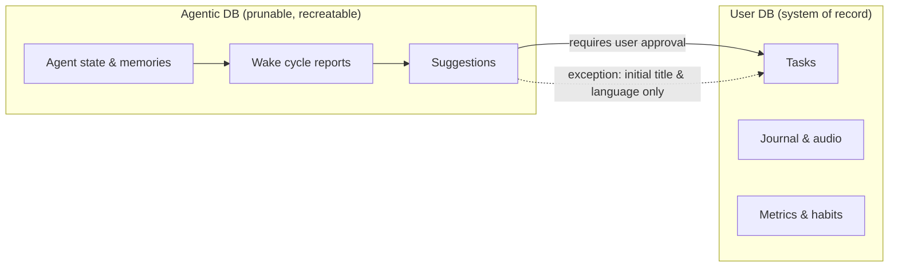

# Lotti

   

[Discord for support](https://discord.gg/uuSaa8NpY)

**A private logbook for the work you actually did.**

Lotti records what you meant to do and what actually happened, and keeps them
as separate facts. Tasks, planned blocks, tracked time, voice notes, journal
entries, habits, and health data live in a local database on your own devices,
looked after by a staff of personal AI assistants: persistent agents that read
what you record, keep the mess summarised, and propose the next step — while
proposed changes wait for your approval. No server ever holds your data in
readable form; sync is end-to-end encrypted, and the relay between your
devices holds only ciphertext — not forever. AI is optional, and when you do
set it up, the route
Lotti recommends is European infrastructure running open-weight models.

macOS · Linux · Windows · iOS · Android. Flutter and Dart, GPL-3.0, in
development since 2016.

I have tracked around 11,000 hours of my own work in it since 2022.

<!-- All screenshots come from the manual's deterministic fixture pipeline
     (docs-site/metadata/screenshot-cases.json), so they track the build. They
     point at the `development` channel and update when the manual regenerates;
     if a case id is ever renamed, these links need renaming with it. -->
<picture>
  <source media="(prefers-color-scheme: dark)" srcset="https://pub-3df7bcf4b8ca493fa6acea182d69d9c7.r2.dev/manual/screenshots/development/tasks/workspace/desktop-dark.webp">
  
</picture>

[Read the manual](https://matthiasn.github.io/lotti/manual/development/) ·
[Install](#install) ·
[Blog series](https://matthiasnehlsen.substack.com/p/meet-lotti)

---

## What is actually different about it

**Intent and reality are separate records.** A task describes an outcome you
want. A time record describes what actually happened, with the notes, photos,
recordings, and measurements that explain it attached to it. Most tools flatten
the two into a single list and then ask you to pretend the day went to plan.
Lotti keeps them apart, so the record stays honest when the week gets noisy.

**Agents propose, you decide.** An agent can read a task, form an opinion,
summarise a mess, and suggest a next change. Its report is an opinion with
provenance, not a new fact in your history. Task, checklist, status, and date
changes wait for you to confirm or dismiss them. The only exception is an
initial title or language for an otherwise empty task. This is enforced by the
storage layout rather than by careful prompting — see
[Two databases](#two-databases-human-in-the-loop-by-construction).

  <picture>
    <source media="(prefers-color-scheme: dark)" srcset="https://pub-3df7bcf4b8ca493fa6acea182d69d9c7.r2.dev/manual/screenshots/development/tasks/agent-suggestions/mobile-dark.webp">
    
  </picture>

**No server ever holds your data in readable form.** Your logbook lives on
your devices. Sync is end-to-end encrypted: the relay you choose holds only
ciphertext, not forever, and nothing depends on it keeping anything — a new
device catches up because your other devices re-send history, not because a
server archived it. No telemetry, and nothing uploaded to Lotti.

**You choose the brain, and you can see what it cost.** Route each category of
your life to the compute you are willing to stand behind: a local model for the
private things, a frontier model for work, or the European option Lotti
recommends. The usage view reports tokens and requests for every cloud call, and
spend, energy and CO₂e for the providers that report them — today that means
Melious. Local inference is not measured at all, because the cost moves onto
your own hardware and grid.

<picture>
  <source media="(prefers-color-scheme: dark)" srcset="https://pub-3df7bcf4b8ca493fa6acea182d69d9c7.r2.dev/manual/screenshots/development/ai/usage/desktop-dark.webp">
  
</picture>

---

## Install

| Platform                 | Where to get it                                                                                                                                 |
|--------------------------|-------------------------------------------------------------------------------------------------------------------------------------------------|
| **Linux**                | [Flathub](https://flathub.org/en/apps/com.matthiasn.lotti) (recommended) or `tar.gz` on [Releases](https://github.com/matthiasn/lotti/releases)  |
| **macOS**                | Signed and notarized DMG on [Releases](https://github.com/matthiasn/lotti/releases)                                                             |
| **iOS / iPadOS / macOS** | TestFlight (limited; invitation only), with broader availability planned                                                                        |
| **Android**              | APK on [Releases](https://github.com/matthiasn/lotti/releases), or Play Store internal testing (limited; invitation only)                        |
| **Windows**              | Build from [source](docs/DEVELOPMENT.md) for now                                                                                                |

---

## What you can do with it

### Capture

- **Audio recording** anywhere in the app, transcribed locally with Whisper
  (99 languages) or Voxtral, or through a cloud provider with audio support. A
  rambling voice note comes back as a task with a checklist.
- **Entries**: notes, images, measurements, and surveys, attached to the work
  they belong to.

### Organize and reflect

- **Tasks** with full lifecycle (open, groomed, in progress, blocked, on hold,
  done, rejected), checklists, estimates, priorities, due dates, labels, linked
  context, and optional generated cover art.
- **Task agents**: give one task a persistent assistant with its own inference
  setup, report, wake state, and proposal history. Automatic updates decide
  when it wakes, not what it may change.
- **Time tracking** recorded against the plan rather than instead of it, with
  focus ratings.
- **Time analysis** over categories, habits, and measurements.

<picture>
  <source media="(prefers-color-scheme: dark)" srcset="https://pub-3df7bcf4b8ca493fa6acea182d69d9c7.r2.dev/manual/screenshots/development/time-analysis/overview/desktop-dark.webp">
  
</picture>

- **Categories and labels** to make the boundaries that your decisions
  actually use.
- **Habits, measurables, and health data** imported from Apple Health and
  other sources.
- **Projects, events, dashboards, and embedding-backed search** exist and are
  in daily use, but ship switched off. Turn them on under Settings → Advanced →
  Flags, and expect rough edges.

### AI and automation

- **Providers, models, and inference profiles** as three separate layers, so
  routing is explicit and the blast radius of a change is visible before you
  make it.
- **A European route, offered rather than imposed.** Onboarding highlights
  [Melious.ai](https://melious.ai), an OpenAI-compatible EU endpoint serving
  open-weight models. You bring your own key and hold your own contract with
  whoever you pick.
- Works with everything else too: OpenAI, Anthropic, Mistral, Google, Alibaba,
  Nebius, OpenRouter, Ollama, or any OpenAI-compatible endpoint, including a
  custom base URL pointed at your own gateway.
- **Agent templates and souls**: a template defines a responsibility, a soul
  defines voice, tone bounds, coaching style, and an anti-sycophancy policy.
  Both are versioned, both are improved through reviewable 1-on-1 sessions, and
  both can be rolled back.
- **Grievances and 1-on-1s.** When an agent annoys you, say so — no form and no
  magic phrase required. It records the grievance and brings it up in the next
  1-on-1, where the two of you reconcile what changes. The result is an
  assistant that evolves rather than one you configure once.
- **Contextual skills** for work that does not need a durable agent, including
  prompt generators that turn a task plus your notes into a coding, design,
  image, or research brief you can paste into the tool of your choice.
- **Usage and impact**: tokens and requests by period, category and model for
  every cloud call, plus cost, energy and CO₂e wherever the provider reports
  them — currently Melious. Other providers return token counts only, so those
  columns stay empty rather than being estimated.
- Turn all of it off. Lotti is useful without any inference configured.

### Sync and data

- End-to-end encrypted sync across your devices, backed by a Synapse
  homeserver you or someone you trust operates.
- The first device is provisioned server-side with the included
  [`tools/matrix_provisioner`](tools/matrix_provisioner) CLI, which creates the
  sync account and encrypted room and writes a single-use pairing bundle.
- Every device after that pairs from one you already use: scan a QR code,
  compare a check code derived independently on both screens, then complete
  emoji verification. Until verification finishes, the new device receives
  ciphertext it cannot read.
- Conflict resolution is built on vector clocks, so a device that was offline
  for a week rejoins without losing writes.
- **Your data is a file you already have.** Local SQLite with a documented
  schema, plus attachments on the filesystem. No export wizard, because there
  is nothing to unlock.

---

## Two databases, human-in-the-loop by construction

Lotti keeps *what you said and did* and *what an agent thinks* in different
databases on disk.

The **user database** is the system of record: tasks, notes, audio, time
recordings, journal entries. It is treated with care, and agents do not write
into it freely.

The **agentic database** is agent working memory: definitions, memories, wake
history, reasoning traces, intermediate results. It may grow and it may be
pruned. It can be thrown away and rebuilt without losing anything that matters
about *you*.

The rule matters because of how it is enforced. Agent-authored content sits in
a different file on disk and reaches the user database only through a code path
that requires your approval. A misbehaving agent has no path to any other field
in the user database.

The two narrow exceptions both concern fields that are still empty: an agent
may set the initial title of an untitled task, and the initial language of a
task that has none. Every subsequent edit needs your approval.

---

## Privacy, sovereignty, and where your compute happens

Three different claims get flattened into the word "private." Lotti makes all
three. They are worth separating, because they fail in different ways.

### Your logbook is not collected

Lotti collects nothing. No telemetry, no analytics, and nothing uploaded to
Lotti. Entries live in local SQLite on each of your
devices, with
attachments beside it on the filesystem. That is structural rather than a policy
commitment: there is nowhere for the data to go, and you can confirm it by
reading the source or watching the traffic. Two things do leave, both because
you configured them: ciphertext to the homeserver you chose, and inference
requests to the provider you chose.

*The other side of that:* there is no server-side backup and no account
recovery, because no server holds a readable or lasting copy of your data.
Sync is the redundancy story — but it is
not automatic history. Pairing a device gives it everything written *from then
on*; your existing settings and back catalogue arrive only when you run *Send
settings* and *Send message history* from the device that already has them.
Until you do, the new device is a live peer, not a backup. Do that early, and a
second device means losing one costs you nothing.

Keep an ordinary backup as well, since replication covers hardware loss and a
backup covers everything else. There is no export feature, because there is
nothing to export from. Your logbook is a SQLite database sitting on your own
disk with a documented schema, so reading it takes a query rather than
permission. Take a consistent copy with `VACUUM INTO` while the app is running,
and bring the attachments directory along with it, because audio and images
live on the filesystem rather than in the database.
<!-- TODO: link a manual page giving the database and attachment paths per
     platform. Without it, "you have access" is true and unactionable. -->
On a phone the database sits inside the app sandbox, so the practical route
there is to pair a desktop and take the copy from that peer.

Deleting works the other way round, and the order matters: delete entries *in
the app* rather than deleting the database files. Purging removes an attachment
by walking the deleted rows that still point at it, so a database removed first
leaves its audio and images orphaned on disk. Paired devices and ordinary
backups keep their own copies either way, and anything already sent to a
provider is subject to that provider's retention, not yours.

*What this does not protect against:* a compromised device. The on-device
SQLite files live inside your OS user account and are not separately encrypted
by Lotti today. App-level at-rest encryption is a candidate for the roadmap;
until it lands, give Lotti's on-device data the same care you would give any
personal app on the same machine, and weigh that before putting your most
sensitive categories in it.

### Your sync infrastructure is yours

Sync runs over Matrix with Vodozemac for end-to-end encryption, against a
Synapse homeserver you or someone you trust operates. The relay only ever
handles ciphertext. Encryption keys are shared only with devices you have
verified through an emoji comparison, so a device that joins the account
without completing verification receives data it cannot read. Both databases
sync this way.

*What this does not protect against:* metadata. Whoever runs the homeserver can
observe that a device synced, when, and roughly how much. Not what.

### Your inference is a routing decision

Lotti has no inference backend. Every AI call goes to a provider you
configured, under your own account and API key, and you choose per category
which provider that is. Work can go to a frontier model while a journal stays
on a local one. That granularity is the entire point.

**Onboarding highlights a European route.** [Melious.ai](https://melious.ai) is
a German company routing open-weight models across a network of EU
infrastructure providers, independently verified at
[staysin.eu](https://staysin.eu/api.melious.ai). They state that requests are
not used for training and that data stays under European jurisdiction. Those
are their claims, on their terms, and worth reading in full before you rely on
them.

Mistral, Google, Alibaba, OpenAI, Anthropic, OpenRouter, and any other
OpenAI-compatible endpoint work equally well. Lotti does not rank them, does
not summarise their terms, and cannot verify anyone's claims about jurisdiction,
retention, or training. Picking a provider is your decision and the due
diligence is yours.

What Lotti does instead is refuse to let the decision be invisible:

- Routing is configured per category, ahead of time, rather than negotiated in
  the moment — so which provider a given piece of work goes to is a setting you
  chose, not a prompt you clicked past. The flip side is that there is no
  just-in-time notice at the point an agent or a transcription fires; the
  onboarding and settings screens are where that decision is made and shown.
- A friendly display name is not the security boundary. The provider detail
  view shows the actual base URL, the models attached to it, and every profile
  that depends on them.
- Usage & Impact logs every request that left the machine and which model served
  it, with token counts throughout and cost, energy and CO₂e wherever the
  provider reports them.

A LAN endpoint is worth the same scrutiny. "Local" means it did not go to a
hosted provider, not that no network hop occurred.

*What this does not protect against:* a provider that does not do what its
terms say. Nothing in Lotti can verify that, and neither can anyone else from
the outside. What Lotti can do is show you every request it made, where it
went, and what it cost.

### Running it all locally

Local inference is finally good enough to drive the agents. **Qwen 3.6 35B A3B**
is the model validated in daily use here — 35B parameters with roughly 3B active
per token, which is what makes it practical on a personal machine while still
being smart enough for the agentic loop. Others probably work too.

It is power-hungry. Tested extensively on an M4 Max with 128 GB of RAM, the
laptop is audible under sustained agent load and the battery drains noticeably
faster than during normal work. Feasible, not free.

Hybrid is the realistic answer, and it is how I run it: a local model for the
private categories, a cheap cloud model such as Gemini Flash for open-source
work and everyday task management. Speech is fully offline via Whisper or
Voxtral either way. Image generation is the one thing with no local path yet —
cover art goes through Gemini or Alibaba.

### Energy is a routing decision too

Inference runs in a physical building on a specific grid. The **Usage & Impact**
view reports tokens and requests for every cloud call, broken down by category
and by model, so "what did my thinking cost" has an answer rather than a vibe.

How complete that answer is depends on the provider. Cost, energy, CO₂e and
water are recorded when the provider returns them with the response, which today
means Melious; every other provider reports token counts only, and those columns
stay empty rather than being filled with an estimate. That is a real limit on the
dashboard: route your work through a provider that discloses nothing, and the
impact of that work is not something Lotti can show you.

The route highlighted in onboarding publishes power usage effectiveness per
datacenter and carries Green Web Foundation verification, which is more than
most disclose. Running a model locally moves the cost onto your own hardware
and your own grid, which is a different trade rather than a free one, and the
dashboard does not measure it.

Choosing a renewable-powered route avoids outsourcing the health and climate
cost of fossil-powered compute, gas turbine generation in particular, to
communities with less power to refuse it. That is a reason to care where your
tokens get processed even if you do not care who reads them.

### If none of that satisfies you

Turn AI off. Configure no provider at all, or point every category at Ollama
with local Whisper for speech. Lotti is a complete task manager, time tracker,
and journal without a single inference call leaving the machine.

---

## In development

Built and documented, but not enabled in a default build. Turn it on under
Settings → Advanced → Flags, and expect it to change.

- **Daily OS** ("Enable DailyOS Page") turns a spoken or typed check-in into a
  plan for one day. It reconciles what you said against your real tasks, drafts
  an agenda against your actual capacity, and presents every proposed change
  with its old time, its new time, and the planner's reason. Nothing is
  committed until you hold the confirm control. Wrap-up at the end of the day
  separates what you finished from what carries forward.
  [Documentation](https://matthiasn.github.io/lotti/manual/development/plan-and-capture/daily-os)

Next agent types on the roadmap: week planners, long-term commitment monitors,
and effort-against-goals balancers — same building blocks, different jobs.
Designed but not yet built: learning quizzes and relationship check-ins. See
the [roadmap](https://matthiasn.github.io/lotti/manual/development/roadmap).

---

## Pricing and sustainability

**Linux is and will always be free, with maximum functionality.** No paywalls,
no upsells. The same promise extends to any future fully open-source mobile
operating system. The one thing it does not include is hosted sync
infrastructure — running a homeserver is a real cost, so you either self-host
Matrix or bring your own.

**On other platforms, the basics stay free too.** Task and journal capture, the
task agent, voice transcription, the everyday loop.

**More advanced agent features may eventually be in-app purchases on platforms
where IAP is the norm** (iOS/macOS, Android, Windows). The candidates: day- and
week-planner agents, overarching project-management agents, longer-horizon
commitment monitors. The exact split is not set yet.

---

## Documentation

- **[Manual](https://matthiasn.github.io/lotti/manual/development/)** — the
  full guide, available in 11 languages. Start with
  [the mental model](https://matthiasn.github.io/lotti/manual/development/getting-started/mental-model)
  if you want to understand the shape of the thing before installing it.
- [Connect an AI provider](https://matthiasn.github.io/lotti/manual/development/ai-and-automation/provider-setup/)
  — local Ollama or cloud Gemini, and the models and profiles around them
- [Task management and voice capture](https://matthiasn.github.io/lotti/manual/development/getting-started/first-task/)
  — the everyday voice-to-checklist workflow
- [Architecture](docs/ARCHITECTURE.md) — the two databases, vector clock sync,
  on-device inference
- [Knowledge bundle](knowledge/index.md) — how the app actually works at
  runtime, subsystem by subsystem, written for contributors and coding agents
  alike
- [Background](docs/BACKGROUND.md) — why this exists
- [Privacy policy](PRIVACY.md) · [Security policy](SECURITY.md)
- [Roadmap](https://matthiasn.github.io/lotti/manual/development/roadmap)

Building it yourself: install Flutter via [FVM](https://fvm.app/) (the repo
includes `.fvmrc`), then `make deps`, `make analyze`, `make test`,
`fvm flutter run -d <device>`. Full setup, including the Linux audio-codec and
emoji-font packages, is in [docs/DEVELOPMENT.md](docs/DEVELOPMENT.md).

---

## Status

The application is in active daily use and
the agentic layer is real, working, and shipping. Development happens in the
open, and the [changelog](CHANGELOG.md) is the honest version of what changed.

Worth knowing if you are picking it up now: the design-system rollout is
partway through, so some screens are polished and others are not. The agentic
layer is young — soul and template ergonomics, grievance handling, and pruning
strategies are all under active development, and feedback there is especially
useful. Local image generation and at-rest database encryption do not exist yet.

The manual, including every screenshot in all 11 languages, is generated from a
deterministic fixture workspace, so the documentation cannot quietly drift from
the build it documents.

**Stack**: Flutter and Dart across five platforms, local SQLite via Drift with
ObjectBox for embeddings, Whisper and Voxtral for on-device speech recognition,
Matrix and Vodozemac for the encrypted sync transport, Glados for property-based
tests.

---

## Contributing

Two things genuinely help, and one thing to know up front.

**Welcome:**

- **Issues and bug reports** — the best place to start. Tell me what broke and
  how to reproduce it.
- **Translations** — new languages and corrections to existing ones.
  AI-assisted translation is fine **provided you contribute from a real-name,
  established GitHub profile**. Translation PRs are the one kind that gets
  merged.

**Not accepted: code pull requests.** Review capacity is the binding
constraint, Lotti holds people's personal data on their own devices, and
AI-generated code now arrives far faster than it can be reviewed carefully. An
unsolicited code PR will be closed unmerged, with thanks and without review —
so please open an issue instead of writing the patch. It is more useful to me
and cheaper for you.

Lotti is GPL-3.0: fork it and build whatever you like on top for yourself.

[CONTRIBUTING.md](CONTRIBUTING.md) has the details, including what makes a
translation PR mergeable.

## License

GPL-3.0. See [LICENSE](LICENSE).

## Acknowledgments

Thanks to the [Flutter](https://flutter.dev) team, the
[Qwen](https://github.com/QwenLM) and [Mistral](https://mistral.ai) teams for
their open-weights models, [OpenAI](https://openai.com) for the
[Whisper](https://github.com/openai/whisper) weights, the
[Ollama](https://ollama.com) project, the [Matrix.org](https://matrix.org)
community, the [Vodozemac](https://github.com/matrix-org/vodozemac) authors, and
everyone contributing translations, issues, and ideas.

---

Built in public. [GitHub](https://github.com/matthiasn/lotti) ·
[Substack](https://matthiasnehlsen.substack.com)
