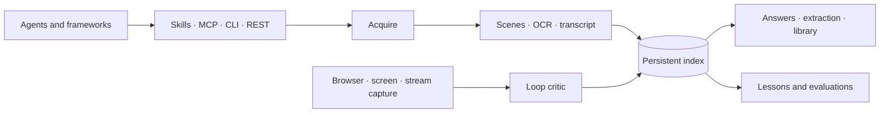

<div align="center">


# Watch Skill

**Give every AI agent eyes for video — and a way to check its own work.**

[](https://github.com/oxbshw/watch-skill/actions/workflows/ci.yml)
[](https://github.com/oxbshw/watch-skill/actions/workflows/install.yml)
[](https://pypi.org/project/watch-skill/)
[](https://pypi.org/project/watch-skill/)
[](pyproject.toml)
[](LICENSE)

[Install](#install) · [Documentation](docs/README.md) · [Examples](examples/README.md) · [Comparison](docs/comparison.md) · [Roadmap](docs/ROADMAP.md)

</div>

Watch Skill turns videos, live streams, meetings, and screen recordings into a searchable,
timestamped index. An agent can ask what happened, get an answer that cites the exact
moment behind it, and ask again tomorrow without processing the video a second time.

When the video is the agent's *own* browser or desktop session, **THE LOOP** closes the
circle: record the work, critique it against plain-language criteria, and show before and
after. That critique is *advisory* — a model describing pictures. To decide whether the
work actually succeeded, attach a **verification contract**: deterministic checks, frozen
before the run, that hold the verdict.

```bash
uvx --from "watch-skill[standard]" watch-skill setup
```

<p align="center">
  
  <br>
  <sub>THE LOOP catching a <code>$NaN</code> total that an end-state screenshot misses, then showing the fix.</sub>
</p>

## What it does

| | |
|---|---|
| **Watch** | Scene-aware frames, on-screen text, and local-first transcription from 1,800+ sites, live HLS/DASH streams, local media, meetings, browsers, windows, and desktops. |
| **Watch live** | A session that reports what changed **while the source is still playing** — bounded queues, counted drops, cursor-addressed events, and a rolling buffer that pins the evidence around each one. [Guide](docs/live.md) |
| **Remember** | A persistent, searchable index with timestamp citations, hybrid retrieval, cross-video synthesis, and reusable lessons. |
| **Verify** | A capture → critique → fix → re-capture loop for browser flows, interfaces, generated video, gameplay, and monitored streams — with deterministic contracts deciding pass or fail. |
| **Operate** | Drive a browser and prove the effect of each action — deterministic target resolution, per-step receipts, and verdicts that reject a page reporting success over a failed request. [Guide](docs/browser-runtime.md) |

Available as Claude Code skills, 37 MCP tools, a CLI, a REST API, and native adapters for
LangChain/LangGraph, CrewAI, the OpenAI Agents SDK, LlamaIndex, and AutoGen.

Four things it will not do, because each one is a way of being confidently wrong:

- **Answer from a video that changed.** Identity follows the bytes, not the path. Overwrite
  `demo.mp4` and the next question returns `stale`, not yesterday's frames.
- **Upload a frame you did not agree to send.** A configured API key is not consent.
  `watch-skill plan` prints every network action before a run makes one.
- **Call an absent judgement a pass.** No frames, no OCR, an unreachable model, a timed-out
  check — all `inconclusive`. Only a required deterministic check produces a `pass`.
- **Claim a capability it has not checked.** `watch-skill capture-capabilities` says what this
  machine can actually record, and whether each answer was machine-tested or merely probed.

## Install

Two pieces, and you want both. The **engine** does the work; the **skills** teach your
agent when to reach for it.

```bash
# 1. the engine — installs, wires up every AI agent on the machine, backs up each config
uvx --from "watch-skill[standard]" watch-skill setup

# 2. the skills — into Claude Code, Codex, Cursor, Copilot, Gemini CLI, and 20+ more
npx skills add oxbshw/watch-skill -g
```

Neither needs a clone, and the engine command works the same on macOS, Linux, and
Windows — [CI runs it on all three](https://github.com/oxbshw/watch-skill/actions/workflows/install.yml)
on every push.

Prefer a permanent install to `uvx` fetching on demand?

```bash
pipx install "watch-skill[standard]"     # or: pip install "watch-skill[standard]"
watch-skill setup
```

<details>
<summary>Other ways in — Claude Code plugin, Docker, from source</summary>

**Claude Code plugin** — skills, slash commands, and the MCP server in one:

```text
/plugin marketplace add oxbshw/watch-skill
/plugin install watch-skill@watch-skill
/watch-skill:setup-watch-skill
```

**Docker** — nothing on the host; the volume is where the index lives, so do not skip it:

```bash
docker run --rm -i -v watch-skill-data:/data ghcr.io/oxbshw/watch-skill serve
```

Built for `linux/amd64` and `linux/arm64`, with an SBOM and a signed build attestation.

**From source** (installs uv and Python if either is missing):

```bash
curl -fsSL https://raw.githubusercontent.com/oxbshw/watch-skill/main/scripts/install.sh | sh
```

```powershell
powershell -ExecutionPolicy Bypass -c "irm https://raw.githubusercontent.com/oxbshw/watch-skill/main/scripts/install.ps1 | iex"
```

**Wiring an agent by hand** — the block most MCP clients take:

```json
{ "mcpServers": { "watch-skill": {
    "command": "uvx",
    "args": ["--from", "watch-skill[standard]", "watch-skill", "serve"] } } }
```

Zed, Amp, and a few others name that key differently; each
[agent guide](docs/agents/README.md) shows the exact shape.

</details>

`standard` is frames, retrieval, and MCP — about 200 MB. `watch-skill[all]` adds OCR,
local Whisper, REST, and the browser THE LOOP drives. `watch-skill doctor` names anything
missing and prints the one command that installs it, so starting small is safe.

Coming from [claude-video](https://github.com/bradautomates/claude-video)? Your `/watch`
commands and flags work unchanged — see the [migration guide](docs/migrate-from-claude-video.md).

## First run

```bash
watch-skill watch "https://youtu.be/..." "Summarize the important moments."
```

That prints a report and an id. Everything after it is a lookup against the index, not a
second download:

```bash
watch-skill ask <video_id> "when does the demo first fail?"
watch-skill search "pricing decision"        # across every video you've watched
watch-skill library ask "what did the team decide about auth?"
```

Useful flags on `watch`:

| Flag | Use it when |
|---|---|
| `--detail transcript` | You want the words, not the pictures — much faster |
| `--detail balanced` \| `token-burner` | More frames, more cost |
| `--start 4:10 --end 6:00` | Only a slice of a long video matters |
| `--word-timestamps` | You need the exact word, not the ten-second segment it sat in |
| `--no-cache` | Re-fetch a source that changed |

And the rest of the surface:

```bash
watch-skill serve                            # MCP over stdio — what agents connect to
watch-skill api                              # REST, port 8748
watch-skill doctor                           # check and repair the setup
watch-skill viewer <video_id> --out r.html   # one self-contained page to share
watch-skill loop viewer <loop_id>            # a run's iterations, compared
watch-skill bench providers                  # compare every provider you have a key for
```

Transcription, OCR, and search run locally and need no API key. Visual question
answering uses whichever provider you already pay for — Anthropic, OpenAI, Gemini,
OpenRouter, Groq, Together, Fireworks, DeepSeek, xAI, Mistral, MiniMax, Moonshot,
Z.ai, or Qwen — or nothing at all with a local Ollama model. Anything else that
speaks the OpenAI format (vLLM, LM Studio, llama.cpp, LiteLLM, Azure OpenAI, a
company gateway) works through the `custom` provider:

```bash
watch-skill setup-vision --provider groq            # or any of the above
watch-skill setup-vision --provider custom \
  --base-url http://127.0.0.1:8000/v1               # your own server
```

See [Getting started](docs/getting-started.md) for manual installation and
[Configuration](docs/configuration.md) for provider and privacy settings.

## Why use it

- **Evidence instead of frame dumps.** Scene detection and perceptual deduplication spend
  the frame budget on distinct moments. Answers include timestamps, confidence, and the
  evidence used to support them.
- **Persistent video memory.** Analyze once, ask again without downloading or transcribing
  the same video. Hybrid full-text and vector retrieval works within one video or across
  the entire library.
- **Local-first processing.** Original-language captions are preferred, local Whisper is
  the default fallback, and cloud speech-to-text is opt-in. An Ollama configuration keeps
  the complete pipeline on the machine.
- **Flow verification.** THE LOOP records an agent's browser, screen, or window and checks
  the result against plain-language criteria, producing a before/after comparison. The
  model's read of that recording is advisory; a [verification
  contract](docs/verification.md) turns it into a decision, and its evidence bundle is
  hash-bound so an edited result stops verifying.
- **Corrections that persist.** `report_mistake` stores a local lesson, applies it to related
  questions, and turns it into a replayable evaluation.
- **Measured cost controls.** Text-first answers, semantic caching, configurable token
  budgets, and explicit `cheapest`, `quality_first`, and `offline_only` policies keep the
  trade-offs visible.
- **Multilingual retrieval.** Script-aware OCR routing, Arabic normalization, CJK substring
  matching, and multilingual embeddings support questions across languages.

Sixteen providers is a menu, not an answer, so there is a benchmark that
settles it on your own keys: `watch-skill bench providers` reads the same
committed frames with every provider you have configured and prints char-hit
rate, latency, and cost from each one's *reported* tokens — see
[method and results](benchmarks/providers/README.md).

The repository includes reproducible [cost](benchmarks/cost/RESULTS.md) and
[perception](benchmarks/perception/RESULTS.md) benchmarks. Product claims in this README
link to the relevant implementation notes or testable example rather than relying on
unqualified marketing numbers.

## Works with your agent

The setup command detects supported clients and updates their configuration with a backup.
Manual guides are available for every entry below.

| | | | |
|:---:|:---:|:---:|:---:|
| [](docs/agents/claude-code.md)<br>[Claude Code](docs/agents/claude-code.md) | [](docs/agents/claude-desktop.md)<br>[Claude Desktop](docs/agents/claude-desktop.md) | [](docs/agents/cursor.md)<br>[Cursor](docs/agents/cursor.md) | [](docs/agents/codex-cli.md)<br>[Codex CLI](docs/agents/codex-cli.md) |
| [](docs/agents/cline.md)<br>[Cline](docs/agents/cline.md) | [](docs/agents/windsurf.md)<br>[Windsurf](docs/agents/windsurf.md) | [](docs/agents/gemini-cli.md)<br>[Gemini CLI](docs/agents/gemini-cli.md) | [](docs/agents/vscode.md)<br>[VS Code](docs/agents/vscode.md) |
| [](docs/agents/github-copilot-cli.md)<br>[GitHub Copilot CLI](docs/agents/github-copilot-cli.md) | [](docs/agents/kimi-code.md)<br>[Kimi Code](docs/agents/kimi-code.md) | [](docs/agents/qwen-code.md)<br>[Qwen Code](docs/agents/qwen-code.md) | [](docs/agents/opencode.md)<br>[OpenCode](docs/agents/opencode.md) |
| [](docs/agents/goose.md)<br>[Goose](docs/agents/goose.md) | [](docs/agents/openhands.md)<br>[OpenHands](docs/agents/openhands.md) | [](docs/agents/kilocode.md)<br>[Kilo Code](docs/agents/kilocode.md) | [](docs/agents/qodo.md)<br>[Qodo](docs/agents/qodo.md) |
| [](docs/agents/agent-zero.md)<br>[Agent Zero](docs/agents/agent-zero.md) | [](docs/agents/openclaw.md)<br>[OpenClaw](docs/agents/openclaw.md) | [](docs/agents/pi.md)<br>[Pi](docs/agents/pi.md) | [](docs/agents/hermes.md)<br>[Hermes](docs/agents/hermes.md) |
| [](docs/agents/zed.md)<br>[Zed](docs/agents/zed.md) | [](docs/agents/roo-code.md)<br>[Roo Code](docs/agents/roo-code.md) | [](docs/agents/continue.md)<br>[Continue](docs/agents/continue.md) | [](docs/agents/jetbrains.md)<br>[JetBrains](docs/agents/jetbrains.md) |
| [](docs/agents/amp.md)<br>[Amp](docs/agents/amp.md) | [](docs/agents/aider.md)<br>[Aider](docs/agents/aider.md) | | |

[](docs/agents/frameworks.md)

Native tools are also available for [LangChain/LangGraph, CrewAI, OpenAI Agents SDK,
LlamaIndex, and AutoGen](docs/agents/frameworks.md); any other framework can use REST or
MCP.

### Why both skills and MCP

MCP gives an agent 37 tools. Skills give it the judgement about when to use them —
that a screen recording in the conversation is worth watching, that a follow-up
question should hit the index instead of re-processing, that a UI change deserves a
verification pass. An agent with only the tools waits to be told; an agent with the
skills reaches for them.

That is why `npx skills add oxbshw/watch-skill -g` is step two of the install and not
an optional extra. Pick individual ones with `--skill <name>`, or list them first:

```bash
npx skills add oxbshw/watch-skill --list
```

| Connection | How it reaches the agent |
|---|---|
| **Skills** | Every agent the [skills CLI](https://skills.sh) supports — Claude Code, Codex CLI, Cursor, GitHub Copilot, Gemini CLI, VS Code, and the rest — plus [OpenClaw](docs/agents/openclaw.md), [Pi](docs/agents/pi.md), and [Hermes-style agents](docs/agents/hermes.md) |
| **MCP** | [Claude Desktop](docs/agents/claude-desktop.md), [Cursor](docs/agents/cursor.md), [Codex CLI](docs/agents/codex-cli.md), [Cline](docs/agents/cline.md), [Windsurf](docs/agents/windsurf.md), [Gemini CLI](docs/agents/gemini-cli.md), [VS Code](docs/agents/vscode.md), [GitHub Copilot CLI](docs/agents/github-copilot-cli.md), [Zed](docs/agents/zed.md), [Roo Code](docs/agents/roo-code.md), [Continue](docs/agents/continue.md), [Kimi Code](docs/agents/kimi-code.md), [Qwen Code](docs/agents/qwen-code.md), [OpenCode](docs/agents/opencode.md), [Goose](docs/agents/goose.md), [OpenHands](docs/agents/openhands.md), [Kilo Code](docs/agents/kilocode.md), [Qodo](docs/agents/qodo.md), [Agent Zero](docs/agents/agent-zero.md) |
| **Native Python tools** | [LangChain/LangGraph, CrewAI, OpenAI Agents SDK, LlamaIndex, and AutoGen](docs/agents/frameworks.md) |
| **HTTP** | Vercel AI SDK, n8n, and any client that can call REST/OpenAPI |

The [full compatibility matrix](docs/agents/README.md) separates machine-tested,
machine-configured, and documentation-verified integrations. If your agent is missing,
the [adapter template](templates/agent-adapter/README.md) provides a short contribution
path.

## Browser Runtime

Watch Skill has one browser subsystem with two modes. *Observer* mode watches
someone else work and verifies the result. *Operator* mode does the work and
holds itself to the same standard.

```python
from watch_skill.operate import (
    Action, ActionKind, BrowserRuntime, Expectation, SideEffect, Target,
)

runtime = BrowserRuntime(source)          # an already-running browser session
result = runtime.run_task("save the display name", [
    Action(kind=ActionKind.CLICK, intent="save",
           target=Target(role="button", name="Save"),
           side_effect=SideEffect.REVERSIBLE,
           expect=Expectation(text_present="Saved", network_ok=True)),
])

result.verified          # False — the page said Saved, PATCH /api/save returned 500
result.receipts[-1].reason
```

The rule the runtime is built around: **dispatching an action is not the same
as proving its effect.** Playwright returning from `click()` proves a click was
delivered and nothing more, so every action carries an expectation written down
beforehand, and the verdict is the comparison. An action with no expectation is
`UNVERIFIED`, never `SUCCEEDED`.

That is what catches the failure mode nothing else does — a page that renders
success over a request that failed. `network_ok` correlates the requests made
during the step, so "Saved" over a 500 is a failure with the request named in
the receipt.

Other properties worth knowing:

- **Targets resolve deterministically first** — accessible role and name, then
  label, test id, placeholder, selector, text. Vision is last because it is the
  most expensive signal and the least stable across a redeploy.
- **Ambiguity is refused, not guessed.** Two buttons named "Delete account" is
  not a case where the first one is probably right.
- **Retries respect side effects.** Clicking "Next" again is fine; clicking
  "Buy" again is not. Recovery never repeats an action that may have taken.
- **Every step produces a receipt** — how the target was found and with what
  confidence, what changed, which requests ran, the verdict, and any recovery.

Run the benchmark against the bundled local fixture site:

```bash
python -m watch_skill.operate.benchmark --out build/benchmark
```

It scores **false-success rate** — tasks where the runtime claimed the goal was
met and the server disagrees — because task success rate on its own counts a
confident wrong answer as a win. Ground truth comes from the fixture server's
own state, not from anything the browser reported.

On that nine-task fixture benchmark every ground-truth verdict was classified
correctly and no false-success verdict was produced. Nine tasks on one
synthetic site is a regression gate rather than a capability claim: it does not
cover real websites, authentication, or shadow DOM, and no other tool was
measured under the same method. [Full method and results](docs/release-proof.md)
and the [design](docs/browser-runtime.md).

## Common workflows

### Build a searchable video library

```bash
watch-skill batch ./recordings --limit 50
watch-skill library overview
watch-skill library ask "What did the team decide about authentication?"
```

`library ask` synthesizes evidence across videos and retains per-video timestamp
provenance. The [library example](examples/12-library-memory/) demonstrates a question
whose answer is distributed across four clips.

### Verify an agent's browser work

```bash
watch-skill loop start "browser:http://127.0.0.1:3000" \
  "Checkout completes and the total is always a valid currency amount"
```

The loop captures the full interaction, critiques failures, and records the before/after
comparison once the agent applies a fix — the run shown at the top of this page.
[Example 14](examples/14-browser-verification/) walks through that transient `$NaN` bug.

The critique is one model's reading of the recording. To make success a decision rather
than an opinion, attach deterministic checks:

```bash
watch-skill verify run checkout-contract.json --dir .
```

`pass` requires every **required** check to pass. A check that fails, times out, or never
runs makes the run `inconclusive` — never a pass. See
[Verification](docs/verification.md).

### Export an offline report

```bash
watch-skill viewer <video_id> --out video-report.html
```

The generated page contains its frames, transcript, OCR, cached answers, and cited
evidence. It has no external runtime dependencies and can be opened without a server.

## Examples

The examples progress from a first watch to agent integration, cross-video memory, and
self-verification.

| Track | Examples |
|---|---|
| Learn the core | [01 Watch and ask](examples/01-watch-and-ask), [02 Focused moment](examples/02-focused-moment), [03 Cross-video search](examples/03-cross-video-search) |
| Build with agents | [06 MCP and REST](examples/06-agent-integration), [09 Framework adapters](examples/09-framework-adapters), [15 Private offline workflow](examples/15-private-offline-workflow) |
| Understand and organize | [05 Multilingual Arabic](examples/05-multilingual-arabic), [10 Structured extraction](examples/10-structured-extraction), [11 Batch mode](examples/11-batch-mode), [12 Library memory](examples/12-library-memory) |
| Verify and improve | [04 UI loop](examples/04-ui-loop), [07 Lessons and stats](examples/07-lessons-and-stats), [08 Loop types](examples/08-loop-types), [13 Self-improvement](examples/13-self-improvement), [14 Browser verification](examples/14-browser-verification), [17 Freshness and offline](examples/17-freshness-and-offline), [20 Observer loop](examples/20-observer-loop) |
| Watch live | [18 Live watch](examples/18-live-watch), [19 Live browser](examples/19-live-browser) |
| Share results | [16 Export a self-contained viewer](examples/16-shareable-viewer) |

See the [example catalog](examples/README.md) for prerequisites, expected output, and a
recommended path through all 20 examples.

## Architecture

All interfaces call the same Python core. Skills and agent adapters decide *when* to use
Watch Skill; acquisition, perception, transcription, indexing, answering, and verification
remain in `src/watch_skill`.



Read [Architecture](docs/architecture.md) for the data model, provider boundaries, and
extension points.

## Documentation

| Guide | Use it for |
|---|---|
| [Documentation index](docs/README.md) | Choose a guide by task or audience |
| [Getting started](docs/getting-started.md) | Installation, first watch, and first agent connection |
| [Tool reference](docs/tools/README.md) | All 37 MCP tools and their REST/CLI counterparts |
| [Configuration](docs/configuration.md) | Storage, privacy, models, limits, and environment variables |
| [Agent matrix](docs/agents/README.md) | Per-client setup and verification status |
| [Verification](docs/verification.md) | Contracts, deterministic checks, assurance levels, attestations |
| [Use-case packs](docs/packs/README.md) | Recipes for research, meetings, QA, content, and operations |
| [THE LOOP](docs/guides/the-loop.md) | Capture, critique, iteration, and proof artifacts |
| [Cost policy](docs/cost.md) | Routing, budgets, caching, and benchmark method |
| [Troubleshooting](docs/troubleshooting.md) | Dependency repair and common runtime errors |
| [Comparison](docs/comparison.md) | Honest trade-offs against the alternatives |
| [Engineering decisions](docs/DECISIONS.md) | The reasoning behind non-obvious design choices |
| [Roadmap](docs/ROADMAP.md) | Planned work and contribution opportunities |

## Development

```bash
git clone https://github.com/oxbshw/watch-skill
cd watch-skill
uv sync --extra all
uv run pytest
uv run ruff check .
```

See [CONTRIBUTING.md](CONTRIBUTING.md) for test tiers, documentation standards, and the
agent-adapter checklist. Security and privacy reports are covered by
[SECURITY.md](SECURITY.md).

## Listed on

Independent directories that index Watch Skill. They are maintained by their operators,
so the details there can lag a release.

- [Agent Skills Hub](https://agentskillshub.top/skill/oxbshw/watch-skill/)
- [Neuralbox](https://neuralbox.tech/oxbshw-watch-skill)

---

<div align="center">

Released under the [MIT License](LICENSE) · Built by [oxbshw](https://github.com/oxbshw)

</div>
