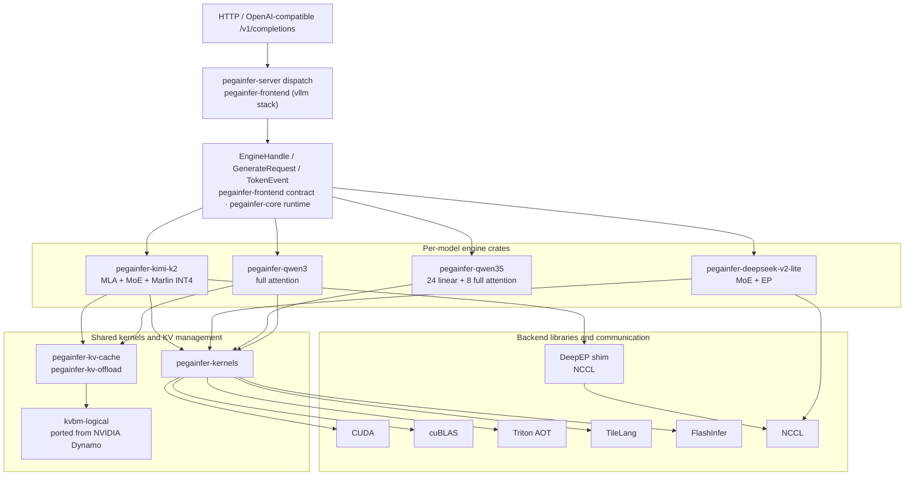

<p align="center">
  
</p>

<h1 align="center">PegaInfer</h1>

<p align="center">
  Pure Rust + CUDA LLM inference engine. No PyTorch. No model framework runtime.
</p>

<p align="center">
  <a href="https://pegainfer.org/">
    
  </a>
  <a href="https://join.slack.com/t/openinferhq/shared_invite/zt-41scnc53a-d0McNJDjK2lVqFGoSLUgXA">
    
  </a>
</p>

<p align="center">
  <a href="#quickstart">Quickstart</a> &middot;
  <a href="#supported-models">Models</a> &middot;
  <a href="#api">API</a> &middot;
  <a href="#performance">Performance</a> &middot;
  <a href="#architecture">Architecture</a> &middot;
  <a href="https://pegainfer.org/blog/">Blog</a>
</p>

---

PegaInfer is an LLM inference engine built entirely in Rust and CUDA — no PyTorch, no ONNX, no framework runtime, every kernel and scheduler hand-written.

It serves frontier-scale models, from Qwen3 to the trillion-parameter Kimi-K2, and already holds its own against the best open-source inference frameworks.

Docs, guides, and engineering deep-dives live at [pegainfer.org](https://pegainfer.org/):

- [PegaInfer 0.1.0: Production-Grade Rust Inference](https://pegainfer.org/blog/pegainfer-010/)
- [Weight Loading: From Safetensors to GPU](https://pegainfer.org/blog/weight-loading/)
- [Speculative Decoding](https://pegainfer.org/blog/speculative-decoding/)
- [See Qwen3 Decode as a CUDA Graph](https://pegainfer.org/blog/cuda-graph-export/)
- [Co-locating Prefill and Decode on One GPU](https://pegainfer.org/blog/green-ctx/)

## Quickstart

### Prerequisites

- Rust (2024 edition), CUDA Toolkit (nvcc, cuBLAS), CUDA-capable GPU
- NVIDIA driver R545 (CUDA 12.3) or newer; `cuFuncGetName` sets this floor, while per-symbol lazy loading keeps the `cuda-12090` cudarc binding from requiring a CUDA 12.9 driver
- The default build (Qwen3-4B / 8B) is pure Rust + CUDA — no Python at all
- Python 3 + Triton for `qwen35` feature builds (build-time only — no Python at runtime)
- The `kimi-k2` EP path additionally needs NCCL ≥ 2.27 at runtime (`ncclAlltoAll`)

### Build & Run

```bash
# Download a model
huggingface-cli download Qwen/Qwen3-4B --local-dir models/Qwen3-4B

# Build & start server on port 8000 — no Python needed for the default Qwen3 build
export CUDA_HOME=/usr/local/cuda
cargo run --release
```

> **Note**: The server CLI is in `pegainfer-server`. Model crates such as `pegainfer-qwen3`, `pegainfer-qwen35`, and `pegainfer-kimi-k2` contain model logic and diagnostics but are not server entrypoints. Use `cargo run --release` from the workspace root, or `cargo run --release -p pegainfer-server -- --model-path <path>`.

```bash
# Try it
curl -s http://localhost:8000/v1/completions \
  -H "Content-Type: application/json" \
  -d '{"prompt": "The capital of France is", "max_tokens": 32}'

# Streaming
curl -N http://localhost:8000/v1/completions \
  -H "Content-Type: application/json" \
  -d '{"prompt": "Write a haiku about Rust:", "max_tokens": 64, "stream": true}'
```

> Always use `--release`. Debug builds are extremely slow for GPU/CUDA code.

<details>
<summary>More options</summary>

```bash
# Qwen3.5 requires the feature-gated Triton AOT kernels (Python + Triton at build time)
uv venv && uv pip install triton
export PEGAINFER_TRITON_PYTHON=.venv/bin/python
cargo run --release --features qwen35 -- --model-path models/Qwen3.5-4B

# Disable CUDA Graph (useful for debugging)
cargo run --release -- --cuda-graph=false
```

**Environment variables:**

| Variable | Description |
|----------|-------------|
| `CUDA_HOME` | CUDA Toolkit path (default: `/usr/local/cuda`) |
| `PEGAINFER_TRITON_PYTHON` | Python with Triton for `qwen35` build-time AOT compilation |
| `PEGAINFER_TILELANG_PYTHON` | Python with TileLang for `k3` build-time kernel generation |
| `PEGAINFER_CUDA_SM` | GPU SM target override when `nvidia-smi` unavailable (e.g. `120`) |

</details>

<details>
<summary>Windows</summary>

```powershell
$env:CUDA_PATH = "C:\Program Files\NVIDIA GPU Computing Toolkit\CUDA\v12.x"

# Default Qwen3 build needs no Python
cargo build --release
cargo run --release -p pegainfer-server -- --model-path models/Qwen3-4B

# Qwen3.5 additionally needs Triton for the feature-gated AOT kernels
uv venv .venv --python 3.12
uv pip install "triton-windows<3.7"
$env:PEGAINFER_TRITON_PYTHON = ".venv\Scripts\python.exe"
cargo run --release --features qwen35 -- --model-path models/Qwen3.5-4B
```

</details>

## Supported Models

| Model | Architecture | Params | Status |
|-------|-------------|--------|--------|
| [Qwen3-4B](https://huggingface.co/Qwen/Qwen3-4B) | Full attention (GQA) | 4B | Greedy + sampling, default feature, pure Rust + CUDA build |
| [Qwen3-8B](https://huggingface.co/Qwen/Qwen3-8B) | Full attention (GQA) | 8B | Greedy + sampling, default feature, pure Rust + CUDA build |
| [Qwen3.5-4B](https://huggingface.co/Qwen/Qwen3.5-4B) / [9B](https://huggingface.co/Qwen/Qwen3.5-9B) / [27B](https://huggingface.co/Qwen/Qwen3.5-27B) | Hybrid Gated DeltaNet + full attention | 4B / 9B / 27B | Text-only BF16, greedy + sampling, feature-gated, `--features qwen35` (build-time Triton) |
| [DeepSeek-V2-Lite](https://huggingface.co/deepseek-ai/DeepSeek-V2-Lite) | MoE + EP | 15.7B total / 2.4B active | Feature-gated, `--features deepseek-v2-lite`, 2-GPU EP2 correctness path |
| [Kimi-K2-Instruct](https://huggingface.co/moonshotai/Kimi-K2-Instruct) | MLA + MoE + Marlin INT4 | 1T total / 32B active | Feature-gated, `--features kimi-k2`, 8-GPU EP path |
| [GLM-5.2](https://huggingface.co/zai-org/GLM-5.2-FP8) | Sparse MLA (DSA) + MoE + native MTP | FP8, ~704 GB | Feature-gated, `--features glm52`, Blackwell-only; EP decode, TP4 prefill, P/D disaggregation — see the [GLM-5.2 guide](https://pegainfer.org/models/glm52/) |

Model type is auto-detected from `config.json` — just point `--model-path` at any supported model directory. Every model line is controlled by a cargo feature; only `qwen3` is on by default, so the stock build serves Qwen3 with zero Python. Other lines require rebuilding `pegainfer-server` with the matching `--features ...` flag before launch.

DeepSeek support is intentionally narrower than the Qwen paths:

- **DeepSeek-V2-Lite** requires `--features deepseek-v2-lite` and the 2-GPU EP2 path. Correctness, direct decode diagnostics, and retained HTTP SLO reports use separate entry points and claim boundaries; see [`benchmarking.md`](docs/models/deepseek-v2-lite/benchmarking.md), [`status.md`](docs/models/deepseek-v2-lite/status.md), and [`hf-accuracy-gate.md`](docs/models/deepseek-v2-lite/hf-accuracy-gate.md).

## API

OpenAI-compatible `/v1/completions` and `/v1/chat/completions` endpoints;
point any OpenAI SDK at `http://localhost:8000/v1`. Field reference and
per-model limits are documented at [pegainfer.org](https://pegainfer.org/).

## Performance

Single RTX 5090 (32 GB), Qwen3-4B, BF16, TP1 — PegaInfer @ `0b42ed3`, vLLM 0.22.1, both driven
by the same `vllm bench serve` client (prefix cache on, seed 42, 1k-in / 128-out). Full tables
and method are in the [benchmark report](docs/benchmarks/qwen3-4b-serving-vllm-rtx5090.md);
the story behind these numbers is in the
[0.1.0 release blog](https://pegainfer.org/blog/pegainfer-010/).

### Footprint

No framework runtime means a small process that starts fast — one process, no `torch.compile`:

| Metric | PegaInfer | vLLM 0.22.1 |
|---|---:|---:|
| Resident memory (idle, loaded) | **771 MB** | 3814 MB |
| Startup → HTTP-ready (cold) | **3.0 s** | 70.0 s |
| Startup (warm compile cache) | **~3.0 s** | 32.7 s |

~5× smaller resident footprint, and a 3 s cold start against vLLM's 70 s — still 11× even
versus vLLM's warm `torch.compile` cache. PegaInfer is a single process; vLLM's RSS is summed
across its process tree.

<p align="center">
  
</p>

### Under serving load

Poisson arrivals, 1k-token prompts, 128-token outputs. Throughput tracks vLLM step-for-step
through the knee and edges ahead at saturation (1794 vs 1692 tok/s, ~14.0 vs 13.2 req/s at
QPS 16). vLLM keeps a per-token decode (TPOT) edge at mid load (QPS 8–12); both knee around
QPS 10–12, past which the queue dominates. The saturated-throughput cap from the earlier run is
gone — batched lm_head + sampling (#362) lifted it.

### Warm-cache latency — the chat / agent hot path

On the multi-turn chat and agent hot path, most of the prompt lands as a warm prefix-cache hit.
PegaInfer's first token stays flat as context grows — ~9 ms at 1k tokens, ~26 ms at 16k against
vLLM's ~96 ms (3.6×) — with p99 within ~1 ms of p50 at every length. Cold (uncached) prefill is
at parity (~1.1 s at 16k).

### KV offload — host-tier restore (pegaflow)

With `--kv-offload`, prefixes evicted from HBM are restored from host DRAM instead of recomputed.
At 16k that turns a 1.14 s cold prefill into a 126 ms host-tier restore (9.1×; 2.6× at 256
tokens). The tiering ladder at 16k: HBM hit ~26 ms < host-tier restore ~126 ms ≪ cold prefill
~1.14 s.

### Qwen3.5-4B vs current vLLM

Single RTX 5090 (32 GB), Qwen3.5-4B, BF16, TP1 — PegaInfer with the
Qwen3.5 decode-tuning change, vLLM 0.23.0, both driven by `vllm bench serve`
0.23.0. Fixed random prompts, 64 measured requests, 2 warmups, text-only
serving with prefix cache off on both engines. Full flags and caveats are in the
[Qwen3.5 benchmark report](docs/benchmarks/qwen35-4b-serving-vllm-rtx5090.md).

| Workload | Metric | PegaInfer | vLLM 0.23.0 |
|---|---|---:|---:|
| 1 input / 256 output | TPOT mean | 6.282 ms | **6.214 ms** |
| 1 input / 512 output | TPOT mean | 6.381 ms | **6.221 ms** |
| 1024 input / 256 output | reported input tokens | 63,459 (992/request) | 65,536 (1,024/request) |
| 1024 input / 256 output | TTFT mean (client-contract) | 55.3 ms | 66.3 ms |
| 1024 input / 256 output | TPOT mean | 7.110 ms | **6.346 ms** |
| 1024 input / 256 output | output tok/s | 137.0 | **151.9** |
| 2048 input / 1 output | reported input tokens | 126,957 (1,984/request) | 131,072 (2,048/request) |
| 2048 input / 1 output | TTFT mean (client-contract) | 97.4 ms | 101.9 ms |

The decode-tuning change improves PegaInfer's own direct Qwen3.5 decode TPOT by about 2-3%.
Against vLLM, prompt-len-1 decode is close, but vLLM still leads the 1024/256
decode and high-concurrency HTTP rows. TTFT rows are fixed-client timings
because reported prompt-token totals differ on the longer prompts.

## Architecture



**Key design decisions:**

- **GPU-first runtime** — model execution stays in native Rust/CUDA paths
- **Custom GPU kernels** — CUDA for decode-critical paths, Triton AOT for Qwen3.5 compatibility kernels, FlashInfer for paged attention/sampling, NCCL for multi-GPU reductions, and cuBLAS for matrix multiplication
- **CUDA Graph** on Qwen decode paths — eliminates kernel launch overhead where enabled
- **Per-model crate boundary** — Qwen3-4B owns its config, weights, scheduler/executor, tests, benches, and kernel plan in `pegainfer-qwen3`

**Model details:**

- **Qwen3**: 32 Q heads, 8 KV heads (GQA 4:1), head_dim=128
- **Qwen3.5**: hybrid — 24 linear attention layers (Gated Delta Rule) + 8 full attention layers, head_dim=256
- **DeepSeek V2-Lite**: feature-gated 2-GPU EP2 correctness/attribution path for the HF/host-staged/NCCL narrow greedy gate

### What's not (yet) implemented

- General-purpose quantization for the Qwen lines — INT4 and FP8 today are model-specific (Kimi-K2 Marlin INT4, GLM5.2 FP8), not yet available for the BF16 Qwen models

## Development

### Fresh-box dev setup

`scripts/setup_dev.sh` bootstraps a build environment on any fresh NVIDIA Ubuntu
host: apt build deps + `protobuf-compiler`, uv, the rustup nightly pinned by
`rust-toolchain.toml`, the vendored `flashinfer/3rdparty/cccl` submodule, then
`cargo build --release`. CUDA is a prerequisite — it detects `nvcc` and fails
loudly rather than installing a toolkit, so boot a CUDA image.

```bash
bash scripts/setup_dev.sh
# on a GPU whose arch the kernels don't target (e.g. V100 sm_70), compile for another:
PEGAINFER_CUDA_SM=90 bash scripts/setup_dev.sh
```

To get the box itself, `scripts/prime_devbox.sh` provisions the cheapest match on
[Prime Intellect](https://www.primeintellect.ai/), has the box git-clone this
repo over HTTPS, and runs `setup_dev.sh` — see the script header for one-time setup.

### Tests

```bash
# Unit tests
cargo test --release --workspace --lib

# Accuracy and integration tests (need GPU + model weights)
PEGAINFER_TEST_MODEL_PATH=models/Qwen3-4B cargo test --release -p pegainfer-qwen3 --test hf_golden_gate
PEGAINFER_TEST_MODEL_PATH=models/Qwen3.5-4B cargo test --release -p pegainfer-qwen35 --features qwen35 --test hf_golden_gate
PEGAINFER_TEST_MODEL_PATH=models/Qwen3.5-4B cargo test --release -p pegainfer-qwen35 --features qwen35 --test e2e_scheduler
PEGAINFER_TEST_MODEL_PATH=models/DeepSeek-V2-Lite cargo test --release -p pegainfer-deepseek-v2-lite --features deepseek-v2-lite --test e2e_ep2 -- --nocapture
```

The DeepSeek-V2-Lite E2E is a correctness/integration gate. Direct diagnostics and HTTP SLO report commands live in [`benchmarking.md`](docs/models/deepseek-v2-lite/benchmarking.md).

## License

Apache-2.0 — see [LICENSE](LICENSE) and [NOTICE](NOTICE). Components ported from
NVIDIA Dynamo (the `kvbm/kvbm-logical` crate) retain their original Apache-2.0 headers; see
[NOTICE_DYNAMO](NOTICE_DYNAMO).
