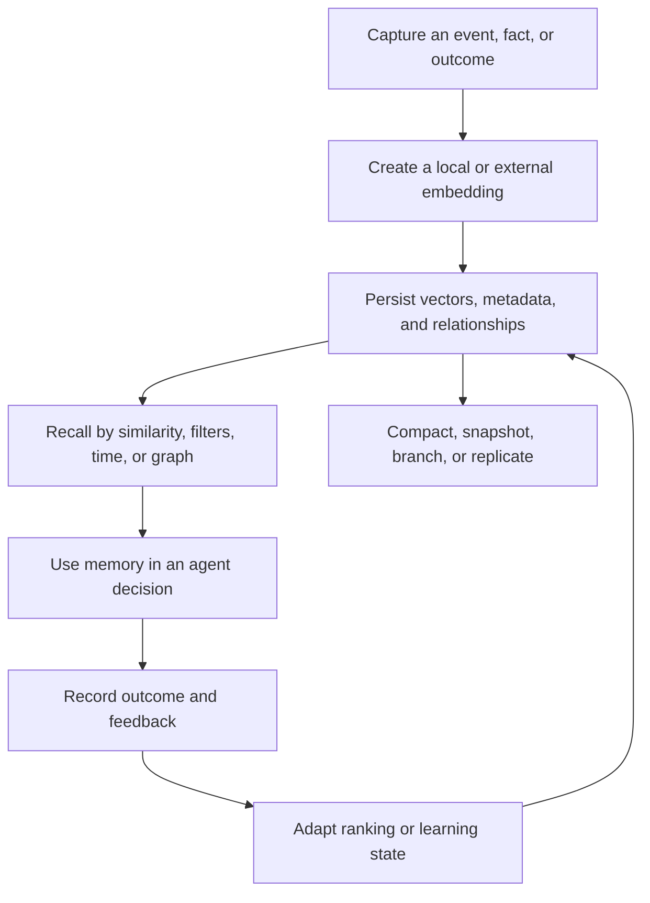

# RuVector

[](https://cognitum.one/ruvector)

[](https://crates.io/crates/ruvector-core)
[](https://www.npmjs.com/package/ruvector)
[](https://www.npmjs.com/package/ruvector)
[](https://www.npmjs.com/package/ruvector)
[](./LICENSE)

## Persistent, adaptive memory for AI agents

RuVector is a Rust native memory substrate for agents that need to remember across sessions. It combines local semantic embeddings, persistent vector retrieval, graph relationships, explicit feedback learning, memory lifecycle controls, and optional shared memory.

The default retrieval path runs locally. Learning happens from recorded outcomes and feedback, not from reads alone. Hosted services remain optional and create a separate data boundary.

## Remember and recall in 30 seconds

No database server or API key is required.

```bash
npx ruvector hooks remember --semantic --type decision \
  "The customer requires all inference to remain in Canada."

npx ruvector hooks recall --semantic --top-k 3 \
  "Where may customer data be processed?"
```

Memory is stored under the current project and remains available to later processes. The first semantic command downloads and caches the local `all-MiniLM-L6-v2` model. Keep one embedding model and dimension per store; use `npx ruvector hooks reembed` before changing an existing store from hash to semantic embeddings. Use `npx ruvector hooks stats` to inspect the store.

## Embed persistent memory in Node.js

```bash
npm install ruvector
```

```javascript
const { OnnxEmbedder, VectorDB } = require('ruvector');

async function main() {
  const embedder = new OnnxEmbedder();
  await embedder.init();

  const db = new VectorDB({
    dimensions: 384,
    distanceMetric: 'cosine',
    storagePath: './agent-memory.db',
  });

  const memories = [
    {
      id: 'decision-1',
      text: 'The customer requires all inference to remain in Canada.',
      kind: 'decision',
    },
    {
      id: 'episode-1',
      text: 'The Toronto pilot passed its privacy review on Tuesday.',
      kind: 'episode',
    },
    {
      id: 'procedure-1',
      text: 'Escalate production access through the security owner.',
      kind: 'procedure',
    },
  ];

  for (const memory of memories) {
    const vector = await embedder.embedPassage(memory.text);
    await db.insert({
      id: memory.id,
      vector,
      metadata: {
        text: memory.text,
        kind: memory.kind,
        tenant: 'acme',
        createdAt: Date.now(),
      },
    });
  }

  const query = await embedder.embedQuery(
    'Where may the customer data be processed?',
  );

  const results = await db.search({
    vector: query,
    k: 3,
    filter: { tenant: 'acme' },
  });

  console.log(results.map(({ score, metadata }) => ({ score, ...metadata })));
}

main().catch(console.error);
```

Reopen the same `storagePath` in another process to recover the stored vectors, metadata, configuration, and searchability. Search `score` is a distance, so lower values are closer. See the [Node.js API](./docs/api/NODEJS_API.md) and [Rust API](./docs/api/RUST_API.md) for the complete interfaces.

## The memory loop



RuVector provides primitives for this loop. Your application remains responsible for deciding what is worth remembering, which evidence is trusted, when a memory expires, and which actions recalled context may influence.

## What memory means in RuVector

Memory classes are application semantics over vectors, metadata, and graphs. The core store is general purpose. RuVector currently exposes two typed layers:

1. [`ruvllm::context::AgenticMemory`](./crates/ruvllm/src/context/agentic_memory.rs) combines working, episodic, semantic, and procedural memory behind one runtime API. It is implemented, but its unified manager is currently in memory and its cross type consolidation method is not complete.

2. [`ruvector-core::AgenticDB`](./crates/ruvector-core/src/agenticdb.rs) persists Reflexion episodes, skills, causal edges, learning sessions, policy state, session turns, and a hash linked witness log. Its typed memory APIs support ONNX, Candle, and API embedding providers for semantic retrieval.

| Memory class | Representation | RuVector surface |
| --- | --- | --- |
| Working and session | Current task, scratchpad, tool cache, turns, namespace, TTL | [`WorkingMemory`](./crates/ruvllm/src/context/working_memory.rs), [`SessionStateIndex`](./crates/ruvector-core/src/agenticdb.rs) |
| Episodic and Reflexion | Trajectory, task, action, observation, critique, outcome | [`EpisodicMemory`](./crates/ruvllm/src/context/episodic_memory.rs), [`ReflexionEpisode`](./crates/ruvector-core/src/agenticdb.rs) |
| Semantic | Facts, confidence, source, tags, relations, collection | [`VectorDB`](./crates/ruvector-core), [`SemanticFact`](./crates/ruvllm/src/context/agentic_memory.rs) |
| Procedural | Skills, actions, triggers, examples, policies, Q values | [`ProceduralSkill`](./crates/ruvllm/src/context/agentic_memory.rs), [`PolicyMemoryStore`](./crates/ruvector-core/src/agenticdb.rs) |
| Causal and relational | Nodes, edges, hyperedges, Cypher paths | [`ruvector-graph`](./crates/ruvector-graph) |
| Learning | Trajectories, rewards, adapters, EWC state | [`SONA`](./crates/sona) |
| Shared | Contributions, provenance, voting, transfer | [`mcp-brain`](./crates/mcp-brain) |
| Auditable | Hash linked entries, snapshots, RVF witnesses | [`WitnessLog`](./crates/ruvector-core/src/agenticdb.rs), [`ruvector-snapshot`](./crates/ruvector-snapshot), [RVF](./crates/rvf) |

## Capability map

### Capture and encode

| Capability | What it enables | Surface |
| --- | --- | --- |
| Local semantic embeddings | Text memory without a per query API fee | [`OnnxEmbedder`](./docs/adr/ADR-210-default-on-semantic-embeddings-minilm.md) |
| External embeddings | Bring an existing embedding model or provider | [`EmbeddingProvider`](./crates/ruvector-core/src/embeddings.rs) |
| Embedding provenance | Track model, dimension, normalization, and query or passage role | [ADR 210](./docs/adr/ADR-210-default-on-semantic-embeddings-minilm.md) |
| Batch and parallel embedding | Higher throughput during memory ingestion | [ONNX implementation](./docs/adr/ADR-210-default-on-semantic-embeddings-minilm.md) |

### Persist and organize

| Capability | What it enables | Surface |
| --- | --- | --- |
| Durable vector storage | Vectors, metadata, deletes, and restart recovery | [`ruvector-core`](./crates/ruvector-core) |
| Unified four type runtime memory | Working, episodic, semantic, and procedural recall | [`AgenticMemory`](./crates/ruvllm/src/context/agentic_memory.rs) |
| Typed persistent agent records | Reflexion episodes, skills, causal edges, policy state, sessions, and witness logs | [`AgenticDB`](./crates/ruvector-core/src/agenticdb.rs) |
| HNSW and flat indexes | Approximate or exact local similarity search | [`ruvector-core`](./crates/ruvector-core/src/index) |
| Collections and aliases | Separate schemas and namespaces by workload | [`ruvector-collections`](./crates/ruvector-collections) |
| Graph and hypergraph storage | Explicit relationships and multi-hop memory | [`ruvector-graph`](./crates/ruvector-graph) |
| High write ingestion | Mutable L0 memory plus background L1 and L2 compaction | [`ruvector-lsm-ann`](./crates/ruvector-lsm-ann) |
| Edge and embedded persistence | Lightweight local vector storage through the RVF Core Profile | [`rvlite`](./crates/rvf/rvf-adapters/rvlite) |
| PostgreSQL extension | Keep vector memory beside relational data | [`ruvector-postgres`](./crates/ruvector-postgres) |

### Recall and reconstruct

| Capability | Best use | Surface |
| --- | --- | --- |
| Dense similarity | General semantic recall | [`VectorDB::search`](./crates/ruvector-core/src/vector_db.rs) |
| Metadata filtering | Simple structured narrowing | [`SearchQuery`](./crates/ruvector-core/src/types.rs) |
| Sparse and dense fusion | Exact terms plus semantic meaning | [`ruvector-hybrid`](./crates/ruvector-hybrid), [ADR 256](./docs/adr/ADR-256-hybrid-sparse-dense-search.md) |
| Predicate aware ANN | Selective filters without post filter recall collapse | [`ruvector-acorn`](./crates/ruvector-acorn) |
| Temporal decay | Prefer recent memories when the domain changes | [`ruvector-temporal-coherence`](./crates/ruvector-temporal-coherence), [ADR 211](./docs/adr/ADR-211-temporal-coherence-agent-memory.md) |
| Coherence gating | Prefer memories supported by related observations | [`ruvector-temporal-coherence`](./crates/ruvector-temporal-coherence) |
| Graph reconstruction | Follow Cue, Tag, and Content associations instead of retrieving one flat chunk | [MRAgent example](./examples/mragent), [ADR 269](./docs/adr/ADR-269-mragent-graph-memory-darwin-optimization.md) |
| Multi-vector MaxSim | Late interaction over token or passage vectors | [`ruvector-maxsim`](./crates/ruvector-maxsim), [ADR 252](./docs/adr/ADR-252-multi-vector-maxsim.md) |
| GNN reranking | Rerank a noisy candidate graph | [`ruvector-gnn-rerank`](./crates/ruvector-gnn-rerank), [ADR 194](./docs/adr/ADR-194-gnn-rerank.md) |
| Matryoshka funnel | Coarse to fine search for truncatable embeddings | [`ruvector-matryoshka`](./crates/ruvector-matryoshka) |
| Disk backed ANN | Move read heavy indexes toward SSD scale | [`ruvector-diskann`](./crates/ruvector-diskann) |

### Learn and adapt

| Capability | What changes | Trigger |
| --- | --- | --- |
| SONA MicroLoRA | Small adapter weights | Recorded trajectory and reward |
| EWC++ consolidation | Protects important learned weights from catastrophic forgetting | Explicit consolidation |
| Outcome aware routing | Policy and routing preferences | Success, failure, or quality signal |
| GNN reranking | Candidate ordering | Training data or configured reranker |
| Self reconstructing graph memory | Shortcut edges after successful reconstruction | Successful graph traversal |
| Darwin optimization | Retrieval and reconstruction configuration | External benchmark and promotion gate |

Reading or searching memory does not, by itself, mutate learned weights or guarantee better future results.

### Consolidate, compress, and recover

| Capability | What it controls | Surface |
| --- | --- | --- |
| LRU, LFU, and coherence compaction | Which memories survive a capacity limit | [`ruvector-agent-memory`](./crates/ruvector-agent-memory), [ADR 252](./docs/adr/ADR-252-agent-memory-compaction.md) |
| Temporal tensor codecs | Low bit storage and temporal segment reuse | [`ruvector-temporal-tensor`](./crates/ruvector-temporal-tensor) |
| Product quantization | Compressed candidate search with exact query vectors | [`ruvector-pq-search`](./crates/ruvector-pq-search) |
| RaBitQ | Deterministic one bit candidate encoding and optional reranking | [`ruvector-rabitq`](./crates/ruvector-rabitq) |
| Graph condensation | Smaller graph memory while retaining original member provenance | [`ruvector-graph-condense`](./crates/ruvector-graph-condense) |
| Full snapshots | Serialized recovery data with compression and checksums | [`ruvector-snapshot`](./crates/ruvector-snapshot) |
| Copy on write branches | Isolated memory experiments without full copies | [RVF](./crates/rvf) |
| Cache consistency modes | Fresh, eventual, or frozen reads across data sources | [`ruvector-rulake`](./crates/ruvector-rulake) |

The `DbOptions.quantization` field in `ruvector-core` is persisted but is not currently applied to core storage or indexes. Use a specialized compression crate when physical compression is required. See the source note in [`types.rs`](./crates/ruvector-core/src/types.rs).

### Govern and distribute

| Capability | What it provides | Surface |
| --- | --- | --- |
| Namespace isolation | Separate collections and schemas | [`ruvector-collections`](./crates/ruvector-collections) |
| Capability gated retrieval | Per vector 64 bit read masks inside search | [`ruvector-capgated`](./crates/ruvector-capgated), [ADR 268](./docs/adr/ADR-268-capability-gated-ann.md) |
| Tamper evident lineage | Hash linked records and witness verification | [RVF](./crates/rvf) |
| Replication primitives | Vector clocks, local change propagation, and conflict strategies | [`ruvector-replication`](./crates/ruvector-replication) |
| Raft primitives | Election, log, and metadata state machine components | [`ruvector-raft`](./crates/ruvector-raft) |
| Shared collective memory | Remote contributions, search, provenance, and voting | [`mcp-brain`](./crates/mcp-brain) |

## Choose a memory path

| Requirement | Start with | Add when needed |
| --- | --- | --- |
| Local agent or coding memory | `npx ruvector hooks` | ONNX semantic mode, MCP |
| Embedded Node.js service | `ruvector` and `VectorDB` | Graph, SONA, snapshots |
| Embedded Rust service | `ruvector-core` | Specialized retrieval crates |
| Typed in-process agent memory | `ruvllm::context::AgenticMemory` | External persistence and consolidation policy |
| High write event stream | `ruvector-lsm-ann` | Snapshot and compaction policy |
| Multi-hop enterprise knowledge | `ruvector-graph` | Hybrid cue search and reconstruction harness |
| Recency sensitive memory | `ruvector-temporal-coherence` | Learned half-life after domain evaluation |
| Memory constrained edge node | `ruvector-pq-search` or `ruvector-rabitq` | Exact reranking for critical recalls |
| Existing lake or warehouse | `ruvector-rulake` | RVF witness bundles |
| PostgreSQL estate | `ruvector-postgres` | Build and operate with `pgrx` separately |
| Cross-agent shared memory | `mcp-brain` | Explicit hosted data policy and trust controls |

## Agent integration

For automated agent integration, install and pin the package locally:

```bash
npm install --save-exact ruvector
RUVECTOR_MCP_PROFILE=readonly ./node_modules/.bin/ruvector mcp start
```

List the currently available tools instead of relying on a hardcoded count:

```bash
./node_modules/.bin/ruvector mcp tools
```

Use `RUVECTOR_MCP_ALLOW` and `RUVECTOR_MCP_DENY` for an explicit tool policy. No policy preserves the broader compatibility surface, so production deployments should set one deliberately.

If you enable editor or coding hooks, inspect the generated configuration, keep the package local and pinned, and run `./node_modules/.bin/ruvector hooks verify`. Do not depend on a fresh `@latest` download inside each hook invocation.

## Deployment surfaces

| Surface | Package or crate | Data boundary |
| --- | --- | --- |
| Node.js and TypeScript | [`ruvector`](https://www.npmjs.com/package/ruvector) | Local process and local files |
| Rust | [`ruvector-core`](https://crates.io/crates/ruvector-core) | Local process and local files |
| Browser | [`@ruvector/wasm`](https://www.npmjs.com/package/@ruvector/wasm) | Browser memory and browser storage |
| HTTP service | [`ruvector-server`](./crates/ruvector-server) | Your service boundary |
| PostgreSQL | [`ruvector-postgres`](./crates/ruvector-postgres) | Your database boundary |
| RVF cognitive container | [`crates/rvf`](./crates/rvf) | Portable signed artifact |
| Shared Brain | [`mcp-brain`](./crates/mcp-brain) | Optional hosted service |

Native npm binaries cover glibc Linux on x64 and arm64, macOS on x64 and arm64, and Windows on x64. Browser and other environments use separate packages. The root package's fallback mode is limited when neither the native core nor RVF can load; use `@ruvector/wasm` explicitly for browser vector operations. Validate the selected backend with:

```bash
npx ruvector info
```

## Security and governance

1. Treat embeddings as sensitive derivatives of source data. Apply the same classification, residency, access, and retention policy as the original content.

2. Collections and metadata filters organize memory; they are not a complete authorization boundary. Enforce identity and authorization in the application. Capability gated ANN is currently a research component with a 64 capability mask and documented side channel and recall limitations.

3. RVF witnesses and hash linked logs are tamper evident. They do not encrypt memory content or prevent an authorized process from reading it.

4. A delete from the live store does not automatically remove copies in snapshots, branches, replicas, exports, or hosted memory. Define retention and erasure across every copy.

5. Shared Brain is a hosted plane. Review its network, identity, provenance, poisoning, and data residency controls before sending enterprise memory.

6. Pin and prepopulate embedding models for offline or regulated deployments. The default npm semantic path downloads its model on first use.

7. Keep tool execution separate from memory retrieval. Retrieved context is untrusted input until policy checks and action authorization pass.

See [SECURITY.md](./SECURITY.md) for reporting and project security guidance.

## Known boundaries

1. The repository is a monorepo. Installing `ruvector` does not activate every crate in this capability map.

2. The unified four type `ruvllm::AgenticMemory` manager does not yet have native save and load support, and its episodic to semantic or procedural consolidation method currently returns no changes. Durable `VectorDB` storage and typed runtime memory are not yet one facade.

3. Core metadata filtering currently narrows the retrieved candidate set. Highly selective filters may return fewer than `k` relevant results. Evaluate ACORN or an application level prefilter for selective workloads.

4. Opening a persisted HNSW database currently enumerates stored vectors and rebuilds the index. Measure cold start time against the intended memory size.

5. Temporal coherence currently builds an exact pairwise coherence graph and is a proof of concept for moderate memory sets. The planned production path is an approximate neighbor graph.

6. Agent memory compaction is not yet wired into the default core, MCP, or RVF persistence path.

7. Full snapshot serialization exists, but incremental snapshots, scheduling, cloud backends, and direct `VectorDB` restoration are not complete on the current main branch.

8. Replication exposes local primitives and simulated transport behavior. Raft still has incomplete response transport and snapshot installation paths. These are not a complete production network replication plane.

9. GNN reranking, MRAgent reconstruction, and Darwin optimization are implemented research surfaces, not automatic behavior in `VectorDB::search`.

10. RVF and PostgreSQL are separate build surfaces and are excluded from the default workspace build because they require their own toolchains.

11. Performance depends on vector dimension, index parameters, filter selectivity, recall target, hardware, and backend. Run the included benchmark for the component and workload you intend to deploy.

## Reproduce the evidence

RuVector keeps benchmark code beside the implementation. These commands exercise memory relevant components without relying on unscoped cross product comparisons.

```bash
# Core vector search
cargo bench -p ruvector-core

# High write LSM memory
cargo run --release -p ruvector-lsm-ann --bin benchmark

# Temporal and coherence weighted recall
cargo run --release -p ruvector-temporal-coherence --bin tcd-benchmark

# Capability gated retrieval
cargo run --release -p ruvector-capgated --bin benchmark

# Matryoshka coarse to fine retrieval
cargo run --release -p ruvector-matryoshka --bin benchmark
```

Record dataset size, dimension, index configuration, hardware, latency percentiles, throughput, and recall together. A latency number without its recall target is not a useful retrieval benchmark. See the [benchmarking guide](./docs/benchmarks/BENCHMARKING_GUIDE.md).

## Build from source

```bash
git clone https://github.com/ruvnet/RuVector.git
cd RuVector
cargo test --workspace
```

The workspace requires Rust 1.77 or newer. RVF and PostgreSQL have separate build instructions in their component documentation.

## Documentation

| Topic | Link |
| --- | --- |
| Documentation index | [docs/INDEX.md](./docs/INDEX.md) |
| Node.js API | [docs/api/NODEJS_API.md](./docs/api/NODEJS_API.md) |
| Rust API | [docs/api/RUST_API.md](./docs/api/RUST_API.md) |
| Cypher reference | [docs/api/CYPHER_REFERENCE.md](./docs/api/CYPHER_REFERENCE.md) |
| Architecture decisions | [docs/adr](./docs/adr) |
| Benchmarks | [docs/benchmarks](./docs/benchmarks) |
| Repository structure | [docs/REPO_STRUCTURE.md](./docs/REPO_STRUCTURE.md) |

## Contributing

Contributions are welcome. Start with the [contribution guide](./docs/development/CONTRIBUTING.md). New capability claims should include an implementation link and reproducible evidence.

## License

RuVector is available under the [MIT License](./LICENSE).

Built by [rUv](https://ruv.io) and powering [Cognitum](https://cognitum.one).
