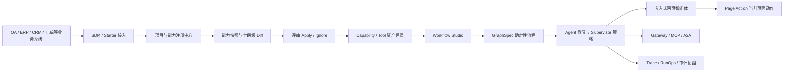
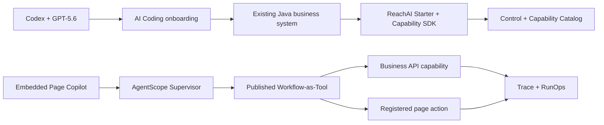

<p align="center">
  
</p>

<h1 align="center">睿池 ReachAI</h1>

<p align="center">
  <strong>让已有 Java 企业系统快速接入可控 AI</strong>
</p>

<p align="center">
  用 AI 辅助搭建确定性业务流程，用 Graph 层固化可执行语义，让智能体安全调用 OA、ERP、CRM、工单、合同、采购等系统中的真实业务能力。
</p>

<p align="center">
  <strong>AI Coding 原生：</strong>通过 Manifest、可安装 Skill 与工程化 API，让 Codex、Cursor、Claude Code 等工具直接完成业务系统接入、页面助手建设和 Workflow 全生命周期工程。
</p>

<p align="center">
  <a href="https://openjdk.org/projects/jdk/17/"></a>
  <a href="https://spring.io/projects/spring-boot"></a>
  <a href="https://spring.io/projects/spring-ai"></a>
  <a href="https://vuejs.org/"></a>
  <a href="LICENSE"></a>
</p>

<p align="center">
  
</p>

## 产品截图

| SDK 快速接入 | Workflow Studio / GraphSpec |
| --- | --- |
|  |  |

| 嵌入到业务系统 | 使用 AI Coding 快速接入 |
| --- | --- |
|  |  |

| 页面接入中心            | AI Coding完成页面智能化改造                                                             |
|-------------------------------------------------------------|--------------------------------------------------------------------------------|
|  |  |

| AI 生成 Workflow 草稿 | 接口图谱与业务能力 |
| --- | --- |
|  |  |

| RunOps 运行中心 | 执行链路追踪 |
| --- | --- |
|  |  |

| 交互式卡片 | 高频能力识别 |
| --- | --- |
|  |  |

> ReachAI 不只把 AI 能力嵌入业务系统，也把平台的工程能力开放给 AI Coding 工具。开发者可以把项目接入信息交给 Codex、Cursor 或 Claude Code，由它们在真实业务仓库中完成改造，并通过 ReachAI API 创建、校验、调试和发布 Workflow。

## 学习交流

如果你对 ReachAI 感兴趣，欢迎加入学习交流群。项目还在持续完善中，欢迎大家一起交流实践经验、提出建议，也请多多指教。

加群二维码如下（二维码有效期有限，如失效可重新获取）：

<p align="center">
  
</p>

## ReachAI 是什么

ReachAI 面向已有 Java 企业系统，帮助企业把存量接口、领域方法、页面动作、知识库和固定业务流程接入到 AI 智能体体系中。

它不是再搭一个孤立的 AI 应用，也不是只做聊天机器人或工作流画布。ReachAI 的核心思路是：

**AI 负责理解需求和辅助搭建，Graph 负责确定性执行，SDK 和临时 token 负责跨系统连接，智能体最终回到真实业务页面里完成工作。**

对于 OA、ERP、CRM、MES、合同、采购、工单、班组管理等系统，ReachAI 希望解决的是一个很现实的问题：

> 已有企业系统如何低改造接入 AI，同时不牺牲流程确定性、权限边界、审计追踪和跨系统协作？

## 为什么不是 AI 孤岛

很多 AI 应用搭建平台更适合从零构建一个独立 AI 应用。但企业现场的大量价值已经沉淀在现有系统中：接口、审批流、页面操作、业务权限、用户身份、运行日志和历史数据都在老系统里。

ReachAI 不要求企业把业务搬到另一个 AI 平台里，而是把 AI 接回企业系统：

- 后端通过 `reachai-spring-boot2-starter` 和 `reachai-capability-sdk` 注册已有业务能力。
- 平台形成项目、实例、能力快照、字段级 diff 和评审链路。
- Workflow Studio 用 `GraphSpec` 固化确定性业务流程。
- Agent 根据用户意图选择 Workflow、Capability、Tool、知识检索、MCP 调用或页面动作。
- Chat Embed SDK 和 Page Bridge 让智能体嵌入到 OA / ERP / CRM 等业务页面。
- 临时 token 机制打通平台身份、业务用户、Agent 授权和跨系统调用。
- Trace / RunOps / ACL / Guard 让每一次调用都可审计、可复盘、可治理。

## 和 Dify 这类 AI 应用编排平台的区别

Dify 这类平台很适合快速搭建独立 AI 应用、Prompt 编排和知识库问答。但在已有企业系统改造场景里，如果 AI 应用和业务系统之间只靠手写 HTTP 接口连接，就很容易变成新的孤岛：

- 业务接口需要在 AI 平台里手工配置和维护。
- 业务系统字段、参数、权限或流程变化后，Workflow 需要人工同步修改。
- 一旦变量很多，节点之间的参数传递、字段映射和错误排查会越来越痛苦。
- AI 应用知道自己的流程，却不天然知道企业系统里的项目、实例、能力版本、页面动作和业务用户身份。
- 调用链路分散在 AI 平台和业务系统两边，审计、复盘、权限解释和变更影响分析都更难闭环。

ReachAI 更关注“已有企业系统如何持续接入 AI”，所以它不是把业务系统当成外部黑盒接口，而是通过 SDK、Graph、临时 token 和治理链路把系统连接起来。

| 对比点 | 常见独立 AI 应用编排方式 | ReachAI 的方式 |
| --- | --- | --- |
| 业务能力接入 | 手写 HTTP Tool，靠人工维护接口参数 | SDK / Starter 主动注册能力、实例、快照和 SDK 图 |
| 业务变化同步 | 接口变了以后手动改 Workflow | 字段级 diff、评审 apply/ignore、稳定能力引用 |
| 流程语义 | 画布和变量配置容易绑定在应用内部 | `GraphSpec` 作为 Workflow 的可执行语义层 |
| 复杂变量传递 | 变量越多，节点映射越难维护 | Graph 节点、端口、引用、上下文和运行轨迹统一建模 |
| 业务身份 | AI 应用通常只知道自己的用户或 API Key | 临时 token 连接平台用户、业务用户、Agent、页面实例和 Origin |
| 网页内操作 | 通常需要业务系统额外写大量胶水代码 | Chat Embed + Page Bridge + Page Action 嵌入当前业务页面 |
| 运行治理 | 调用日志和业务审计容易割裂 | Trace / RunOps / ACL / Guard / Replay / Compare 统一复盘 |
| 外部 AI 修改流程 | 多数停留在平台内拖拽和配置 | Workflow AI Coding 接口支持 Codex、Cursor 等工具读取、patch、校验、运行 |

一句话说：**Dify 更像独立 AI 应用搭建器，ReachAI 更像已有企业系统的 AI 接入层、Graph 工程层和运行治理层。**

## 核心闭环



这条链路把企业 AI 落地拆成几件可控的事情：

1. 业务系统注册自己已有的接口、领域方法和运行实例。
2. 平台把这些能力沉淀为可评审、可治理、可复用的资产。
3. AI 辅助生成或修改 Workflow，但最终落到可执行的 `GraphSpec`。
4. Agent 作为统一入口，根据用户意图调用确定性流程和企业能力。
5. 网页智能体嵌入到业务页面内，通过临时 token 和 Page Action 安全操作当前页面。
6. RunOps、Trace、ACL、Guard 和审计日志负责生产治理。

## 亮点能力

### AI 生成流程，但 Graph 保证确定性

企业业务不能完全依赖大模型临场发挥。请假审批、费用报销、合同查询、工单流转、采购申请等流程需要可校验、可发布、可回滚和可审计。

ReachAI 支持用 AI 生成 Workflow 草稿，也支持用自然语言对局部节点和流程进行语义修改。但最终保存和执行的是平台统一的 `GraphSpec`，而不是一段不可控提示词。

`GraphSpec` 是 ReachAI 的运行语义层：

- 连接 Workflow Studio 画布、AI 生成、AI 局部修改和 SDK 图同步。
- 支撑发布校验、版本快照、Runtime 执行和 RunOps 复盘。
- 区分运行语义和画布布局，避免流程只停留在前端展示层。

### AI Coding 原生：让 Codex、Cursor 直接操作 ReachAI

ReachAI 将系统接入和 Workflow 工程能力设计成面向 AI Coding 工具的一等接口，而不是只提供一套需要人工阅读的 SDK 文档。项目接入和业务页面任务由平台签发一次性交接包；Cursor 或 Codex 激活后只获得当前任务的短期 Token，读取受限上下文并回传事件、问题和结构化结果。Workflow 工程接口是另一条独立链路，继续使用显式项目级鉴权完成 GraphSpec 的创建、修改、校验、调试和发布。

| AI Coding 场景 | 可完成的工作 | ReachAI 的控制边界 |
| --- | --- | --- |
| 业务系统接入 | 识别 Maven 模块、Java / Spring Boot 版本，接入 SDK / Starter，补充注册配置、网关路由、Embed Token Broker 和前端嵌入 | 一次性交接、任务级短期 Token、事件/问题/Artifact 回传和 `CODE_READY / RUNTIME_READY / E2E_READY` 分层自检 |
| 业务页面工作台 | 扫描业务模块、路由、页面组件和直接关联 API；按选定页面发起只读分析、明确实施和浏览器验收任务 | 页面目录、目标级读写范围、结构化结果契约、状态机、Page Bridge、发布数据与验收审计 |
| Workflow 工程 | 创建 Workflow，读取上下文，结构化 patch `GraphSpec`，校验、调试运行、查看 Trace / RunOps、检查版本并发布 | `dryRun` 预览、并发 revision、发布校验、版本快照、权限与审计 |
| 项目上下文治理 | 提交从代码中提取的项目、页面、API、模块和 Workflow 上下文候选，回查状态与审计记录 | 候选评审后进入治理资产，不允许 AI 绕过审核直接污染正式上下文 |

典型使用方式是：

1. 在 ReachAI 的 **项目接入工作台** 或 **业务页面工作台** 创建任务并生成一次性交接包。
2. 把交接包复制一次给当前仍活跃的 Cursor 或 Codex 会话；客户端激活一次性代码并读取当前任务上下文。
3. AI 工具只使用短期任务 Token 回传真实进度、待回答问题和符合 JSON Schema 的 Artifact；终态、取消或交接关闭后 Token 立即失效。
4. ReachAI 校验并应用结果，开发者在工作台复核平台检查、页面地图、Trace 和真实浏览器验收结果。

Workflow AI Coding 不复用任务 Token：它继续使用项目级 `X-ReachAI-AiCoding-Key` 调用受版本、revision、dry-run、发布校验和审计约束的工程接口。ReachAI 不安装 Runner，也不承诺在本地 AI Coding 会话停止后自动唤醒它。

例如，开发者可以直接提出：

- “把这个 Spring Boot 2 系统接入 ReachAI，并完成 SDK 注册、网关和网页智能体自检。”
- “创建一个合同审批 Workflow，在审批前增加金额校验，失败时转人工处理。”
- “把客户查询节点改为调用 CRM Capability，先 dry-run、校验，再执行调试并给出 traceId。”
- “为当前订单页面增加筛选和提交两个 Page Action，完成页面助手 Workflow 并做 smoke test。”

这里开放的是**受认证、校验、版本和审计约束的工程接口**，不是让外部 AI 直接修改数据库。Workflow 的运行语义始终以 `GraphSpec` 为准，`canvas_json` 只承载画布布局。完整 API 与 Patch 协议见 [Workflow AI Coding](docs/reference/Workflow-AI-Coding.md)。

### SDK 低改造接入已有系统

业务系统不需要为了接入 AI 重写一套服务。新系统和核心系统可以通过 ReachAI SDK 主动注册能力，存量系统也可以通过扫描和治理逐步接入。

```java
@ReachCapability(
    name = "submitLeaveRequest",
    title = "提交请假申请",
    description = "根据员工、时间和请假类型提交 OA 请假流程",
    domain = "oa",
    module = "leave",
    sideEffect = ReachSideEffectLevel.WRITE,
    requiredRoles = {"oa.leave.submit"}
)
public LeaveResult submitLeave(
    @ReachParam(name = "request", description = "请假申请信息", required = true)
    LeaveRequest request
) {
    return leaveService.submit(request);
}
```

Starter 会同步项目、实例、能力快照和 SDK 图。平台侧不会直接覆盖生产资产，而是形成字段级 diff、评审 apply/ignore、稳定引用和审计记录。

### 临时 token 打通平台和业务身份

企业智能体不能只知道“平台用户是谁”，还必须知道“业务系统当前登录用户是谁”。

ReachAI 的嵌入式对话链路使用短期 token：

- 前端 SDK 只持有短期 `embedToken`，不保存 `appSecret`。
- 业务后端使用应用凭证和当前登录用户向平台申请 token。
- 平台校验 App、Origin、Agent、用户状态、TTL、撤销记录和密钥。
- Tool 调用和 Page Action 可以携带业务用户上下文，方便业务系统二次鉴权。
- Trace / RunOps 可以按平台用户、业务用户、Agent、项目、会话和页面实例复盘。

### 网页智能体嵌入业务页面

ReachAI 支持把智能体嵌入到已有业务系统页面中，而不是把用户带到另一个平台。

业务页面可以通过 Chat Embed SDK 接入对话框，通过 Page Bridge 注册当前页面动作。智能体可以理解当前页面上下文，并在授权范围内调用已注册动作：

- 打开详情。
- 设置筛选条件。
- 回填表单。
- 提交审批。
- 创建工单。
- 展示结构化结果。

页面动作必须绑定当前 `sessionId + pageInstanceId`，执行结果会回传平台并写入审计。

### 开放协议连接更多工具和智能体

ReachAI 不只服务自己的管理端。平台可以通过 Gateway、MCP、A2A 等协议，把已治理的 Agent 和 Capability 暴露给 IDE、外部 Agent、自动化工具或其他业务系统。

这让 ReachAI 更像企业 AI 能力的控制面和运行治理层，而不是一个封闭工作流编辑器。

## 你可以用 ReachAI 做什么

| 场景 | ReachAI 提供的能力 |
| --- | --- |
| OA 快速接入 AI | 把请假、审批、通知、查询等能力注册为可治理 Capability，并用 Workflow 固化流程 |
| 企业固定流程自动化 | 用 AI 生成流程草稿，用 `GraphSpec` 发布可校验、可回放的确定性流程 |
| 智能体调用多个系统 | Agent 根据用户意图选择 Workflow、Tool、Capability、MCP 或 A2A 调用 |
| 网页智能体嵌入 | 在业务页面内接入 Chat Widget，通过 Page Bridge 调用当前页面动作 |
| 跨系统身份打通 | 用短期 token 连接平台用户、业务用户、Agent 授权和页面实例 |
| 运行治理与审计 | 通过 RunOps、Trace、ACL、Guard、Replay 和 Compare 复盘每一次执行 |
| 外部 AI Coding 修改流程 | 让 Codex、Cursor 等工具读取 Workflow 上下文、提交 Graph patch、校验、调试并发布 |
| 能力资产治理 | 管理项目、实例、能力快照、字段级 diff、评审记录和稳定引用 |

## 当前功能模块

| 模块 | 说明 |
| --- | --- |
| `reachai-capability-sdk` | JDK8 兼容的业务能力声明 SDK 契约 |
| `reachai-spring-boot2-starter` | Spring Boot 2 业务系统接入 Starter，支持注册、心跳、能力同步和 SDK 图同步 |
| `reachai-control-service` | 当前 Platform Control / public API BFF 主入口，承接 `/api/**`、`/embed/**` 和 SDK 注册公开入口 |
| `reachai-runtime-service` | 当前 Runtime Host 部署单元，承接 Agent、Workflow、GraphSpec、Trace、RunOps、调试和运行时内部 API |
| `reachai-capability-service` | 当前 Capability Catalog 部署单元，承接 SDK 注册、项目实例、能力快照、diff/review/apply、扫描目录和能力资产 API |
| `reachai-knowledge-service` | 当前 Knowledge / Retrieval 部署单元，承接知识库、文件、chunk、RAG、业务索引、向量检索和历史扫描器实现 |
| `reachai-model-service` | 当前 Model Gateway 部署单元，承接模型实例、Chat、Embedding、Rerank 和 OpenAI 兼容代理 |
| `ai-runtime-contract` | 中台内部 Tool / Skill 运行时契约 |
| `ai-admin-front` | Vue 3 管理端，承载注册中心、Workflow Studio、RunOps、模型、知识、治理和开放协议页面 |
| `sql` | 统一 SQL 基线和升级脚本 |
| `docs` | 系统知识库、产品说明和截图资料 |

## 当前部署单元与目标逻辑域

当前后端重塑已进入物理服务拆分后的旧结构退场阶段。第一阶段保持同一个 MySQL 库，不拆库；公共入口由 `reachai-control-service` 保持 `/api/**`、`/embed/**` 和 SDK 注册入口兼容。默认 Maven reactor、本地启动和部署清单收敛到五个当前物理服务：

| 目标逻辑域 | 当前部署单元 | 说明 |
| --- | --- | --- |
| Model Gateway | `reachai-model-service` | 模型实例、供应商适配、Chat、Embedding、Rerank、OpenAI 兼容代理 |
| Knowledge / Retrieval | `reachai-knowledge-service` | 知识库、文件、chunk、RAG、向量检索、业务索引 |
| Capability Catalog | `reachai-capability-service` | SDK 注册、能力快照、字段级 diff、评审 apply/ignore、扫描目录、语义文档、Tool/Capability 资产 |
| Runtime Host | `reachai-runtime-service` | Agent 身份与 Supervisor、Workflow、GraphSpec 执行、调试、人工交互、Runtime Adapter |
| Platform Control | `reachai-control-service` | 身份、RBAC、ACL、Guard、Gateway、MCP、A2A、市场、RunOps/Trace 管理面和 public API/BFF |

这次拆分不改变公开路由、SQL 表名、前端代理或页面结构。旧 `ai-agent-service` 已从仓库主路径删除，不再是平台主后端、Maven module、IDEA 后端项目、本地启动项或部署单元；剩余兼容路径必须显式迁入 owning service 本地实现，或正式删除。公共路由主路径、冻结兼容 alias 和 retired route 见 [Public Route Contracts](docs/architecture/public-route-contracts.md)；详细规则见 [Backend Boundaries And Naming](docs/architecture/backend-boundaries-and-naming.md)、[Physical Split Route Ownership](docs/architecture/physical-split-route-ownership.md) 和 [Legacy Retirement](docs/architecture/legacy-retirement.md)。

## 快速开始

### 1. 启动基础设施

```bash
docker compose -f deploy/docker-compose.infra.yml up -d
```

### 2. 初始化数据库

```bash
mysql -h localhost -u root -proot < sql/initV2.sql
```

### 3. 构建后端

```bash
mvn clean install -DskipTests
```

默认 Maven reactor 只包含当前主路径模块和五服务部署单元；旧 `ai-agent-service` module 已删除。

### 4. 启动服务

仓库已提供 IDEA 共享 Run Configurations：`00 ReachAI Five Services` 可一键启动五个服务，`01 ReachAI Model Service` 到 `05 ReachAI Control Service` 可按编号单独启动和调试。在 IDEA 重新加载 Maven 项目后即可使用；这些配置只指定 Spring Boot 主类和 Maven module，不写入任何本机密钥。

```bash
# Model Gateway，默认 18601
cd reachai-model-service
mvn spring-boot:run

# Knowledge / Retrieval，默认 18602，context-path /ai
cd ../reachai-knowledge-service
mvn spring-boot:run

# Capability Catalog，默认 18605
cd ../reachai-capability-service
mvn spring-boot:run

# Runtime Host，默认 18604
cd ../reachai-runtime-service
mvn spring-boot:run

# Platform Control / public API BFF，默认 18603
cd ../reachai-control-service
mvn spring-boot:run
```

本地推荐启动顺序：`reachai-model-service`（18601）→ `reachai-knowledge-service`（18602，`/ai`）→ `reachai-capability-service`（18605）→ `reachai-runtime-service`（18604）→ `reachai-control-service`（18603）。默认五服务拓扑不再包含 `ai-agent-service:18606`；剩余 public route 必须逐路由确认由 owning service 本地实现承接，或正式删除。

常用环境变量：

推荐在 Windows 上运行交互式脚本，它会写入当前用户环境变量，并自动生成 `AI_MYSQL_URL`：

```powershell
powershell -NoProfile -ExecutionPolicy Bypass -File .\scripts\set-ai-mysql-env.ps1
```

也可以在资源管理器或 `cmd` 中运行：

```cmd
scripts\setup-ai-mysql-env.cmd
```

脚本执行后，如果使用 IntelliJ IDEA 启动后端，请重启 IDEA，再重新启动 Spring Boot Run Configuration。Windows 用户环境变量不会自动刷新到已经打开的 IDEA、Cursor、Codex 或 PowerShell 进程中。

只想在当前 PowerShell 窗口临时启动时，可以手动设置：

```powershell
$env:AI_MYSQL_HOST="localhost"
$env:AI_MYSQL_PORT="3306"
$env:AI_MYSQL_DATABASE="reach_ai"
$env:AI_MYSQL_USER="reach_ai"
$env:AI_MYSQL_PASSWORD="<your-mysql-password>"
$env:AI_MYSQL_URL="jdbc:mysql://$env:AI_MYSQL_HOST`:$env:AI_MYSQL_PORT/$env:AI_MYSQL_DATABASE?useUnicode=true&characterEncoding=utf-8&serverTimezone=Asia/Shanghai"
$env:REDIS_HOST="localhost"
$env:REDIS_PORT="6379"
$env:REDIS_PASSWORD=""
$env:MILVUS_HOST="localhost"
$env:MILVUS_PORT="19530"
$env:MODEL_SERVICE_URL="http://localhost:18601"
$env:KNOWLEDGE_SERVICE_URL="http://localhost:18602"
$env:CAPABILITY_SERVICE_URL="http://localhost:18605"
$env:RUNTIME_SERVICE_URL="http://localhost:18604"
```

五个服务都启动后，在仓库根目录执行一次启动链路自检：

```powershell
$env:REACHAI_PLATFORM_SESSION_TOKEN = '<登录 ReachAI 管理端后取得的平台会话令牌>'
node scripts/check-physical-service-smoke.mjs --wait-ms 120000 --interval-ms 3000
Remove-Item Env:REACHAI_PLATFORM_SESSION_TOKEN
```

### 5. 启动管理端

```bash
cd ai-admin-front
npm install
npm run dev
```

访问 [http://localhost:5200](http://localhost:5200)。

## 技术栈

| 层级 | 技术 |
| --- | --- |
| 后端 | Java 17、Spring Boot 3.4、Spring Cloud 2024、Spring Cloud Alibaba |
| AI | Spring AI 1.0、Spring AI Alibaba、AgentScope、LangGraph4j |
| 数据 | MySQL、Redis、Milvus |
| ORM | MyBatis-Plus |
| 文档与扫描 | JavaParser、Apache POI、PDFBox |
| 前端 | Vue 3、Vite、Element Plus、TypeScript、Pinia、Vue Flow、AntV G6 |
| 部署 | Docker、Kubernetes |

## 命名说明

- 产品语义中，可编排、可治理、可复用的业务单元统一称为 **Capability / 能力**。
- 历史代码和接口中仍可能出现 `skill`、`skills` 等命名；当前新库表名已收敛为 service/domain 前缀，例如 `capability_draft`、`runtime_skill_interaction`。
- `GraphSpec` 是 Workflow 的运行语义，`canvas_json` 是画布布局，不应把画布 JSON 当作运行时语义来源。
- `eaf.*`、`X-EAF-*`、`Eaf*` 等历史技术标识仍可能作为兼容边界存在；产品品牌和新接入默认使用 ReachAI。

## 一句话总结

ReachAI 让企业已有系统快速拥有可控 AI：**Codex、Cursor 等 AI Coding 工具负责接入与工程实施，Graph 固化确定性执行，SDK 连接真实业务能力，临时 token 打通跨系统身份，网页智能体回到 OA/ERP/CRM 页面里完成工作。**

## OpenAI Build Week 2026 Submission

**Project:** ReachAI: Codex-to-Production for Enterprise Agents<br>
**Track:** Developer Tools — agentic workflows and enterprise integration tooling<br>
**License:** [MIT](LICENSE)<br>
**Demo video:** [Watch the ReachAI OpenAI Build Week demo on YouTube](https://youtu.be/xZEB9oQWKug)

### What ReachAI does

ReachAI helps teams bring governed AI agents into existing Java enterprise systems. Instead of rebuilding an OA, ERP, CRM, MES, or internal operations system as a separate AI application, developers connect its real APIs, domain methods, user identity, permissions, and page actions to ReachAI.

The resulting agent can understand a request, select one or more published Workflows, call a real business API or an explicitly registered page action, render structured results, require confirmation for writes, and record the complete execution in Trace and RunOps.

### Existing project versus Build Week work

ReachAI existed before OpenAI Build Week. The pre-existing project supplied the foundational Java services, administration UI, and early Capability, Agent, and Workflow concepts. This submission is specifically about the meaningful extensions built and proven during the July 13–21 submission period with Codex and GPT-5.6:

- A Codex-oriented SDK onboarding workbench that exposes a project Manifest, an installable Skill, scoped engineering APIs, step-by-step evidence reporting, and layered `CODE_READY / RUNTIME_READY / E2E_READY` checks.
- End-to-end onboarding of an existing Spring Boot business system through `reachai-spring-boot2-starter`, gateway routing, an Embed Token Broker, and the Chat Embed SDK.
- A project Page Copilot Agent whose AgentScope Supervisor selects published Workflow-as-Tool targets according to user intent.
- Two governed execution paths: direct business API capabilities and explicit page actions bound to the current page instance.
- Generic `LIST_CARD` rendering, result counts, first-five display, and “expand remaining” behavior without business-specific card code.
- Strong confirmation for write operations, followed by a second authorization and business-rule check in the business backend.
- Version-pinned Agent and Workflow releases plus RunOps evidence for planning, workflow selection, node execution, tool calls, latency, and traceability.

The submission does not claim that the entire repository was created during Build Week. The dated evidence below identifies the work completed inside the submission window.

### How we used Codex and GPT-5.6

GPT-5.6 was used in Codex as the build-time reasoning model for the core Build Week work. Codex operated directly against the real ReachAI and business-system repositories rather than generating a disconnected prototype.

| Phase | How Codex and GPT-5.6 contributed |
| --- | --- |
| Repository understanding | Inspected the multi-module Maven topology, Vue application, runtime contracts, gateway security, SDK registration, page bridge, and existing business-system code before proposing changes. |
| SDK onboarding | Implemented and validated Starter configuration, registry callbacks, gateway routes, Embed Token Broker behavior, frontend Chat Embed integration, and sessionized onboarding evidence. |
| Agent and Workflow engineering | Created and refined deterministic `GraphSpec` workflows, attached published versions as Supervisor tools, validated release contracts, and kept page actions separate from direct API capabilities. |
| Failure diagnosis | Traced identity, permission, token, streaming, page-action callback, workflow-selection, and interaction-resume failures across browser, gateway, control, runtime, and business-service boundaries. |
| Live validation | Ran targeted tests and builds, exercised the real browser flow, checked stable demo data, and verified planning, tool calls, and latency in RunOps. |
| Submission preparation | Helped structure the Devpost story, produce the under-three-minute bilingual demo, redact credentials, and document reproducible judge flows. |

Codex accelerated repository navigation, cross-service reasoning, implementation, testing, and evidence collection. The human author retained the product decisions, accepted or rejected proposed changes, chose the demo scope, and verified the final behavior. ReachAI's runtime model remains configurable; the Build Week claim here concerns the real use of GPT-5.6 within Codex to build and validate this submission.

### Key human product and engineering decisions

- **Extend existing systems instead of replacing them.** ReachAI connects to the real Java application, business identity, permissions, and pages.
- **Keep execution deterministic.** AI can help author and select a Workflow, but the published `GraphSpec` is the executable contract.
- **Make page operation explicit.** The Supervisor prefers a page-action Workflow only when the user asks to operate the page; otherwise it can select a business API Workflow.
- **Never bypass business authorization.** A zero-result API response caused by the current user's data visibility is treated as correct behavior, not something for the agent to work around.
- **Require confirmation for writes.** The runtime presents a confirm/cancel interaction before invoking a write, and the business backend validates authorization and business state again.
- **Use reusable presentation contracts.** Team results use the platform-level `LIST_CARD` protocol rather than a one-off team-management component.
- **Publish and observe everything.** Agent configurations and Workflow versions are pinned, while RunOps and Trace retain evidence for audit, replay, and diagnosis.

### Submission architecture



### Judge quick start

**Validated platform:** Windows 11. The backend is Java 17 and the frontend is Vue 3; Docker-based infrastructure and the JVM services are also intended for Linux and macOS development environments.

**Prerequisites:** Java 17+, Maven, Node.js 20 LTS, npm, Docker, Docker Compose, and a MySQL client.

```bash
# 1. Start MySQL, Redis, and Milvus
docker compose -f deploy/docker-compose.infra.yml up -d

# 2. Initialize the ReachAI database
mysql -h localhost -u root -proot < sql/initV2.sql

# 3. Build the backend
mvn clean install -DskipTests

# 4. Start the five services with the shared IDEA configuration
#    "00 ReachAI Five Services"

# 5. Start the administration frontend
cd ai-admin-front
npm install
npm run dev
```

Open [http://localhost:5200](http://localhost:5200). Detailed service-by-service commands and environment variables are available in [快速开始](#快速开始).

The demonstration uses a dedicated local team-management test project connected to ReachAI. Its records are synthetic fixtures used to make expected results stable. Business login credentials, App Secrets, Embed Tokens, and AI Coding Keys are intentionally not committed to this repository. If an interactive hosted judge environment is supplied, its temporary credentials belong only in the private Devpost testing instructions.

### Demo prompts and expected behavior

These are the stable flows used in the recorded demonstration:

| Execution path | Prompt | Expected behavior |
| --- | --- | --- |
| Direct business API | `不要操作页面，直接调用业务接口查询建设一工班` | Returns zero visible records for the current identity, demonstrating that ReachAI preserves business data permissions. |
| Page action | `请操作当前页面，查询成员为刘阳的班组` | The Supervisor selects the page-query Workflow; the page and generic list card both show two matching records. |
| Combined page filters | `请操作当前页面，查询负责人为靳圣辉、成员包含刘阳的班组` | Structured manager and member filters produce two stable results. |
| Expand generic results | `帮我在页面上查询负责人为靳圣辉的班组` | Nine results are found; the card shows five first and allows the remaining four to be expanded. |
| Governed write | Use only a dedicated disposable enabled record with no unfinished period. | ReachAI resolves one record, presents confirm/cancel, and invokes the write only after confirmation; the backend checks permission and business state again. |

### Dated Build Week evidence

| Date | Commit | Evidence |
| --- | --- | --- |
| 2026-07-14 | `ec611994` | Reshaped Agent Supervisor, Workflow Studio, and the RunOps runtime path. |
| 2026-07-17 | `93c0375e` | Upgraded the model center and unified conversation/streaming execution. |
| 2026-07-18 | `995dc2f6` | Enabled AI Coding onboarding by default. |
| 2026-07-20 | `f1b00ca0` | Hardened Workflow Runtime, interaction recovery, and internal-service security boundaries. |
| 2026-07-21 | `1e8184b6` | Fixed interactive request invocation used by the governed conversation flow. |

The required `/feedback` Codex Session ID for the primary build thread is submitted through the private Devpost form rather than committed to the public repository.
